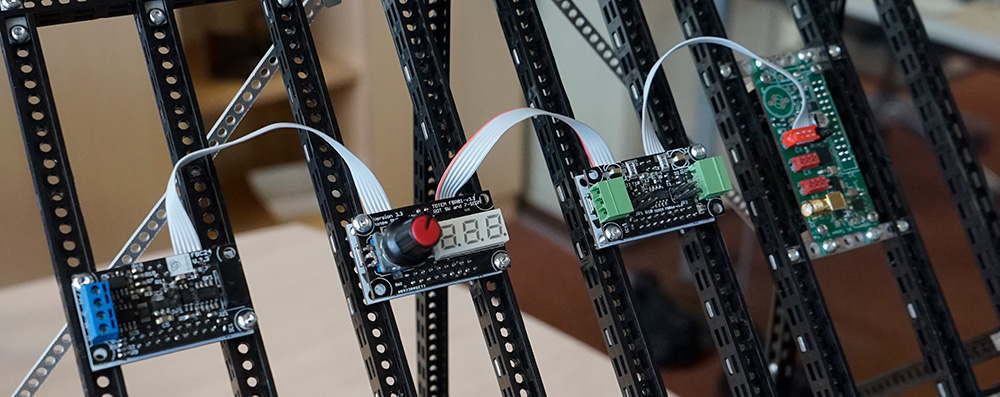

# TotemBUS



*[CAN]: Controller Area Network
*[daisy-chain]: Wiring scheme in which multiple devices are wired together in sequence or in a ring

TotemBUS is our implemented communication protocol to control Totem modules over CAN bus network. It's designed for large modular systems, but allows to interact with basic robots without a hassle. The key factors are fast response, low overhead and easy integration with multiple development platforms. Communication is peer-to-peer, so no host module is required.  

It's based on principle of CAN communication. Although modules themselves are daisy-chain connected, they are communicating in bus network topology, where modules can interact with each other directly.  
Every module has it's 8-bit number (for example `04`, printed on the board) and 15-bit unique serial identifier (for example `25684`). Each message on the TotemBUS is addressed for particular module or group of modules. Serial is required when interacting with multiple modules with the same number.  
Protocol allows sending message to:  

- All modules.  
- Multiple modules with the same number (for example `04`).  
- Specific module with exact number and serial (for example `04` and `25684`).  

Example how to define specific modules and access them:

```arduino
// Instance of all modules connected to TotemBUS
TotemModule all_modules(0);
// Instance of all modules with number 04
TotemModule all_04_modules(04);
// Instance of specific module 04 with serial number 25684
TotemModule specific_04_module(04, 25684);

void function() {
    // Will blink led of all modules
    all_modules.write("indicate");
    // Will blink led of all 04 modules
    all_04_modules.write("indicate");
    // Will blink led of 04 module with serial number 25684
    specific_04_module.write("indicate");
}
```

Modules accept a string based command (for example "indicate") and optional data. All command strings are encoded to 32-bit integer and packet with provided data. So most messages can fit to a single CAN bus packet. This saves a lot of bandwidth and increases response time, allowing to use any format of string command. The full list of commands can be found in Modules section.

For more information about API functionality of [TotemModule](/API/TotemModule) read [API information](/API/).  
For more information about specific modules read [Modules information](/modules/).  
