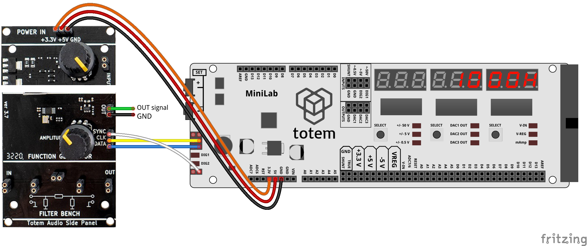
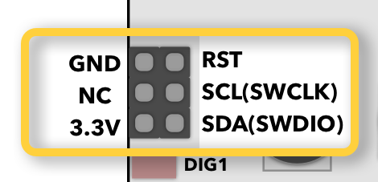
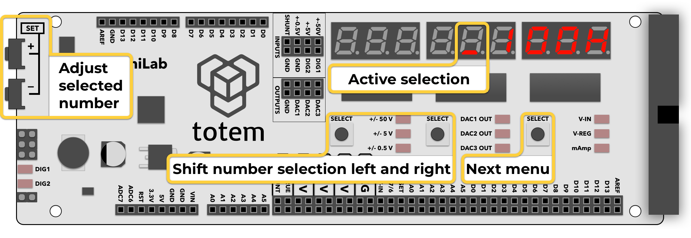

# 7. AD9833 control

Control [AD9833 chip](https://www.analog.com/media/en/technical-documentation/data-sheets/ad9833.pdf) directly from LabBoard. Allows to control output frequency and waveform without requiring to hook up Arduino.  
It can be found in [Audio side panel](../../side-panels/audio-panel.md) ver 3.7.

## Setup

1. Hook up power to side panel. Chip requires 3.3V.
1. Connect wires:  
    - **+3.3V** to LabBoard **3.3V**
    - **+5V** to LabBoard **5V**
    - **GND** to LabBoard **GND**
    - **CLK** to LabBoard **SCL**
    - **DATA** to LabBoard **SDA**
    - **SYNC** to LabBoard **TXD**
1. Select mode `7. AD9833`
1. Display will show `1000H` and "OUT signal" pin (green wire) start output 1000 Hz frequency. Lower pins is simply connected to GND.

## Control frequency

Numerical value can be entered using button combination:

- ++"Left SELECT"++, ++"Middle SELECT"++ - select digit to edit (indicated by a blinking dot).
- ++"SET\+"++, ++"SET\-"++ - change selected digit.

Frequency is updated on value change.

## Change waveform

4 different waveforms available:

- Sine
- Triangular
- Square
- Half-Square

Click ++"Right SELECT"++ to switch between waveforms. Pressing other buttons returns back to frequency select.
