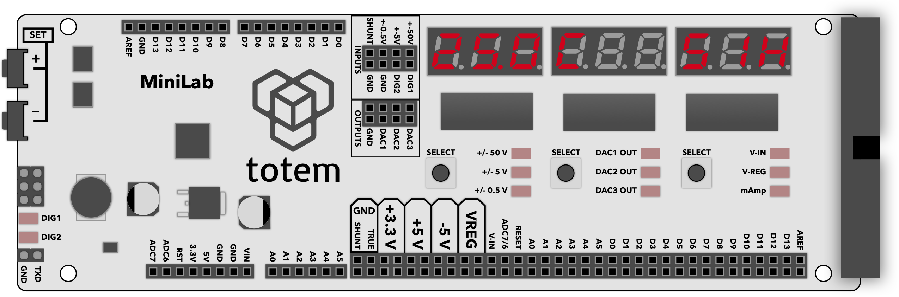
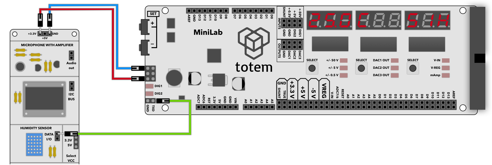

# 6. DHT11 monitor

## About

Will display temperature and humidity of connected DHT11 sensor.

## Details

- Connect sensor DATA I/O to **TXD** pin.
- Displays environment temperature in Celsius.
- Displays environment humidity in percentage.

## Controls

Enter mode:

- Select Menu > `6. dHt11`.

Exit mode:

- Open menu and select other mode.

## Example

  
_Click image to make it larger._

1. Enter DHT11 mode by selecting Menu > `6. dHt11`.
1. Connect sensor to **3.3V** and **GND**.
1. Connect sensor DATA I/O to **TDX** pin.
1. Temperature and humidity readout will be displayed.  
In case of communication error - `no con.` will be shown.
