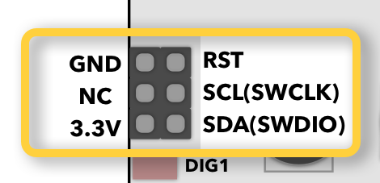

# 5. I2C scanner

## About

Find address of connected I2C device.

## Details

- Connect I2C device to **SCL** and **SDA** pins.
- Displays HEX address of I2C device.
- Up to 10 devices can be connected.

## Controls

Enter mode:

- Select Menu > `5. I2C`.

Exit mode:

- Open menu and select other mode.

## Example

  
_Click image to make it larger._

1. Connect I2C device to **3.3V** and **GND**.
1. Connect I2C device to **SCL** and **SDA** pins.
1. Enter I2C mode by selecting Menu > `5. I2C`.
1. `SCAn...` will be displayed until any device is found.
1. Discovered device address will be displayed in the right corner. Represented as hexadecimal value. If multiple found - will scroll between every second.
