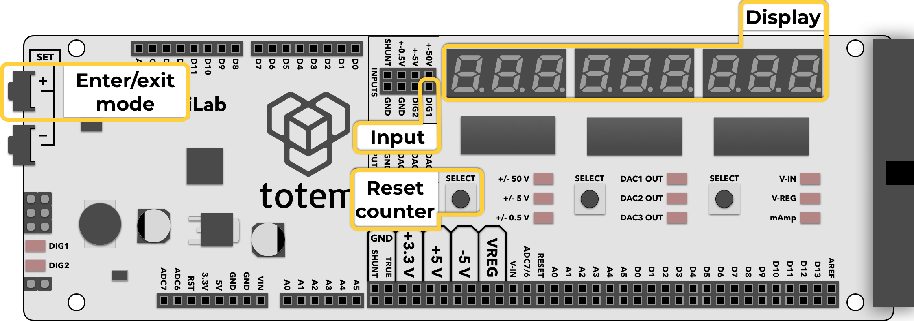
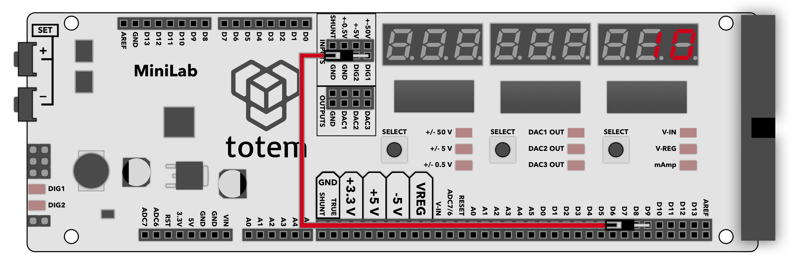

# 1. Pulse counter



## About

Mode used for counting number of pulses in a signal. Display shows total number of pulses and increments with each new one. Count value can be reset any time with a button press.

## Details

- Count signal pulses at **DIG1** pin.
- Maximum frequency up to 23 MHz*.
- Input pin is pulled HIGH (default state).
- Display is updated each pulse. Value will overflow after 999999999.
- Signal HIGH level should be in the amplitude from 2 V to 5 V.
- Left corner LED **DIG1** will light up according to signal state (HIGH or LOW).  
_It is not directly tied to input pin. Only for visual representation_.

\* _Frequencies over 10MHz can be affected by electrical conditions (contacts, wire length, voltage, no shielding, etc.). Make sure wires are short and signal is stable enough._

## Controls

Reset counter to `0`:

- Click ++"Left SELECT"++

Switch between detection edge (does not change pull-up):

- Click ++"Right SELECT"++ to change mode:
    - `On HI` - count on rising edge ⎽/⎺ (default)
    - `On LO` - count on falling edge ⎺\⎽

Enter mode:

- Select Menu > `1. COUNt`.
- (_deprecated_) In [Main screen](../main-screen.md) hold ++"SET\+"++  for 3 seconds.

Exit mode:

- Open menu and select other mode.
- (_deprecated_) Press ++"SET\+"++ to exit to [Main screen](../main-screen.md).

## Example



1. Connect **D9** digital pin to **DIG1** pulse counter input.
1. Enter pulse counter mode by selecting Menu > `1. COUNt`.
1. Load code sketch to TotemDuino:
```arduino
void setup() {
  pinMode(9, OUTPUT); // Set pin D9 to output
}
void loop() {
  for (int i=0; i<10; i++) { // Repeat 10 times
    digitalWrite(9, HIGH); // Set pin D9 HIGH
    digitalWrite(9, LOW); // Set pin D9 LOW
  }
  delay(500); // Wait 500ms
}
```
1. Observe that the counter increments by 10 every 0.5 second.
1. Click ++"Left SELECT"++ to reset counter value.
