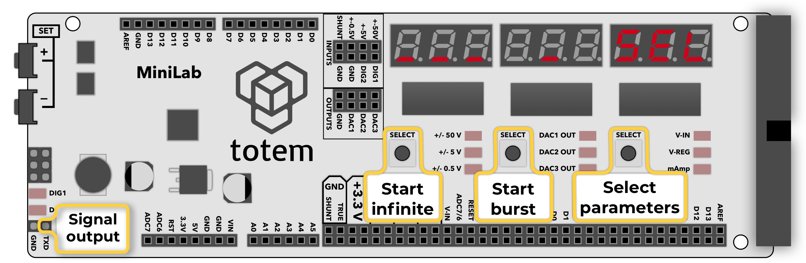
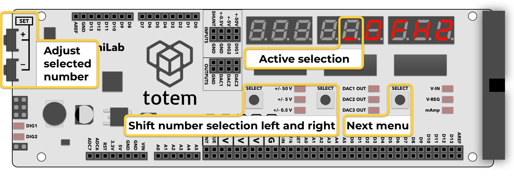
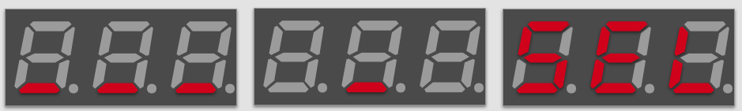
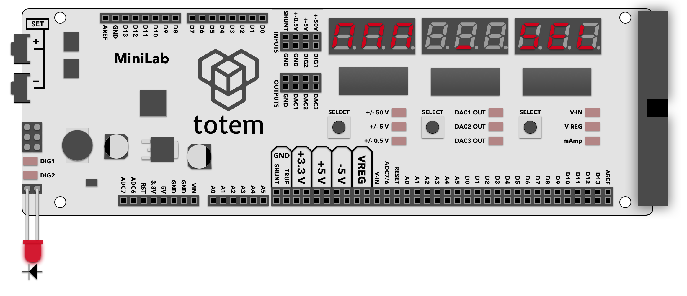

# 3. Pulse generator

*[but works with Arduino 5V logic]: In 5V logic to change from LOW to HIGH only ~2.7 Volt is required. So 3.3V is enough to trigger and safe to use.

## About

Mode used to generate rectangular waveform with configurable frequency and duty cycle. Can work in infinite mode or output burst of preset number of pulses.

## Details

- Output configured signal at **TXD** pin.
- Inactive **TXD** pin state - LOW.
- Output voltage is **3.3V** (but works with Arduino 5V logic).
- Configurable frequency (period) up to 1 MHz.
- Configurable duty cycle (pulse width).
- Output continuos signal.
- Output burst of up to 65535 pulses.
- Default settings: 10Hz, 50% duty, 5 cnt burst.

## Controls

Consists of 1 main screen to activate signal output and 5 screens to set signal generator parameters.

1. `___ _ SEL` - main screen. Launch continuos mode | launch burst mode | change settings.
1. `10FHZ` - configure frequency (Hz).
1. `100000FuS` - configure frequency in microseconds (µs).
1. `50.0d %` - configure duty cycle (percentage).
1. `50000duS` - configure duty cycle in microseconds (µs).
1. `5cnt` - configure burst count (number).

Numerical value can be entered using button combination:

- ++"Left SELECT"++, ++"Middle SELECT"++ - select digit to edit (indicated by a blinking segment).
- ++"SET\+"++, ++"SET\-"++ - change selected digit.
- ++"Right SELECT"++ - jump to next parameter.  

### Frequency configuration

Signal frequency (pulse period) can be entered in 2 formats:  

- **hertz:** option `FHZ`, between `1` and `999999` Hz.
- **microseconds:** option `FuS`, between `1` and `999999` µs.

Entered values are automatically converted between formats.  
Changing value updates signal output instantly.  

**Example:** to enter 2000Hz frequency press ++"Right SELECT"++ until `FHZ` is displayed. Enter number `2000` and go to `___ _ SEL`.  
**Example:** to enter 500µs pulse press ++"Right SELECT"++ until `FuS` is displayed. Enter number `500` and go to `___ _ SEL`.  

Mathematical relation between hertz and microseconds:  
`frequency = 1000000 / microseconds`  
`microseconds = 1000000 / frequency`  

### Duty cycle configuration

Signal duty cycle (pulse width) can be entered in 2 formats:  

- **percentage:** option `d %`, between `0.0` and `100.0` %.
- **microseconds:** option `duS`, between `0` and `FuS` µs (pulse width can't be higher than period).

Entered values are automatically converted between formats.  
Changing value updates signal output instantly.  

**Example:** to enter 23.7% duty cycle press ++"Right SELECT"++ until `d %` is displayed. Enter number `23.7` and go to `___ _ SEL`.  
**Example:** to enter 500µs pulse width press ++"Right SELECT"++ until `duS` is displayed. Enter number `500` and go to `___ _ SEL`.  

Mathematical relation between hertz, microseconds and percentage:  
`frequency = 1000000 / microseconds`  
`microseconds = 1000000 / frequency`  
`microseconds = pulse_period_us * duty_cycle / 100`  

Duty cycle is a percentage 0..100% of pulse period (frequency). It specifies how long signal is in HIGH state after pulse start.  
For example: If we set 400Hz as frequency (2500µs period) and want 35% time HIGH and 65% time LOW, we need to set duty cycle to: `35.0`. It means signal will stay HIGH (⎽/⎺) for 875µs and then LOW (⎺\⎽) for 1625µs.

### Pulse count configuration

- **pulse count:** option `cnt`, between `1` and `65535`.

This mode allows to output burst of pulses (\_|⎺|\_) when button is pressed.  
Only used when ++"Middle SELECT"++ key is clicked in `___ _ SEL` screen.

Example waveform of 3 pulse output: \_\_\_|⎺|\_\_|⎺|\_\_|⎺|\_\_\_

### Control screen

- ++"Left SELECT"++ - start/stop infinite series of pulse generation with current settings. Once active, this is indicated by series of square symbols.
- ++"Middle SELECT"++ - start/stop finite generation of pulses, making number of pulses entered in pulse count (`cnt`). Once finished, indicate value goes back to a single underscore symbol. When active - incrementing percent of pulses emitted, until end.
- ++"Right SELECT"++ - (`SEL`) go back to configuration.

Enter mode:

- Select Menu > `3. PULSE`.
- (_deprecated_) In [Main screen](../main-screen.md) hold ++"Left SELECT"++ for 3 seconds.

Exit mode:

- Open menu and select other mode.

## Example

1. Enter pulse generation mode, select continuous pulse mode with following parameters:  
Frequency = 100Hz  
Duty cycle = 50%  
2. Enable infinite pulse mode by pressing ++"Left SELECT"++ button.  
3. Connect **TXD** pin to an LED.  
4. Observe that LED lights up. Experiment by changing duty cycle and see that LED dims or brightens. Now you’ve got a working PWM module.  
