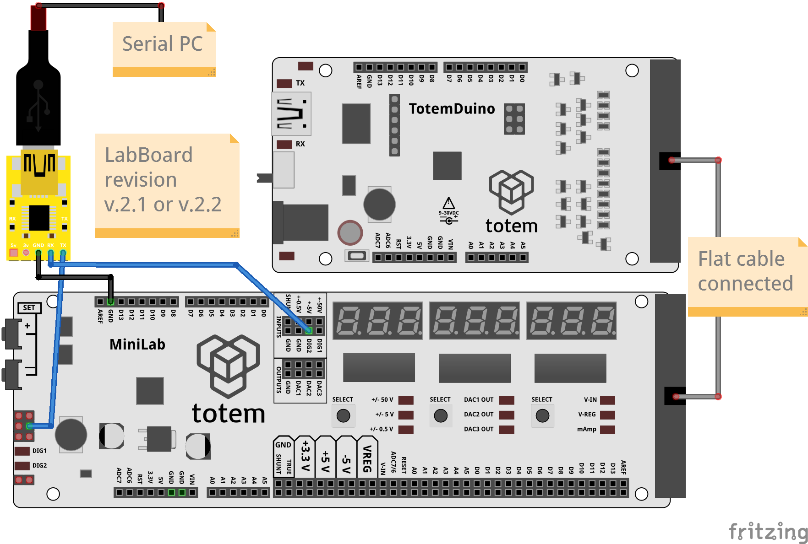

# 4. Serial monitor


!!! check "Select board revision"
    This tutorial differs between board revisions. Please select the one you have:
    === "LabBoard v.2.1, v.2.2"
        <table markdown="1">
        <tr markdown="1">
        <td markdown="1" style="vertical-align: middle">**v.2.1** :white_check_mark:</td>
        <td markdown="1" style="vertical-align: middle">**v.2.2** :white_check_mark:</td>
        <td markdown="1" style="vertical-align: middle">**v.2.3** :x:</td>
        <td markdown="1"></td>
        </tr>
        </table>
    === "LabBoard v.2.3"
        <table markdown="1">
        <tr markdown="1">
        <td markdown="1" style="vertical-align: middle">**v.2.1** :x:</td>
        <td markdown="1" style="vertical-align: middle">**v.2.2** :x:</td>
        <td markdown="1" style="vertical-align: middle">**v.2.3** :white_check_mark:</td>
        <td markdown="1"></td>
        </tr>
        </table>

!!! info "Check firmware version"
    Documentation is written for the latest firmware version. Read [Firmware update](../firmware-update.md) section to perform this procedure.

!!! tip "Exit serial mode"
    To exit back to menu from serial mode - press both ++"SET\+"++ ++"SET\-"++ keys at the same time (instead of any two keys). This is done to allow freely use of LabBoard keys without interruption.

Serial mode allows to communicate with LabBoard over serial (UART) and control its features. This interaction can read or write values using [Serial protocol](../serial/protocol.md) commands, enabling external LabBoard control from TotemDuino or PC. This can be used for debugging or as integral part of application (view and control). Multiple features are available:

- Read measurements
- Set output voltage
- Control signal generator
- Interact with keys, LED and display
- Print serial on display `#!arduino Serial.println("Arduino")`
- Control LabBoard features over [Serial protocol](../serial/protocol.md)
- Control LabBoard features with [Totem Library](https://github.com/totemmaker/TotemArduino){target="_blank"} from Arduino

## Main settings

There are multiple ways to use serial communication. When enabling serial mode, LabBoard will ask to choose required configuration:

- **Baud rate:** Communication speed. Must match with one used in `#!arduino Serial.begin(baudrate)` or serial terminal application
- **Direction:** Selection between `PC` and `Arduino`. Swaps TX, RX pins depending on endpoint device (the one who sends commands to LabBoard)
- **Background mode:** Enabled in settings ("Always on"). Activates serial in normal LabBoard operation mode to work concurrently

## Connect to Arduino

Enables communication with Arduino boards over **D0** and **D1** pins.  
[Serial protocol](../serial/protocol.md) commands can be sent using [Serial](https://www.arduino.cc/reference/en/language/functions/communication/serial/){target=_blank"}: `#!arduino Serial.println("LB:OUT:DAC1:500")`.  
[Totem Library](https://github.com/totemmaker/TotemArduino){target="_blank"} provides convenient wrapper functions `#!arduino LB.volt.setDAC1(500)` to use within Arduino environment. Read [Serial API reference](../serial/api.md) for more information.  
**Arduino examples:** [Github](https://github.com/totemmaker/arduino-examples/tree/master/mini-lab/labboard){target=_blank}

=== "LabBoard v.2.1, v.2.2"
    Wiring instructions:

    ??? summary "Connect with TotemDuino"
        **Direction:** Arduino.  
        **Control:** From sketch running on TotemDuino.  
        **Power:** From TotemDuino DC jack or USB.  
        Required wiring:  

        - ^^TotemDuino **D0**^^ to LabBoard **SCL** ([SWD header pinout](../../assets/images/mini-lab/labboard-swd-header.png))  
        - LabBoard **D1** to LabBoard **DIG2**

        [](../../assets/images/mini-lab/labboard-serial-arduino-r22-totemduino.png)
    
    ??? summary "Connect with Arduino boards"
        **Direction:** Arduino.  
        **Control:** From sketch running on Arduino board.  
        **Power:** From Arduino board DC jack or USB.  
        **Flat cable is not connected.**  
        Voltages 3.3V, 5V, VIN are provided by Arduino board. LabBoard does not have voltage regulator ([Power scheme](../../mini-lab/power.md)).  
        Required wiring:  

        - **D0** to LabBoard **SCL** ([SWD header pinout](../../assets/images/mini-lab/labboard-swd-header.png))  
        - **D1** to LabBoard **DIG2**
        - **3V3** to LabBoard **3.3V**
        - **5V** to LabBoard **5V**
        - **GND** to LabBoard **GND**
        - **VIN** to LabBoard **VIN**

        [](../../assets/images/mini-lab/labboard-serial-arduino-r22-uno.png)
    
=== "LabBoard v.2.3"
    Wiring instructions:

    ??? summary "Connect with TotemDuino"
        **Direction:** Arduino.  
        **Control:** From sketch running on TotemDuino.  
        **Power:** From TotemDuino DC jack or USB.  
        Required wiring:  

        - ^^TotemDuino **D0**^^ to LabBoard **D0**  

        [](../../assets/images/mini-lab/labboard-serial-arduino-r23-totemduino.png)
    
    ??? summary "Connect with  Arduino boards"
        **Direction:** Arduino.  
        **Control:** From sketch running on Arduino board.  
        **Power:** From Arduino board DC jack or USB.  
        **Flat cable is not connected.**  
        Voltages 3.3V, 5V, VIN are provided by Arduino board. LabBoard does not have voltage regulator ([Power scheme](../../mini-lab/power.md)).  
        Required wiring:  

        - **D0** to LabBoard **D0**
        - **D1** to LabBoard **D1**
        - **3V3** to LabBoard **3.3V**
        - **5V** to LabBoard **5V**
        - **GND** to LabBoard **GND**
        - **VIN** to LabBoard **VIN**

        [](../../assets/images/mini-lab/labboard-serial-arduino-r23-uno.png)
    

1. Select serial mode - `4. SERIAL`.
1. Change value with ++"SET\+"++, ++"SET\-"++. Confirm with ++"Right SELECT"++.
1. Select baud rate (speed) - `bAU 57600`.   
_Must match the one set in `#!arduino Serial.begin(57600)`._
1. Select direction - `Arduino`.
1. Mode is active and displays `Serial`.

## Connect to PC

Enables communication with external devices, capable to interpret serial data. This allows to connect data stream to PC over USB or use other device to communicate over TX and RX.  
LabBoard control can be achieved using [Serial protocol](../serial/protocol.md) commands.  
**Python examples:** [Github](https://github.com/totemmaker/python-examples/tree/master/mini-lab/labboard){target=_blank}

=== "LabBoard v.2.1, v.2.2"
    Wiring instructions:

    ??? summary "Connect over TotemDuino"
        **Direction:** PC.  
        **Control:** From PC over TotemDuino as passthrough.  
        **Power:** From TotemDuino DC jack or USB.  
        TotemDuino will be disabled to act as passthrough for direct LabBoard communication with PC.  
        Required wiring:  

        - ^^TotemDuino **D0**^^ to LabBoard **SCL** ([SWD header pinout](../../assets/images/mini-lab/labboard-swd-header.png))  
        - LabBoard **D1** to LabBoard **DIG2**
        - **RST** to **GND** (disable TotemDuino)
        
        [](../../assets/images/mini-lab/labboard-serial-pc-r22-totemduino.png)
    
    ??? summary "Connect over USB-Serial converter with TotemDuino"
        **Direction:** PC.  
        **Control:** From PC over USB-Serial converter.  
        **Power:** From TotemDuino DC jack or USB.  
        Required wiring:  

        - **TX** to LabBoard **SCL** ([SWD header pinout](../../assets/images/mini-lab/labboard-swd-header.png))
        - **RX** to LabBoard **DIG2**
        - **GND** to LabBoard **GND**
        
        [](../../assets/images/mini-lab/labboard-serial-pc-r22-ttl_totemduino.png)
    
    ??? summary "Connect over USB-Serial converter without TotemDuino"
        **Direction:** PC.  
        **Control:** From PC over USB-Serial converter.  
        **Power:** From USB-Serial converter.  
        **Flat cable is not connected.**  
        **VIN** not available!. Certain LabBoard functionality will not work.  
        Voltages 3.3V, 5V are provided by USB-Serial converter. LabBoard does not have voltage regulator ([Power scheme](../../mini-lab/power.md)).  
        Required wiring:  

        - **TX** to LabBoard **SCL** ([SWD header pinout](../../assets/images/mini-lab/labboard-swd-header.png))
        - **RX** to LabBoard **DIG2**
        - **GND** to LabBoard **GND**
        - **3v** to LabBoard **3.3V**
        - **5v** to LabBoard **5V**
        
        [](../../assets/images/mini-lab/labboard-serial-pc-r22-ttl.png)

    ??? summary "Connect over Arduino board"
        **Direction:** PC.  
        **Control:** From PC over Arduino board as passthrough.  
        **Power:** From Arduino board DC jack or USB.  
        **Flat cable is not connected.**  
        Voltages 3.3V, 5V, VIN are provided by Arduino board. LabBoard does not have voltage regulator ([Power scheme](../../mini-lab/power.md)).  
        Arduino board will be disabled to act as passthrough for direct LabBoard communication with PC.  
        Required wiring:  
        
        - **D0** to LabBoard **SCL** ([SWD header pinout](../../assets/images/mini-lab/labboard-swd-header.png))
        - **D1** to LabBoard **DIG2**
        - **3V3** to LabBoard **3.3V**
        - **5V** to LabBoard **5V**
        - **GND** to LabBoard **GND**
        - **VIN** to LabBoard **VIN**
        - **RESET** to **GND** (disable Arduino)

        [](../../assets/images/mini-lab/labboard-serial-pc-r22-uno.png)
    
=== "LabBoard v.2.3"
    Wiring instructions:

    ??? summary "Connect over TotemDuino"
        **Direction:** PC.  
        **Control:** From PC over TotemDuino as passthrough.  
        **Power:** From TotemDuino DC jack or USB.  
        TotemDuino will be disabled to act as passthrough for direct LabBoard communication with PC.  
        Required wiring:  

        - **RST** to **GND** (disable TotemDuino)

        [](../../assets/images/mini-lab/labboard-serial-pc-r23-totemduino.png)
    
    ??? summary "Connect over USB-Serial converter"
        **Direction:** PC.  
        **Control:** From PC over USB-Serial converter.  
        **Power:** From USB-Serial converter.  
        **Flat cable is not connected.**  
        **VIN** not available!. Certain LabBoard functionality will not work.  
        Voltages 3.3V, 5V are provided by USB-Serial converter. LabBoard does not have voltage regulator ([Power scheme](../../mini-lab/power.md)).  
        Required wiring:  

        - **TX** to LabBoard **D0**
        - **RX** to LabBoard **D1**
        - **GND** to LabBoard **GND**
        - **3v** to LabBoard **3.3V**
        - **5v** to LabBoard **5V**

        [](../../assets/images/mini-lab/labboard-serial-pc-r23-ttl.png)
        
    ??? summary "Connect over Arduino board"
        **Direction:** PC.  
        **Control:** From PC over Arduino board as passthrough.  
        **Power:** From Arduino board DC jack or USB.  
        **Flat cable is not connected.**  
        Voltages 3.3V, 5V, VIN are provided by Arduino board. LabBoard does not have voltage regulator ([Power scheme](../../mini-lab/power.md)).  
        Required wiring:  

        - **D0** to LabBoard **D0**
        - **D1** to LabBoard **D1**
        - **3V3** to LabBoard **3.3V**
        - **5V** to LabBoard **5V**
        - **GND** to LabBoard **GND**
        - **VIN** to LabBoard **VIN**
        - **RESET** to **GND** (disable Arduino)

        [](../../assets/images/mini-lab/labboard-serial-pc-r23-uno.png)
    

1. Select serial mode - `4. SERIAL`.
1. Change value with ++"SET\+"++, ++"SET\-"++. Confirm with ++"Right SELECT"++.
1. Select baud rate (speed) - `bAU 57600`.   
_Select same speed in terminal application._
1. Select direction - `PC`.
1. Mode is active and displays `Serial`.

**Testing communication with PC:**  

1. Open Arduino IDE, select port, open Serial Monitor.
1. Select `57600 baud`.
1. Type in `LB:IN:5V:?`, press ++enter++.
1. Observe received value `LB:IN:5V:0`.

## Serial print display


In serial mode (except background) - LabBoard will display data sent using `#!arduino Serial.println()` function, acting similar as Arduino IDE Serial Monitor. Because it is limited by showing 9 symbols ant the same moment - it will only display last received line (ending with new line symbol "\n") and aligned to right. Start of longer text will be cut off. It recognizes whole alphabet, but certain letters and symbols are limited by 7 segments.

**Example:**

```arduino
Serial.println("Hi");
Serial.print("This");
Serial.print("HELLO.");
Serial.println(" 123.");
```

Arduino IDE Serial Monitor would print:
```
Hi
This HELLO. 123.
```

LabBoard will display only `HELLO. 123.`, because last new line symbol "\n" was sent by `#!arduino Serial.println(" 123.")`. "This" didn't fit as line of text is aligned to its end. Symbols '.' and ',' are converted to dot segment on display.

It can be disabled with [LB.display.setMonitor(`false`)](../serial/api.md#display.setMonitor) function or `LB:DISP:MON:0`. Any data stream not recognized by [Serial protocol](../serial/protocol.md) will be skipped.

## Always on (background) mode

In this mode - serial is always enabled to control LabBoard during normal operation (not limited to "4. Serial mode"). This can be used to run LabBoard normally and read measurements externally at the same time.

**Note: Serial wiring has to be done according selected endpoint device.**  
_Features "I2C scan" and "AD9833 control" will be disabled on v.2.1, v.2.2 boards if "always on" mode is enabled. SCL pin is occupied with serial communication._  

To enable background mode:  

1. Open menu > `0. SEtUP`
1. Select `5. SERIAL`
1. Click ++"Middle SELECT"++ key to switch between settings.  
Change using ++"SET\+"++  ++"SET\-"++ keys.  
1. Set default baud rate `bAU 57600`
1. Set endpoint device - `Arduino` or `PC`
1. Set `ALVAYS` mode to `On`

Serial mode will be active on TX, RX (SCL, DIG2 or D0, D1) pins all the time.
