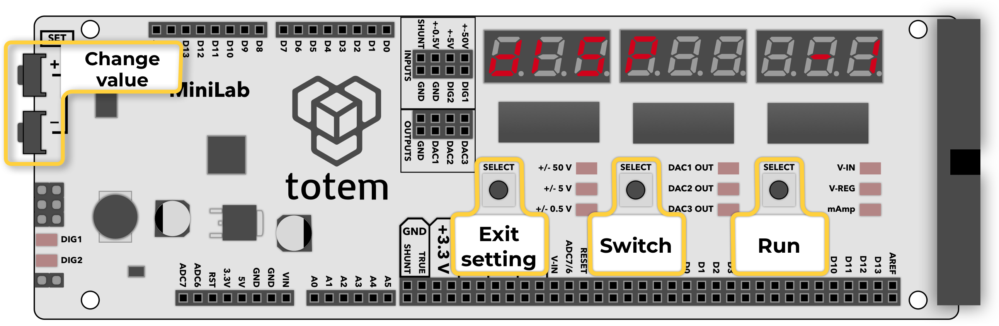
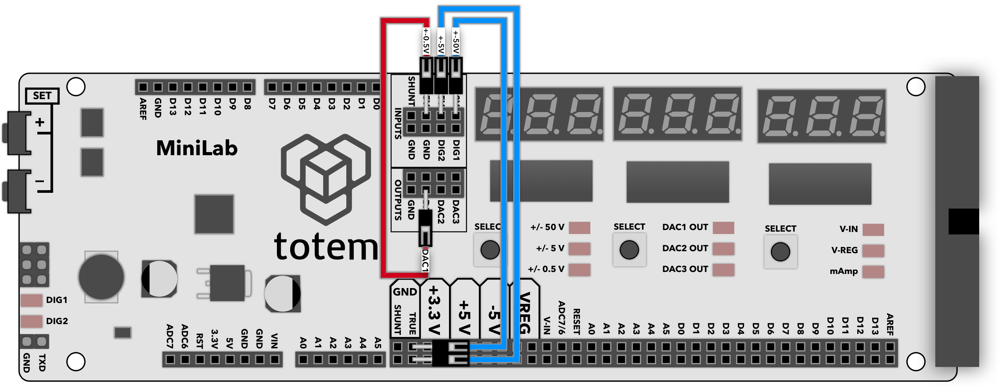
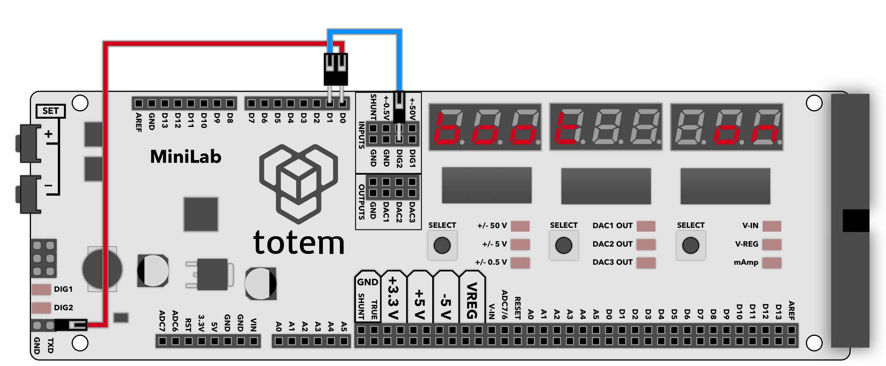

# 0. Setup

Menu to access various LabBoard configuration options.  
These setting are stored in memory and used during LabBoard operation.  
To exit selected option - press ++"Left SELECT"++ button.  
Settings are saved when value is changed. No need to press a button for confirmation. Some menu options required to press and hold `run` button (++"Right SELECT"++) to execute specified action.

1. `dISP` - [Display brightness](#display)
1. `dAC` - [DAC output manual adjust](#dac-offset)
1. `AdC` - [Voltage measure manual adjust](#adc-offset)
1. `CALIb` - [Auto calibration](#calibration)
1. `SERIAL` - [Default Serial mode baud rate](#serial)
1. `UERSI` - [Firmware version](#firmware)
1. `rESEt` - [Factory reset](#reset)
1. `boot` - [Enter boot mode](#boot)

## Setup menu options

### 1. Display brightness { #display }

Change display and LED brightness.  

`diSP 7` will be shown and LED will light up to indicate current brightness level.  

Using ++"SET\+"++ and ++"SET\-"++ increase or decrease brightness level between `0` and `15`.  

### 2. DAC manual offset { #dac-offset }

Manually adjust DAC offset. Can be used to fine tune DAC channel output if value displayed on screen differs from multimeter reading.  

`dAC 0.000` will be shown and selected DAC channel LED will light up.  

Click ++"Middle SELECT"++ to switch active DAC channel to configure.  
Using ++"SET\+"++ and ++"SET\-"++ increase or decrease offset.  

### 3. ADC manual offset { #adc-offset }

Manually adjust ADC offset. Can be used to fine tune voltage measurements if value displayed on screen differs from multimeter readings.  
These values are auto generated during calibration, but can be manually adjusted if required.  

`AdC 0.000` will be shown and selected voltage channel LED will light up.  

Click ++"Middle SELECT"++ to switch active voltage channel to configure.  
Using ++"SET\+"++ and ++"SET\-"++ increase or decrease offset.  

### 4. Auto calibration { #calibration }

This feature will calibrate ADC channels for more precise voltage measurements.  

`CALIb run` will be shown. It is in  waiting state until "run" button is pressed.

1. Connect wires as specified:
    - **±50V** to **GND**
    - **±5V** to **GND**
    - **±0.5V** to **DAC1**
1. Press and hold ++"Right SELECT"++ for 1s until calibration starts
1. `888888888` lights up. Wait for display `donE`
1. Press ++"Left SELECT"++ to exit

### 5. Serial settings { #serial }

Contains 3 different serial settings:

- **Default baud rate:** selected default speed of serial mode `baud 57600`
- **Communication direction:** selected value of endpoint device `Arduino` or `PC`
- **Always on (background mode):** enable of disable [Always on serial mode](serial-monitor.md#always-on-background-mode)

Jump between settings by pressing ++"Middle SELECT"++ key.  
Use ++"SET\+"++ and ++"SET\-"++ to change value.  

### 6. Firmware version { #firmware }

Display current firmware version.  

`UERSI x.xx` will be shown indicating installed firmware version.

### 7. Factory reset { #reset }

Factory reset option will reset all settings to default state. Calibration will be requested after reset is done.  

`rESEt run` will be shown. It is in waiting state until "run" button is pressed.

1. Press and hold ++"Right SELECT"++ for 1s until reset starts
1. `donE` will be displayed briefly
1. `CALIb run` will be shown. Follow [calibration section](#calibration) to proceed

### 8. Enter boot mode { #boot }

Enter system bootloader for firmware update.

`boot  run` will be shown. It is in waiting state until "run" button is pressed.

1. Press and hold ++"Right SELECT"++ for 1s
1. `boot   on` will be displayed
1. Run firmware download. Follow [firmware update section](../firmware-update.md)
