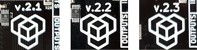

# Firmware update

LabBoard firmware can be updated to the latest version in order to receive new features and improvements. Available update methods:

- [Update over Arduino](#update-over-arduino) (recommended)
- [Update over UART](#update-over-uart)
- [Update over SWD](#update-over-swd)

_Note: [Factory reset](features/setup.md#reset) will be applied during update._

!!! check "Select board revision"
    This tutorial differs between board revisions. Please select the one you have:
    === "LabBoard v.2.1, v.2.2"
        <table markdown="1">
        <tr markdown="1">
        <td markdown="1" style="vertical-align: middle">**v.2.1** :white_check_mark:</td>
        <td markdown="1" style="vertical-align: middle">**v.2.2** :white_check_mark:</td>
        <td markdown="1" style="vertical-align: middle">**v.2.3** :x:</td>
        <td markdown="1"></td>
        </tr>
        </table>
    === "LabBoard v.2.3"
        <table markdown="1">
        <tr markdown="1">
        <td markdown="1" style="vertical-align: middle">**v.2.1** :x:</td>
        <td markdown="1" style="vertical-align: middle">**v.2.2** :x:</td>
        <td markdown="1" style="vertical-align: middle">**v.2.3** :white_check_mark:</td>
        <td markdown="1"></td>
        </tr>
        </table>

## Check version

To get currently installed firmware version:

1. Press any two keys at the same moment.  
If menu (`1. COUNT`) not displayed - version `1.02` is installed.
1. Select [`0. SEtUP`](features/setup.md) → [`6. UERSI`](features/setup.md#firmware).
1. Current installed version will be displayed on screen (`UERSI 2.00`).

_Menu system is only available from version 2.00._  
{target=_blank}

## Update over Arduino

Simple update procedure using TotemDuino, connected with LabBoard over flat cable.  
For smooth process - make sure to follow steps in order.  

### Prepare TotemDuino

[:octicons-download-16: Download labboard_update.ino](https://github.com/totemmaker/labboard-firmware/releases/latest/download/labboard_update.ino){ .md-button .md-button--primary }  

Upload **labboard_update.ino** to TotemDuino.

??? abstract "How to do it?"
    1. Click button to download latest firmware update file.  
    1. Open **labboard_update.ino** file. A message may appear requesting to create folder - click ok.
    1. Connect TotemDuino to computer over USB.
    1. Select `Tools` → `Port`.
    1. Upload code to TotemDuino.

### Prepare LabBoard

**Important: Unplug USB cable from TotemDuino.**

Start LabBoard in boot mode:  
:   Hold ++"SET\-"++ key and power on MiniLab (plug DC jack into TotemDuino).  
    LabBoard won't turn on, meaning it's in boot mode.  

=== "LabBoard v.2.1, v.2.2"
    Connect wires to pins **D0** to LabBoard **TXD** and **D1** to LabBoard **DIG2**.  
    
    
=== "LabBoard v.2.3"

1. Click TotemDuino reset button to start update.  
    {width=80%}  
    _TX (red) LED will start to blink._
1. Wait for (green) LED to turn on and LabBoard to display `CALIb run`.
1. Firmware update is completed. Proceed to [calibration section](features/setup.md#calibration).  

### Troubleshot

In case (green) LED is flashing at 0.5s rate - update procedure failed:

=== "LabBoard v.2.1, v.2.2"
    - Restart update procedure by pressing reset button again.
    - Make sure correct LabBoard revision is selected.
    - Make sure LabBoard is in boot mode.  
    _LED ±0.5V may be lit on, and will not respond to any key press._
    - Make sure USB cable is unplugged when pressing Reset button.
    - Disconnect everything and repeat steps in order.
    - Connect ^^LabBoard **TXD**^^ pin to ^^TotemDuino **D0**^^ pin directly (bypass flat cable).
    - Follow tutorial [recover LabBoard with deleted firmware](https://forum.totemmaker.net/t/minilab-menu/253/6){target="_blank"}.  
    **!! Only if it does not power on anymore !!**.  

=== "LabBoard v.2.3"
    - Restart update procedure by pressing reset button again.
    - Make sure correct LabBoard revision is selected.
    - Make sure LabBoard is in boot mode.  
    _LED ±0.5V may be lit on, and will not respond to any key press._
    - Make sure USB cable is unplugged when pressing Reset button.
    - Disconnect everything and repeat steps in order.
    - Connect ^^LabBoard **D0**^^ pin to ^^TotemDuino **D0**^^ pin directly (bypass flat cable).

## Update over UART

STM32 has integrated bootloader capable of loading firmware using UART (Serial) peripheral. This requires application on PC side and USB to Serial converter to transfer data to MCU.  
One application that is capable to do so - [STM32CubeProgrammer](https://www.st.com/en/development-tools/stm32cubeprog.html){target=_blank}. Other applications can be used also.

=== "LabBoard v.2.1, v.2.2"
    Wiring instructions:

    ??? summary "Connect over TotemDuino"
        1. Connect pins:
            - **RST** to **GND** (disable TotemDuino)
            - **D0** to LabBoard **TXD**
            - **D1** to LabBoard **DIG2**
        1. Hold ++"SET-"++ button and plug in USB to TotemDuino (power on). LED ±0.5V should light up dimly.

        

    ??? summary "Connect over USB Serial"
        1. Unplug flat cable from LabBoard (or put TotemDuino in Reset: **RST** to **GND**).
        1. Connect pins:
            - **GND** to LabBoard **GND**
            - **TX** to LabBoard **DIG2**
            - **RX** to LabBoard **TXD**
        1. Connect **3.3V** to LabBoard **3.3V** if there is no external power to LabBoard.
        1. Hold ++"SET-"++ button and plug in Serial converter (power on). LED ±0.5V should light up dimly.

        

=== "LabBoard v.2.3"
    Wiring instructions:

    ??? summary "Connect over USB Serial"
        1. Unplug flat cable from LabBoard (or put TotemDuino in Reset: **RST** to **GND**).
        1. Connect pins:
            - **GND** to LabBoard **GND**
            - **TX** to LabBoard **D0**
            - **RX** to LabBoard **D1**
        1. Connect **3.3V** to LabBoard **3.3V** if there is no external power to LabBoard.
        1. Hold ++"SET-"++ button and plug in Serial converter (power on). LED ±0.5V should light up dimly.

        

In STM32 Cube Programmer application select UART with specified settings. Baudrate value can be different. Click ++"Connect"++ to establish connection.

Download firmware in .hex or .bin format and flash (download) it to LabBoard.  
Binary (.bin) file address - `0x08000000`.

[:octicons-download-16: Download LabBoard.hex](https://github.com/totemmaker/labboard-firmware/releases/latest/download/LabBoard.hex){ .md-button .md-button--primary } [Download LabBoard.bin](https://github.com/totemmaker/labboard-firmware/releases/latest/download/LabBoard.bin){ .md-button .md-button--primary }  

## Update over SWD

SWD is a programming and debugging interface for ARM chips. A special hardware (ST-Link) and PC software is required to perform update using this method. One application that is capable to do so - [STM32CubeProgrammer](https://www.st.com/en/development-tools/stm32cubeprog.html){target=_blank}. Other applications can be used also.  
Some ST-Link programmers has Mass storage feature where connected board opens as storage device, allowing to simply drag and drop firmware file and automatically flash it to LabBoard.

Wiring instructions:

??? summary "Connect over ST-Link"
    1. Connect ST-Link to LabBoard:
        - ST-Link **SWCLK** to LabBoard **SWCLK**
        - ST-Link **GND** to LabBoard **GND**
        - ST-Link **SWDIO** to LabBoard **SWDIO**
        - ST-Link **NRST** to LabBoard **RST**
    1. Connect **3V3** to LabBoard **3.3V** if there is no external power to LabBoard.

    

In STM32 Cube Programmer application select ST-LINK with specified settings and click ++"Connect"++. Connection should be established if wiring is correct and LabBoard has power.

Download firmware in .hex or .bin format and flash (download) it to LabBoard.  
Binary (.bin) file address - `0x08000000`.

[:octicons-download-16: Download LabBoard.hex](https://github.com/totemmaker/labboard-firmware/releases/latest/download/LabBoard.hex){ .md-button .md-button--primary } [:octicons-download-16: Download LabBoard.bin](https://github.com/totemmaker/labboard-firmware/releases/latest/download/LabBoard.bin){ .md-button .md-button--primary }  

## Downgrading

If you need to install older firmware version (in case of bug in latest one or etc.), browse [Releases section](https://github.com/totemmaker/labboard-firmware/releases){target=_blank} (Assets) to download required version **labboard_update.ino**, **LabBoard.hex** or **LabBoard.bin** and follow install guide with selected file.
