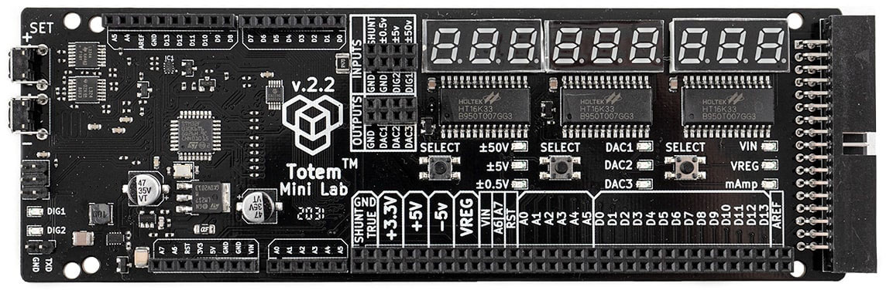
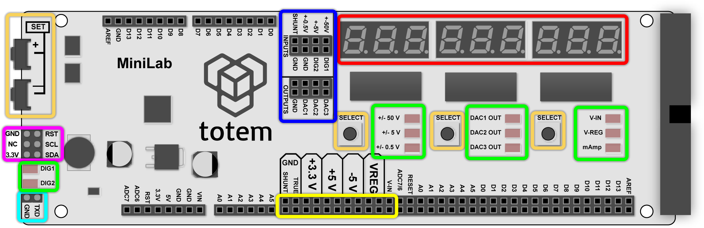

# Overview

!!! info "Check firmware version"
    Documentation is written for the latest firmware version. Read [Firmware update](firmware-update.md) section to perform this procedure.

This board has a dual use - firstly it can be used as an expansion board to the TotemDuino system, offering easily accessible input and output connections, and secondly
- it is a measuring and testing unit, containing multiple features.

LabBoard is designed to be mounted onto Totem beams and boards, as well as to the third part surfaces, with a help of a few bolts and brackets.

## Features

- [**Digital to Analog converter**](main-screen.md#middle-display) - converter outputting a pre-set voltage:
    - 3 channels in the 0..3.25 Volt range (DAC1, DAC2, DAC3)
    - 1 channel in the 3..14 Volt range (VREG)
- [**Voltage measure**](main-screen.md#voltage-measurement) - three inputs in the ±0.5V, ±5V and ±50V range.
- [**Current measure**](main-screen.md#current-measurement) - sensing current up to 800 mA.
- [**Frequency meter**](features/frequency-meter.md) - digital signal frequency measurement module for signals up to 23 MHz.
- [**Pulse counter**](features/pulse-counter.md) - digital signal pulse counter, counting up to 999999999 pulses.
- [**Pulse generator**](features/pulse-generator.md) - unit capable of generating finite or infinite series of pulses, with programmable pulse width and period.
- [**Serial monitor**](features/serial-monitor.md) - View serial data output from Arduino and control LabBoard itself.
- [**I2C scanner**](features/i2c-scanner.md) - detect HEX address of connected I2C device.
- [**DHT11 monitor**](features/dht11-monitor.md) - display connected DHT11 sensor measurements.
- [**AD9833 control**](features/ad9833-control.md) - control connected AD9833 chip parameters.

## Layout

LabBoard works on its own as a separate device, providing additional functionality and convenience of prototyping. Unmarked headers mirrors TotemDuino pins over connected flat cable and are not used in LabBoard functionality (directly).  

**Description of board items:**  

- Control keys - ++"SET\+"++ ++"SET\-"++ used to increment, decrement values and jump between selections. ++"Left SELECT"++ ++"Middle SELECT"++ ++"Right SELECT"++ used to select certain options, depending on mode LabBoard is running.
- Display - 7-segment display with 9 digits and individual dots. Displays all information related to currently running mode.
- LED - contains total of 11 LED. Groups of 3 (near buttons) are used to indicate currently selected parameter in [Main screen](main-screen.md) mode. DIG1 and DIG2 mostly used to show digital state of DIG1 and DIG2 pins.
- Input / Output - Header for voltage measure and regulated output. There are 3 channels for voltage measurement, 3 channels (DAC) for variable voltage output and 2 digital pins for various functionality.
- SWD header - initially designed to flash firmware, but repurposed to reuse SCL and SDA pins for additional LabBoard functionality ([I2C scanner](features/i2c-scanner.md) and [AD9833 control](features/ad9833-control.md)).
- Power out - provides power for breadboard and other circuits. Outputs regulated voltage of: 3.3V, 5V, -5V, VIN - DC input and VREG - variable between 3V and 14V.
- TXD pin - used to generate configurable output signal in [Pulse generator](features/pulse-generator.md) mode. Also used in [DHT11 monitor](features/dht11-monitor.md) mode.
