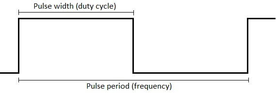

# Serial protocol

Serial protocol to control LabBoard from Arduino or external device, like PC.  
Command must start with `LB` prefix, separated by `:`, ending with new line symbol `\n`.  
Example: `#!arduino Serial.print("LB:OUT:DAC1:1500\n")` or `#!arduino Serial.println("LB:OUT:DAC1:1500")`  

**Protocol:**  

| Command | Description |
| --- | --- |
| `LB:<group>:<cmd>:<value>` | Write value to specific command |
| `LB:<group>:<cmd>:?` | Request to read specific command  |
| `LB:<group>:?` | Request to read all commands in group  |
| `LB:?` | Request to read all LabBoard commands |
| `LB:<group>:<cmd>:!` | Enable notify for specific command. `!0` - disable |
| `LB:<group>:!` | Enable notify for all commands in group. `!0` - disable |
| `LB:!` | Enable notify for all LabBoard commands. `!0` - disable |

**Examples:**  

Calling `LB:OUT:DAC1:1500` will change DAC1 output to 1.5 Volts.  
Calling `LB:OUT:DAC1:?` will return current value of DAC1 - `LB:OUT:DAC1:1500`.  
Calling `LB:IN:?` will return of all 5 "Voltage input" commands with values.  
Calling `LB:IN:5V:!` will stream `LB:IN:5V:1000` value on each change.  

### Voltage input

Read voltage of `VIN`, `±50V`, `±5V`, `±0.5V` pins and current of `SHUNT` pin.

| Command | Parameter | Description |
| --- | --- | --- |
| `LB:IN:VIN:` | `6000` - `30000` mV | VIN pin voltage |
| `LB:IN:50V:` | `-50000` - `50000` mV | ±50V pin voltage |
| `LB:IN:5V:`  | `-6150` - `6150` mV | ±5V pin voltage |
| `LB:IN:05V:` | `-700` - `700` mV | ±0.5V pin voltage |
| `LB:IN:AMP:` | `0` - `800` mA  | SHUNT pin current |

`LB:IN:50V` and `LB:IN:05V` limits can vary a bit.  
Read instructions how to setup [current measurement](main-screen.md#current-measurement).  
**`-100000` is returned if measurement is invalid or over the limit.**  
Channel overvoltage may invalidate measurements of other channels also.  

### Voltage output

Set voltage to `VREG`, `DAC1`, `DAC2`, `DAC3` pins.

| Command | Parameter | Description |
| --- | --- | --- |
| `LB:OUT:VREG:` | `3000` - `VIN - 1000` mV | VREG pin voltage |
| `LB:OUT:DAC1:` | `0` - `3250` mV | DAC1 pin voltage |
| `LB:OUT:DAC2:` | `0` - `3250` mV | DAC2 pin voltage |
| `LB:OUT:DAC3:` | `0` - `3250` mV | DAC3 pin voltage |

`LB:OUT:VREG` maximum voltage depends on `VIN` voltage, which is 15V with provided DC power supply. In this case, output range is - `3000` - `14000` mV.  

### Frequency generator

Output configurable [Pulse-width modulation](https://en.wikipedia.org/wiki/Pulse-width_modulation){target="_blank"} to `TXD` pin.

| Command | Parameter | Description |
| --- | --- | --- |
| `LB:TXD:RUN:` | `0` - stop   `1` - start TXD   `2` - start TXD burst | Generator control |
| `LB:TXD:FHZ:` | `1` - `1000000` Hz | Frequency in hertz |
| `LB:TXD:FUS:` | `1` - `1000000` μs | Frequency in microseconds |
| `LB:TXD:DUS:` | `0` - `1000000` μs | Duty cycle in microseconds |
| `LB:TXD:DPCT:` | `0` - `1000` % | Duty cycle percentage (`% * 10`) |
| `LB:TXD:CNT:` | `0` - `65535` | Pulses count in burst mode |

`LB:TXD:FHZ` is tied to `LB:TXD:FUS`. Both control output frequency but with different units.  
`LB:TXD:DUS` is tied to `LB:TXD:DPCT`. Both control output duty cycle but with different units.  
`LB:TXD:DUS` maximum value is limited by `LB:TXD:FUS`. Pulse width can't be longer than Period.  
`LB:TXD:DPCT` is percentage multiplied by 10 for more precision.  
`LB:TXD:CNT` is a number of pulses to generate when calling command `LB:TXD:RUN:2`.  

### Frequency monitor

Measure frequency with `DIG1` pin.

| Command | Parameter | Description |
| --- | --- | --- |
| `LB:RXD:RUN:` | `0` - disable RXD   `1` - enable RXD | Monitor control |
| `LB:RXD:EDGE:` | `0` - LOW edge   `1` - HIGH edge | Sample (detect) edge.   _Default: HIGH_ |
| `LB:RXD:CNT:` | _write:_ `0` - reset to 0   _read:_ pulses count | Number of pulses |
| `LB:RXD:FHZ:` | _read_: `0` - `23000000` hertz | Measured frequency |

### Digital inputs

Read state of digital `DIG1` and `DIG2` pins.

| Command | Parameter | Description |
| --- | --- | --- |
| `LB:DIG1:` | `0` - LOW   `1` - HIGH | Digital pin state |
| `LB:DIG2:` | `0` - LOW   `1` - HIGH | Digital pin state |

### Display control

| Command | Parameter | Description |
| --- | --- | --- |
| `LB:DISP:TXT:<text>` | string | Put text on display (align left) |
| `LB:DISP:TXT:<seg>:<text>` | `<seg>` : `0` - `8`   `<text>` : string | Put text on display (offset from left) |
| `LB:DISP:DIM:` | `0` - `15` | Display brightness |
| `LB:DISP:BLI:<rate>` | `<rate>` : milliseconds | Display blink rate |
| `LB:DISP:BLI:<hex>:<rate>` | `<hex>` : HEX value `0` - `1FF`  `<rate>` : milliseconds | Display segment blink rate |
| `LB:DISP:MON:` | `0` - disabled   `1` - enabled | Serial monitor mode   _Default: enabled_ |

`<text>` is a string of 9 characters. Symbols `.` `,` will use dot segment. Example: `DISP 4.567`.  
`<hex>` is map of segments that will be affected. There are 9 segments, starting at from left.  
`<rate>` is blinking frequency in milliseconds. Setting `0` will disable blinking.  
`LB:DISP:MON` is a feature to print `Serial.println()` content to display in `4. SERIAL` mode.  

### Key press

Read currently pressed LabBoard keys.

| Command | Parameter | Description |
| --- | --- | --- |
| `LB:KEY:<hex>` | `<hex>`: HEX value `0` - `1F` | Binary map of pressed keys |

`<hex>`:  
`B00001` - ++"SET\-"++  
`B00010` - ++"SET\+"++  
`B00100` - ++"Right SELECT"++  
`B01000` - ++"Middle SELECT"++  
`B10000` - ++"Left SELECT"++  
`LB:KEY` returns HEXdecimal value. Example: `LB:KEY:C` converts to `B01100`. This means that keys ++"Right SELECT"++ and ++"Middle SELECT"++ are currently pressed.  

### LED control

Control individual LabBoard LED.

| Command | Parameter | Description |
| --- | --- | --- |
| `LB:LED:<hex>` | `<hex>`: HEX value `0` - `7FF` | Binary map of LED state |
| `LB:LED:<num>:<state>` | `<num>`: LED number `1` - `11`   `<state>`: `0` - off, `1` - on | State of specific LED |

??? summary "LED names"
    | Number | Name on board | Binary map |
    | --- | --- | --- |
    | **0**  | All   | `B00000000000` |
    | **1**  | DIG1  | `B00000000001` |
    | **2**  | DIG2  | `B00000000010` |
    | **3**  | ±50V  | `B00000000100` |
    | **4**  | ±5V   | `B00000001000` |
    | **5**  | ±0.5V | `B00000010000` |
    | **6**  | DAC1  | `B00000100000` |
    | **7**  | DAC2  | `B00001000000` |
    | **8**  | DAC3  | `B00010000000` |
    | **9**  | VIN   | `B00100000000` |
    | **10** | VREG  | `B01000000000` |
    | **11** | mAmp  | `B10000000000` |

`<hex>` is binary map on turned on LEDs.  
`<num>` is number of LED in a list from DIG1 to mAmp. Starting at digit `1` to `11`. `0` - all.  
`<state>` is state of LED. `0` - lit off, `1` - lit on.  
Example: command `LB:LED:2C` will turn on `±50V`, `±5V` and `DAC1`. All other - off.  
Example: command `LB:LED:10:1` will turn on `mAmp`. Does not change other LED.  

### Configuration

Control LabBoard settings.

| Command | Parameter | Description |
| --- | --- | --- |
| `LB:CFG:REV:` | `22` `23` | Revision number |
| `LB:CFG:VER:` | `200` | Firmware version |
| `LB:CFG:SBAUD:` | `57600` | Default serial baud rate |
| `LB:CFG:SMODE:` | `0` - PC   `1` - Arduino | Default serial mode   _Default: Arduino_ |
| `LB:CFG:SON:` | `0` - off   `1` - on | Background serial mode   _Default: off_ |
| `LB:CFG:DISP:` | `7` | Display brightness |
| `LB:CFG:VREG:` | `0` | Calibration offset |
| `LB:CFG:DAC1:` | `0` | Calibration offset |
| `LB:CFG:DAC2:` | `0` | Calibration offset |
| `LB:CFG:DAC3:` | `0` | Calibration offset |
| `LB:CFG:VIN:` | `0` | Calibration offset |
| `LB:CFG:50V:` | `0` | Calibration offset |
| `LB:CFG:5V:` | `0` | Calibration offset |
| `LB:CFG:05V:` | `0` | Calibration offset |
| `LB:CFG:RST:` | `1` | Reset all configuration  _Restart required after._ |

`LB:CFG:REV` is board revision number. v.2.1 and v.2.2 both returns `22`.  
`LB:CFG:VER` is firmware version number. `250` converts to 2.50.  
`LB:CFG:DISP` is default display brightness. Value between `0` and `15`.  
Calibration offset is a drift from correct measurement in mV. Can be negative.  

### System control

| Command | Parameter | Description |
| --- | --- | --- |
| `LB:BOOT:` | `1` | Restart in boot mode |
| `LB:RST:` | `1` | Restart LabBoard |

Boot mode is used during firmware update.  
