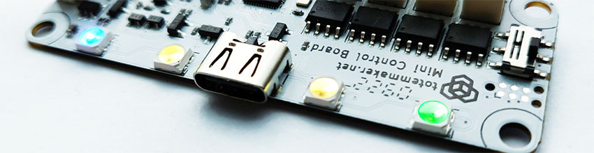

# Mini Control Board

[Totem App]: ../remote-control/app/index.md "Totem Smartphone App"
[Totem Arduino Library]: ../remote-control/arduino/index.md "Totem Arduino Library for remote control"

!!! note "Discontinued"
    This product was discontinued in 2023-Q2. All new robotic kits includes programmable [RoboBoard X3](../roboboard-x3/index.md).

Compact remote motor driver for small robotic kits. Integrated control board with Bluetooth connection, 4 DC motor channels and 2 Servo motor channels. It’s handy for small projects that require  only motor controls. Can be used with [Totem App] and [Totem Arduino Library].

_Note: this board is only remote controlled and does not support Arduino programming.  
For that case use [RoboBoard X3](../roboboard-x3/index.md)._

## Details

**Connectivity:**  
• Bluetooth (BLE)  

**On-board features:**  
• 2 Servo channels (3.7 Volts)  
• 4 DC channels (3.7 Volts)  
• 4 RGB lights  
• On/off switch  
• Battery input, integrated charger  

**Power:**  
• USB-C: (only for charging)  
• Battery: LiPo, 3.7V, 250 mAh  

**Dimensions:**  
• 65 x 25 x 8 mm (L x W x H)  

## Features

### :material-bluetooth: Bluetooth

Uses BLE to advertise board appearance. This allows to connect it with smartphone using [Totem App] or [Totem Arduino Library].  
Bluetooth is always enabled. Only singe device can be connected at the same time.

### :material-format-rotate-90: 2 Servo motor channels

3.7 Volt servo motor channels marked with letter A, B. Can be controlled individually.  
Most servo motors can turn its arm 180 degrees. This range is mapped to position in percentage: -100% - left, 0% - center, 100% - right.  
Servo angle visualization:  

### :material-tire: 4 DC motor channels

3.7 Volt DC motor channels marked with letter A, B, C, D. Can be controlled individually.  
Allows to control motor spin direction, power (speed) and braking (only [v2.0](revisions.md/#v20)). Brake feature can be enabled using [Totem App] (board settings).  
Channels are connected to the battery and output voltage is controlled with PWM. The higher the voltage, the faster motor will spin. Maximum voltage may vary depending on battery state of charge (2.8V-4.2V).  
Power values corresponds with percentage:  
0% - (no power, 0.0V)  
100% - (full power forward, 3.7V)  
-100% - (full power backward, -3.7V)  

### :traffic_light: 4 RGB light bar

LED light bar is used for customizing robot appearance and indicating connection state.  

- **Running animation** - no connection
- **Steady color** - connected to robot
- **Change color** - click ++"Settings"++ when connected with [Totem App]

### :material-power: On/Off switch

Used to turn board power on/off without a need to disconnect battery. Push switch ① up or down to toggle power.  
Upon power on - battery charge level will be displayed. "Loading" animation will be played with specific color ②:  

- :octicons-dot-fill-24:{ style="color: lawngreen" } - battery is full
- :octicons-dot-fill-24:{ style="color: gold" } - battery is medium
- :octicons-dot-fill-24:{ style="color: red" } - battery is low
- :material-white-balance-sunny:{ style="color: red" } - battery is discharged

### :material-power-plug: USB-C charger connector

Board [v2.0](revisions.md/#v20) features built-in battery charger:

1. Plug-in USB-C cable ①
1. :octicons-dot-fill-24:{ style="color: gold" } will blink while charging ②
1. :octicons-dot-fill-24:{ style="color: lawngreen" } will light up when finished ③

Charging will work even if power switch is set to OFF position.  
All other functionality is disabled while USB-C cable is plugged in.  
Any USB power source (computer, phone charger) can be used, providing 0.5A or more current.  

### :material-battery-high: Battery input

Battery input for connecting 1S LiPo 3.7V battery.  
**Recommended to use only supplied battery.**  
Specifications: LiPo, 3.7V, 250 mAh.

## Revision changelog

View [Revision changelog](revisions.md) section.

## Known behavior

Board revision [v2.0](revisions.md/#v20) will enable DC channel C and D for a short period of time (25ms) during power on. This will result in slight robot wheel spin and doesn't indicate defective product or firmware. Most robotic kits use channels A and B.
