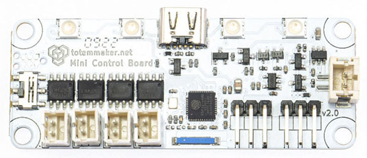
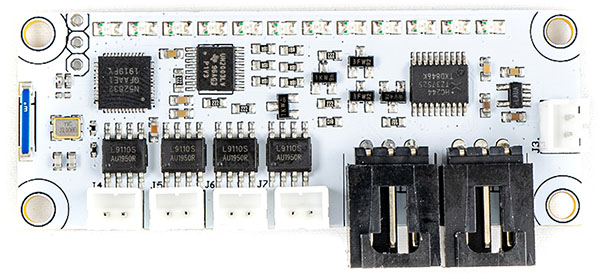
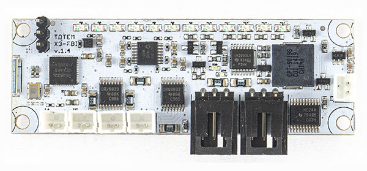

# Revision changelog

We are always looking to improve our products. Any physical change (components, layout) is indicated with board revision number (printed on top). Each revision may have different features or functionality.

_Discontinued in 2023-Q2 and replaced by [RoboBoard X3](../roboboard-x3/index.md#revision-changelog)._

## v2.0

Manufactured from 2022-Q1.

- Visual, design and layout
- Rename to Mini Control Board
- 12 red LED switched to 4 RGB
- Switched MCU from nRF52 to ESP32
- Improved battery connector
- Integrated battery charger (USB-C)
- Added on/off switch
- Motor braking feature

## v1.5

Also known as Totem X3-FBI or MiniTrooper board.

- Layout changes
- Shorter by 1.0 cm
- Removed speaker (not good enough)

## v1.4

Also known as Totem X3-FBI or MiniTrooper board.

- First public release