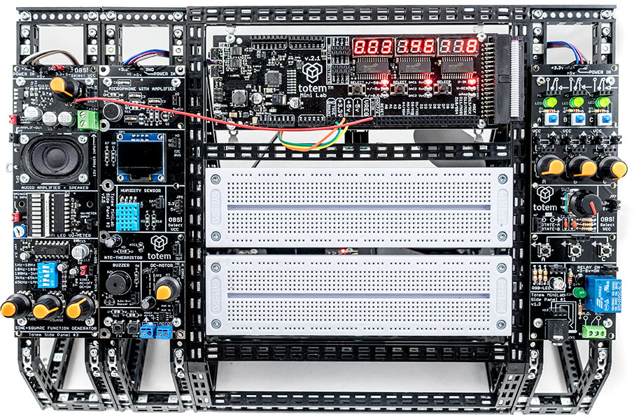

# Overview

[LabBoard]: ../labboard/index.md "Totem LabBoard"
[TotemDuino]: ../totemduino/index.md "Totem TotemDuino"

!!! info "Check firmware version"
    Documentation is written for the latest firmware version. Read [Firmware update](../labboard/firmware-update.md) section to perform this procedure.

Totem Mini Lab contains all the necessities for starting your path in the world of electronics and programming. Using it, should be simple and fun! While building it, we tried to address and improve all the negative parts about prototyping - no longer you’ll have to deal with messy wiring, fragile connections and headaches of where to mount every separate part of your experiment.

Mini Lab is meant to be used together with Totem construction system which allows users to build solid workbenches with integrated breadboards, as well as available expansion boards which can expand the capabilities of the Mini Lab even further.

## Who is it for

Main goal of Mini Lab is to provide a platform which would give an easy and approachable way for students and young makers communities to build up on, using it as a stepping stone into the world of electronics and programming.

While not intended to be used in place of a professional level equipment, Mini Lab has its own advantages - small size, speed of setup and versatility could find its place in any makers shop.

## What’s in the kit

In the Mini Lab you’ll find:  

* **[TotemDuino]** - our improved version of Arduino UNO platform
* **[LabBoard]** - a capable experimentation and measuring platform
* **34-pin flat cable** - use it to connect TotemDuino and LabBoard together
* **Collection of Totem construction parts** - for building Totem workbench
* **Power supply** - to power Mini Lab from the mains
* **Breadboards** - to extend your experimentation area
* **Breadboard cables** - short male to male cables useful for experimentation
* **Building instructions** - suggested use of Totem parts for building a workbench where everything neatly mounts together

Sold separately:

- [I/O side panel](../side-panels/io-panel.md) - a kit of buttons, switches and indicators
- [Sensor side panel](../side-panels/sensor-panel.md) - a kit of microphone, display, temperature sensor and DC motor controller
- [Audio side panel](../side-panels/audio-panel.md) - a kit of speaker and audio amplifiers
- [Side panel stand](https://totemmaker.net/product/side-panel-stand/){target=_blank} - structure for more stable side panel mounting or placing on the table

## Assembly guide

<a href="https://totemmaker.net/wp-content/uploads/2018/03/totem-mini-lab-building-instructions-v.2.1-print-edit-v2.pdf" class="image fit">Totem-mini-lab-building-instructions.pdf</a>
<object style="width:100%; height:600px;" data="https://totemmaker.net/wp-content/uploads/2018/03/totem-mini-lab-building-instructions-v.2.1-print-edit-v2.pdf" type="application/pdf">
    <embed src="https://totemmaker.net/wp-content/uploads/2018/03/totem-mini-lab-building-instructions-v.2.1-print-edit-v2.pdf" type="application/pdf" />
</object>

<a href="https://totemmaker.net/wp-content/uploads/2018/02/Totem-Building-Good-practises-v.1.0-Mini-LaB.pdf" class="image fit">Totem-Building-Good-practises-Mini-LaB.pdf</a>
<object style="width:100%; height:600px;" data="https://totemmaker.net/wp-content/uploads/2018/02/Totem-Building-Good-practises-v.1.0-Mini-LaB.pdf" type="application/pdf">
    <embed src="https://totemmaker.net/wp-content/uploads/2018/02/Totem-Building-Good-practises-v.1.0-Mini-LaB.pdf" type="application/pdf" />
</object>
