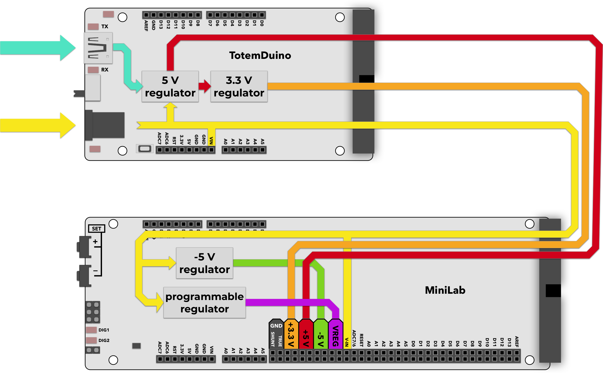

# Power scheme

Mini Lab comes with a 15 V, 2 Amp external power supply (older units with 12V). Internally, supply voltage is regulated into several voltages needed to run various parts of the system. Each of these can be used during measurements or experiments, as they do have easily accessible pins that equipment can be connected to.

While Mini Lab can easily use any of the available voltage for your experiments, digital signals going to and from TotemDuino shouldn’t be higher than the currently selected running voltage for it. A selector switch on the TotemDuino board can set the supply voltage for the TotemDuino microcontroller either at 5 or 3.3 volts. This allows you to set the logic level interfacing with various external equipment that could only be used at one of these voltages without any additional voltage level converters. Refer to TotemDuino section for explanation on how to set the voltage.

Available voltage sources are:  

* **15 V, 2.0 A** - (VIN) direct supply voltage (12V older units).
* **5 V, 0.5 A** - (+5V) regulated supply voltage, shared with TotemDuino.
* **-5 V, 0.5 A** - (-5V) separate regulated voltage, for experimentation with operation amplifiers.
* **3.3 V, 0.25 A** - (+3.3V) regulated supply voltage, shared with TotemDuino and LabBoard processor.
* **0 .. 3.25 V** - (DAC1, DAC2, DAC3) programmable regulated voltage output, up to 0.35 A.
* **3 .. 14 V** - (VREG) programmable, high voltage, regulated voltage output, up to 0.35 A.

It is possible to run only from USB power, but in that case modules relying on higher voltage, such as programmable regulator (VREG) and direct supply (VIN) will not be available. 
