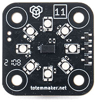

# [11] Distance module

## Description

Module designed for measuring distance to an obstacle. It uses infrared laser sensor to avoid limitations of ultrasonic counterparts.  
With included 8 color LED, module can be used for car headlights or distance indication.  

**Features:**  

- Laser distance sensing (range 3-130 cm)  
- 8 individual controllable RGB lights  

{style="display: block;margin-left: auto;margin-right: auto;"}

***

## Code examples

**Arduino projects:** [11_distance](https://github.com/totemmaker/TotemArduinoBoards/tree/master/libraries/TotemBUS/examples/11_distance){target=_blank}

```arduino
#include <TotemModule11.h>
TotemModule11 module;
```

??? example "Function usage (click to expand)"
    ```arduino
    /* Distance */
    // Read distance in millimeters
    float distMM = module.getMM();
    // Read distance in centimeters
    float distCm = module.getCm();
    // Read distance in foot
    float distFoot = module.getFoot();
    // Read distance in inches
    float distInch = module.getInch();
    // Check if some objet is detected
    bool inRange = module.isDetected();
    ```
    ```arduino
    /* All RGB lights control */
    // Set all LED to "Totem" colors
    module.rgb.colorTotem();
    // Set all LED to green color
    module.rgb.color(0, 255, 0);
    module.rgb.color(0x00FF00);
    // Turn all LED on
    module.rgb.on();
    // Turn all LED off
    module.rgb.off();
    // Set all LED to on
    module.rgb.set(HIGH);
    // Toggle all LED state on / off
    module.rgb.toggle();
    // Check if any LED is on
    bool isOn = module.rgb.isOn();
    // Enable bright mode
    module.rgb.setBrightMode(true);
    ```
    ```arduino
    /* Single RGB light control */
    // Set LED 1 to color red
    module.rgb[0].color(255, 0, 0);
    // Set LED 4 to color green
    module.rgb[3].color(0, 255, 0);
    // Set LED 8 to color blue
    module.rgb[7].color(0, 0, 255);
    ```

***

## Functions

### Distance

<h4 class="apidec" id="getMM">
<code>distance</code> <span class="object">module</span>.<span class="function">getMM</span>()
<a class="headerlink" href="#getMM" title="Permanent link">¶</a></h4>
: Get distance between module and barrier in millimeters.  
**Returns:**  
`distance` - millimeters to object ~[`30`:`1300`]mm. `0` - not detected.  

<h4 class="apidec" id="getCm">
<code>distance</code> <span class="object">module</span>.<span class="function">getCm</span>()
<a class="headerlink" href="#getCm" title="Permanent link">¶</a></h4>
: Get distance between module and barrier in centimeters.  
**Returns:**  
`distance` - centimeters to object ~[`3`:`130`]cm. `0` - not detected.  

<h4 class="apidec" id="getFoot">
<code>distance</code> <span class="object">module</span>.<span class="function">getFoot</span>()
<a class="headerlink" href="#getFoot" title="Permanent link">¶</a></h4>
: Get distance between module and barrier in foot.  
**Returns:**  
`distance` - foot to object (_float_) ~[`0.098`:`4.265`]ft. `0` - not detected.  

<h4 class="apidec" id="getInch">
<code>distance</code> <span class="object">module</span>.<span class="function">getInch</span>()
<a class="headerlink" href="#getInch" title="Permanent link">¶</a></h4>
: Get distance between module and barrier in inches.  
**Returns:**  
`distance` - inches to object (_float_) ~[`1.181`:`51.181`]inch. `0` - not detected.  

<h4 class="apidec" id="isDetected">
<code>isDetected</code> <span class="object">module</span>.<span class="function">isDetected</span>()
<a class="headerlink" href="#isDetected" title="Permanent link">¶</a></h4>
: Check if object is in sensing range (detected).  
**Returns:**  
`isDetected` - object detected [`true`:`false`].  

### All RGB lights control

<h4 class="apidec" id="colorTotem">
<span class="object">module</span>.<span class="group">rgb</span>.<span class="function">colorTotem</span>()
<a class="headerlink" href="#colorTotem" title="Permanent link">¶</a></h4>
: Set all LED to "Totem" colors (blue, yellow, green).  

<h4 class="apidec" id="color-rgb">
<span class="object">module</span>.<span class="group">rgb</span>.<span class="function">color</span>(<code>red</code>, <code>green</code>, <code>blue</code>)
<a class="headerlink" href="#color-rgb" title="Permanent link">¶</a></h4>
<h4 class="apidec" id="color-hex">
<span class="object">module</span>.<span class="group">rgb</span>.<span class="function">color</span>(<code>hex</code>)
<a class="headerlink" href="#color-hex" title="Permanent link">¶</a></h4>
: Set LED color with automatic RGB or HEX parameter. More convenient to use compared to ones with explicit format.  
Alpha value in `hex` is ignored.  
**Parameter:**  
`red` - amount of red color [`0`:`255`]  
`green` - amount of green color [`0`:`255`]  
`blue` - amount of blue color [`0`:`255`]  
`hex` - hexadecimal color code [`0x000000`:`0xFFFFFF`]  

<h4 class="apidec" id="on">
<span class="object">module</span>.<span class="group">rgb</span>.<span class="function">on</span>()
<a class="headerlink" href="#on" title="Permanent link">¶</a></h4>
: Turn all LED on to last used color.  

<h4 class="apidec" id="off">
<span class="object">module</span>.<span class="group">rgb</span>.<span class="function">off</span>()
<a class="headerlink" href="#off" title="Permanent link">¶</a></h4>
: Turn all LED off.  

<h4 class="apidec" id="set">
<span class="object">module</span>.<span class="group">rgb</span>.<span class="function">set</span>(<code>state</code>)
<a class="headerlink" href="#set" title="Permanent link">¶</a></h4>
: Set all LED to specific state (on / off).  
**Parameter:**  
`state` - state on / off [`HIGH`:`LOW`] or [`true`:`false`]  

<h4 class="apidec" id="toggle">
<span class="object">module</span>.<span class="group">rgb</span>.<span class="function">toggle</span>()
<a class="headerlink" href="#toggle" title="Permanent link">¶</a></h4>
: Toggle all LED between on / off states.  

<h4 class="apidec" id="isOn">
<code>state</code> <span class="object">module</span>.<span class="group">rgb</span>.<span class="function">isOn</span>()
<a class="headerlink" href="#isOn" title="Permanent link">¶</a></h4>
: Check if any of RGB light is on.  
**Returns:**  
`state` - is any LED on [`true`:`false`] or [`HIGH`:`LOW`].  

<h4 class="apidec" id="setBrightMode">
<span class="object">module</span>.<span class="group">rgb</span>.<span class="function">setBrightMode</span>(<code>state</code>)
<a class="headerlink" href="#setBrightMode" title="Permanent link">¶</a></h4>
: Disable multiplexing if all LED is set to the same color. This results in much more brightness.  
This mode is required to be enabled each time module is powered up. This is disabled by default to match brightness when using `color`, `colorX` commands.  
**Parameter:**  
`state` - bright mode is on [`true`:`false`]. _Default:_ `false`  

### Single RGB light control

Individual LED can be accessed by specifying index: `module.rgb[0].on()`.  
LED from 1 to 8 is identified as indexes `0`-`7`.  
Accessing "without index" will affect all LED.

***

## Low level commands

These are low level TotemBUS commands accepted by module. Is not required when using objective API described above.

??? abstract "Command list"
    | Command | Parameters | Description |
    | ------- | ---------- | ----------- |
    | `distance` | _Returns:_(`int`) | Get distance to object in mm |
    | `rgbAll/totem` | _None_ | Set LED to Totem colors |
    | `rgbAll/bright` | (`bool`) | Enable bright LED mode |
    | `rgbAll` | (`byte`, `byte`, `byte`) | Set all LED color |
    | `rgbX` | (`byte`, `byte`, `byte`, `byte`) | Set specific LED color |
