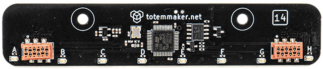

# [14] Line follower module


## Description

White and black line detector for following some path on the floor. It reports line offset underneath the sensor which is used to steer a robot in the correct direction.

**Features:**  

- White/Black line position detection  
- Junction detection  
- Automatic line color detection  
- Automatic contrast calibration  

{style="display: block;margin-left: auto;margin-right: auto;"}

***

## Code examples

**Arduino projects:** [14_lineFollower](https://github.com/totemmaker/TotemArduinoBoards/tree/master/libraries/TotemBUS/examples/14_lineFollower){target=_blank}

```arduino
#include <TotemModule14.h>
TotemModule14 module;
```

??? example "Function usage (click to expand)"
    ```arduino
    /* Reading sensor data */
    // Get line position "3"
    int pos = module.getPos();
    // Get line color 'W'
    char color = module.getColor();
    // Check if color is white "true"
    bool isWhite = module.isWhite();
    // Check if color is black "false"
    bool isBlack = module.isBlack();
    // Check if color (line) is detected "true"
    bool isColor = module.isDetected();
    // Check if junction is detected "false"
    bool isJunction = module.isJunction();
    // Get current detection accuracy "50"
    int accuracy = module.getAccuracy();
    // Set new detection threshold
    module.setThreshold(20);
    // Get raw sensor reading
    uint8_t *contrast = NULL;
    module.getRaw(contrast);
    // contrast contains array: {21,30,65,70,70,68,36,20}
    int sensorA = contrast[0]; // 21
    int sensorD = contrast[3]; // 70
    int sensorH = contrast[7]; // 20
    ```

    ```arduino
    /* All LED control */
    // Turn all LED on
    module.led.on();
    // Turn all LED off
    module.led.off();
    // Set all LED on
    module.led.set(HIGH);
    // Toggle all LED on / off
    module.led.toggle();
    // Is any of LED on "true"
    bool isAllOn = module.led.isOn();
    // Set LEDs : on|off|off|on|on|off|off|on
    module.led.setBinary(B10011001);
    // Reset LEDs to default behavior
    module.led.reset();
    ```

    ```arduino
    /* Single LED control */
    // Turn LED A on
    module.led[0].on();
    // Turn LED D off
    module.led[3].off();
    // Toggle LED B on / off
    module.led[1].toggle();
    // Set LED A off
    module.led[0].set(LOW);
    // Check if LED A is on "false"
    bool isAOn = module.led[0].isOn();
    ```

***

## Functions

### Reading sensor data

<h4 class="apidec" id="getPos">
<code>position</code> <span class="object">module</span>.<span class="function">getPos</span>()
<a class="headerlink" href="#getPos" title="Permanent link">¶</a></h4>
: Line position below sensor. (negative, 0, positive) = (left, center, right).  
**Returns:**  
`position` - line position [`-35`:`35`]. `0` - center  

<h4 class="apidec" id="getColor">
<code>color</code> <span class="object">module</span>.<span class="function">getColor</span>()
<a class="headerlink" href="#getColor" title="Permanent link">¶</a></h4>
: Get currently detected line color. This can be White or Black. Color is returned in [ASCII](https://www.asciitable.com) character. Use `'W'`, `'B'` expression.  
**Returns:**  
`color` -  line color (_char_) [`'W'` - white, `'B'` - black]. `0` - not detected.

<h4 class="apidec" id="getRaw">
<span class="object">module</span>.<span class="function">getRaw</span>(<code>data[8]</code> )
<a class="headerlink" href="#getRaw" title="Permanent link">¶</a></h4>
: Returns 8 byte array of contrast reading from each sensor.  
`0`% - light does not reflect (black), `100`% - light does reflect (white).  
Array index 0 corresponds to sensor A, 1 - B, ..., 7 - H.  
Data is returned trough `data` array parameter.  
**Returns:**  
`data[8]` -  8 byte array of each sensor contrast [`0`:`100`]%  

<h4 class="apidec" id="isWhite">
<code>state</code> <span class="object">module</span>.<span class="function">isWhite</span>()
<a class="headerlink" href="#isWhite" title="Permanent link">¶</a></h4>
: Check if white line is detected.  
**Returns:**  
`state` -  white line detected [`true`:`false`]  

<h4 class="apidec" id="isBlack">
<code>state</code> <span class="object">module</span>.<span class="function">isBlack</span>()
<a class="headerlink" href="#isBlack" title="Permanent link">¶</a></h4>
: Check if black line is detected.  
**Returns:**  
`state` -  black line detected [`true`:`false`]  

<h4 class="apidec" id="isDetected">
<code>state</code> <span class="object">module</span>.<span class="function">isDetected</span>()
<a class="headerlink" href="#isDetected" title="Permanent link">¶</a></h4>
: Check if line color is detected.  
**Returns:**  
`state` -  line detected [`true`:`false`]  

<h4 class="apidec" id="isJunction">
<code>state</code> <span class="object">module</span>.<span class="function">isJunction</span>()
<a class="headerlink" href="#isJunction" title="Permanent link">¶</a></h4>
: Check if sensor is currently detecting line junction (cross). A horizontal lines in its follow path. This is used for invoking some kind of action or to change direction (turn robot left or right)  
_NOTE: This will also return `true` if line is not detected at all._  
**Returns:**  
`state` -  junction detected [`true`:`false`]  

<h4 class="apidec" id="getAccuracy">
<code>contrast</code> <span class="object">module</span>.<span class="function">getAccuracy</span>()
<a class="headerlink" href="#getAccuracy" title="Permanent link">¶</a></h4>
: Percentage of current contrast difference between line and ground (maximum values).  
Higher value means better detection accuracy. If value is lower than `setThreshold()`, sensor won't be able to work properly. In this case lower `setThreshold()` value or improve surface contrast.  
**Returns:**  
`contrast` -  contrast difference [`0`:`100`]%  

<h4 class="apidec" id="setThreshold">
<span class="object">module</span>.<span class="function">setThreshold</span>(<code>contrast</code>)
<a class="headerlink" href="#setThreshold" title="Permanent link">¶</a></h4>
: Minimum contrast difference between line and ground required to start detection.  
Lower value means more sensitivity when detecting line, but more susceptible to noise and misreadings. Should be changed only when there is an issue with detection on particular surface.  
**Parameter:**  
`contrast` -  detection start contrast [`10`:`80`]%. _Default:_ `20`  

<h4 class="apidec" id="setColor">
<span class="object">module</span>.<span class="function">setColor</span>(<code>color</code>)
<a class="headerlink" href="#setColor" title="Permanent link">¶</a></h4>
: Set line color to improve accuracy. This can be White or Black.  
**Parameter:**  
`color` -  line color (_char_) [`'W'` - white, `'B'` - black]. `0` - auto.

### All LED control

<h4 class="apidec" id="led.on">
<span class="object">module</span>.<span class="group">led</span>.<span class="function">on</span>()
<a class="headerlink" href="#led.on" title="Permanent link">¶</a></h4>
: Turn all LED on.  

<h4 class="apidec" id="led.off">
<span class="object">module</span>.<span class="group">led</span>.<span class="function">off</span>()
<a class="headerlink" href="#led.off" title="Permanent link">¶</a></h4>
: Turn all LED off.  

<h4 class="apidec" id="led.set">
<span class="object">module</span>.<span class="group">led</span>.<span class="function">set</span>(<code>state</code>)
<a class="headerlink" href="#led.set" title="Permanent link">¶</a></h4>
: Set all LED to specific state (on / off).  
**Parameter:**  
`state` - state on / off [`HIGH`:`LOW`] or [`true`:`false`]  

<h4 class="apidec" id="led.toggle">
<span class="object">module</span>.<span class="group">led</span>.<span class="function">toggle</span>()
<a class="headerlink" href="#led.toggle" title="Permanent link">¶</a></h4>
: Toggle all LED between on / off states.  

<h4 class="apidec" id="led.isOn">
<code>state</code> <span class="object">module</span>.<span class="group">led</span>.<span class="function">isOn</span>()
<a class="headerlink" href="#led.isOn" title="Permanent link">¶</a></h4>
: Check if any of LED is on.  
**Returns:**  
`state` - is any LED on [`true`:`false`] or [`HIGH`:`LOW`].  

<h4 class="apidec" id="led.setBinary">
<span class="object">module</span>.<span class="group">led</span>.<span class="function">setBinary</span>(<code>mask</code>)
<a class="headerlink" href="#led.setBinary" title="Permanent link">¶</a></h4>
: Set all LED state with single value mask.  
Each bit in 8-bit value represents individual LED state. 1 - on, 0 - off.  
**Parameter:**  
`state` - binary mask [`B00000000`:`B11111111`].  

<h4 class="apidec" id="led.reset">
<span class="object">module</span>.<span class="group">led</span>.<span class="function">reset</span>()
<a class="headerlink" href="#led.reset" title="Permanent link">¶</a></h4>
: Re-enable default behavior of LED. It is switched off when any of LED function is used.  

### Single LED control

Control specific LED by providing its number. 0 - A, 1 - B, ..., 7 - H.  

Individual LED can be accessed by specifying index: `module.rgb[0].on()`.  
LED from A to H is identified as indexes `0`-`7`.  
Accessing "without index" will affect all LED.

***

## Low level commands

These are low level TotemBUS commands accepted by module. Is not required when using objective API described above.

??? abstract "Command list"
    | Command | Parameters | Description |
    | ------- | ---------- | ----------- |
    | `sensor/threshold` | (`int`) | Sensor threshold |
    | `sensor/range` | _Returns:_(`int`) | Accuracy |
    | `sensor/raw` | _Returns:_(`byte[8]`) | Raw each sensor contrast |
    | `line/junction` | _Returns:_(`bool`) | Is junction detected |
    | `line/color` | _Returns:_(`char`) | Detected line color |
    | `line/pos` | _Returns:_(`int`) | Detected line position |
    | `led` | (`byte`) | Write 8-bit mask of each LED on/off |
