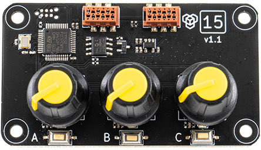

# [15] Potentiometer module


## Description

Module designed to provide input for robotic application. 3 analog knobs and 3 buttons allow to execute specific actions or adjust parameters. Can be used for motor speed, PID adjusting, servo position, RGB color and anything other.

**Features:**  

- 3 analog knobs  
- 3 buttons  
- 3 individual brightness leds  

{style="display: block;margin-left: auto;margin-right: auto;"}

## Code examples

**Arduino projects:** [15_potentiometer](https://github.com/totemmaker/TotemArduinoBoards/tree/master/libraries/TotemBUS/examples/15_potentiometer){target=_blank}

```arduino
#include <TotemModule15.h>
TotemModule15 module;
```

??? example "Function usage (click to expand)"
    ```arduino
    /* Knob control */
    // Read knob A value "128"
    int knobA = module.getKnobA();
    // Change knob resolution to 12 bits
    module.setKnobBits(12);
    // Read knob B value "2048"
    int knobB = module.getKnobB();
    // Read knob C value "0"
    int knobC = module.getKnobC();
    ```

    ```arduino
    /* Button */
    // Check if button A is pressed
    bool isInA = module.getButtonA();
    // Check if button B is pressed or released
    bool isInB = module.getButtonB();
    // Check if button C is pressed or released
    bool isInC = module.getButtonC();
    ```

    ```arduino
    /* All LED control */
    // Turn all LED on
    module.led.on();
    // Turn all LED off
    module.led.off();
    // Set all LED to on
    module.led.set(HIGH);
    // Toggle all LED state on / off
    module.led.toggle();
    // Check if any LED is on
    bool isOn = module.led.isOn();
    // Set all LED brightness to 50%
    module.led.setAlpha(128);
    // Set all LED state to: A:on, B:off, C:on
    module.led.setBinary(B101);
    // Reset all LED to default behavior
    module.led.reset();
    ```

    ```arduino
    /* Single LED control */
    // Set LED A on
    module.led[0].on();
    // Set LED B off
    module.led[1].off();
    // Set LED C to off
    module.led[2].set(LOW);
    // Toggle LED A state on / off
    module.led[0].toggle();
    // Check if LED B is on "false"
    bool isOn = module.led[1].isOn();
    // Set LED C brightness to 100%
    module.led[2].setAlpha(255);
    ```

***

## Functions

### Knob control

#### (`position`) module.getKnobA() { #getKnobA data-toc-label='getKnobA()' }
#### (`position`) module.getKnobB() { #getKnobB data-toc-label='getKnobB()' }
#### (`position`) module.getKnobC() { #getKnobC data-toc-label='getKnobC()' }
: Get knob position. (0, 128, 255) = (left, center, right).  
Returned value range depends on `setKnobBits()` (resolution) setting.  
**Returns:**  
`position` - knob position [`0`:`255`]  

#### module.setKnobBits(`resolution`) { #setKnobBits data-toc-label='setKnobBits()' }
: Set knob resolution. `knobX.get()` will return value according to this parameter.  
Allowed values:  
`6` - [0:64]  
`8` - [0:256] (default)  
`10` - [0:1024]  
`12` - [0:4096]  
**Parameter:**  
`resolution` - knob analog resolution in bits. [`6`,`8`,`10`,`12`], _Default:_ `8`  

### Button

#### (`state`) module.getButtonA() { #getButtonA data-toc-label='getButtonA()' }
#### (`state`) module.getButtonB() { #getButtonB data-toc-label='getButtonB()' }
#### (`state`) module.getButtonC() { #getButtonC data-toc-label='getButtonC()' }
: Check if button is pressed.  
**Returns:**  
`status` - yes / no [`true`:`false`]  

### All LED control

#### module.led.on() { #led.on data-toc-label='led.on()' }
: Turn all LED on.  

#### module.led.off() { #led.off data-toc-label='led.off()' }
: Turn all LED off.  

#### module.led.set(`state`) { #led.set data-toc-label='led.set()' }
: Set all LED to specific state (on / off).  
**Parameter:**  
`state` - state on / off [`HIGH`:`LOW`] or [`true`:`false`]  

#### module.led.toggle() { #led.toggle data-toc-label='led.toggle()' }
: Toggle all LED between on / off states.  

#### (`state`) module.led.isOn() { #led.isOn data-toc-label='led.isOn()' }
: Check if any of LED is on.  
**Returns:**  
`state` - is any LED on [`true`:`false`] or [`HIGH`:`LOW`].  

#### module.led.setAlpha(`alpha`) { #led.setAlpha data-toc-label='led.setAlpha()' }
: Set all LED brightness.  
**Parameter:**  
`alpha` - brightness [`0`:`255`].  

#### module.led.setBinary(`mask`) { #led.setBinary data-toc-label='led.setBinary()' }
: Set all LED state with single value mask.  
Each bit represents individual LED state. B100 - A, B010 - B, B001 - C.  
**Parameter:**  
`state` - binary mask [`B000`:`B111`].  

#### module.led.reset() { #led.reset data-toc-label='led.reset()' }
: Re-enable default behavior of LED. It is switched off when any of LED function is used.  

### Single LED control

Control specific LED by providing its number. 0 - A, 1 - B, 2 - C.  

Individual LED can be accessed by specifying index: `module.rgb[0].on()`.  
LED from A to C is identified as indexes `0`-`2`.  
Accessing "without index" will affect all LED.

## Low level commands

These are low level TotemBUS commands accepted by module. Is not required when using objective API described above.

| Command | Parameters | Description |
| ------- | ---------- | ----------- |
| `knobA` |  _Returns:_(`int`) | Knob A position |
| `knobB` |  _Returns:_(`int`) | Knob B position |
| `knobC` |  _Returns:_(`int`) | Knob C position |
| `knobAll/bits` | (`int`) | Set knob resolution in bits |
| `ledAll/reset` | _None_ | Reset LED to default behavior |
| `ledAll` | (`int`) | Set all LED brightness (%) |
| `ledA` | (`int`) | Set LED A brightness (%) |
| `ledB` | (`int`) | Set LED B brightness (%) |
| `ledC` | (`int`) | Set LED C brightness (%) |
| `buttonA` | _Returns:_(`bool`) | Is button A pressed |
| `buttonB` | _Returns:_(`bool`) | Is button B pressed |
| `buttonC` | _Returns:_(`bool`) | Is button C pressed |
