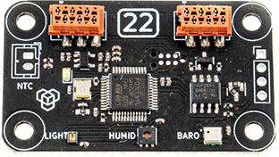

# [22] Environment sensor

## Description

Module with multiple integrated sensors for measuring environment conditions. It contains light, humidity and barometer sensors, allowing to monitor a variety of parameters.  

**Features:**  

Detection of:  

- Luminosity  
- Infrared  
- Color (RGB)  
- Air temperature (internal & external NTC)  
- Air humidity  
- Atmospheric pressure  
- Altitude  

{style="display: block;margin-left: auto;margin-right: auto;"}

***

## Code examples

**Arduino projects:** [22_sensor](https://github.com/totemmaker/TotemArduinoBoards/tree/master/libraries/TotemBUS/examples/22_sensor){target=_blank}

```arduino
#include <TotemModule22.h>
TotemModule22 module;
```

??? example "Function usage (click to expand)"
    ```arduino
    /* Light */
    // Get  amount of red color "1561"
    int colorR = module.getColorR();
    // Get  amount of green color "156581"
    int colorG = module.getColorG();
    // Get  amount of green color "215017"
    int colorB = module.getColorB();
    // Get amount of infrared light
    int getIR = module.getIR();
    // Get luminosity
    int getLumen = module.getLumen();
    // Set light sensor gain
    module.setLightSensorGain(18);
    ```
    ```arduino
    /* Temperature */
    // Get air temperature Celsius
    float tempC = module.getTempC();
    // Get air temperature Fahrenheit 
    float tempF = module.getTempF();
    // Get air temperature Kelvin
    float tempK = module.getTempK();
    ```
    ```arduino
    /* NTC temperature */
    // Get NTC sensor air temperature Celsius
    float ntcTempC = module.getNtcC();
    // Get NTC sensor air temperature Fahrenheit
    float ntcTempF = module.getNtcF();
    // Get NTC sensor air temperature Kelvin
    float ntcTempK = module.getNtcK();
    // Get NTC sensor resistance
    int ntcR = module.getNtcResistance();
    ```
    ```arduino
    /* Humidity */
    // Get air humidity
    int humidity = module.getHumidity();
    ```
    ```arduino
    /* Pressure */
    // Get air pressure Pascal
    float pressurePa = module.getPressurePa();
    // Get air pressure Hectopascal
    float pressurehPa = module.getPressurehPa();
    // Get air pressure Millibar
    float pressureMbar = module.getPressureMbar();
    // Get air pressure Bar
    float pressureBar = module.getPressureBar();
    // Get air pressure Pound per Square Inch
    float pressurePsi = module.getPressurePsi();
    ```
    ```arduino
    /* Altitude */
    // Get altitude Meters
    float altitudeM = module.getAltitudeMeter();
    // Get altitude Foot
    float altitudeFt = module.getAltitudeFoot();
    // Get altitude Inches
    float altitudeInch = module.getAltitudeInch();
    // Set sea level air pressure
    module.setAltitudeSeaLevel(101325);
    ```
    ```arduino
    /* LED control */
    // Turn LED on
    module.led.on();
    // Turn LED off
    module.led.off();
    // Set LED to on
    module.led.set(HIGH);
    // Toggle LED state on / off
    module.led.toggle();
    // Check if LED is on
    bool isOn = module.led.isOn();
    ```

## Functions

### Light

Light sensor is able to read amount of detected light and its color saturation. If you trying to get precise measurements, turn of on-board red LED which may induce some red shade into sensor. Use function `module.led.off()` for that.  

<h4 class="apidec" id="getColorR">
<code>saturation</code> <span class="object">module</span>.<span class="function">getColorR</span>()
<a class="headerlink" href="#getColorR" title="Permanent link">¶</a></h4>
<h4 class="apidec" id="getColorG">
<code>saturation</code> <span class="object">module</span>.<span class="function">getColorG</span>()
<a class="headerlink" href="#getColorG" title="Permanent link">¶</a></h4>
<h4 class="apidec" id="getColorB">
<code>saturation</code> <span class="object">module</span>.<span class="function">getColorB</span>()
<a class="headerlink" href="#getColorB" title="Permanent link">¶</a></h4>
: Get precise amount of specified color. Higher value means more color in light is detected.  
**Returns:**  
`saturation` - 18-bit amount of red color [`0`:`262143`]  

<h4 class="apidec" id="getIR">
<code>saturation</code> <span class="object">module</span>.<span class="function">getIR</span>()
<a class="headerlink" href="#getIR" title="Permanent link">¶</a></h4>
: Get precise amount of infrared light hitting the sensor.  
**Returns:**  
`saturation` - 18-bit amount of infrared light [`0`:`262143`]  

<h4 class="apidec" id="getLumen">
<code>saturation</code> <span class="object">module</span>.<span class="function">getLumen</span>()
<a class="headerlink" href="#getLumen" title="Permanent link">¶</a></h4>
: Get precise amount of light (luminosity) hitting the sensor.  
**Returns:**  
`saturation` - 18-bit amount of light [`0`:`262143`]  

<h4 class="apidec" id="setLightSensorGain">
<span class="object">module</span>.<span class="function">setLightSensorGain</span>(<code>gain</code>)
<a class="headerlink" href="#setLightSensorGain" title="Permanent link">¶</a></h4>
: Set light sensor gain.  
**Parameter:**  
`gain` - gain value [`1`,`3`,`6`,`9`,`18`]. _Default:_ `18`  

### Temperature

<h4 class="apidec" id="getTempC">
<code>temperatureC</code> <span class="object">module</span>.<span class="function">getTempC</span>()
<a class="headerlink" href="#getTempC" title="Permanent link">¶</a></h4>
<h4 class="apidec" id="getTempF">
<code>temperatureF</code> <span class="object">module</span>.<span class="function">getTempF</span>()
<a class="headerlink" href="#getTempF" title="Permanent link">¶</a></h4>
<h4 class="apidec" id="getTempK">
<code>temperatureK</code> <span class="object">module</span>.<span class="function">getTempK</span>()
<a class="headerlink" href="#getTempK" title="Permanent link">¶</a></h4>
: Get air temperature. Multiple units available.  
**Returns:**  
`temperatureC` - Celsius (_float_) (`24.75`)C  
`temperatureF` - Fahrenheit (_float_) (`76.55`)F  
`temperatureK` - Kelvin (_float_) (`297.9`)K  

### NTC temperature

Module supports external [Thermistor](https://en.wikipedia.org/wiki/Thermistor){target=_blank}. It should be soldered or connected to NTC pins. Once connected, module will start measurements automatically.

<h4 class="apidec" id="getNtcC">
<code>temperatureC</code> <span class="object">module</span>.<span class="function">getNtcC</span>()
<a class="headerlink" href="#getNtcC" title="Permanent link">¶</a></h4>
<h4 class="apidec" id="getNtcF">
<code>temperatureF</code> <span class="object">module</span>.<span class="function">getNtcF</span>()
<a class="headerlink" href="#getNtcF" title="Permanent link">¶</a></h4>
<h4 class="apidec" id="getNtcK">
<code>temperatureK</code> <span class="object">module</span>.<span class="function">getNtcK</span>()
<a class="headerlink" href="#getNtcK" title="Permanent link">¶</a></h4>
: Get NTC sensor temperature. Multiple units available.  
**Returns:**  
`temperatureC` - Celsius (_float_) (`24.75`)C  
`temperatureF` - Fahrenheit (_float_) (`76.55`)F  
`temperatureK` - Kelvin (_float_) (`297.9`)K  

<h4 class="apidec" id="getNtcResistance">
<code>resistance</code> <span class="object">module</span>.<span class="function">getNtcResistance</span>()
<a class="headerlink" href="#getNtcResistance" title="Permanent link">¶</a></h4>
: Get NTC sensor resistance in (Ohms). Module use it to compute air temperature.  
**Returns:**  
`resistance` - thermistor resistance in Ohms. `0` - not connected  

### Humidity

<h4 class="apidec" id="getHumidity">
<code>humidity</code> <span class="object">module</span>.<span class="function">getHumidity</span>()
<a class="headerlink" href="#getHumidity" title="Permanent link">¶</a></h4>
: Get percentage of air humidity.  
**Returns:**  
`humidity` - humidity [`0`:`100`]%  

### Pressure

<h4 class="apidec" id="getPressurePa">
<code>pressurePa</code> <span class="object">module</span>.<span class="function">getPressurePa</span>()
<a class="headerlink" href="#getPressurePa" title="Permanent link">¶</a></h4>
<h4 class="apidec" id="getPressurehPa">
<code>pressurehPa</code> <span class="object">module</span>.<span class="function">getPressurehPa</span>()
<a class="headerlink" href="#getPressurehPa" title="Permanent link">¶</a></h4>
<h4 class="apidec" id="getPressureMbar">
<code>pressureMbar</code> <span class="object">module</span>.<span class="function">getPressureMbar</span>()
<a class="headerlink" href="#getPressureMbar" title="Permanent link">¶</a></h4>
<h4 class="apidec" id="getPressureBar">
<code>pressureBar</code> <span class="object">module</span>.<span class="function">getPressureBar</span>()
<a class="headerlink" href="#getPressureBar" title="Permanent link">¶</a></h4>
<h4 class="apidec" id="getPressurePsi">
<code>pressurePsi</code> <span class="object">module</span>.<span class="function">getPressurePsi</span>()
<a class="headerlink" href="#getPressurePsi" title="Permanent link">¶</a></h4>
: Get atmospheric air pressure. Multiple units available.  
**Returns:**  
`pressurePa` - Pascal (_float_) (`90000`)Pa  
`pressurehPa` - Hectopascal (_float_) (`900`)hPa  
`pressureMbar` - Millibar (_float_) (`900`)mbar  
`pressureBar` - Bar (_float_) (`0.9`)bar  
`pressurePsi` - Pound per Square Inch (_float_) (`13.05`)psi  

### Altitude

Altitude calculation (altimeter) works by comparing current air pressure to a reference point (sea level). Sea level air pressure vary between locations and weather. For precise measurements - set it with function `setSeaLevel()`. Default setting is `101325` Pascals (1013.25 mbar). 

<h4 class="apidec" id="getAltitudeMeter">
<code>altitudeM</code> <span class="object">module</span>.<span class="function">getAltitudeMeter</span>()
<a class="headerlink" href="#getAltitudeMeter" title="Permanent link">¶</a></h4>
<h4 class="apidec" id="getAltitudeFoot">
<code>altitudeFt</code> <span class="object">module</span>.<span class="function">getAltitudeFoot</span>()
<a class="headerlink" href="#getAltitudeFoot" title="Permanent link">¶</a></h4>
<h4 class="apidec" id="getAltitudeInch">
<code>altitudeInch</code> <span class="object">module</span>.<span class="function">getAltitudeInch</span>()
<a class="headerlink" href="#getAltitudeInch" title="Permanent link">¶</a></h4>
: Get sensor altitude above sea level. Multiple units available.  
**Returns:**  
`altitudeM` - Meters (_float_) (`100`)m  
`altitudeFt` - Foot (_float_) (`328.084`)ft  
`altitudeInch` - Inches (_float_) (`3937.01`)inch  

<h4 class="apidec" id="setAltitudeSeaLevel">
<span class="object">module</span>.<span class="function">setAltitudeSeaLevel</span>(<code>pressure</code>)
<a class="headerlink" href="#setAltitudeSeaLevel" title="Permanent link">¶</a></h4>
: Set air pressure at sea level for altitude calculation.  
**Parameter:**  
`pressure` - pressure at sea level in Pascal units. _Default:_ `101325`Pa  

### LED control

<h4 class="apidec" id="led.on">
<span class="object">module</span>.<span class="group">led</span>.<span class="function">on</span>()
<a class="headerlink" href="#led.on" title="Permanent link">¶</a></h4>
: Turn LED on.  

<h4 class="apidec" id="led.off">
<span class="object">module</span>.<span class="group">led</span>.<span class="function">off</span>()
<a class="headerlink" href="#led.off" title="Permanent link">¶</a></h4>
: Turn LED off.  

<h4 class="apidec" id="led.set">
<span class="object">module</span>.<span class="group">led</span>.<span class="function">set</span>(<code>state</code>)
<a class="headerlink" href="#led.set" title="Permanent link">¶</a></h4>
: Set LED to specific state (on / off).  
**Parameter:**  
`state` - state on / off [`HIGH`:`LOW`] or [`true`:`false`]  

<h4 class="apidec" id="led.toggle">
<span class="object">module</span>.<span class="group">led</span>.<span class="function">toggle</span>()
<a class="headerlink" href="#led.toggle" title="Permanent link">¶</a></h4>
: Toggle LED between on / off states. 

<h4 class="apidec" id="led.isOn">
<code>state</code> <span class="object">module</span>.<span class="group">led</span>.<span class="function">isOn</span>()
<a class="headerlink" href="#led.isOn" title="Permanent link">¶</a></h4>
: Check if LED is on.  
**Returns:**  
`state` - LED is on [`true`:`false`] or [`HIGH`:`LOW`].  


***

## Low level commands

These are low level TotemBUS commands accepted by module. Is not required when using objective API described above.

??? abstract "Command list"
    | Command | Parameters | Description |
    | ------- | ---------- | ----------- |
    | `color` | _Returns:_(`int`) | Get RGB HEX color |
    | `color/R` | _Returns:_(`int`) | Get precise red color |
    | `color/G` | _Returns:_(`int`) | Get precise blue color |
    | `color/B` | _Returns:_(`int`) | Get precise green color |
    | `light/IR` | _Returns:_(`int`) | Get infrared amount |
    | `light/lumen` | _Returns:_(`int`) | Get lumen amount |
    | `light/gain` | (`byte`) | Set sensor gain |
    | `nfc` | _Returns:_(`int`) | Get external NTC temperature Celsius |
    | `nfc/C` | _Returns:_(`int`) | Get external NTC temperature Celsius |
    | `nfc/F` | _Returns:_(`int`) | Get external NTC temperature Fahrenheit |
    | `nfc/K` | _Returns:_(`int`) | Get external NTC temperature Kelvin |
    | `nfc/R` | _Returns:_(`int`) | Get external NTC resistance (Ohms) |
    | `temperature` | _Returns:_(`int`) | Get temperature Celsius |
    | `temperature/C` | _Returns:_(`int`) | Get temperature Celsius |
    | `temperature/F` | _Returns:_(`int`) | Get temperature Fahrenheit |
    | `temperature/K` | _Returns:_(`int`) | Get temperature Kelvin |
    | `humidity` | _Returns:_(`int`) | Get humidity (%) |
    | `pressure` | _Returns:_(`int`) | Get pressure Millibar |
    | `pressure/mbar` | _Returns:_(`int`) | Get pressure Millibar |
    | `pressure/Pa` | _Returns:_(`int`) | Get pressure Pascal |
    | `pressure/hPa` | _Returns:_(`int`) | Get pressure Hectopascal |
    | `pressure/psi` | _Returns:_(`int`) | Get pressure Pound per square inch |
    | `altitude` | _Returns:_(`int`) | Get altitude meters |
    | `altitude/m` | _Returns:_(`int`) | Get altitude meters |
    | `altitude/ft` | _Returns:_(`int`) | Get altitude foot |
    | `altitude/seaLevel` | (`int`) | Set sea level pressure (Pascal) |
    | `led` | (`bool`) | Set LED on/off |
