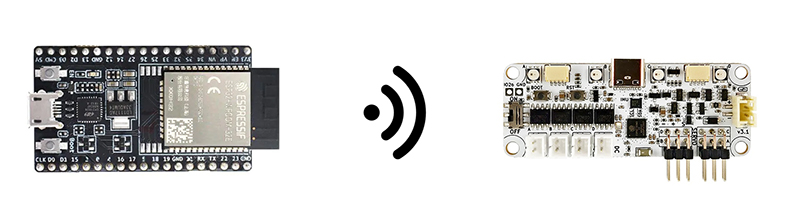

# Totem BLE



- Operate Totem BLE boards remotely over [TotemApp](../../roboboard/api/totemapp.md) service
- Supported on ESP32 (BLE capable) Arduino boards and [TotemLibrary](https://github.com/totemmaker/TotemArduino){target=_blank}
- Available features:
    - Board discovery [`scan()`](#scan)
    - Control integrated features ([Motor control](../roboboard-x3.md#motor-control))
    - Send user defined data [`sendValue()`](../roboboard-x3.md#sendValue), [`sendString()`](../roboboard-x3.md#sendString)

```arduino title="Totem Library headers"
// Control over Bluetooth
#include <TotemBLE.h>              // Discover Totem boards (scan)
#include <TotemMiniControlBoard.h> // Connect Mini Control Board
#include <TotemRoboBoardX3.h>      // Connect RoboBoard X3
#include <TotemRoboBoardX4.h>      // Connect RoboBoard X4
```

## TotemBLE

`TotemBLE` is only used to discover available boards or validate them before connecting. For actual connection and control read specific board section [MiniControlBoard](../mini-control-board.md#api-reference), [RoboBoard X3](../roboboard-x3.md#api-reference), [RoboBoard X4](../roboboard-x4.md#api-reference).

Boards are able to represent themselves with customizable: `name`, `color` and `model` (type of robot). This information is available before BLE connection is established. Same information and functionality is available using [Totem App](../../remote-control/app/index.md).

```arduino
#include <TotemBLE.h>
TotemBLE totemBLE;
// Board found event
void onScanResult(TotemScanResult result) {
  // Print discovered board information
  Serial.printf("Address: '%s', Type: %s, Name: %s, Color: %x\n",
    result.getAddress().c_str(), result.getType().c_str(), result.getName().c_str(), result.getColor());
}
void setup() {
  Serial.begin(115200);
  // Register result function
  totemBLE.addOnScanResult(onScanResult);
  // Start scan for available Totem Boards
  totemBLE.scan();
}
void loop() { }
```

### Scan function

Begin BLE [`scan()`](#scan) and receive discovered results from [`addOnScanResult()`](#addOnScanResult).

<h4 class="apidec" id="addOnScanResult">
<span class="object">totemBLE</span>.<span class="function">addOnScanResult</span>(<code>function</code>)
<a class="headerlink" href="#addOnScanResult" title="Permanent link">¶</a></h4>
: Register function to receive discovered scan results [`TotemScanResult`](#totemscanresult).  
**Parameter:**  
`function` - `void onResult(TotemScanResult result)`  

<h4 class="apidec" id="scan">
<code>status</code> <span class="object">totemBLE</span>.<span class="function">scan</span>()
<a class="headerlink" href="#scan" title="Permanent link">¶</a></h4>
<h4 class="apidec" id="scan-duration">
<code>status</code> <span class="object">totemBLE</span>.<span class="function">scan</span>(<code>duration</code>)
<a class="headerlink" href="#scan-duration" title="Permanent link">¶</a></h4>
: Start Bluetooth scan for Totem boards. Results will be received in function registered with [`addOnScanResult()`](#addOnScanResult).  
**Parameter:**  
`duration` - amount of seconds to scan. [`0`] infinite.  
**Returns:**  
`status` - [`true`] scan is started, [`false`] failed to start.  

<h4 class="apidec" id="stop">
<span class="object">totemBLE</span>.<span class="function">stop</span>()
<a class="headerlink" href="#stop" title="Permanent link">¶</a></h4>
: Stop ongoing Bluetooth scan.  

<h4 class="apidec" id="isScanning">
<code>status</code> <span class="object">totemBLE</span>.<span class="function">isScanning</span>()
<a class="headerlink" href="#isScanning" title="Permanent link">¶</a></h4>
: Check if ongoing Bluetooth scan.  
**Returns:**  
`status` - [`true`] scanning, [`false`] not scanning.  

<h4 class="apidec" id="wait">
<span class="object">totemBLE</span>.<span class="function">wait</span>()
<a class="headerlink" href="#wait" title="Permanent link">¶</a></h4>
: Wait (block) until scan is stopped by `duration` or manually with [`stop()`](#stop).  
```arduino
TotemBLE totemBLE;
void setup() {
  totemBLE.scan();
  totemBLE.wait();
  // Code execution is held by "wait" function, until scan is stopped
}
```

### Find function

Begin BLE scan looking for specific board. Result will be returned once discovered.

<h4 class="apidec" id="findAny">
<a href="#totemscanresult"><code>TotemScanResult</code></a> <span class="object">totemBLE</span>.<span class="function">findAny</span>()
<a class="headerlink" href="#findAny" title="Permanent link">¶</a></h4>
<h4 class="apidec" id="findAny-name">
<a href="#totemscanresult"><code>TotemScanResult</code></a> <span class="object">totemBLE</span>.<span class="function">findAny</span>(<code>name</code>)
<a class="headerlink" href="#findAny-name" title="Permanent link">¶</a></h4>
: Discover any Totem board (block until found).  
**Parameter:**  
`name` - (optional) find board with matching name.  
**Returns:**  
[`TotemScanResult`](#totemscanresult) - scan result object.  

<h4 class="apidec" id="findMiniControlBoard">
<a href="#totemscanresult"><code>TotemScanResult</code></a> <span class="object">totemBLE</span>.<span class="function">findMiniControlBoard</span>()
<a class="headerlink" href="#findMiniControlBoard" title="Permanent link">¶</a></h4>
<h4 class="apidec" id="findRoboBoardX3">
<a href="#totemscanresult"><code>TotemScanResult</code></a> <span class="object">totemBLE</span>.<span class="function">findRoboBoardX3</span>()
<a class="headerlink" href="#findRoboBoardX3" title="Permanent link">¶</a></h4>
<h4 class="apidec" id="findRoboBoardX4">
<a href="#totemscanresult"><code>TotemScanResult</code></a> <span class="object">totemBLE</span>.<span class="function">findRoboBoardX4</span>()
<a class="headerlink" href="#findRoboBoardX4" title="Permanent link">¶</a></h4>
<h4 class="apidec" id="findMiniControlBoard-name">
<a href="#totemscanresult"><code>TotemScanResult</code></a> <span class="object">totemBLE</span>.<span class="function">findMiniControlBoard</span>(<code>name</code>)
<a class="headerlink" href="#findMiniControlBoard-name" title="Permanent link">¶</a></h4>
<h4 class="apidec" id="findRoboBoardX3-name">
<a href="#totemscanresult"><code>TotemScanResult</code></a> <span class="object">totemBLE</span>.<span class="function">findRoboBoardX3</span>(<code>name</code>)
<a class="headerlink" href="#findRoboBoardX3-name" title="Permanent link">¶</a></h4>
<h4 class="apidec" id="findRoboBoardX4-name">
<a href="#totemscanresult"><code>TotemScanResult</code></a> <span class="object">totemBLE</span>.<span class="function">findRoboBoardX4</span>(<code>name</code>)
<a class="headerlink" href="#findRoboBoardX4-name" title="Permanent link">¶</a></h4>
: Discover specific type of Totem board (block until found).  
**Parameter:**  
`name` - (optional) find board with matching name.  
**Returns:**  
[`TotemScanResult`](#totemscanresult) - scan result object.  

<h4 class="apidec" id="findAddress">
<a href="#totemscanresult"><code>TotemScanResult</code></a> <span class="object">totemBLE</span>.<span class="function">findAddress</span>(<code>address</code>)
<a class="headerlink" href="#findAddress" title="Permanent link">¶</a></h4>
: Discover Totem board matching Bluetooth address (block until found).  
**Parameter:**  
`address` - address Bluetooth address to find.  
**Returns:**  
[`TotemScanResult`](#totemscanresult) - scan result object.  

## TotemScanResult

<h4 class="apidec" id="getAddress">
<code>address</code> <span class="object">result</span>.<span class="function">getAddress</span>()
<a class="headerlink" href="#getAddress" title="Permanent link">¶</a></h4>
: Get board Bluetooth address.  
**Returns:**  
`address` - [String](https://www.arduino.cc/reference/en/language/variables/data-types/stringobject/){target=_blank} object containing address  

<h4 class="apidec" id="getName">
<code>name</code> <span class="object">result</span>.<span class="function">getName</span>()
<a class="headerlink" href="#getName" title="Permanent link">¶</a></h4>
: Get board name.  
**Returns:**  
`name` - [String](https://www.arduino.cc/reference/en/language/variables/data-types/stringobject/){target=_blank} object containing name  

<h4 class="apidec" id="getColor">
<code>color</code> <span class="object">result</span>.<span class="function">getColor</span>()
<a class="headerlink" href="#getColor" title="Permanent link">¶</a></h4>
: Get board appearance color.  
**Returns:**  
`color` - 24-bit HEX color  

<h4 class="apidec" id="getModel">
<code>color</code> <span class="object">result</span>.<span class="function">getModel</span>()
<a class="headerlink" href="#getModel" title="Permanent link">¶</a></h4>
: Get board appearance identifier.  
_Note: Not used at the moment_.  
**Returns:**  
`color` - 16-bit identifier  

<h4 class="apidec" id="getNumber">
<code>number</code> <span class="object">result</span>.<span class="function">getNumber</span>()
<a class="headerlink" href="#getNumber" title="Permanent link">¶</a></h4>
: Get board identification number.  
**Returns:**  
`number` - 8-bit id  

<h4 class="apidec" id="getType">
<code>type</code> <span class="object">result</span>.<span class="function">getType</span>()
<a class="headerlink" href="#getType" title="Permanent link">¶</a></h4>
: Get board type name.  
**Returns:**  
`type` - [String](https://www.arduino.cc/reference/en/language/variables/data-types/stringobject/){target=_blank} of [`Mini Control Board`, `RoboBoard X3`, `RoboBoard X4`]  

<h4 class="apidec" id="isMiniControlBoard">
<code>status</code> <span class="object">result</span>.<span class="function">isMiniControlBoard</span>()
<a class="headerlink" href="#isMiniControlBoard" title="Permanent link">¶</a></h4>
<h4 class="apidec" id="isRoboBoardX3">
<code>status</code> <span class="object">result</span>.<span class="function">isRoboBoardX3</span>()
<a class="headerlink" href="#isRoboBoardX3" title="Permanent link">¶</a></h4>
<h4 class="apidec" id="isRoboBoardX4">
<code>status</code> <span class="object">result</span>.<span class="function">isRoboBoardX4</span>()
<a class="headerlink" href="#isRoboBoardX4" title="Permanent link">¶</a></h4>
: Is board of specific type.  
**Returns:**  
`status` - [`true`:`false`]  
