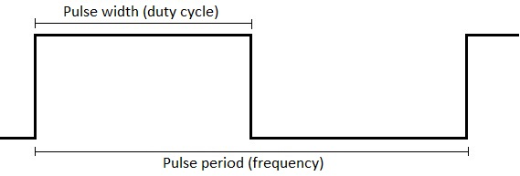

# LabBoard

Programming code reference to control LabBoard from Arduino boards over [Serial protocol](../labboard/serial-protocol.md).  
To setup serial communication - read [Serial setup](../labboard/features/serial-monitor.md) section.  
Functions are available using [Totem Library](https://github.com/totemmaker/TotemArduino){target="_blank"}.  
Make sure `#!arduino Serial.begin(57600)` speed matches with the one selected in LabBoard.  

Example code executed on TotemDuino:  
```arduino
#include <Totem.h> // Includes LabBoard functions LB.*
void setup() {
  Serial.begin(57600); // Set baudrate to 57600
}
void loop() {
  LB.led.on(); // Turn all LabBoard LED on
  delay(1000); // Wait 1s
  LB.led.off(); // Turn all LabBoard LED off
  delay(1000); // Wait 1s
}
```

## Voltage read (ADC)

Read voltage of LabBoard analog inputs.

<h4 class="apidec" id="volt.getVIN"><span class="object">LB</span>.<span class="group">volt</span>.<span class="function">getVIN</span>()<a class="headerlink" href="#volt.getVIN" title="Permanent link">¶</a></h4>
: Read VIN pin voltage.  
  _Returns:_ ([float](https://www.arduino.cc/reference/en/language/variables/data-types/float/){target="_blank"}) `6.0` - `30.0` V | `-100.0` - invalid.
<h4 class="apidec" id="volt.get50V"><span class="object">LB</span>.<span class="group">volt</span>.<span class="function">get50V</span>()<a class="headerlink" href="#volt.get50V" title="Permanent link">¶</a></h4>
: Read ±50V pin voltage.  
  _Returns:_ ([float](https://www.arduino.cc/reference/en/language/variables/data-types/float/){target="_blank"}) `-50.0` - `50.0` V | `-100.0` - invalid.
<h4 class="apidec" id="volt.get5V"><span class="object">LB</span>.<span class="group">volt</span>.<span class="function">get5V</span>()<a class="headerlink" href="#volt.get5V" title="Permanent link">¶</a></h4>
: Read ±5V pin voltage.  
  _Returns:_ ([float](https://www.arduino.cc/reference/en/language/variables/data-types/float/){target="_blank"}) `-6.15` - `6.15` V | `-100.0` - invalid.
<h4 class="apidec" id="volt.get05V"><span class="object">LB</span>.<span class="group">volt</span>.<span class="function">get05V</span>()<a class="headerlink" href="#volt.get05V" title="Permanent link">¶</a></h4>
: Read ±0.5V pin voltage.  
  _Returns:_ ([float](https://www.arduino.cc/reference/en/language/variables/data-types/float/){target="_blank"}) `-0.7` - `0.7` V | `-100.0` - invalid.
<h4 class="apidec" id="volt.getAmp"><span class="object">LB</span>.<span class="group">volt</span>.<span class="function">getAmp</span>()<a class="headerlink" href="#volt.getAmp" title="Permanent link">¶</a></h4>
: Read SHUNT pin current.  
  _Returns:_ ([float](https://www.arduino.cc/reference/en/language/variables/data-types/float/){target="_blank"}) `0.0` - `0.8` A | `-100.0` - invalid.

---

```arduino
#include <Totem.h> // Includes LabBoard functions LB.*
void setup() {
  Serial.begin(57600); // Set baudrate to 57600
  LB.display.setMonitor(0); // Don't print "Serial.print" to LabBoard display.
  LB.display.clear(); // Clear LabBoard display.
}
void loop() {
  // Read LabBoard voltages
  float v05 = LB.volt.get05V();
  float v5 = LB.volt.get5V();
  float v50 = LB.volt.get50V();
  float vin = LB.volt.getVIN();
  // Print voltages to Arduino IDE Serial Monitor
  Serial.print("Pin 0.5V : ");
  Serial.println(v05);
  Serial.print("Pin 5V : ");
  Serial.println(v5);
  Serial.print("Pin 50V : ");
  Serial.println(v50);
  Serial.print("Pin VIN : ");
  Serial.println(vin);
  delay(300);
}
```

## Voltage write (DAC)

Write voltage to LabBoard analog outputs.

<h4 class="apidec" id="volt.setVREG"><span class="object">LB</span>.<span class="group">volt</span>.<span class="function">setVREG</span>(<code>voltage</code>)<a class="headerlink" href="#volt.setVREG" title="Permanent link">¶</a></h4>
: Write VREG pin voltage.  
  _Maximum output voltage depends on VIN voltage._  
  `voltage`: ([float](https://www.arduino.cc/reference/en/language/variables/data-types/float/){target="_blank"}) `3.0` - `VIN - 1.0` V.
<h4 class="apidec" id="volt.setDAC1"><span class="object">LB</span>.<span class="group">volt</span>.<span class="function">setDAC1</span>(<code>voltage</code>)<a class="headerlink" href="#volt.setDAC1" title="Permanent link">¶</a></h4>
: Write DAC1 pin voltage.  
  `voltage`: ([float](https://www.arduino.cc/reference/en/language/variables/data-types/float/){target="_blank"}) `0.0` - `3.25` V.
<h4 class="apidec" id="volt.setDAC2"><span class="object">LB</span>.<span class="group">volt</span>.<span class="function">setDAC2</span>(<code>voltage</code>)<a class="headerlink" href="#volt.setDAC2" title="Permanent link">¶</a></h4>
: Write DAC2 pin voltage.  
  `voltage`: ([float](https://www.arduino.cc/reference/en/language/variables/data-types/float/){target="_blank"}) `0.0` - `3.25` V.
<h4 class="apidec" id="volt.setDAC3"><span class="object">LB</span>.<span class="group">volt</span>.<span class="function">setDAC3</span>(<code>voltage</code>)<a class="headerlink" href="#volt.setDAC3" title="Permanent link">¶</a></h4>
: Write DAC3 pin voltage.  
  `voltage`: ([float](https://www.arduino.cc/reference/en/language/variables/data-types/float/){target="_blank"}) `0.0` - `3.25` V.

---

<h4 class="apidec" id="volt.getVREG"><span class="object">LB</span>.<span class="group">volt</span>.<span class="function">getVREG</span>()<a class="headerlink" href="#volt.getVREG" title="Permanent link">¶</a></h4>
: Read VREG pin voltage.  
  _Returns:_ ([float](https://www.arduino.cc/reference/en/language/variables/data-types/float/){target="_blank"}) `3.0` - `VIN - 1.0` V.
<h4 class="apidec" id="volt.getDAC1"><span class="object">LB</span>.<span class="group">volt</span>.<span class="function">getDAC1</span>()<a class="headerlink" href="#volt.getDAC1" title="Permanent link">¶</a></h4>
: Read DAC1 pin voltage.  
  _Returns:_ ([float](https://www.arduino.cc/reference/en/language/variables/data-types/float/){target="_blank"}) `0.0` - `3.25` V.
<h4 class="apidec" id="volt.getDAC2"><span class="object">LB</span>.<span class="group">volt</span>.<span class="function">getDAC2</span>()<a class="headerlink" href="#volt.getDAC2" title="Permanent link">¶</a></h4>
: Read DAC2 pin voltage.  
  _Returns:_ ([float](https://www.arduino.cc/reference/en/language/variables/data-types/float/){target="_blank"}) `0.0` - `3.25` V.
<h4 class="apidec" id="volt.getDAC3"><span class="object">LB</span>.<span class="group">volt</span>.<span class="function">getDAC3</span>()<a class="headerlink" href="#volt.getDAC3" title="Permanent link">¶</a></h4>
: Read DAC3 pin voltage.  
  _Returns:_ ([float](https://www.arduino.cc/reference/en/language/variables/data-types/float/){target="_blank"}) `0.0` - `3.25` V.

---

```arduino
#include <Totem.h> // Includes LabBoard functions LB.*
void setup() {
  Serial.begin(57600); // Set baudrate to 57600
}
void loop() {
  LB.volt.setDAC1(0.5); // Set DAC1 to 0.5V
  LB.volt.setDAC2(1.0); // Set DAC2 to 1.0V
  LB.volt.setDAC3(1.5); // Set DAC3 to 1.5V
  delay(2000); // Wait 2s
  LB.volt.setDAC1(1.5); // Set DAC1 to 1.5V
  LB.volt.setDAC2(2.0); // Set DAC2 to 2.0V
  LB.volt.setDAC3(2.5); // Set DAC3 to 2.5V
  delay(2000); // Wait 2s
}
```

## Frequency generator

Control LabBoard frequency generator on **TXD** pin.



<h4 class="apidec" id="txd.stop"><span class="object">LB</span>.<span class="group">txd</span>.<span class="function">stop</span>()<a class="headerlink" href="#txd.stop" title="Permanent link">¶</a></h4>
: Stop signal generator on **TXD** pin.  
<h4 class="apidec" id="txd.start"><span class="object">LB</span>.<span class="group">txd</span>.<span class="function">start</span>()<a class="headerlink" href="#txd.start" title="Permanent link">¶</a></h4>
: Start signal generator on **TXD** pin.  
<h4 class="apidec" id="txd.startBurst"><span class="object">LB</span>.<span class="group">txd</span>.<span class="function">startBurst</span>()<a class="headerlink" href="#txd.startBurst" title="Permanent link">¶</a></h4>
: Start signal generator on **TXD** pin and stop after number of pulses elapsed.  
  Configured with with `setBurstCount(count)`.  
<h4 class="apidec" id="txd.setBurstCount"><span class="object">LB</span>.<span class="group">txd</span>.<span class="function">setBurstCount(<code>count</code>)</span><a class="headerlink" href="#txd.setBurstCount" title="Permanent link">¶</a></h4>
: Write amount of pulses to output during burst mode.  
  Generator will stop when configured number is reached.  
  `count`: `0` - `65535`.  
<h4 class="apidec" id="txd.setFrequency"><span class="object">LB</span>.<span class="group">txd</span>.<span class="function">setFrequency</span>(<code>frequency</code>)<a class="headerlink" href="#txd.setFrequency" title="Permanent link">¶</a></h4>
: Write output signal frequency in hertz.  
  `frequency`: `1` - `1000000` Hz  
<h4 class="apidec" id="txd.setDutyCycle"><span class="object">LB</span>.<span class="group">txd</span>.<span class="function">setDutyCycle(<code>percentage</code>)</span><a class="headerlink" href="#txd.setDutyCycle" title="Permanent link">¶</a></h4>
: Write output signal duty cycle in percentage. `0.1` precision.  
  `percentage`: ([float](https://www.arduino.cc/reference/en/language/variables/data-types/float/){target="_blank"}) `0.0` - `100.0` %
<h4 class="apidec" id="txd.setPeriod"><span class="object">LB</span>.<span class="group">txd</span>.<span class="function">setPeriod(<code>period</code>)</span><a class="headerlink" href="#txd.setPeriod" title="Permanent link">¶</a></h4>
: Write output signal frequency (period) in microseconds.  
  `period`: `1` - `1000000` μs  
<h4 class="apidec" id="txd.setPulseWidth"><span class="object">LB</span>.<span class="group">txd</span>.<span class="function">setPulseWidth(<code>pulse</code>)</span><a class="headerlink" href="#txd.setPulseWidth" title="Permanent link">¶</a></h4>
: Write output signal duty cycle (pulse width) in microseconds.  
  **Value can't be larger than period!**  
  `pulse`: `0` - `1000000` μs  

---

<h4 class="apidec" id="txd.isBurst"><span class="object">LB</span>.<span class="group">txd</span>.<span class="function">isBurst</span>()<a class="headerlink" href="#txd.isBurst" title="Permanent link">¶</a></h4>
: Read if generator is running in burst mode.  
<h4 class="apidec" id="txd.isRunning"><span class="object">LB</span>.<span class="group">txd</span>.<span class="function">isRunning</span>()<a class="headerlink" href="#txd.isRunning" title="Permanent link">¶</a></h4>
: Read if generator is running.  
<h4 class="apidec" id="txd.getFrequency"><span class="object">LB</span>.<span class="group">txd</span>.<span class="function">getFrequency</span>()<a class="headerlink" href="#txd.getFrequency" title="Permanent link">¶</a></h4>
: Read output signal frequency in hertz.  
  _Returns:_ `1` - `1000000` Hz  
<h4 class="apidec" id="txd.getDutyCycle"><span class="object">LB</span>.<span class="group">txd</span>.<span class="function">getDutyCycle</span>()<a class="headerlink" href="#txd.getDutyCycle" title="Permanent link">¶</a></h4>
: Read output signal duty cycle in percentage.  
  _Returns:_ ([float](https://www.arduino.cc/reference/en/language/variables/data-types/float/){target="_blank"}) `0.0` - `100.0` %
<h4 class="apidec" id="txd.getPeriod"><span class="object">LB</span>.<span class="group">txd</span>.<span class="function">getPeriod</span>()<a class="headerlink" href="#txd.getPeriod" title="Permanent link">¶</a></h4>
: Read output signal frequency (period) in microseconds.  
  _Returns:_ `1` - `1000000` μs  
<h4 class="apidec" id="txd.getPulseWidth"><span class="object">LB</span>.<span class="group">txd</span>.<span class="function">getPulseWidth</span>()<a class="headerlink" href="#txd.getPulseWidth" title="Permanent link">¶</a></h4>
: Read output signal duty cycle (pulse width) in microseconds.  
  _Returns:_ `0` - `1000000` μs  

---

```arduino
#include <Totem.h> // Includes LabBoard functions LB.*
void setup() {
  Serial.begin(57600); // Set baudrate to 57600
  LB.txd.setFrequency(2000); // Set frequency to 2kHz
  LB.txd.setDutyCycle(20); // Set duty cycle to 20%
  LB.txd.start(); // Enable signal generator on TXD pin
}
void loop() {
  LB.txd.setDutyCycle(20); // Set duty cycle to 20%
  delay(2000); // Wait 2s
  LB.txd.setDutyCycle(80); // Set duty cycle to 80%
  delay(2000); // Wait 2s
}
```

## Frequency monitor

Control LabBoard frequency monitor and counter on **DIG1** pin.

<h4 class="apidec" id="rxd.stop"><span class="object">LB</span>.<span class="group">rxd</span>.<span class="function">stop</span>()<a class="headerlink" href="#rxd.stop" title="Permanent link">¶</a></h4>
: Stop signal monitor on **DIG1** pin.  
<h4 class="apidec" id="rxd.start"><span class="object">LB</span>.<span class="group">rxd</span>.<span class="function">start</span>()<a class="headerlink" href="#rxd.start" title="Permanent link">¶</a></h4>
: Start signal monitor on **DIG1** pin.  
<h4 class="apidec" id="rxd.getFrequency"><span class="object">LB</span>.<span class="group">rxd</span>.<span class="function">getFrequency</span>()<a class="headerlink" href="#rxd.getFrequency" title="Permanent link">¶</a></h4>
: Read input signal frequency in hertz.  
  _Returns:_ `0` - `23000000` Hz  
<h4 class="apidec" id="rxd.getPeriod"><span class="object">LB</span>.<span class="group">rxd</span>.<span class="function">getPeriod</span>()<a class="headerlink" href="#rxd.getPeriod" title="Permanent link">¶</a></h4>
: Read input signal frequency (period) in microseconds.  
  _Returns:_ `0.04` - `1000000.0` μs  
<h4 class="apidec" id="rxd.getCount"><span class="object">LB</span>.<span class="group">rxd</span>.<span class="function">getCount</span>()<a class="headerlink" href="#rxd.getCount" title="Permanent link">¶</a></h4>
: Read number of signal pulses elapsed.  
  _Returns:_ number  
<h4 class="apidec" id="rxd.resetCount"><span class="object">LB</span>.<span class="group">rxd</span>.<span class="function">resetCount</span>()<a class="headerlink" href="#rxd.resetCount" title="Permanent link">¶</a></h4>
: Reset pulse counter to 0 (value returned by `getCount()`).  
<h4 class="apidec" id="rxd.setSampleEdge"><span class="object">LB</span>.<span class="group">rxd</span>.<span class="function">setSampleEdge</span>(<code>edge</code>)<a class="headerlink" href="#rxd.setSampleEdge" title="Permanent link">¶</a></h4>
: Write sample (detect) edge. _Default: HIGH_  
  `edge`: &nbsp;`0` - LOW edge (falling)  
  &nbsp;&nbsp;&nbsp;&nbsp;&nbsp;&nbsp;&nbsp;&nbsp;&nbsp;&nbsp;&nbsp;&nbsp;&nbsp;`1` - HIGH edge (rising)  
<h4 class="apidec" id="rxd.getSampleEdge"><span class="object">LB</span>.<span class="group">rxd</span>.<span class="function">getSampleEdge</span>()<a class="headerlink" href="#rxd.getSampleEdge" title="Permanent link">¶</a></h4>
: Read sample (detect) edge.  
  _Returns:_ &nbsp;`0` - LOW edge (falling)  
  &nbsp;&nbsp;&nbsp;&nbsp;&nbsp;&nbsp;&nbsp;&nbsp;&nbsp;&nbsp;&nbsp;&nbsp;&nbsp;&nbsp;&nbsp;&nbsp;`1` - HIGH edge (rising)  

---

```arduino
#include <Totem.h> // Includes LabBoard functions LB.*
void setup() {
  Serial.begin(57600); // Set baudrate to 57600
  LB.txd.start(); // Enable signal monitor on DIG1 pin
}
void loop() {
  // Read measured frequency on DIG1 pin
  int frequency = LB.rxd.getFrequency();
  // Print measured frequency on LabBoard display
  Serial.println(frequency);
  delay(500); // Wait 0.5s
}
```

## Digital read

Read digital state of LabBoard pins **DIG1** and **DIG2**.

<h4 class="apidec" id="getDIG1"><span class="object">LB</span>.<span class="function">getDIG1</span>()<a class="headerlink" href="#getDIG1" title="Permanent link">¶</a></h4>
: Read LabBoard pin **DIG1** digital state.  
  _Returns:_ `0` - LOW | `1` - HIGH  
<h4 class="apidec" id="getDIG2"><span class="object">LB</span>.<span class="function">getDIG2</span>()<a class="headerlink" href="#getDIG2" title="Permanent link">¶</a></h4>
: Read LabBoard pin **DIG2** digital state.  
  _Returns:_ `0` - LOW | `1` - HIGH  

---

```arduino
#include <Totem.h> // Includes LabBoard functions LB.*
void setup() {
  Serial.begin(57600); // Set baudrate to 57600
}
void loop() {
  // Read DIG pins state
  int dig1 = LB.getDIG1();
  int dig2 = LB.getDIG2();
  // Print pins state to LabBoard display
  Serial.print("1");
  Serial.println(dig1 ? "HI" : "LO");
  Serial.print("   2");
  Serial.println(dig2 ? "HI" : "LO");
}
```

## Display control

Control LabBoard 7-segment display.  

<h4 class="apidec" id="Serial.println"><span class="object">Serial</span>.<span class="function">println</span>(<code>value</code>)<a class="headerlink" href="#Serial.println" title="Permanent link">¶</a></h4>
: Write value to display. Aligned to right.  
  `value`: any value or string.  
<h4 class="apidec" id="display.print"><span class="object">LB</span>.<span class="group">display</span>.<span class="function">print</span>(<code>value</code>)<a class="headerlink" href="#display.print" title="Permanent link">¶</a></h4>
: Write value to display. Aligned to left.  
  `value`: any value or string.  
<h4 class="apidec" id="display.print"><span class="object">LB</span>.<span class="group">display</span>.<span class="function">print</span>(<code>offset</code>,<code>value</code>)<a class="headerlink" href="#display.print" title="Permanent link">¶</a></h4>
: Write value to display. Aligned to left. Allows to set writing start point.  
  `offset`: number of segments to push from left.  
  `value`: any value or string.  
<h4 class="apidec" id="display.clear"><span class="object">LB</span>.<span class="group">display</span>.<span class="function">clear</span>()<a class="headerlink" href="#display.clear" title="Permanent link">¶</a></h4>
: Clear display (set to empty).  
<h4 class="apidec" id="display.setBlink"><span class="object">LB</span>.<span class="group">display</span>.<span class="function">setBlink</span>(<code>rate</code>)<a class="headerlink" href="#display.setBlink" title="Permanent link">¶</a></h4>
: Write whole display blinking rate in milliseconds.  
  `rate`: `0` - `1000` ms | `0` - stop blink.  
<h4 class="apidec" id="display.setBlink-seg"><span class="object">LB</span>.<span class="group">display</span>.<span class="function">setBlink</span>(<code>segment</code>,<code>rate</code>)<a class="headerlink" href="#display.setBlink-seg" title="Permanent link">¶</a></h4>
: Write specific segment blinking rate in milliseconds.  
  `segment`: `1` - `9` number from left.  
  `rate`: `0` - `1000` ms | `0` - stop blink.  
<h4 class="apidec" id="display.setBlinkBinary"><span class="object">LB</span>.<span class="group">display</span>.<span class="function">setBlinkBinary</span>(<code>map</code>,<code>rate</code>)<a class="headerlink" href="#display.setBlinkBinary" title="Permanent link">¶</a></h4>
: Write binary map of segments group to set blinking rate in milliseconds.  
  `map`: `B000000000` - `B111111111` | `0x0` - `0x1FF`.  
  `rate`: `0` - `1000` ms | `0` - stop blink.  
<h4 class="apidec" id="display.setBrightness"><span class="object">LB</span>.<span class="group">display</span>.<span class="function">setBrightness</span>(<code>brightness</code>)<a class="headerlink" href="#display.setBrightness" title="Permanent link">¶</a></h4>
: Write display brightness.  
  `brightness`: `0` - `15`  
<h4 class="apidec" id="display.setMonitor"><span class="object">LB</span>.<span class="group">display</span>.<span class="function">setMonitor</span>(<code>state</code>)<a class="headerlink" href="#display.setMonitor" title="Permanent link">¶</a></h4>
: Write serial monitor feature state (on / off).  
  Will print all data from `Serial.println()` to display. _Default: on._  
  `state`: `0` - off | `1` - on  

---

```arduino
#include <Totem.h> // Includes LabBoard functions LB.*
void setup() {
  Serial.begin(57600); // Set baudrate to 57600
}
int counter = 0;
void loop() {
  // Clean display before printing
  LB.display.clear();
  counter++; // Increment counter value
  LB.display.print(0, counter); // Print to first segment
  counter++;
  LB.display.print(3, counter); // Print to fourth segment
  counter++;
  LB.display.print(6, counter); // Print to seventh segment
  delay(1000);
}
```

## LED control

Control 11 available LabBoard LED. Each one can be individually turned on / off.  

??? summary "LED names"
    | Number | Name on board | Name in code | Binary map |
    | --- | --- | --- | --- |
    | **0**  | All   | LabBoard::LED_ALL  | `B00000000000` |
    | **1**  | DIG1  | LabBoard::LED_DIG1 | `B00000000001` |
    | **2**  | DIG2  | LabBoard::LED_DIG2 | `B00000000010` |
    | **3**  | ±50V  | LabBoard::LED_50V  | `B00000000100` |
    | **4**  | ±5V   | LabBoard::LED_5V   | `B00000001000` |
    | **5**  | ±0.5V | LabBoard::LED_05V  | `B00000010000` |
    | **6**  | DAC1  | LabBoard::LED_DAC1 | `B00000100000` |
    | **7**  | DAC2  | LabBoard::LED_DAC2 | `B00001000000` |
    | **8**  | DAC3  | LabBoard::LED_DAC3 | `B00010000000` |
    | **9**  | VIN   | LabBoard::LED_VIN  | `B00100000000` |
    | **10** | VREG  | LabBoard::LED_VREG | `B01000000000` |
    | **11** | mAmp  | LabBoard::LED_mAmp | `B10000000000` |

<h4 class="apidec" id="led.on"><span class="object">LB</span>.<span class="group">led</span>.<span class="function">on</span>()<a class="headerlink" href="#led.on" title="Permanent link">¶</a></h4>
: Write all LED to turn on.  
<h4 class="apidec" id="led.off"><span class="object">LB</span>.<span class="group">led</span>.<span class="function">off</span>()<a class="headerlink" href="#led.off" title="Permanent link">¶</a></h4>
: Write all LED to turn off.  
<h4 class="apidec" id="led.on-number"><span class="object">LB</span>.<span class="group">led</span>.<span class="function">on</span>(<code>number</code>)<a class="headerlink" href="#led.on-number" title="Permanent link">¶</a></h4>
: Write specific LED to turn on.  
  `number`: `1` - `11` | `0` - all LED.  
<h4 class="apidec" id="led.off-number"><span class="object">LB</span>.<span class="group">led</span>.<span class="function">off</span>(<code>number</code>)<a class="headerlink" href="#led.off-number" title="Permanent link">¶</a></h4>
: Write specific LED to turn off.  
  `number`: `1` - `11` | `0` - all LED.  
<h4 class="apidec" id="led.set"><span class="object">LB</span>.<span class="group">led</span>.<span class="function">set</span>(<code>number</code>,<code>state</code>)<a class="headerlink" href="#led.set" title="Permanent link">¶</a></h4>
: Write specific LED state (on / off).  
  `number`: `1` - `11` | `0` - all LED.  
  `state`: `0` - off | `1` - on.  
<h4 class="apidec" id="led.get"><span class="object">LB</span>.<span class="group">led</span>.<span class="function">get</span>(<code>number</code>)<a class="headerlink" href="#led.get" title="Permanent link">¶</a></h4>
: Read specific LED state.  
  `number`: `1` - `11` | `0` - all LED.  
  _Returns:_ `0` - off | `1` - on.  
<h4 class="apidec" id="led.setBinary"><span class="object">LB</span>.<span class="group">led</span>.<span class="function">setBinary</span>(<code>map</code>)<a class="headerlink" href="#led.setBinary" title="Permanent link">¶</a></h4>
: Write binary map of turned on LED.  
  `map`: `B00000000000` - `B11111111111` | `0x0` - `0x7FF`  
<h4 class="apidec" id="led.getBinary"><span class="object">LB</span>.<span class="group">led</span>.<span class="function">getBinary</span>()<a class="headerlink" href="#led.getBinary" title="Permanent link">¶</a></h4>
: Read binary map of turned on LED.  
  _Returns:_ `B00000000000` - `B11111111111` | `0x0` - `0x7FF`  

---

```arduino
#include <Totem.h> // Includes LabBoard functions LB.*
void setup() {
  Serial.begin(57600); // Set baudrate to 57600
}
void loop() {
  LB.led.on(); // Turn all LED on
  delay(1000); // Wait 1s
  LB.led.off(LabBoard::LED_DAC2); // Turn DAC2 LED off
  delay(1000); // Wait 1s
  LB.led.off(LabBoard::LED_5V); // Turn 5V LED off
  delay(1000); // Wait 1s
  LB.led.off(); // Turn all LED off
  delay(1000); // Wait 1s
}
```

## Key read

<h4 class="apidec" id="key.get"><span class="object">LB</span>.<span class="group">key</span>.<span class="function">get</span>(<code>number</code>)<a class="headerlink" href="#key.get" title="Permanent link">¶</a></h4>
: Read specific key state.  
  _Returns:_ &nbsp;`0` - not pressed  
  &nbsp;&nbsp;&nbsp;&nbsp;&nbsp;&nbsp;&nbsp;&nbsp;&nbsp;&nbsp;&nbsp;&nbsp;&nbsp;&nbsp;&nbsp;&nbsp;&nbsp;`1` - is pressed  
<h4 class="apidec" id="key.getBinary"><span class="object">LB</span>.<span class="group">key</span>.<span class="function">getBinary</span>()<a class="headerlink" href="#key.getBinary" title="Permanent link">¶</a></h4>
: Read binary map of pressed keys.  
  _Returns:_ `B00000 ` - `B11111` | `0x0` - `0x1F`  

---

```arduino
#include <Totem.h> // Includes LabBoard functions LB.*
void setup() {
  Serial.begin(57600); // Set baudrate to 57600
}
void loop() {
  // Get keys state
  int kLeft = LB.key.get(LabBoard::KEY_LEFT);
  int kMid = LB.key.get(LabBoard::KEY_MIDDLE);
  int kRight = LB.key.get(LabBoard::KEY_RIGHT);
  // Display "---" if key is pressed
  LB.display.clear();
  LB.display.print(0, kLeft ? "---" : "   ");
  LB.display.print(3, kMid ? "---" : "   ");
  LB.display.print(6, kRight ? "---" : "   ");
  delay(50);
}
```

## Configuration

Control LabBoard stored settings.  

??? summary "Settings list"
    | Name | Description |
    | --- | --- |
    | REV   | Revision number (**readonly**) |
    | VERS  | Firmware version (**readonly**) |
    | SBAUD | Default serial baud rate |
    | SMODE | Default serial mode |
    | SON   | Background serial mode |
    | DISP  | Display brightness |
    | VREG  | Calibration offset |
    | DAC1  | Calibration offset |
    | DAC2  | Calibration offset |
    | DAC3  | Calibration offset |
    | VIN   | Calibration offset |
    | 50V   | Calibration offset |
    | 5V    | Calibration offset |
    | 05V   | Calibration offset |
    | RST   | Write `1` to factory reset |

    For more information read [Serial protocol - Configuration](../labboard/serial-protocol.md#configuration).

<h4 class="apidec" id="config.set"><span class="object">LB</span>.<span class="group">config</span>.<span class="function">set</span>(<code>name</code>,<code>value</code>)<a class="headerlink" href="#config.set" title="Permanent link">¶</a></h4>
: Write configuration (setting) value.  
  `name`: setting name (`"DISP"`)  
  `value`: setting value  
<h4 class="apidec" id="config.get"><span class="object">LB</span>.<span class="group">config</span>.<span class="function">get</span>(<code>name</code>)<a class="headerlink" href="#config.get" title="Permanent link">¶</a></h4>
: Read configuration (setting) value.  
  `name`: setting name (`"DISP"`)  
  _Returns:_ setting value  

---

```arduino
#include <Totem.h> // Includes LabBoard functions LB.*
void setup() {
  Serial.begin(57600); // Set baudrate to 57600
}
void loop() {
  // Get revision and version
  int rev = LB.config.get("REV");
  int vers = LB.config.get("VERS");
  // Print to display
  Serial.print(rev);
  Serial.print(" ");
  Serial.println(vers);
  delay(1000); // Wait 1s
}
```

## Power

Control LabBoard power state.  

<h4 class="apidec" id="runBoot"><span class="object">LB</span>.<span class="function">runBoot</span>()<a class="headerlink" href="#runBoot" title="Permanent link">¶</a></h4>
: Restart LabBoard into boot mode (for firmware update).  
<h4 class="apidec" id="restart"><span class="object">LB</span>.<span class="function">restart</span>()<a class="headerlink" href="#restart" title="Permanent link">¶</a></h4>
: Restart LabBoard  
