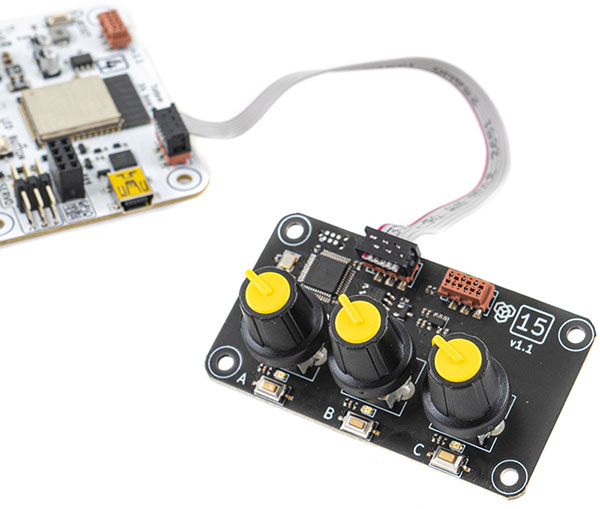

# X4 Modules

Legacy TotemBUS modules for RoboBoard X4 v1.0 and v1.1 only.  
_Note: "TotemModule" headers are included in [Totem Boards core](https://github.com/totemmaker/TotemArduinoBoards){target=_blank} and don't require [Totem Library](https://github.com/totemmaker/TotemArduino){target=_blank}._

```arduino title="RoboBoard X4 module headers"
// Control X4 Modules
#include <TotemModule11.h>  // Control Distance module
#include <TotemModule14.h>  // Control Line Follower module
#include <TotemModule15.h>  // Control Potentiometer module
#include <TotemModule22.h>  // Control Sensor module
```

## Connecting modules



- Each module is identified by number [XX] in a white square.
- Unique serial identifier is available in case more than one module is used.
- Modules can be daisy-chained with a 6 pin connector. It provides power and communication.
- Module is operational the second it's physically connected to X4.

## Controlling modules


Each module accepts a set of commands to control their specific capabilities (like reading sensor data, controlling lights or motors). Controller can also subscribe to data in order for module to start broadcasting it. The list of available functions can be found in documentation page for specific module.  

- [11] [Distance module](../11.md)
- [14] [Line follower module](../14.md)
- [15] [Potentiometer module](../15.md)
- [22] [Environment sensor](../22.md)

## Accessing specific module

Module API can be accessed by declaring its class. It will work right away, without a need for initialization. Multiple instances can be created.  
If module is not physically connected, all functions calls will be ignored.  

```arduino
#include <TotemModule11.h>
TotemModule11 module; // Declare use of distance sensor [11]
TotemModule11 module2(25151); // Declare use of distance sensor [11] with serial 25151
```
`TotemModuleXX` - each module hash class implementation name of `TotemModule` + _number_.  
`module` - a variable name of `TotemModule11`. Can be any (sensor, controller, lineReader, ...). This instance is used to call module functions.  
`(25151)` - if there are multiple modules with same number - serial is used to specify exact one. Using instance `module2` will send commands to specific module only. Otherwise - all connected [11] modules will receive a command. Check [Module scanner](#module-scanner) on how to get serial.  

## General functions

Each module library contains an API to access its functionality.

```arduino title="Communicating with module"
// Read distance from sensor
int distance = module.getMM();
// Set RGB color to green
module.rgb.color(0, 255, 0);
```

## Events

```arduino
#include <TotemModule15.h>
#include <TotemModule22.h>
TotemModule15 mod15;
TotemModule22 mod22;

void moduleEvt(int evt) {
  if (evt == TotemModule22::evtTemp) printf("Temp: %fC\n", mod22.getTempC());
  if (evt == TotemModule15::evtButtonA) printf("ButtonA: %d\n", mod15.getButtonA());
  if (evt == TotemModule15::evtButtonB) printf("ButtonB: %d\n", mod15.getButtonB());
  if (evt == TotemModule15::evtButtonC) printf("ButtonC: %d\n", mod15.getButtonC());
  if (evt == TotemModule15::evtKnobA) printf("KnobA: %d\n", mod15.getKnobA());
  if (evt == TotemModule15::evtKnobB) printf("KnobB: %d\n", mod15.getKnobB());
  if (evt == TotemModule15::evtKnobC) printf("KnobC: %d\n", mod15.getKnobC());
}

void setup() {
  mod15.addEvent(moduleEvt);
  mod22.addEvent(moduleEvt);
  // Call required functions once to receive
  // values and start broadcasting
  mod22.getTempC();
  mod15.getButtonA();
  mod15.getButtonB();
  mod15.getButtonC();
  mod15.getKnobA();
  mod15.getKnobB();
  mod15.getKnobC();
}
void loop() {

}
```

Reading module functions like `#!arduino module.get()` will always return cached value without blocking the code. This value is constantly updated in background with broadcast messages from module.  
_Code blocks shortly whem calling "get" function first time - to register an event and return value._

Using `addEvent` function is only useful if you need a callback when latest value update from module is received. Events are called only if value has changed compared to last one.

<h4 class="apidec" id="addEvent">
<span class="object">module</span>.<span class="function">addEvent</span>(<code>function</code>)
<a class="headerlink" href="#addEvent" title="Permanent link">¶</a></h4>
: Register module event function. Will be called when new data is available.  
Event data can be received simply by accessing `module`. Data is cached and won't initiate read request, but must be called inside registered function.  
**Parameter:**  
`function` - void moduleEvt(int evt)  

## Multiple modules example

Simple code example to show usage of Line Follower + Potentiometer modules and interaction between them.  
• Knob A - controls LED position on Line Follower  
• Knob B - controls RGB color  
• Knob C - controls RGB color  
```arduino
#include <TotemModule14.h>
#include <TotemModule15.h>
// Declare modules
TotemModule14 line; // Line follower module
TotemModule15 pot;  // Potentiometer module
// Start program
void setup() {
  // Empty
}
// Loop program
void loop() {
  // Read Potentiometer module knob positions
  int knobA = pot.getKnobA();
  int knobB = pot.getKnobB();
  int knobC = pot.getKnobC();
  // Display Knob A position on Line Follower module
  line.led.off();
  line.led[map(knobA, 0, 255, 0, 7)].on(); // map [0:255] -> [0:7]
  // Change RoboBoard X4 RGB color depending on Knob B, C positions
  RGB.color(
    255-knobB, knobC, 255-knobC // red, green, blue
  );
  // Delay 20 milliseconds
  delay(20);
}
```

## Module scanner

API to scan for TotemBUS modules. Can be used to get list of connected TotemBUS modules and their information (number and serial).  

```arduino
#include <TotemModule11.h>
void setup() {
  Serial.begin(115200);
}
void loop() {
  // Try to find any module on the TotemBUS
  if (TotemX4Module::find()) {
    // Print found module
    Serial.printf("Found. Number: %d, Serial: %d\n", TotemX4Module::foundNumber, TotemX4Module::foundSerial);
  }
  else {
    Serial.println("Not found");
  }
  delay(1000); // Wait 1s
}
```

***

<h4 class="apidec" id="find">
<code>found</code> <span class="object">TotemX4Module</span>::<span class="function">find</span>(<code>number</code>, <code>serial</code>)
<a class="headerlink" href="#find" title="Permanent link">¶</a></h4>
: Try to find module on TotemBUS network.  
Available request types:  
• all modules  
• modules matching specified number  
• module matching specified number and serial  
Result can be acquired with `TotemX4Module::foundNumber` and `TotemX4Module::foundSerial`.  
**Parameter:**  
`number` - module number [`0`:`255`]. `0` - all modules  
`serial` - module serial [`0`:`32767`]. `0` - ignore serial  
**Returns:**
`found` - `true` if module has been found  

<h4 class="apidec" id="foundNumber">
<span class="object">TotemX4Module</span>::<span class="function">foundNumber</span>
<a class="headerlink" href="#foundNumber" title="Permanent link">¶</a></h4>
: Found module number.  

<h4 class="apidec" id="foundSerial">
<span class="object">TotemX4Module</span>::<span class="function">foundSerial</span>
<a class="headerlink" href="#foundSerial" title="Permanent link">¶</a></h4>
: Found module serial.  
