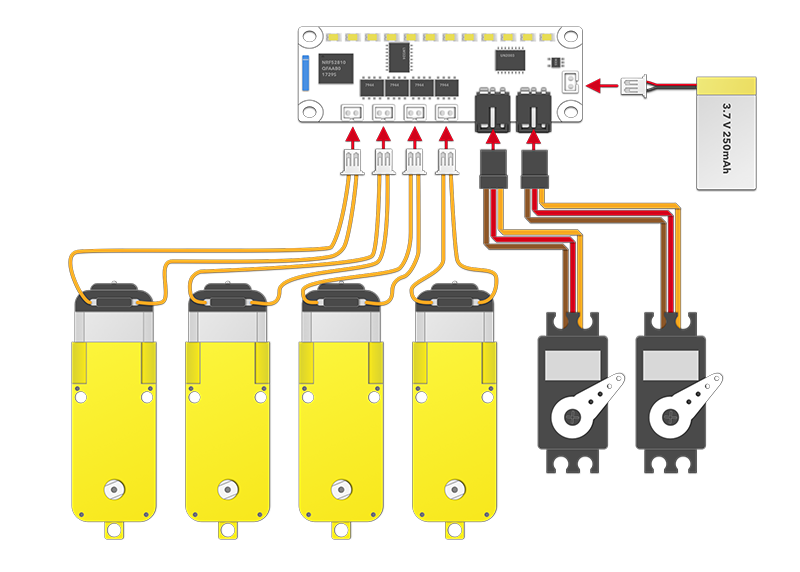
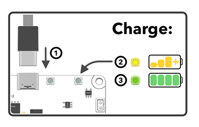
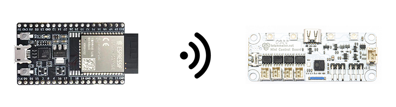

# Mini Control Board

[Totem App]: ../remote-control/app/index.md "Totem Smartphone App"
[Arduino Library]: index.md#install-library "Totem Arduino Library for remote control"


Remote control board with 4 motors, 2 servos and RGB lights.  
Operate Mini Control Board remotely using [Totem App] and [Arduino Library].

<div class="grid" style="grid-template-columns: repeat(auto-fit, minmax(min(100%, 8rem), 1fr))">
  <a href="/remote-control/app/control-robot/" class="card" style="color: inherit"><span class="twemoji"><svg xmlns="http://www.w3.org/2000/svg" viewBox="0 0 16 16"><path d="M3.75 0h8.5C13.216 0 14 .784 14 1.75v12.5A1.75 1.75 0 0 1 12.25 16h-8.5A1.75 1.75 0 0 1 2 14.25V1.75C2 .784 2.784 0 3.75 0ZM3.5 1.75v12.5c0 .138.112.25.25.25h8.5a.25.25 0 0 0 .25-.25V1.75a.25.25 0 0 0-.25-.25h-8.5a.25.25 0 0 0-.25.25ZM8 13a1 1 0 1 1 0-2 1 1 0 0 1 0 2Z"/></svg></span> Mobile control</a>
  <a href="#api-reference" class="card" style="color: inherit"><span class="twemoji"><svg xmlns="http://www.w3.org/2000/svg" viewBox="0 0 24 24"><path d="M6 4h12v1h3v2h-3v2h3v2h-3v2h3v2h-3v2h3v2h-3v1H6v-1H3v-2h3v-2H3v-2h3v-2H3V9h3V7H3V5h3V4m5 11v3h1v-3h-1m2 0v3h1v-3h-1m2 0v3h1v-3h-1Z"/></svg></span> ESP32 control</a>
  <a href="https://github.com/totemmaker/TotemArduino" target="_blank" class="card" style="color: inherit"><span class="twemoji"><svg xmlns="http://www.w3.org/2000/svg" viewBox="0 0 24 24"><path d="M8 3a2 2 0 0 0-2 2v4a2 2 0 0 1-2 2H3v2h1a2 2 0 0 1 2 2v4a2 2 0 0 0 2 2h2v-2H8v-5a2 2 0 0 0-2-2 2 2 0 0 0 2-2V5h2V3m6 0a2 2 0 0 1 2 2v4a2 2 0 0 0 2 2h1v2h-1a2 2 0 0 0-2 2v4a2 2 0 0 1-2 2h-2v-2h2v-5a2 2 0 0 1 2-2 2 2 0 0 1-2-2V5h-2V3h2Z"/></svg></span> Arduino library</a>
</div>

!!! note "Discontinued"
    This product was discontinued in 2023-Q2. All new robotic kits includes programmable [RoboBoard X3](../roboboard-x3/index.md).

## User manual

??? abstract "Feature list (click to expand)"
    **Connectivity:**  
    • Bluetooth (BLE)  

    **Board features:**  
    • 2 Servo ports (3.7 Volts)  
    • 4 DC ports (3.7 Volts)  
    • 4 RGB lights  
    • On/off switch  
    • Battery input, integrated charger  

    **Power:**  
    • USB-C: (only for charging)  
    • Battery: LiPo, 3.7V, 250 mAh  

    **Dimensions:**  
    • 65 x 25 x 8 mm (L x W x H)  

### :material-tire: Motors

Connectors on the board allow for the direct plug-in of 4 DC motors and 2 Servos.  
Motors are powered straight from the battery (around 3.7V).  
Each port is identified by letter A, B, C, D.

4 DC ports has control of: spin direction, PWM duty cycle [`0`:`100`]%, braking ([v2.0](#v20) only).  
2 Servo ports has control of: arm position [`-100`:`100`]% ([`-`] left, [`0`] center, [`+`] right).  
Servo is predefined to [`500`:`2500`]us range.  



### :material-bluetooth: Bluetooth

Once powered on, board will show up in [Totem App connection menu](../remote-control/app/control-robot.md#connecting-robot) and becomes connectable using [Arduino Library]. Bluetooth is always enabled. Only singe device can be connected at the same time.

### :material-power: Power & charging

<div class="grid" markdown>
<div class="grid cards" markdown>
  
①&nbsp;Push switch up to power on.  
②&nbsp;Battery level is displayed in color:  
:octicons-dot-fill-24:{ style="color: lawngreen" } - battery is full  
:octicons-dot-fill-24:{ style="color: gold" } - battery is medium  
:octicons-dot-fill-24:{ style="color: red" } - battery is low  
:material-white-balance-sunny:{ style="color: red" } - battery is discharged  
• Boards [v1.4](#v14), [v1.5](#v15) don't have power switch.  
</div>
<div class="grid cards" markdown>
  
①&nbsp;Plug-in USB-C cable  
② :octicons-dot-fill-24:{ style="color: gold" } battery is charging  
③ :octicons-dot-fill-24:{ style="color: lawngreen" } battery is charged  
• Charging will override ON, OFF switch.  
• Board is not operational while charging.  
• Use computer or phone charger to power.  
• Boards [v1.4](#v14), [v1.5](#v15) don't have built in charger.  
</div>
</div>

### :traffic_light: RGB light bar

Light bar can be used for robot appearance and indicating certain states.  
_Note: Boards [v1.4](#v14), [v1.5](#v15) has 12 individual red LED, controlled using [setLED()](#setLED)._  

- **Running animation** - no connection
- **Steady color** - connected to robot
- **Change color** - click ++"Settings"++ when connected with [Totem App]
- **Control color** - set any with [rgbColor()](#rgbColor)


## API Reference



Control Mini Control Board remotely using any ESP32 development board.  
Arduino interface is provided by Totem [Arduino Library].

```arduino
#include <TotemMiniControlBoard.h>
TotemMiniControlBoard board;
void setup() {
  // Connect to Mini Control Board (over Bluetooth)
  board.connect();
  // Set RGB to red
  board.rgbColor(125,0,0);
  // Spin Motor
  board.dcSpinA(40);
  // Spin Servo
  board.servoSpinA(50);
}
void loop() { }
```

### Connection

Functions to establish and control Bluetooth connection.

<h4 class="apidec" id="connect">
<code>state</code> <span class="object">board</span>.<span class="function">connect</span>()
<a class="headerlink" href="#connect" title="Permanent link">¶</a></h4>
<h4 class="apidec" id="connectName">
<code>state</code> <span class="object">board</span>.<span class="function">connectName</span>(<code>name</code>)
<a class="headerlink" href="#connectName" title="Permanent link">¶</a></h4>
<h4 class="apidec" id="connectAddress">
<code>state</code> <span class="object">board</span>.<span class="function">connectAddress</span>(<code>address</code>)
<a class="headerlink" href="#connectAddress" title="Permanent link">¶</a></h4>
: Initiate Bluetooth connection to the board.  
**Parameter:**  
`name` - connect only if name matches  
`address` - connect only if BLE address matches  
**Returns:**  
`state` - [`true`] connected, [`false`] failed  

<h4 class="apidec" id="isConnected">
<code>state</code> <span class="object">board</span>.<span class="function">isConnected</span>()
<a class="headerlink" href="#isConnected" title="Permanent link">¶</a></h4>
: Is connection active.  
**Returns:**  
`state` - [`true`] connected, [`false`] disconnected  

<h4 class="apidec" id="disconnect">
<span class="object">board</span>.<span class="function">disconnect</span>()
<a class="headerlink" href="#disconnect" title="Permanent link">¶</a></h4>
: Terminate active connection  

<h4 class="apidec" id="getAddress">
<code>address</code> <span class="object">board</span>.<span class="function">getAddress</span>()
<a class="headerlink" href="#getAddress" title="Permanent link">¶</a></h4>
: Get connected board BLE address.  
**Returns:**  
`address` - [String](https://www.arduino.cc/reference/en/language/variables/data-types/stringobject/){target=_blank} object containing address `XX:XX:XX:XX:XX`  

<h4 class="apidec" id="addOnConnectionChange">
<span class="object">board</span>.<span class="function">addOnConnectionChange</span>(<code>function</code>)
<a class="headerlink" href="#addOnConnectionChange" title="Permanent link">¶</a></h4>
: Register connection state change event.  
**Parameter:**  
`function` - function name `void onConnectionChange()`  

### Information

Functions to receive board information and configuration.

<h4 class="apidec" id="getBattery">
<code>voltage</code> <span class="object">board</span>.<span class="function">getBattery</span>()
<a class="headerlink" href="#getBattery" title="Permanent link">¶</a></h4>
: Read battery voltage.  
**Returns:**  
`voltage` - [`2700`:`4200`] voltage in millivolts.  

<h4 class="apidec" id="getVersion">
<code>version</code> <span class="object">board</span>.<span class="function">getVersion</span>()
<a class="headerlink" href="#getVersion" title="Permanent link">¶</a></h4>
: Get firmware version.  
**Returns:**  
`version` - [String](https://www.arduino.cc/reference/en/language/variables/data-types/stringobject/){target=_blank} object containing firmware version.  

<h4 class="apidec" id="getRevision">
<code>version</code> <span class="object">board</span>.<span class="function">getRevision</span>()
<a class="headerlink" href="#getRevision" title="Permanent link">¶</a></h4>
: Get board revision.  
**Returns:**  
`version` - [String](https://www.arduino.cc/reference/en/language/variables/data-types/stringobject/){target=_blank} object containing board revision.  

<h4 class="apidec" id="getName">
<code>name</code> <span class="object">board</span>.<span class="function">getName</span>()
<a class="headerlink" href="#getName" title="Permanent link">¶</a></h4>
: Get configured board name.  
**Returns:**  
`name` - [String](https://www.arduino.cc/reference/en/language/variables/data-types/stringobject/){target=_blank} object containing

<h4 class="apidec" id="getModel">
<code>model</code> <span class="object">board</span>.<span class="function">getModel</span>()
<a class="headerlink" href="#getModel" title="Permanent link">¶</a></h4>
: Get type of robot board is installed in (configured with [`setModel()`](#setModel)).  
_Note: not used at the moment._  
**Returns:**  
`name` - 16-bit identifier  

<h4 class="apidec" id="getColor">
<code>hex</code> <span class="object">board</span>.<span class="function">getColor</span>()
<a class="headerlink" href="#getColor" title="Permanent link">¶</a></h4>
: Get configured board appearance color.  
**Returns:**  
`hex` - [`0`:`0xFFFFFF`] 24-bit color code.  

<h4 class="apidec" id="getInvertDC">
<code>state</code> <span class="object">board</span>.<span class="function">getInvertDC</span>()
<a class="headerlink" href="#getInvertDC" title="Permanent link">¶</a></h4>
: Get if all DC motor ports are inverted.  
**Returns:**  
`state` - [`true`] invert, [`false`] not inverted

<h4 class="apidec" id="getAutobrakeDC">
<code>state</code> <span class="object">board</span>.<span class="function">getAutobrakeDC</span>()
<a class="headerlink" href="#getAutobrakeDC" title="Permanent link">¶</a></h4>
: Get if all DC motor autobrake is enabled.  
**Returns:**  
`state` - [`true`] brake, [`false`] coast

### Motor control

Servo and DC motors control functions.

<h4 class="apidec" id="servoSpinA">
<span class="object">board</span>.<span class="function">servoSpinA</span>(<code>pos</code>)
<a class="headerlink" href="#servoSpinA" title="Permanent link">¶</a></h4>
<h4 class="apidec" id="servoSpinB">
<span class="object">board</span>.<span class="function">servoSpinB</span>(<code>pos</code>)
<a class="headerlink" href="#servoSpinB" title="Permanent link">¶</a></h4>
: Spin servo motor to position.  
**Parameter:**  
`pos` - [`-100`:`100`]% position. [`0`] center  

<h4 class="apidec" id="servoSpinABCD">
<span class="object">board</span>.<span class="function">servoSpinAB</span>(<code>A</code>,<code>B</code>)
<a class="headerlink" href="#servoSpinABCD" title="Permanent link">¶</a></h4>
: Spin all servo motors to individual position with a single command.  
**Parameter:**  
`A`,`B` - [`-100`:`100`]% position. [`0`] center  

<h4 class="apidec" id="dcSpinA">
<span class="object">board</span>.<span class="function">dcSpinA</span>(<code>power</code>)
<a class="headerlink" href="#dcSpinA" title="Permanent link">¶</a></h4>
<h4 class="apidec" id="dcSpinB">
<span class="object">board</span>.<span class="function">dcSpinB</span>(<code>power</code>)
<a class="headerlink" href="#dcSpinB" title="Permanent link">¶</a></h4>
<h4 class="apidec" id="dcSpinC">
<span class="object">board</span>.<span class="function">dcSpinC</span>(<code>power</code>)
<a class="headerlink" href="#dcSpinC" title="Permanent link">¶</a></h4>
<h4 class="apidec" id="dcSpinD">
<span class="object">board</span>.<span class="function">dcSpinD</span>(<code>power</code>)
<a class="headerlink" href="#dcSpinD" title="Permanent link">¶</a></h4>
: Spin DC motor.  
**Parameter:**  
`power` - [`-100`:`100`]% power. [`0`] stop  

<h4 class="apidec" id="dcBrakeA">
<span class="object">board</span>.<span class="function">dcBrakeA</span>(<code>power</code>)
<a class="headerlink" href="#dcBrakeA" title="Permanent link">¶</a></h4>
<h4 class="apidec" id="dcBrakeB">
<span class="object">board</span>.<span class="function">dcBrakeB</span>(<code>power</code>)
<a class="headerlink" href="#dcBrakeB" title="Permanent link">¶</a></h4>
<h4 class="apidec" id="dcBrakeC">
<span class="object">board</span>.<span class="function">dcBrakeC</span>(<code>power</code>)
<a class="headerlink" href="#dcBrakeC" title="Permanent link">¶</a></h4>
<h4 class="apidec" id="dcBrakeD">
<span class="object">board</span>.<span class="function">dcBrakeD</span>(<code>power</code>)
<a class="headerlink" href="#dcBrakeD" title="Permanent link">¶</a></h4>
: Brake DC motor.  
_Only supported in [v2.0](#v20)_  
**Parameter:**  
`power` - [`0`:`100`]% power. Default 100%  

<h4 class="apidec" id="dcSpinABCD">
<span class="object">board</span>.<span class="function">dcSpinABCD</span>(<code>A</code>,<code>B</code>,<code>C</code>,<code>D</code>)
<a class="headerlink" href="#dcSpinABCD" title="Permanent link">¶</a></h4>
: Apply individual spin power to all DC motors with a singe command.  
**Parameter:**  
`A`,`B`,`C`,`D` - [`-100`:`100`]% power. [`0`] stop  

<h4 class="apidec" id="dcBrakeABCD">
<span class="object">board</span>.<span class="function">dcBrakeABCD</span>(<code>A</code>,<code>B</code>,<code>C</code>,<code>D</code>)
<a class="headerlink" href="#dcBrakeABCD" title="Permanent link">¶</a></h4>
: Apply individual brake to all DC motors with a singe command.  
_Only supported in [v2.0](#v20)_  
**Parameter:**  
`A`,`B`,`C`,`D` - [`0`:`100`]% power. Default 100%  

### Lights control

RGB lights (or 12 LED) control functions.

<h4 class="apidec" id="setLED">
<span class="object">board</span>.<span class="function">setLED</span>(<code>map</code>)
<a class="headerlink" href="#setLED" title="Permanent link">¶</a></h4>
: Set LED strip state (boards v1.4, v1.5).  
Each bit in 12bit value represents individual on-board LED. [`0`] off, [`1`] on.  
**Parameter:**  
`map` - [`0`:`0b111111111111`] LED state map  

<h4 class="apidec" id="rgbBrightMode">
<span class="object">board</span>.<span class="function">rgbBrightMode</span>(<code>state</code>)
<a class="headerlink" href="#rgbBrightMode" title="Permanent link">¶</a></h4>
: Turn full brightness RGB mode (change color to take effect).  
**Parameter:**  
`state` - [`true`] full, [`false`] medium  

<h4 class="apidec" id="hasRGB">
<code>state</code> <span class="object">board</span>.<span class="function">hasRGB</span>()
<a class="headerlink" href="#hasRGB" title="Permanent link">¶</a></h4>
: Check if board has RGB lights (revision 2.0).  
**Returns:**  
`state` - [`true`] has RGB, [`false`] has LED strip  

<h4 class="apidec" id="rgbColorA">
<span class="object">board</span>.<span class="function">rgbColorA</span>(<code>hex</code>)
<a class="headerlink" href="#rgbColorA" title="Permanent link">¶</a></h4>
<h4 class="apidec" id="rgbColorB">
<span class="object">board</span>.<span class="function">rgbColorB</span>(<code>hex</code>)
<a class="headerlink" href="#rgbColorB" title="Permanent link">¶</a></h4>
<h4 class="apidec" id="rgbColorC">
<span class="object">board</span>.<span class="function">rgbColorC</span>(<code>hex</code>)
<a class="headerlink" href="#rgbColorC" title="Permanent link">¶</a></h4>
<h4 class="apidec" id="rgbColorD">
<span class="object">board</span>.<span class="function">rgbColorD</span>(<code>hex</code>)
<a class="headerlink" href="#rgbColorD" title="Permanent link">¶</a></h4>
<h4 class="apidec" id="rgbColorA-rgb">
<span class="object">board</span>.<span class="function">rgbColorA</span>(<code>red</code>,<code>green</code>,<code>blue</code>)
<a class="headerlink" href="#rgbColorA-rgb" title="Permanent link">¶</a></h4>
<h4 class="apidec" id="rgbColorB-rgb">
<span class="object">board</span>.<span class="function">rgbColorB</span>(<code>red</code>,<code>green</code>,<code>blue</code>)
<a class="headerlink" href="#rgbColorB-rgb" title="Permanent link">¶</a></h4>
<h4 class="apidec" id="rgbColorC-rgb">
<span class="object">board</span>.<span class="function">rgbColorC</span>(<code>red</code>,<code>green</code>,<code>blue</code>)
<a class="headerlink" href="#rgbColorC-rgb" title="Permanent link">¶</a></h4>
<h4 class="apidec" id="rgbColorD-rgb">
<span class="object">board</span>.<span class="function">rgbColorD</span>(<code>red</code>,<code>green</code>,<code>blue</code>)
<a class="headerlink" href="#rgbColorD-rgb" title="Permanent link">¶</a></h4>
: Set color to individual RGB light.  
**Parameter:**  
:red_circle: `red` - amount of red color [`0`:`255`]  
:green_circle: `green` - amount of green color [`0`:`255`]  
:blue_circle: `blue` - amount of blue color [`0`:`255`]  
:fontawesome-solid-hashtag: `hex` - hexadecimal color code [`0`:`0xFFFFFF`]  

<h4 class="apidec" id="rgbColor">
<span class="object">board</span>.<span class="function">rgbColor</span>(<code>hex</code>)
<a class="headerlink" href="#rgbColor" title="Permanent link">¶</a></h4>
<h4 class="apidec" id="rgbColor-rgb">
<span class="object">board</span>.<span class="function">rgbColor</span>(<code>red</code>,<code>green</code>,<code>blue</code>)
<a class="headerlink" href="#rgbColor-rgb" title="Permanent link">¶</a></h4>
: Set color to all RGB lights.  
**Parameter:**  
:red_circle: `red` - amount of red color [`0`:`255`]  
:green_circle: `green` - amount of green color [`0`:`255`]  
:blue_circle: `blue` - amount of blue color [`0`:`255`]  
:fontawesome-solid-hashtag: `hex` - hexadecimal color code [`0`:`0xFFFFFF`]  

<h4 class="apidec" id="rgbColorTotem">
<span class="object">board</span>.<span class="function">rgbColorTotem</span>()
<a class="headerlink" href="#rgbColorTotem" title="Permanent link">¶</a></h4>
: Set all RGB lights to Totem color.  

<h4 class="apidec" id="rgbColorReset">
<span class="object">board</span>.<span class="function">rgbColorReset</span>()
<a class="headerlink" href="#rgbColorReset" title="Permanent link">¶</a></h4>
: Set RGB lights to default board color (configured with [setColor()](#setColor)).  

### Configuration

Configure board settings (retained after power off).

<h4 class="apidec" id="setName">
<span class="object">board</span>.<span class="function">setName</span>(<code>name</code>)
<a class="headerlink" href="#setName" title="Permanent link">¶</a></h4>
: Change board name.  
**Parameter:**  
`name` - board discovery name (30 bytes max)  

<h4 class="apidec" id="setColor">
<span class="object">board</span>.<span class="function">setColor</span>(<code>hex</code>)
<a class="headerlink" href="#setColor" title="Permanent link">¶</a></h4>
<h4 class="apidec" id="setColor-rgb">
<span class="object">board</span>.<span class="function">setColor</span>(<code>red</code>,<code>green</code>,<code>blue</code>)
<a class="headerlink" href="#setColor-rgb" title="Permanent link">¶</a></h4>
: Change board initial color.  
It may be displayed inside mobile application or on-board RGB lights.  
**Parameter:**  
:red_circle: `red` - amount of red color [`0`:`255`]  
:green_circle: `green` - amount of green color [`0`:`255`]  
:blue_circle: `blue` - amount of blue color [`0`:`255`]  
:fontawesome-solid-hashtag: `hex` - hexadecimal color code [`0`:`0xFFFFFF`]  

<h4 class="apidec" id="setModel">
<span class="object">board</span>.<span class="function">setModel</span>(<code>model</code>)
<a class="headerlink" href="#setModel" title="Permanent link">¶</a></h4>
: Assign type of robot board is installed in.  
_Note: not used at the moment._  
**Parameter:**  
`model` - [0:0xFFFF] 16-bit identifier  

<h4 class="apidec" id="setInvertDC">
<span class="object">board</span>.<span class="function">setInvertDC</span>(<code>state</code>)
<a class="headerlink" href="#setInvertDC" title="Permanent link">¶</a></h4>
: Invert all DC motor ports.  
**Parameter:**  
`state` - [`true`] invert, [`false`] not inverted  

<h4 class="apidec" id="setAutobrakeDC">
<span class="object">board</span>.<span class="function">setAutobrakeDC</span>(<code>state</code>)
<a class="headerlink" href="#setAutobrakeDC" title="Permanent link">¶</a></h4>
: Brake all DC motors when power is set to `0`.  
_Only supported in [v2.0](#v20)_  
**Parameter:**  
`state` - [`true`] brake, [`false`] coast  

<h4 class="apidec" id="resetConfig">
<span class="object">board</span>.<span class="function">resetConfig</span>()
<a class="headerlink" href="#resetConfig" title="Permanent link">¶</a></h4>
: Reset stored configuration (factory reset).  

<h4 class="apidec" id="restart">
<span class="object">board</span>.<span class="function">restart</span>()
<a class="headerlink" href="#restart" title="Permanent link">¶</a></h4>
: Restart connected board.  

## Known behavior

Board revision [v2.0](#v20) will enable DC channel C and D for a short period of time (25ms) during power on. This will result in slight robot wheel spin and doesn't indicate defective product or firmware. Most robotic kits use channels A and B.

## Revision changelog

We are always looking to improve our products. Any physical change (components, layout) is indicated with board revision number (printed on top). Each revision may have different features or functionality.

_Discontinued in 2023-Q2 and replaced by [RoboBoard X3](../roboboard-x3/index.md#revision-changelog)._

### v2.0


Manufactured from 2022-Q1.

- Visual, design and layout
- Rename to Mini Control Board
- 12 red LED switched to 4 RGB
- Switched MCU from nRF52 to ESP32
- Improved battery connector
- Integrated battery charger (USB-C)
- Added on/off switch
- Motor braking feature

### v1.5


Also known as Totem X3-FBI or MiniTrooper board.

- Layout changes
- Shorter by 1.0 cm
- Removed speaker (not good enough)

### v1.4


Also known as Totem X3-FBI or MiniTrooper board.

- First public release