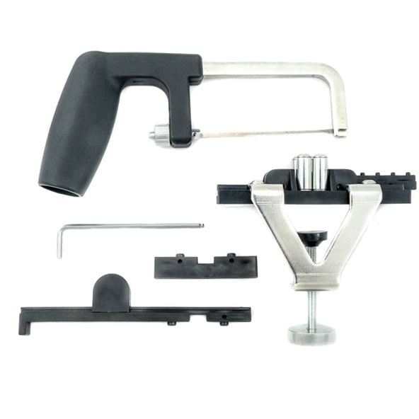
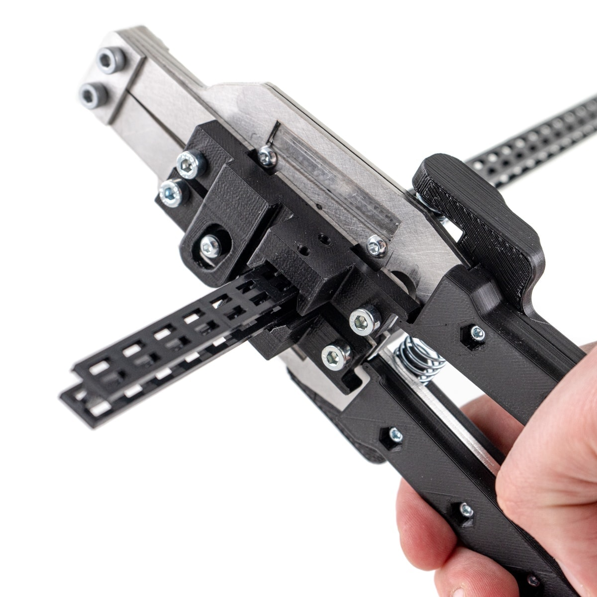
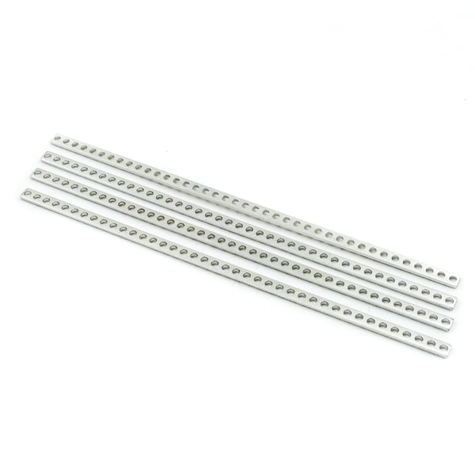
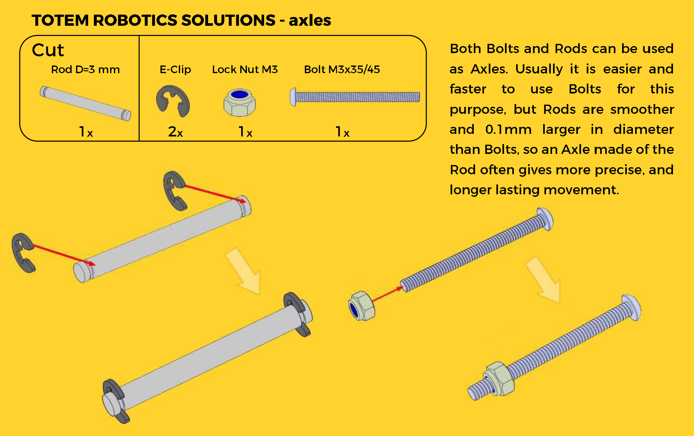

# Beam Cutters

<iframe style="width: 100%;aspect-ratio: 16/9;" loading="lazy" src="https://www.youtube.com/embed/x1VGHKiUeTk" title="" frameborder="0" allow="accelerometer; autoplay; clipboard-write; encrypted-media; gyroscope; picture-in-picture; web-share" referrerpolicy="strict-origin-when-cross-origin" allowfullscreen></iframe>

Cut required length Totem [plastic beams](beams.md) with specifically designed tools.  
Available [40cm beam packs](beams.md) are perfect for making customized projects.  

**Note:** ^^This is not a toy and is intended for use by or under the supervision of adults.^^

Totem offers two cutting solutions:  

-   **Beam Cutter** [:material-cart: _TM-TT-03_](https://totemmaker.net/product/totem-beam-cutter-plus-tower-cutter/){style="float: right" target=_blank}  
    [{width="300px"}](#beam-cutter)  
    • **getting started** • **more versatile** 

-   **Beam PRO-Cutter** [:material-cart: _TKM-EPC_](https://totemmaker.net/product/totem-beam-pro-cutter/){style="float: right" target=_blank}  
    [{width="300px"}](#pro-cutter)  
    • **clean cuts** • **extensive use**

## Beam cutter

A simple Tools Kit based on saw cutter and beam holder:

- Attaches to the table and stable while cutting.
- Adaptable for left and right handed users.
- Contains a ruler for consistent sizes to be cut.
- Used for 1 cm step cutting, but you can also cut and 0.5 cm.
- Uses interchangeable [:material-cart: Dremel MS53 Moto-Saw](https://totemmaker.net/product/beam-cutter-saw-blade-dremel-5-pack/){target=_blank} blades.

[{loading=lazy}](../assets/images/products/tools/beam-cutter-assembly.png)
[{loading=lazy}](../assets/images/products/tools/beam-cutter-usage.jpg)

## PRO-Cutter

Advanced cutting tool designed specifically for Totem beams. Makes clean and easy cuts with simply press of the handle.

[:material-cart: _TKM-EPC_](https://totemmaker.net/product/totem-beam-pro-cutter/){target=_blank} |
[:material-printer-3d: STL files](https://github.com/totemmaker/TotemSTL/tree/master/Beam%20pro%20cutter){target=_blank}

- Contains ruler for 1 cm step cutting.
- Easy to cut - almost no force needed.
- Adaptable for left and right handed use.
- Precise and clean cut.

**Note:** Make sure to fit pins of the cutter into the grid of the Beam.

<iframe style="width: 100%;aspect-ratio: 16/9;" loading="lazy" src="https://www.youtube.com/embed/72namnhBf3g" title="" frameborder="0" allow="accelerometer; autoplay; clipboard-write; encrypted-media; gyroscope; picture-in-picture; web-share" referrerpolicy="strict-origin-when-cross-origin" allowfullscreen></iframe>

<iframe style="width: 100%;aspect-ratio: 16/9;" loading="lazy" src="https://www.youtube.com/embed/sG71OTzymkc" title="" frameborder="0" allow="accelerometer; autoplay; clipboard-write; encrypted-media; gyroscope; picture-in-picture; web-share" referrerpolicy="strict-origin-when-cross-origin" allowfullscreen></iframe>

## Strip Bracket Cutting

{width=350px loading=lazy}

Totem tools can be also used to cut [aluminium strip brackets](brackets.md#strip-bracket).

**Note:** Pliers or any hacksaw for cutting metal can be also used instead.

[{loading=lazy}](../assets/images/products/tools/strip-bracket-cutting-tool.png)
[{loading=lazy}](../assets/images/products/tools/strip-bracket-cutting-tool-cutting.png)

## Rod Cutting

[{loading=lazy}](../assets/images/products/tools/rod-cutting-tool.png)  
[{loading=lazy}](../assets/images/products/tools/rod-cutting-tool-cutting.png)  
[{loading=lazy}](../assets/images/products/motors/totem-robotics-solutions-axles.png)
