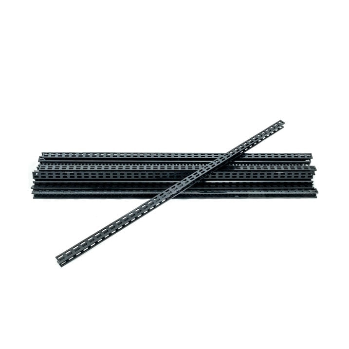
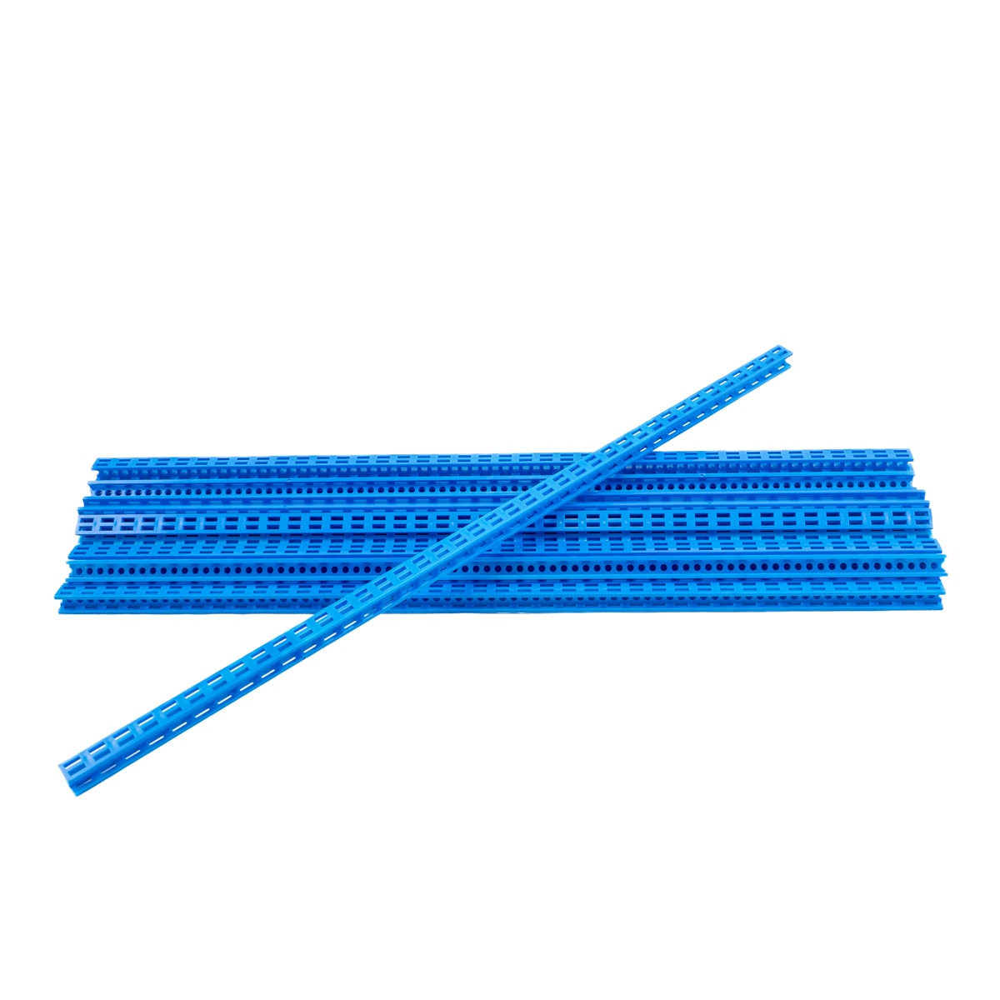
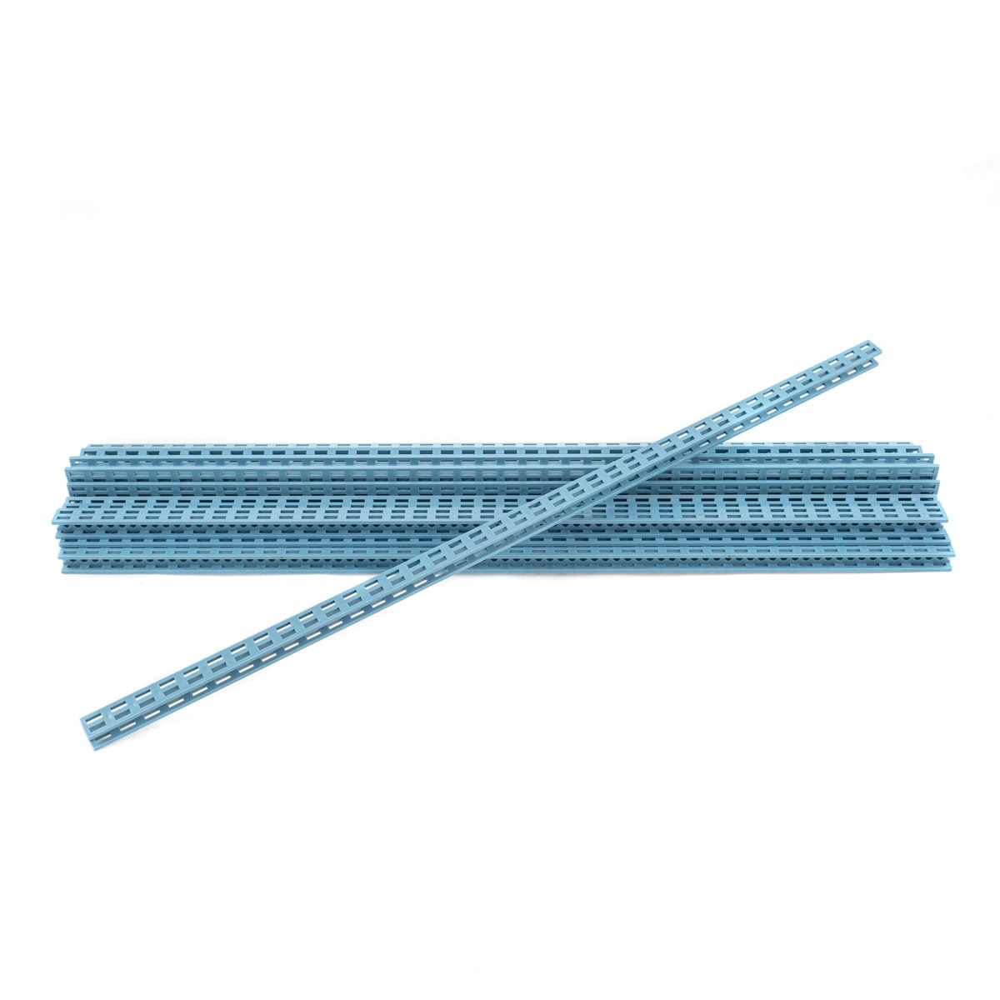
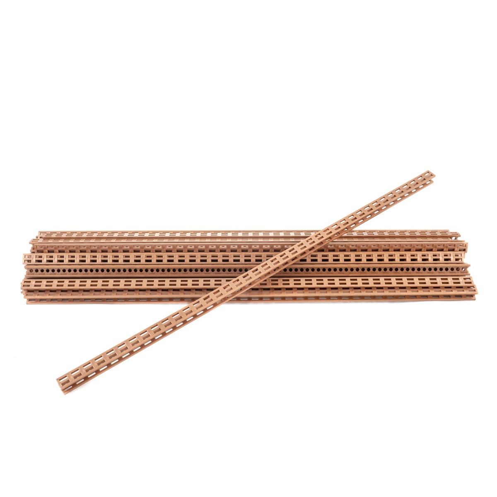
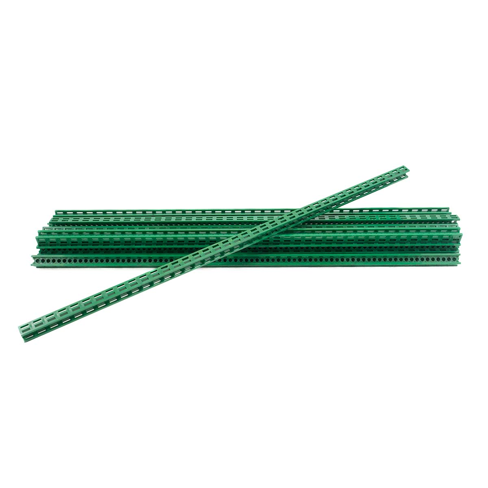
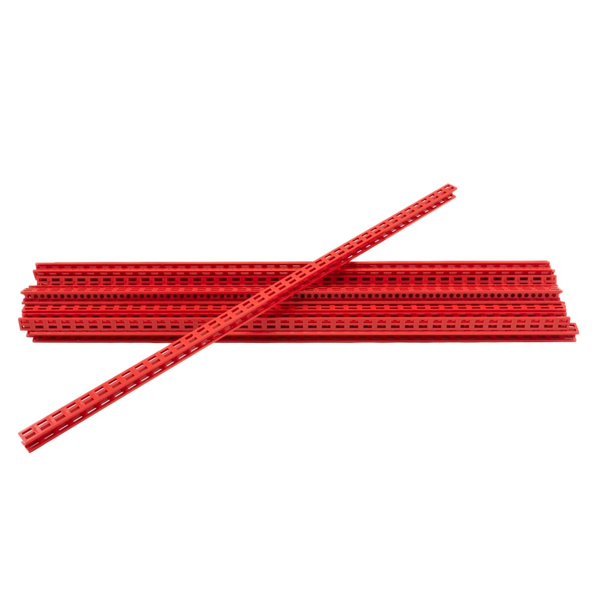
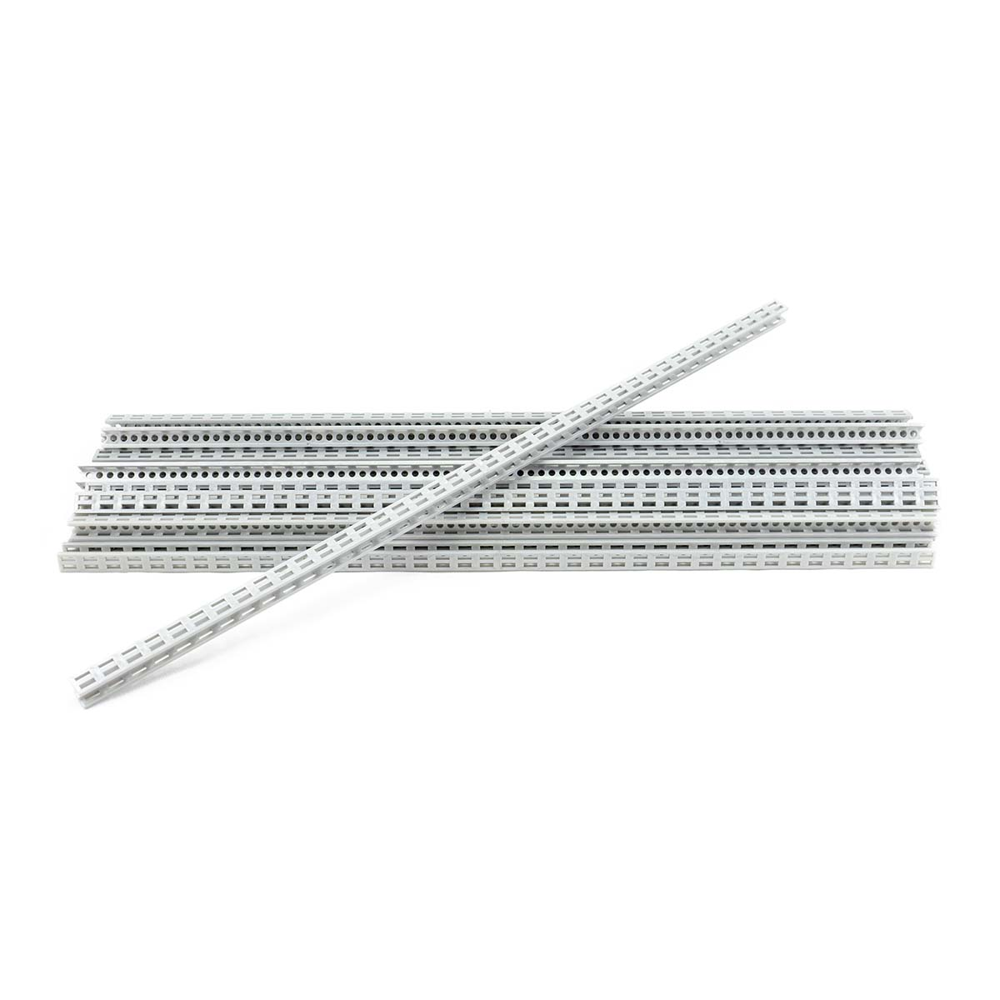
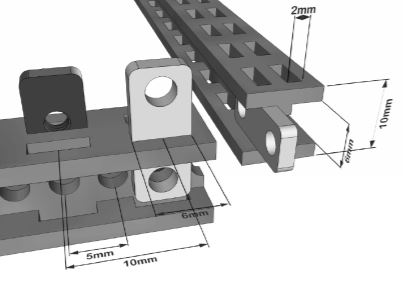
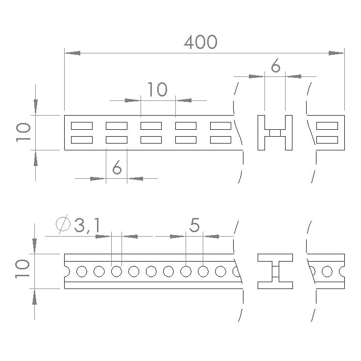

# Beams

Main structural part of Totem building system. Contains holes for bracket and nut mounting.

-   **Black**  
    [:material-cart: _TM-BM1-20_](https://totemmaker.net/product/beams-20-pack/){target=_blank}  
      

-   **Blue**  
    [:material-cart: _TM-BM5-20_](https://totemmaker.net/product/beams-20-pack-blue/){target=_blank}  
      

-   **Light Blue**  
    [:material-cart: _TM-BM3-20_](https://totemmaker.net/product/beams-20-pack-light-blue/){target=_blank}  
      

-   **Copper**  
    [:material-cart: _TM-BM2-20_](https://totemmaker.net/product/beams-20-pack-copper/){target=_blank}  
      

-   **Green**  
    [:material-cart: _TM-BM6-20_](https://totemmaker.net/product/beams-20-pack-green/){target=_blank}  
      

-   **Red**  
    [:material-cart: _TM-BM4-20_](https://totemmaker.net/product/beams-20-pack-red/){target=_blank}  
      

-   **Silver**  
    [:material-cart: _TM-BM7-20_](https://totemmaker.net/product/beams-20-pack-silver/){target=_blank}  
      

**Material:** ABS (plastic) | [:material-cube-outline: STEP files](https://github.com/totemmaker/TotemSTEP/tree/master/Totem%20Beams){target=_blank}  
**Dimensions:** L400 x H10 x H10 mm  

[{width=300px}](../assets/images/products/beams/totem-grid-2-beams.jpg)
[{width=300px}](../assets/images/products/beams/totem-beam-dimensions.jpg)

- **Same size:** All beams are (400x10x10) (except pre-cut ones sold in [robotic kits](robotics-kits.md)).
- **Cut beams:** Use [Totem Tools](beam-cutters.md) to shorten beams down to 1 cm (0.5cm possible).
- **Pleasant to use:** Lightweight plastic, easy to shape, but still makes sturdy structures.
- **Reusable:** Disassemble old projects and use to building new ones.
- **Versatile**: Special layout of slots and holes makes it great element to construct any shapes. Easy to expand structure, by adding other beam or board or any other element at any point on your project.
- **Special nut**: [Totem Nut M3 6x10](fasteners.md#regular-nuts) stay in the structure of Beam before Bolts are tightened! Fits in both sides of the beam.
- **Make it even stronger:** Use [aluminium Strip Bracket](brackets.md#strip-bracket) to make more resistant Beam. It perfectly fits into the track of the Beam.