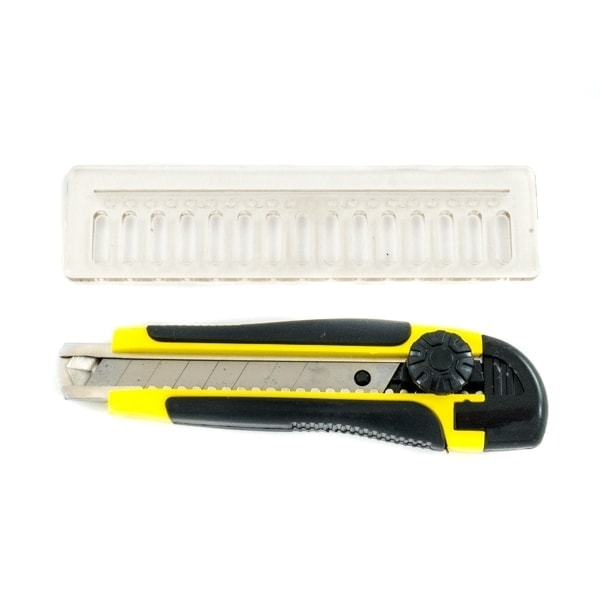
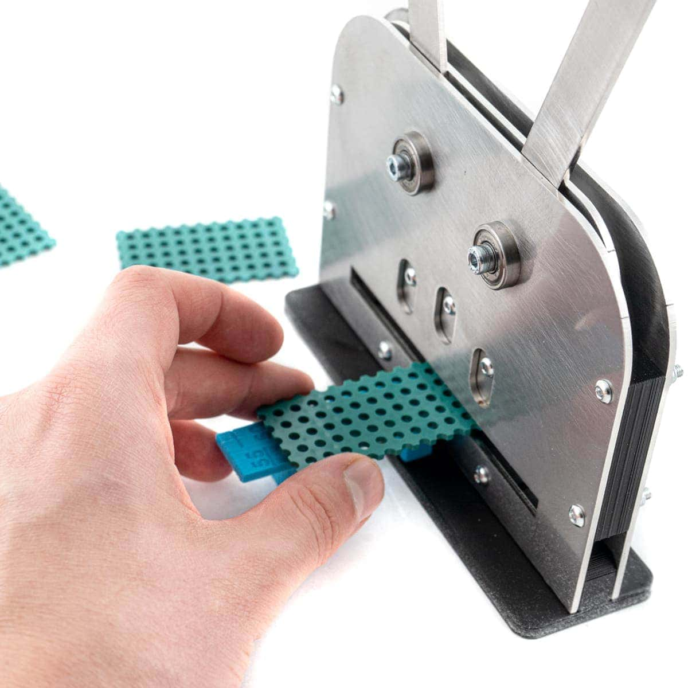

# Board Cutters

<iframe style="width: 100%;aspect-ratio: 16/9;" loading="lazy" src="https://www.youtube.com/embed/wd7m2lz9QA0" title="" frameborder="0" allow="accelerometer; autoplay; clipboard-write; encrypted-media; gyroscope; picture-in-picture; web-share" referrerpolicy="strict-origin-when-cross-origin" allowfullscreen></iframe>

Cut required size Totem [plastic boards](boards.md) with specifically designed tools.  
Available 100x100cm [BLACK](https://totemmaker.net/product/boards-10-pack/){target=_blank} and [GREEN](https://totemmaker.net/product/boards-cuttable-100x100-mm-10-pack-dark-green/){target=_blank} packs are perfect for making customized projects.  

**Note:** ^^This is not a toy and is intended for use by or under the supervision of adults.^^

Totem offers two cutting solutions:  

-   **Board Cutter** [:material-cart: _TM-TT-01_](https://totemmaker.net/product/totem-board-cutter/){style="float: right" target=_blank}  
    [{width="300px"}](#board-cutter)  
    • **getting started** • **cost-effective**

-   **Board PRO-Cutter** [:material-cart: _TKM-OPC_](https://totemmaker.net/product/totem-board-pro-cutter/){style="float: right" target=_blank}  
    [{width="300px"}](#board-pro-cutter)  
    • **clean cuts** • **extensive use**

## Board Cutter

[{loading=lazy}](../assets/images/products/tools/board-cutter-usage.png)

A simple Tool Kit based on retractable knife and specifically designed ruler:

- Ruler pins fits to Totem Board grid in 45° or 90° angles.
- Prevents moving around while cutting.
- Contains inlet for straight cuts.

Tools are included in [Totem Maker Kit](https://totemmaker.net/product/totem-maker-kit/){target=_blank} and Totem [XL Maker Kit](https://totemmaker.net/product/totem-xl-maker-kit/){target=_blank}.  
Other Totem kits provide pre-cut beams - check before purchasing.

We recommend to use a cutting mattress or any kind of cutting board.

## Board PRO-Cutter

{width=500px loading=lazy}

Advanced Totem Board cutting tool for safe, clean and extensive use.

- Safe to use (no exposed blades)
- Cut in a single press of the handles
- Nice and clean 90° angle cuts
- Has a ruler for 5mm steps
- [:material-printer-3d: STL files](https://github.com/totemmaker/TotemSTL/tree/master/Board%20pro%20cutter){target=_blank} are available

**Note:** Make sure to fit pins of the cutter into the grid of the Board! Can't insert at 45° angle!

<iframe style="width: 100%;aspect-ratio: 16/9;" loading="lazy" src="https://www.youtube.com/embed/2eJN2Xl6uiA" title="" frameborder="0" allow="accelerometer; autoplay; clipboard-write; encrypted-media; gyroscope; picture-in-picture; web-share" referrerpolicy="strict-origin-when-cross-origin" allowfullscreen></iframe>
