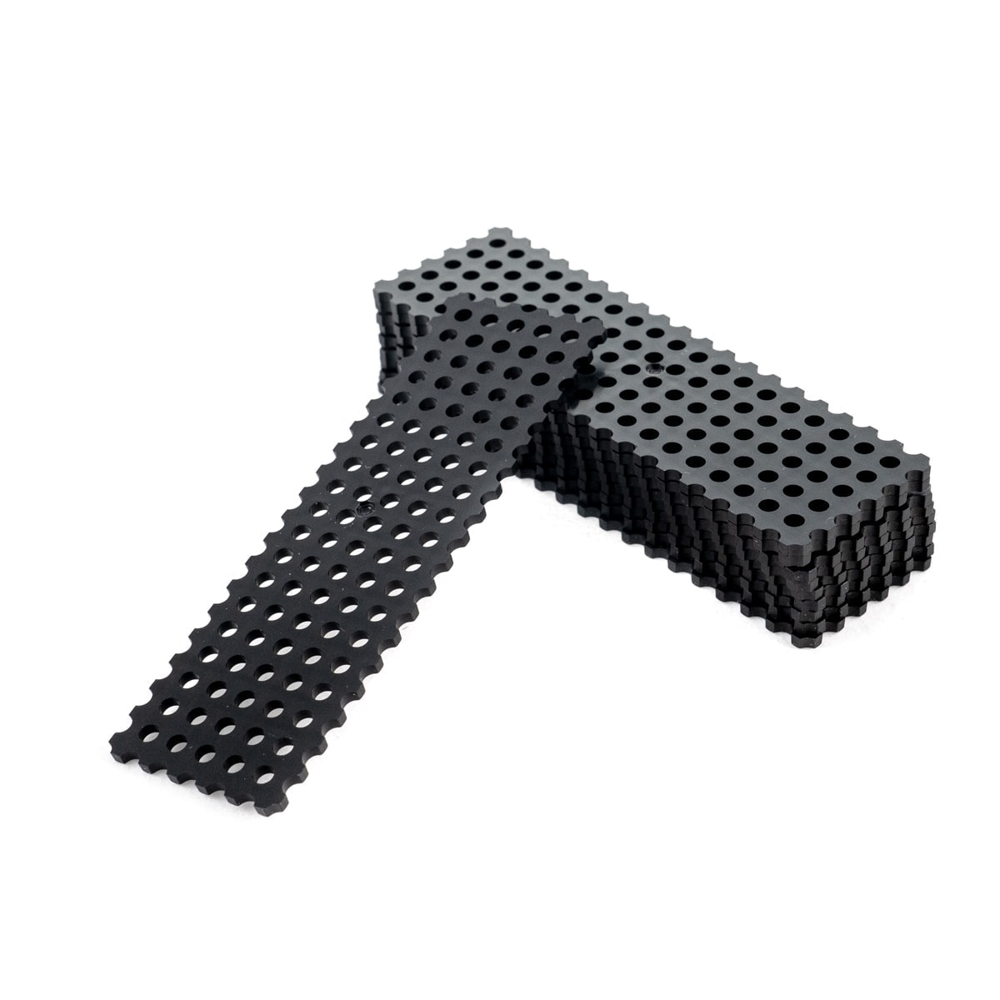
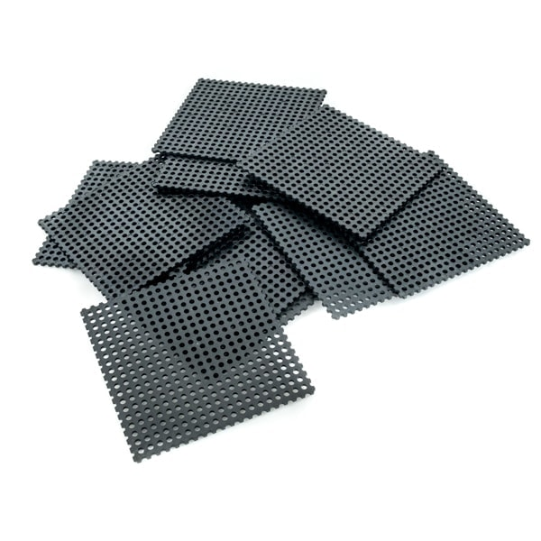
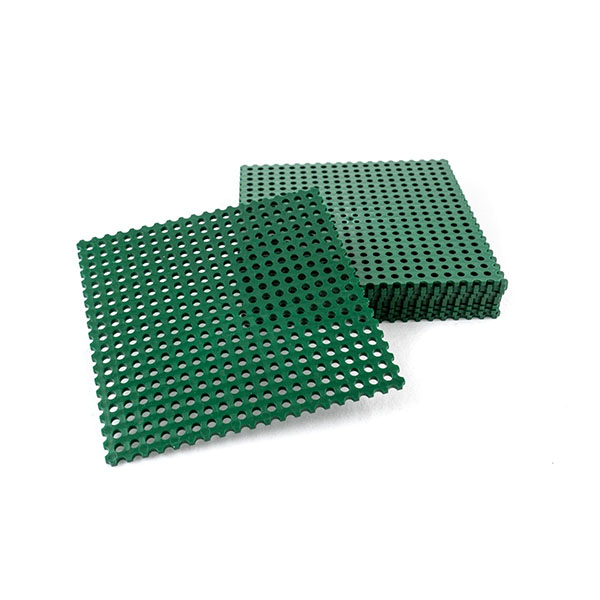
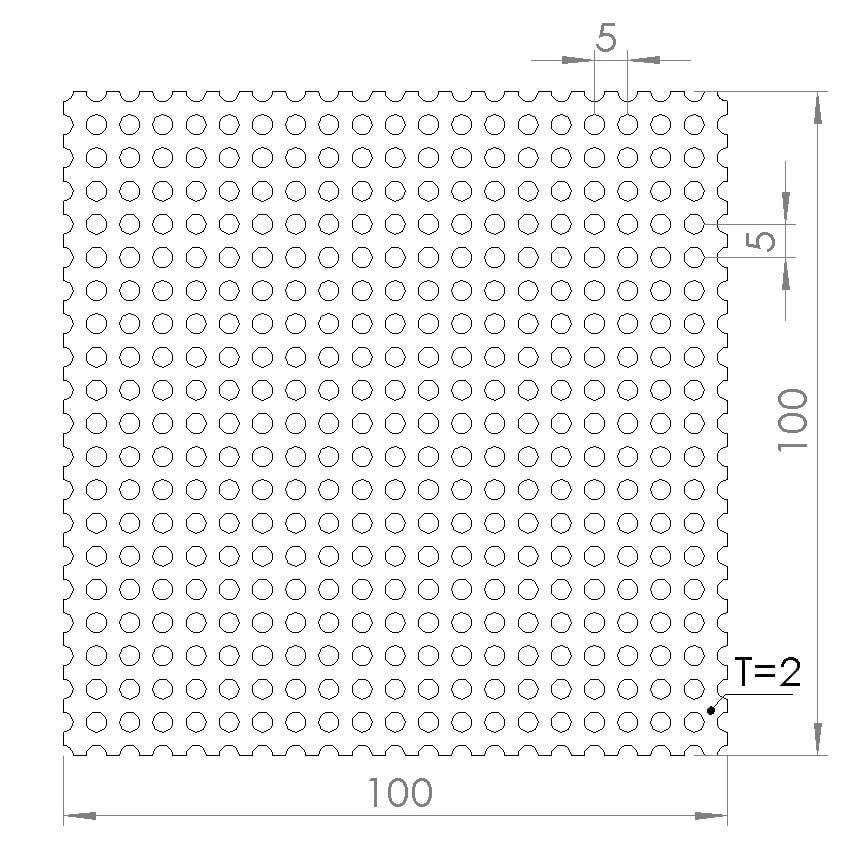
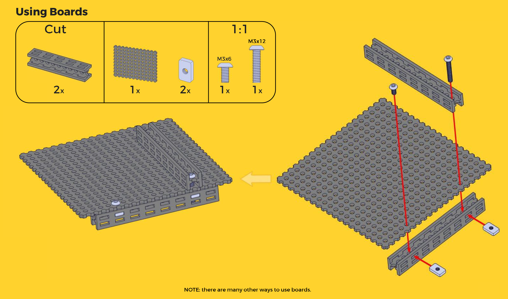

*[CAD]: Computer-Aided design. For 3D modeling

# Boards

Totem Boards can be used as structural part or to cover empty spaces.

-   **Black 30x100mm**  
    [:material-cart: _TM-PB3-10_](https://totemmaker.net/product/board-30x100-10-pack/){target=_blank}  
      

-   **Black 100x100mm**  
    [:material-cart: _TM-PB1-10_](https://totemmaker.net/product/boards-10-pack/){target=_blank}  
      

-   **Green 100x100mm**  
    [:material-cart: _TM-PB2-10_](https://totemmaker.net/product/boards-cuttable-100x100-mm-10-pack-dark-green/){target=_blank}  
      

- **Usage:** to cover something, decoration, making boxes, basis for mounting electronics.
- **Cutting:** use [Board Cutter](board-cutters.md) for 90º or 45º degrees angle.
- **Size:** 30x100mm and 100x100mm, (thickness) 2mm, (hole distance) 5mm.
- **Material:** PC/ABS (plastic).
- **Colors:** black and green.
- **CAD:** [:material-cube-outline: STEP files](https://github.com/totemmaker/TotemSTEP/tree/master/Totem%20Boards){target=_blank}.

{width="300px"}
{width="300px"}

[{loading=lazy}](../assets/images/products/beams/using-boards.png)
