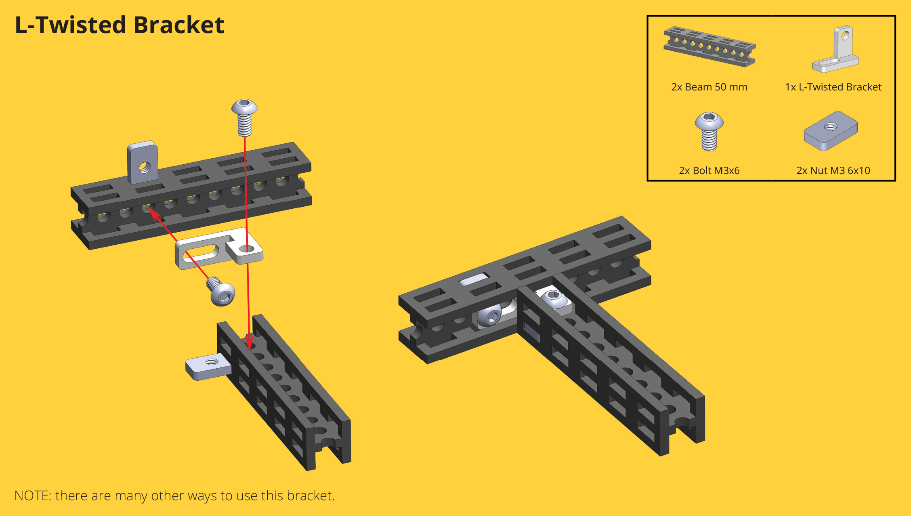

# Brackets

Totem Brackets connect [Beams](beams.md) together and are used for mounting third-party components. Multiple shapes and angles are available along with 3D [:material-cube-outline: STEP files](https://github.com/totemmaker/TotemSTEP/tree/master/Totem%20Brackets){target=_blank}.

## Strip bracket

{width=350px loading=lazy}

**Strip bracket** | [_:material-cart: TM-BR15-4_](https://totemmaker.net/product/cuttable-strip-bracket-200-mm-4-pack/){target=_blank} | [:material-cube-outline: STEP files](https://github.com/totemmaker/TotemSTEP/tree/master/Totem%20Brackets/Strip%20Brackets){target=_blank}  
**Material**: 6061 aluminium, anodized surface.  
**Dimensions (mm)**: 200 x 6 x 2 mm.  
**Can be cut to required length:** [Strip Bracket Cutting](beam-cutters.md#strip-bracket-cutting)  

[{loading=lazy}](../assets/images/products/brackets/using-strip-brackets.png)

## 2-hole brackets

Use to connect beams together in 0°, 45°, 90° angles.

- **Round holes:** Makes more sturdy connections.
- **Oblong holes:** Allows for precise adjustment.

### 2-hole

-   **2-hole simple** [_:material-cart: TM-BR1-20_](https://totemmaker.net/product/2-hole-simple-bracket-20-pack/){style="float: right" target=_blank}  
    {loading=lazy}  

-   **2-hole** [_:material-cart: TM-BR11-20_](https://totemmaker.net/product/2-hole-bracket-20-pack/){style="float: right" target=_blank}  
    {loading=lazy}  

[:material-cube-outline: STEP 2-hole simple](https://github.com/totemmaker/TotemSTEP/blob/master/Totem%20Brackets/2-hole%20simple%20bracket.STEP){target=_blank} | [:material-cube-outline: STEP 2-hole](https://github.com/totemmaker/TotemSTEP/blob/master/Totem%20Brackets/2-hole%20bracket.STEP){target=_blank}

[{loading=lazy}](../assets/images/products/brackets/2-hole-simple-bracket-usage.png)

### 2-hole 45°

-   **2-hole 45° simple** [_:material-cart: TM-BR2-20_](https://totemmaker.net/product/2-hole-45-simple-bracket-20-pack/){style="float: right" target=_blank}  
    {loading=lazy}  
    • Use with [Single side filler](#single-side-filler)  

-   **2-hole 45°** [_:material-cart: TM-BR10-20_](https://totemmaker.net/product/2-hole-45-bracket-20-pack/){style="float: right" target=_blank}  
    {loading=lazy}  
    • Use with [Double side filler](#double-side-filler)  

[:material-cube-outline: STEP 2-hole 45 simple](https://github.com/totemmaker/TotemSTEP/blob/master/Totem%20Brackets/2-hole%2045%20simple%20bracket.STEP){target=_blank} | [:material-cube-outline: STEP 2-hole 45](https://github.com/totemmaker/TotemSTEP/blob/master/Totem%20Brackets/2-hole%2045%20bracket.STEP){target=_blank}

[{loading=lazy}](../assets/images/products/brackets/2-hole-45-simple-bracket-usage.png)
[{loading=lazy}](../assets/images/products/brackets/2-hole-45-bracket-usage.png)

<iframe style="width: 100%;aspect-ratio: 16/9;" loading="lazy" src="https://www.youtube.com/embed/cKkfLgfzaIc" title="" frameborder="0" allow="accelerometer; autoplay; clipboard-write; encrypted-media; gyroscope; picture-in-picture; web-share" referrerpolicy="strict-origin-when-cross-origin" allowfullscreen></iframe>

### 2-hole 90°

-   **C-bracket** [_:material-cart: TM-BR13-20_](https://totemmaker.net/product/c-bracket-20-pack/){style="float: right" target=_blank}  
    {loading=lazy}  

-   **2-hole 90°** [_:material-cart: TM-BR9-20_](https://totemmaker.net/product/2-hole-90-bracket-20-pack/){style="float: right" target=_blank}  
    {loading=lazy}  

[:material-cube-outline: STEP C-bracket](https://github.com/totemmaker/TotemSTEP/blob/master/Totem%20Brackets/C%20bracket.STEP){target=_blank} | [:material-cube-outline: STEP 2-hole 90](https://github.com/totemmaker/TotemSTEP/blob/master/Totem%20Brackets/2-hole%2090%20bracket.STEP){target=_blank}

Build 90° connections:

[{loading=lazy}](../assets/images/products/brackets/c-bracket-usage.png)

Make sturdy corners - no brackets are sticking out of the frame:

[{loading=lazy}](../assets/images/products/brackets/typical-c-bracket-corner.png)

Make more complex connections - no brackets are sticking out of the frame:

[{loading=lazy}](../assets/images/products/brackets/c-bracket-and-3-hole-bracket-usage.png)

<iframe style="width: 100%;aspect-ratio: 16/9;" loading="lazy" src="https://www.youtube.com/embed/hTxfato-GGg" title="" frameborder="0" allow="accelerometer; autoplay; clipboard-write; encrypted-media; gyroscope; picture-in-picture; web-share" referrerpolicy="strict-origin-when-cross-origin" allowfullscreen></iframe>

## L brackets

Use for opposite side beam and external components mounting.

### L-bracket

{width=300px loading=lazy}

**L-bracket** | [_:material-cart: TM-BR3-20_](https://totemmaker.net/product/l-bracket-20-pack/){target=_blank} | [:material-cube-outline: STEP file](https://github.com/totemmaker/TotemSTEP/blob/master/Totem%20Brackets/L-bracket.STEP){target=_blank}

Build 90° connections with adjustable position.

[{loading=lazy}](../assets/images/products/brackets/l-bracket-usage.png)

### L-twisted

-   **L-twisted** [_:material-cart: TM-BR4-20_](https://totemmaker.net/product/l-twisted-bracket-20-pack/){style="float: right" target=_blank}  
    {loading=lazy}  

-   **L-twisted mirror** [_:material-cart: TM-BR4M-20_](https://totemmaker.net/product/l-twisted-mirror-bracket-20-pack/){style="float: right" target=_blank}  
    {loading=lazy}  

[:material-cube-outline: STEP L-twisted](https://github.com/totemmaker/TotemSTEP/blob/master/Totem%20Brackets/L-twisted%20bracket.STEP){target=_blank} | [:material-cube-outline: STEP L-twisted mirror](https://github.com/totemmaker/TotemSTEP/blob/master/Totem%20Brackets/L-twisted%20mirror%20bracket.STEP){target=_blank}

Build opposing side 90° connections with adjustable position.

[{loading=lazy}](../assets/images/products/brackets/l-twisted-bracket-usage.png)

<iframe style="width: 100%;aspect-ratio: 16/9;" loading="lazy" src="https://www.youtube.com/embed/If_hbsaz-QY" title="" frameborder="0" allow="accelerometer; autoplay; clipboard-write; encrypted-media; gyroscope; picture-in-picture; web-share" referrerpolicy="strict-origin-when-cross-origin" allowfullscreen></iframe>

### L-twisted adjustable

-   **L-twisted adjustable** [_:material-cart: TM-BR14-20_](https://totemmaker.net/product/l-twisted-adjustable-bracket-20-pack/){style="float: right" target=_blank}  
    {loading=lazy}  

-   **L-twisted adj. mirror** [_:material-cart: TM-BR14M-20_](https://totemmaker.net/product/l-twisted-adjustable-mirror-bracket-20-pack/){style="float: right" target=_blank}  
    {loading=lazy}  

[:material-cube-outline: STEP L-twisted adjustable](https://github.com/totemmaker/TotemSTEP/blob/master/Totem%20Brackets/L-twisted%20adjustable%20bracket.STEP){target=_blank} | [:material-cube-outline: STEP L-twisted adjustable mirror](https://github.com/totemmaker/TotemSTEP/blob/master/Totem%20Brackets/L-twisted%20adjustable%20mirror%20bracket.STEP){target=_blank}

Handy for mounting electronics that don't follow Totem construction system spacing.

[{loading=lazy}](../assets/images/products/fasteners/using-nylon-standoffs.png)

## 45x90 brackets

Use for 45° angle beam mounting. Oblong holes makes connection adjustable.

### Swan 90x45

-   **Swan 90x45** [_:material-cart: TM-BR5-20_](https://totemmaker.net/product/swan-90x45-bracket-20-pack/){style="float: right" target=_blank}  
    {loading=lazy}  

-   **Swan 90x45 mirror** [_:material-cart: TM-BR5M-20_](https://totemmaker.net/product/swan-90x45-mirror-bracket-20-pack/){style="float: right" target=_blank}  
    {loading=lazy}  

[:material-cube-outline: STEP Swan 90x45](https://github.com/totemmaker/TotemSTEP/blob/master/Totem%20Brackets/Swan%2090x45%20bracket.STEP){target=_blank} | [:material-cube-outline: STEP Swan 90x45 mirror](https://github.com/totemmaker/TotemSTEP/blob/master/Totem%20Brackets/Swan%2090x45%20mirror%20bracket.STEP){target=_blank}

[{loading=lazy}](../assets/images/products/brackets/swan-90-45-bracket-usage.png)

### 45x90

-   **45x90** [_:material-cart: TM-BR8-20_](https://totemmaker.net/product/45x90-bracket-20-pack/){style="float: right" target=_blank}  
    {loading=lazy}  

-   **45x90 mirror** [_:material-cart: TM-BR8M-20_](https://totemmaker.net/product/45x90-mirror-bracket-20-pack/){style="float: right" target=_blank}  
    {loading=lazy}  

[:material-cube-outline: STEP 45x90](https://github.com/totemmaker/TotemSTEP/blob/master/Totem%20Brackets/45x90%20bracket.STEP){target=_blank} | [:material-cube-outline: STEP 45x90 mirror](https://github.com/totemmaker/TotemSTEP/blob/master/Totem%20Brackets/45x90%20mirror%20bracket.STEP){target=_blank}

[{loading=lazy}](../assets/images/products/brackets/45-90-bracket-usage.png)

## 3-hole bracket

Use for additional mounting options. Oblong holes makes connection adjustable.

-   **3-hole** [_:material-cart: TM-BR6-20_](https://totemmaker.net/product/3-hole-bracket-20-pack/){style="float: right" target=_blank}  
    {loading=lazy}  
    • For mounting [Standard Servo Motors](motors.md#standard-servo)  

-   **3-hole 45** [_:material-cart: TM-BR7-20_](https://totemmaker.net/product/3-hole-45-bracket-20-pack/){style="float: right" target=_blank}  
    {loading=lazy}  
    • Use with [Double side filler](#double-side-filler)   

[:material-cube-outline: STEP 3-hole](https://github.com/totemmaker/TotemSTEP/blob/master/Totem%20Brackets/3-hole%20bracket.STEP){target=_blank} | [:material-cube-outline: STEP 3-hole 45](https://github.com/totemmaker/TotemSTEP/blob/master/Totem%20Brackets/3-hole%2045%20bracket.STEP){target=_blank}

Connect 3 Beams with one bracket:

[{loading=lazy}](../assets/images/products/brackets/3-hole-bracket-usage.png)
[{loading=lazy}](../assets/images/products/brackets/3-hole-45-bracket-usage.png)

## Plastic

Plastic bracket alternative. Use together with [Screw M3x7.5](fasteners.md#screws).

- Faster building time. [Nuts](fasteners.md#nuts) are not required.
- Many variations available for 3D printing [:material-printer-3d: STL files](https://github.com/totemmaker/TotemSTL/tree/master/Misc/Plastic%20brackets){target=_blank}.
- Structure weights less. Similar sturdiness compared to metal brackets.

### Plastic bracket

-   **Plastic bracket** [_:material-cart: TM456_](https://totemmaker.net/product/brackets-for-building-totem-racks-for-grove-arduino-raspberry/){style="float: right" target=_blank}  
    {loading=lazy}  
    • For building [Totem racks](https://totemmaker.net/product/totem-rack-for-grove-modules-arduino-and-raspberry/){target=_blank}  

-   **Snap op bracket** [_:material-cart: TM457_](https://totemmaker.net/product/snap-on-brackets-for-totem-rack-for-grove-modules-and-arduino-raspberry/){style="float: right" target=_blank}  
    {loading=lazy}  
    • Mount Grove, Arduino, Raspberry boards  

- **Plastic bracket** - use for general Totem structure building and as replacement for metal brackets. Used in [Totem Rack for Grove Beginner Kit](https://totemmaker.net/product/totem-rack-for-grove-beginner-kit/){target=_blank}.
- **Snap op bracket** - use for attaching Groove modules to Totem structure. Modules easily snaps on. Used in [Totem Rack for Grove Modules and Arduino/Raspberry](https://totemmaker.net/product/totem-rack-for-grove-modules-arduino-and-raspberry/){target=_blank}.

For more details see: [:fontawesome-solid-file-pdf: Totem Groove rack instructions](https://totemmaker.net/wp-content/uploads/2021/11/grove-modules-rack-instructions-v.1.1.pdf){target=_blank}.

{loading=lazy}

Mount brackets to the rack with M3 bolts and then conveniently snap on the Grove modules, Arduino and/or Raspberry PCBs (use [M2.5x8 screw](fasteners.md#screws)).

[{loading=lazy}](../assets/images/products/brackets/snap-on-brackets-for-groove-rack.jpg)
[{loading=lazy}](../assets/images/products/brackets/arduino-uno-mounting.jpg)
[{loading=lazy}](../assets/images/products/brackets/raspberry-pi-mounting.jpg)

### Single side filler

{width=300px loading=lazy}

**Single side filler** | [_:material-cart: TM-PL2-20_](https://totemmaker.net/product/single-side-filler-20-pack-nice-corners-finishing/){target=_blank}

**Material:** ABS/PC plastic.  
**Usage:** For improved visual and structure integrity or 45° degree connections.  
**Brackets:** [2-hole 45 simple](#2-hole-45), [45x90 bracket](#45x90).  

**Note:** connection type differs from [Double side filler](#double-side-filler).

Use with 2-hole 45 simple bracket:

[{loading=lazy}](../assets/images/products/brackets/2-hole-45-simple-bracket-usage.png)

Use with 45x90 bracket:

[{loading=lazy}](../assets/images/products/brackets/45-90-bracket-usage.png)

### Double side filler

{width=300px loading=lazy}

**Double side filler** | [_:material-cart: TM-PL1-20_](https://totemmaker.net/product/double-side-filler-20-pack-nice-corners-finishing/){target=_blank}

**Material:** ABS/PC plastic.  
**Usage:** For improved visual and structure integrity or 45° degree connections.  
**Brackets:** [Swan 90x45](#swan-90x45), [2-hole 45](#2-hole-45), [3-hole 45](#3-hole-bracket).  

**Note:** connection type differs from [Single side filler](#single-side-filler).

[{loading=lazy}](../assets/images/products/brackets/swan-90-45-bracket-usage.png)

Use with [2-hole 45 bracket](#2-hole-45):

[{loading=lazy}](../assets/images/products/brackets/2-hole-45-bracket-usage.png)

Use with [3-hole 45 bracket](#3-hole-bracket):

[{loading=lazy}](../assets/images/products/brackets/3-hole-45-bracket-usage.png)
