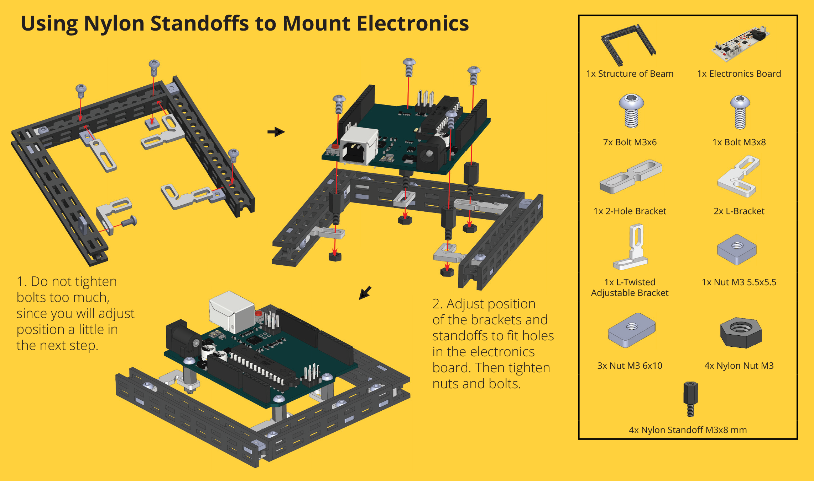

# Fasteners

## Regular bolts

-   **Bolt M3x6**  
    [_:material-cart: TM-BL6-100_](https://totemmaker.net/product/bolt-m3x6-100-pack/){target=_blank}  
    {loading=lazy}  
-   **Bolt M3x8**  
    [_:material-cart: TM-BL8-100_](https://totemmaker.net/product/bolt-m3x8-100-pack/){target=_blank}  
    {loading=lazy}  
-   **Bolt M3x10**  
    [_:material-cart: TM-BL10-50_](https://totemmaker.net/product/bolt-m3x10-50-pack/){target=_blank}  
    {loading=lazy}  
-   **Bolt M3x12**  
    [_:material-cart: TM-BL12-50_](https://totemmaker.net/product/bolt-m3x12-50-pack/){target=_blank}  
    {loading=lazy}  
-   **Bolt M3x14**  
    [_:material-cart: TM-BL14-50_](https://totemmaker.net/product/bolt-m3x14-50-pack/){target=_blank}  
    {loading=lazy}  
-   **Bolt M3x16**  
    [_:material-cart: TM-BL16-50_](https://totemmaker.net/product/bolt-m3x16-50-pack/){target=_blank}  
    {loading=lazy}  
-   **Bolt M3x20**  
    [_:material-cart: TM-BL20-50_](https://totemmaker.net/product/bolt-m3x20-50-pack/){target=_blank}  
    {loading=lazy}  
-   **Bolt M3x25**  
    [_:material-cart: TM-BL-25-50_](https://totemmaker.net/product/bolt-m3x25-30-pack/){target=_blank}  
    {loading=lazy}  
-   **Bolt M3x35**  
    [_:material-cart: TM-BL35-20_](https://totemmaker.net/product/bolt-m3x35-20-pack/){target=_blank}  
    {loading=lazy}  
-   **Bolt M3x45**  
    [_:material-cart: TM-BL45-20_](https://totemmaker.net/product/bolt-m3x45-20-pack/){target=_blank}  
    {loading=lazy}  

**Material:** 8,8 grade steel, Zn plating. | **Size:** 3 mm x 6-45 mm. | [:material-cube-outline: STEP files](https://github.com/totemmaker/TotemSTEP/tree/master/Totem%20Fasteners){target=_blank}

Often used bolt with for tightening Totem construction system. Available in multiple lengths.  
Has machine screw thread and used together with threaded [nuts](#regular-nuts).  

## Screws

-   **Bolt M2.5x12 and M2.5x8**  
    [_:material-cart: TM-BL128-4_](https://totemmaker.net/product/bolt-m25x12-2-pcs-and-m25x8-2-pcs/){target=_blank}  
    {loading=lazy}  
    • For [Mini Servo Motor](motors.md#mini-servo) and [Raspberry Pi](brackets.md#plastic-bracket)  
-   **Screw M3x7.5**  
    [_:material-cart: TM998_](https://totemmaker.net/product/screw-m3x7-5-100-pack/){target=_blank}  
    {loading=lazy}  
    • Self-tapping for [plastic brackets](brackets.md#plastic-bracket)  

[:material-cube-outline: STEP Bolt M2.5x12 (for servo arm)](https://github.com/totemmaker/TotemSTEP/blob/master/Totem%20Fasteners/Bolt%20M2.5x4%20(Mini%20servo%20arm%20bolt).STEP){target=_blank}

- **Bolt M2.5x12 and M2.5x8** - Screws for tightening arm to [Mini Servo Motor](motors.md#mini-servo) and mounting [Raspberry Pi to plastic bracket](brackets.md#plastic-bracket) (it has smaller M2.5 holes).
- **Screw M3x7.5** - Self-tapping screw for [plastic brackets](brackets.md#plastic-bracket). Easier to use compared to bolts.

[{loading=lazy}](../assets/images/products/fasteners/using-servo-and-plastic-screw.png)

## Nuts

### Regular nuts

-   **Nut M3 5.5x5.5**  
    [_:material-cart: TM-NT55-50_](https://totemmaker.net/product/nut-m3-6x6-50-pack/){target=_blank}  
    {loading=lazy}  
    • For [Beam Plug](#beam-plug) or tight spaces  
-   **Nut M3 6x10**  
    [_:material-cart: TM-NT61-100_](https://totemmaker.net/product/nut-m3-10x6-100-pack/){target=_blank}  
    {loading=lazy}  
    • For inserting into [Totem Beam](beams.md)  
-   **Lock nut M3**  
    [_:material-cart: TM-NT02-30_](https://totemmaker.net/product/lock-nut-30-pack/){target=_blank}  
    {loading=lazy}  
    • For tightening moving parts  

**Material:** 8,8 grade steel, Zn plating.  
[:material-cube-outline: STEP Nut M3 5.5x5.5](https://github.com/totemmaker/TotemSTEP/blob/master/Totem%20Fasteners/Nut%20M3%205.5x5.5.STEP){target=_blank} | [:material-cube-outline: STEP Nut M3 6x10](https://github.com/totemmaker/TotemSTEP/blob/master/Totem%20Fasteners/Nut%20M3%206x10.STEP){target=_blank} | [:material-cube-outline: STEP Lock nut M3](https://github.com/totemmaker/TotemSTEP/blob/master/Totem%20Fasteners/Lock%20nut%20M3.STEP){target=_blank}

- **Nut 5.5x5.5** - for using with [Beam Plug](#beam-plug) or tight spaces, where small footprint is required.
- **Nut 6x10** - stays in the structure of [Totem Beam](beams.md) before [Bolts](#regular-bolts).
- **Lock nut** - prevents self-screwing. Used with free moving parts like axles and hinges.

[{loading=lazy}](../assets/images/products/fasteners/totem-nut-inserting.png)
[{loading=lazy}](../assets/images/products/fasteners/lock-nuts-usage.png)

### Nylon nut

{width=300px loading=lazy}  

**Nylon nut M3** | [_:material-cart: TM-NT1-50_](https://totemmaker.net/product/nylon-nut-m3-50-pack/){target=_blank} | [:material-cube-outline: STEP file](https://github.com/totemmaker/TotemSTEP/blob/master/Totem%20Fasteners/Nylon%20nut%20M3.STEP){target=_blank}

Used together with [Nylon standoff](#nylon-standoff) for tightening it to frame.

{loading=lazy}

### Linear nut

{width=300px loading=lazy}  

**Nylon Linear nut** | [_:material-cart: TM-RB-06-2_](https://totemmaker.net/product/linear-nut-guide-screw-2-2x4-5-2-pack/){target=_blank} | Guide screw: [:material-cube-outline: STEP file](https://github.com/totemmaker/TotemSTEP/blob/master/Totem%20Fasteners/Guide%20screw.STEP){target=_blank}

Comes with guide screws (2.2 x 4.5 mm) - 2 pcs.

[{loading=lazy}](../assets/images/products/fasteners/totem-robotics-solutions-linear-nut.png)

## Spacers

### Washers

-   **Nylon Washer M3 8x1 mm**  
    [_:material-cart: TM-PL6-50_](https://totemmaker.net/product/nylon-washers-3x8x1-50-pack/){target=_blank}  
    {loading=lazy}  
-   **Metal Washer M3 9x0.8 mm**  
    [_:material-cart: TM047-20_](https://totemmaker.net/product/metal-washer-m3x9x08-20-pack/){target=_blank}  
    {loading=lazy}  

[:material-cube-outline: STEP Nylon Washer M3 8x1 mm](https://github.com/totemmaker/TotemSTEP/blob/master/Totem%20Fasteners/Nylon%20washer%203x8x1.STEP){target=_blank} | [:material-cube-outline: STEP Metal Washer M3 9x0.8 mm](https://github.com/totemmaker/TotemSTEP/blob/master/Totem%20Fasteners/Washer%209mm%200.8mm%20M3.STEP){target=_blank}  

Used for adding slight space between parts and reducing movement resistance.

[{loading=lazy}](../assets/images/products/fasteners/using-metal-washer.png)

### Nylon spacers

-   **Nylon spacer 4mm**  
    [_:material-cart: TM204-20_](https://totemmaker.net/product/nylon-spacer-4mm-20-pack/){target=_blank}  
    {loading=lazy}  
-   **Nylon spacer 5mm**  
    [_:material-cart: TM208-20_](https://totemmaker.net/product/nylon-spacer-5mm-20-pack/){target=_blank}  
    {loading=lazy}  
-   **Nylon spacer 8mm**  
    [_:material-cart: TM091-20_](https://totemmaker.net/product/nylon-spacer-8mm-20-pack/){target=_blank}  
    {loading=lazy}  

[:material-cube-outline: STEP Nylon spacer 4mm](https://github.com/totemmaker/TotemSTEP/blob/master/Totem%20Fasteners/Nylon%20spacer%204mm.STEP){target=_blank} | [:material-cube-outline: STEP Nylon spacer 5mm](https://github.com/totemmaker/TotemSTEP/blob/master/Totem%20Fasteners/Nylon%20spacer%205%20mm.STEP){target=_blank} | [:material-cube-outline: STEP Nylon spacer 8mm](https://github.com/totemmaker/TotemSTEP/blob/master/Totem%20Fasteners/Nylon%20spacer%208mm.STEP){target=_blank}  

Used when added spacing is required.

[{loading=lazy}](../assets/images/products/fasteners/using-nylon-spacers.png)

### Nylon standoff

{width=300px loading=lazy}

**Nylon standoff M3 8mm** | [_:material-cart: TM-PL5-50_](https://totemmaker.net/product/nylon-spacer-m3-8mm-female-7-mm-male-6-mm-50-pack/){target=_blank} | [:material-cube-outline: STEP file](https://github.com/totemmaker/TotemSTEP/blob/master/Totem%20Fasteners/Nylon%20standoff%20M3x8mm.STEP){target=_blank}  
**Dimensions:** 6 x 14 mm. Thread: M3 x 6 mm.  

Can be used with [nylon nut](#nylon-nut) or [regular nuts](#regular-nuts). Handy for rising parts up or mounting electronics.

Use [Totem Wrench and Socket](screwdrivers.md#totem-wrench) for tightening standoffs.  
[{loading=lazy}](../assets/images/products/tools/totem-wrench-info.png)  

[{loading=lazy}](../assets/images/products/fasteners/using-nylon-standoffs.png)

### Threaded spacer

{width=300px loading=lazy}  

**Threaded nylon spacer M3 8mm** | [_:material-cart: TM-PL2-50_](https://totemmaker.net/product/threaded-nylon-spacer-m3x8-50-pack/){target=_blank} | [:material-cube-outline: STEP file](https://github.com/totemmaker/TotemSTEP/blob/master/Totem%20Fasteners/Threaded%20spacer%20M3x8mm.STEP){target=_blank}  

Used for adding spacing or mounting parts. Can be screwed from both sides with [Regular bolts](#regular-bolts).

**Dimensions:** A - 5.5 mm | C - M3 | L - 8 mm  
{loading=lazy}

### Beam plug

{width=300px loading=lazy}

**Nylon Beam plug** | [_:material-cart: TM-RB-07-20_](https://totemmaker.net/product/beam-plug-20-pack/){target=_blank} | [:material-cube-outline: STEP file](https://github.com/totemmaker/TotemSTEP/blob/master/Totem%20Other%20parts/Beam%20plug.STEP){target=_blank}  

[{loading=lazy}](../assets/images/products/fasteners/totem-robotics-solutions-beam-plug.png)
