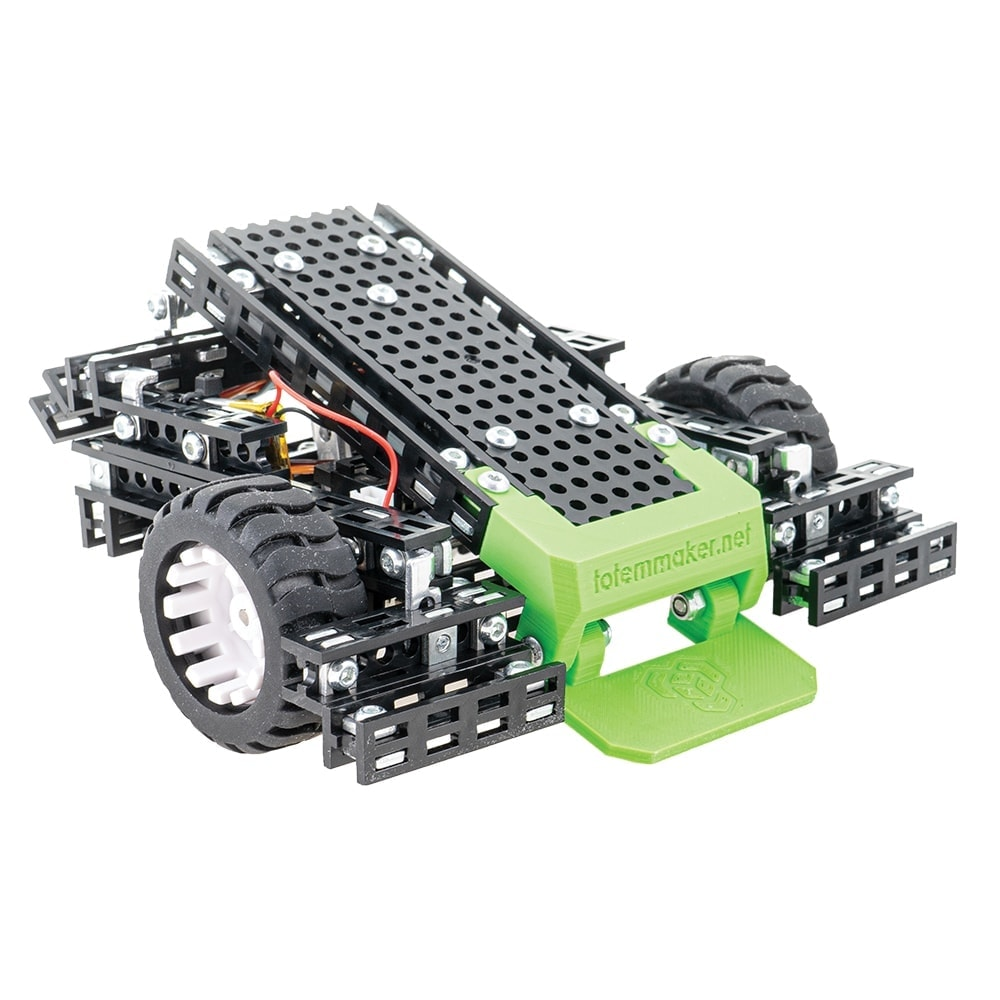
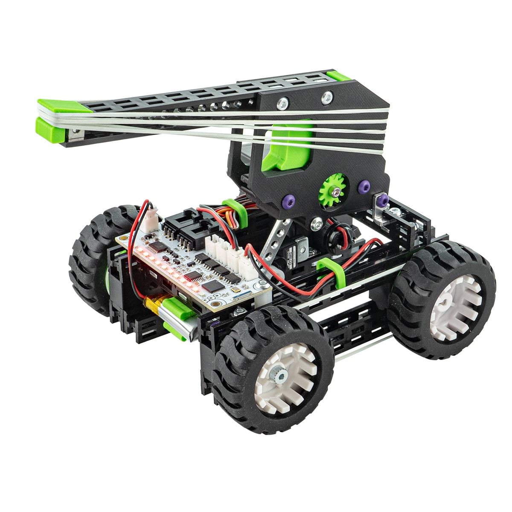
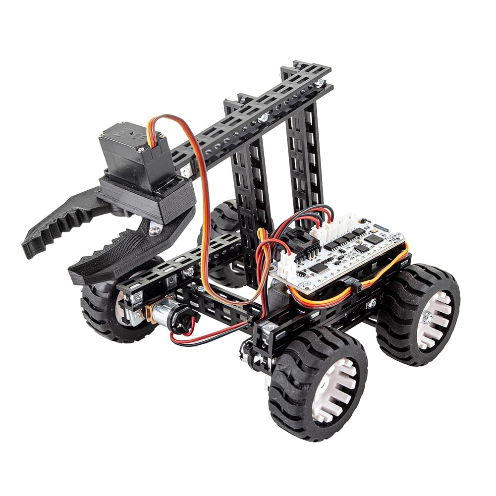
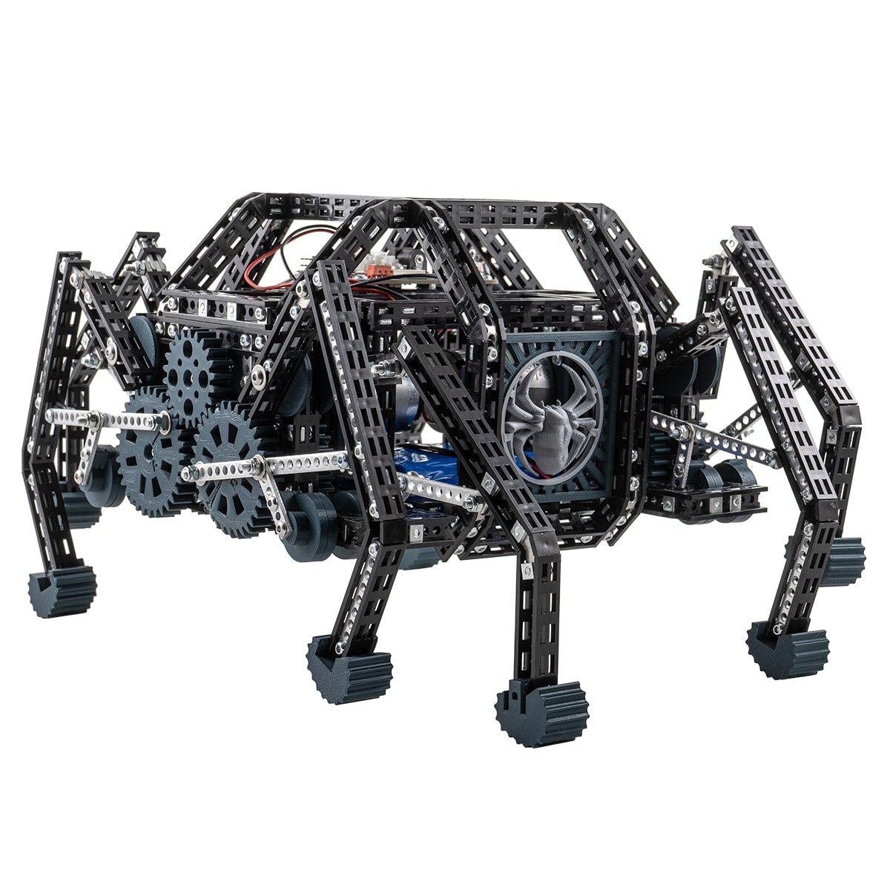
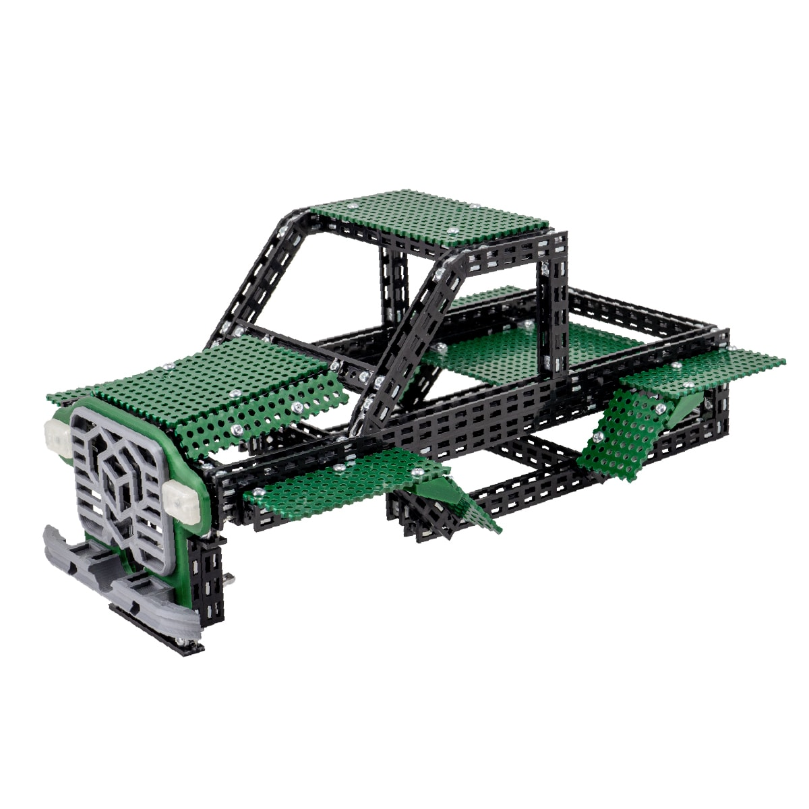
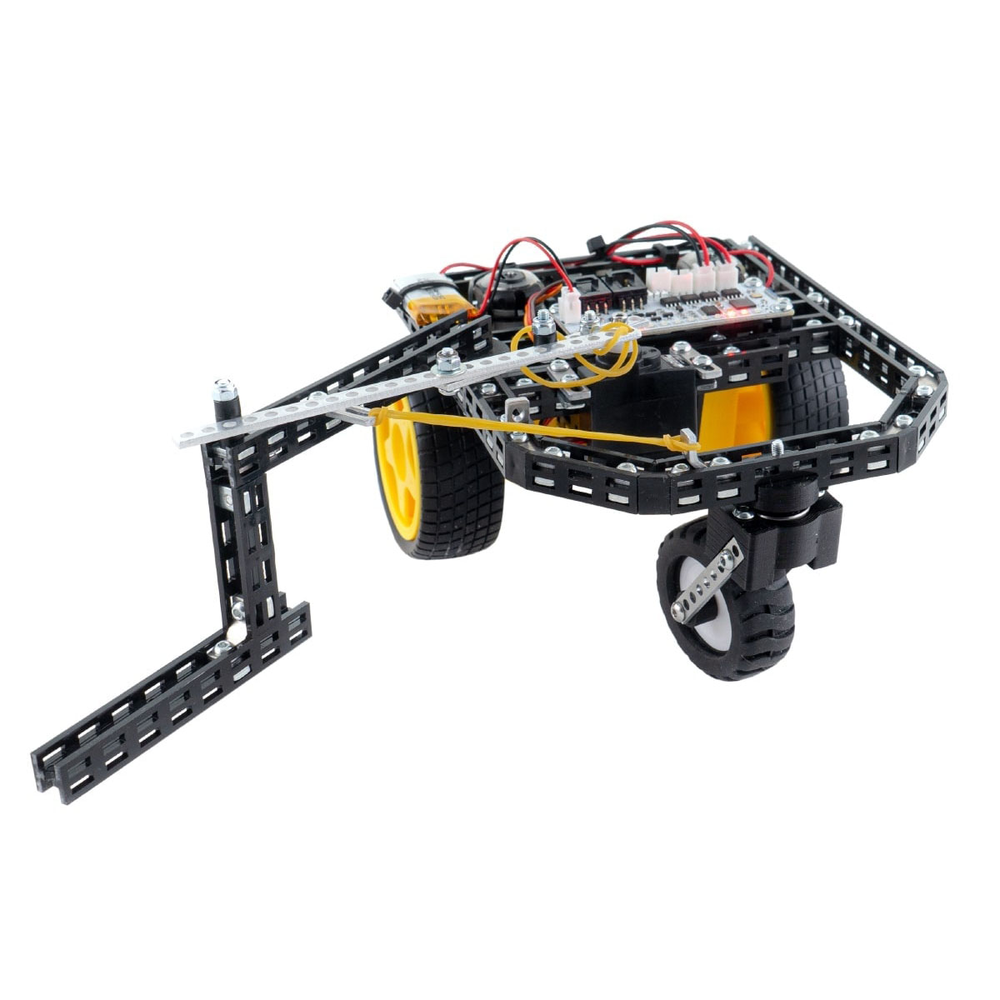
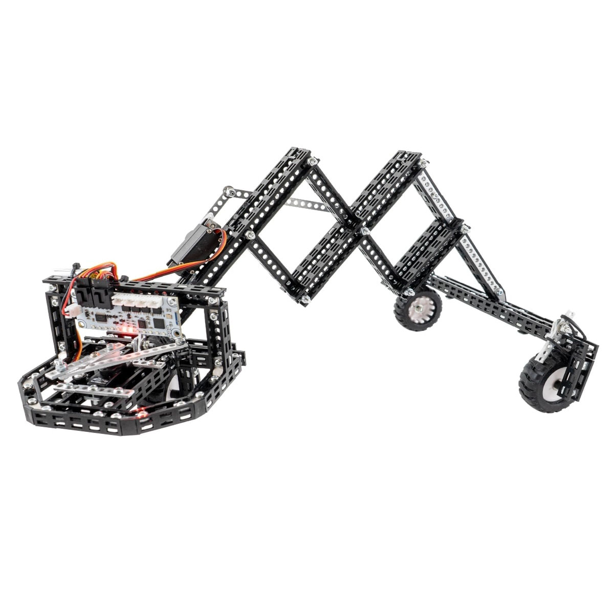
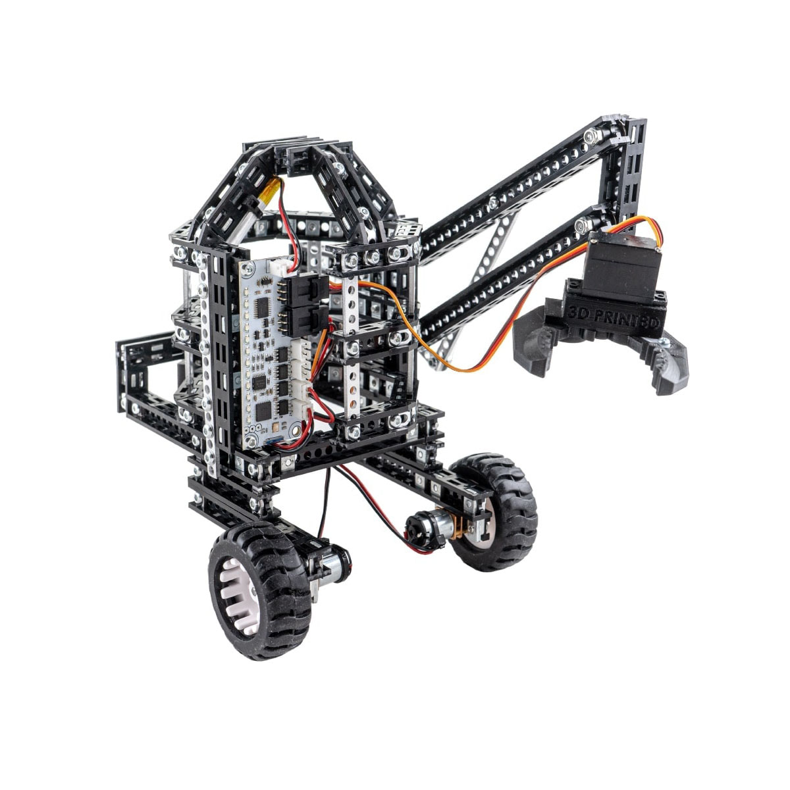
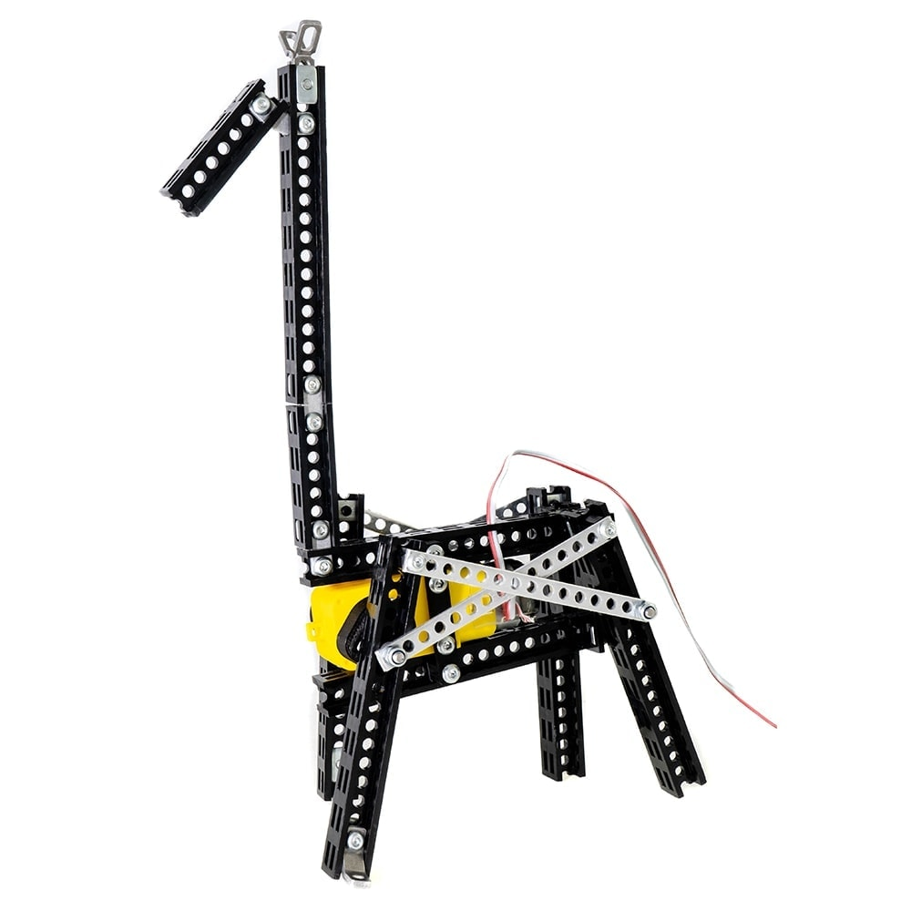

---
hide:
  - toc
---

# Robotic kits

    <a href="robotics-kits/#mini-trooper" class="card cover">Mini Trooper</a>
    <a href="robotics-kits/#mini-shooter" class="card cover">Mini Shooter</a>
    <a href="robotics-kits/#gripper-bot" class="card cover">Gripper Bot</a>
    <a href="robotics-kits/#black-spider" class="card cover">Black Spider</a>
    <a href="robotics-kits/#robocar-chassis" class="card cover">RoboCar Chassis</a>
    <a href="robotics-kits/#truck-top" class="card cover">Truck Top</a>
    <a href="robotics-kits/#retro-top" class="card cover">Retro Top</a>
    <a href="robotics-kits/#robotics-kit" class="card cover">Robotics Kit</a>
    <a href="robotics-kits/#4wd-car" class="card cover">4WD Car</a>
    <a href="robotics-kits/#hockey-bot" class="card cover">Hockey Bot</a>
    <a href="robotics-kits/#larva-mobile" class="card cover">Larva mobile</a>
    <a href="robotics-kits/#lift-mobile" class="card cover">Lift mobile</a>
    <a href="robotics-kits/#lucas-robot" class="card cover">Lucas robot</a>
    <a href="robotics-kits/#mini-spider" class="card cover">Mini Spider</a>
    <a href="robotics-kits/#dog" class="card cover">Dog</a>
    <a href="robotics-kits/#giraffe" class="card cover">Giraffe</a>
    <a href="robotics-kits/#t-rex" class="card cover">T-Rex</a>

## Mini Lab

    <a href="../mini-lab/" class="card cover">Mini Lab</a>
    <a href="../totemduino/micro-lab/" class="card cover">Micro Lab</a>
    <a href="../labboard/" class="card cover">LabBoard</a>
    <a href="../totemduino/" class="card cover">TotemDuino</a>
    <a href="../side-panels/io-panel/" class="card cover">IO panel</a>
    <a href="../side-panels/sensor-panel/" class="card cover">Sensor panel</a>
    <a href="../side-panels/audio-panel/" class="card cover">Audio panel</a>
    <a href="../side-panels/#stand-assembly" class="card cover">Side Panel Stand</a>
    <a href="https://totemmaker.net/wp-content/uploads/2021/11/grove-modules-rack-instructions-v.1.1.pdf" class="card cover">Grove Beginners rack</a>
    <a href="https://totemmaker.net/wp-content/uploads/2021/11/grove-modules-rack-instructions-v.1.1.pdf" class="card cover">Grove Module rack</a>

## Tools

    <a href="board-cutters/#board-pro-cutter" class="card cover">Board PRO-cutter</a>
    <a href="beam-cutters/#pro-cutter" class="card cover">Beam PRO-cutter</a>
    <a href="beam-cutters/#beam-cutter" class="card cover">Beam cutter</a>
    <a href="board-cutters/#board-cutter" class="card cover">Board cutter</a>
    <a href="screwdrivers/#totem-screwdriver" class="card cover">Screwdriver</a>
    <a href="screwdrivers/#totem-wrench" class="card cover">Wrench</a>

