# Mechanics

[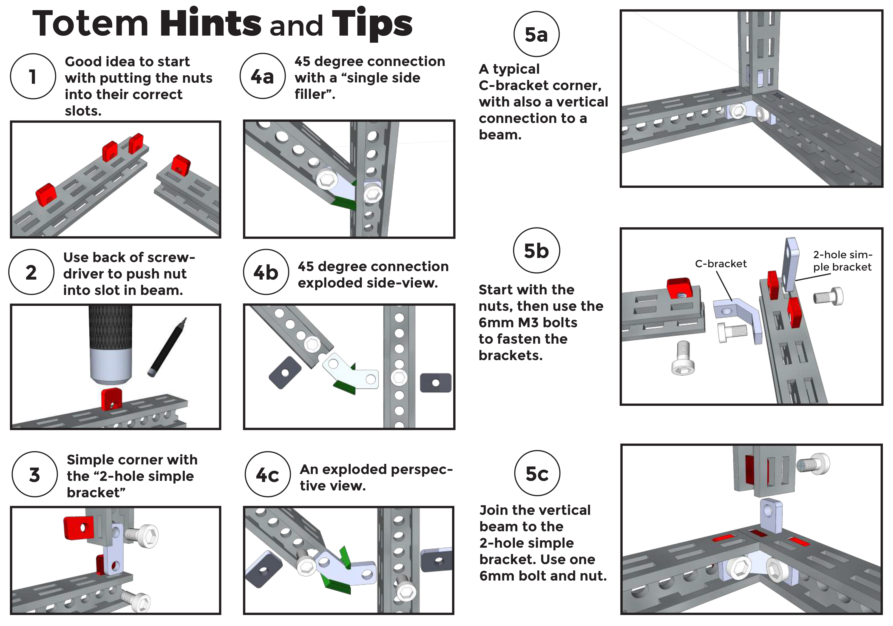{loading=lazy}](../../assets/images/products/misc/totem-building-hints.png)

In Totem Mechanics we use metal fasteners ([Bolts](../fasteners.md#regular-bolts) and [Nuts](../fasteners.md#regular-nuts)), because they make the structure more robust. It is slightly more complicated, but with more possibilities. We chose to have PC/ABS plastic parts as a main structure ([Beams](../beams.md) and [Boards](../boards.md)) because of their customization possibilities.

Makers have all kinds of motors, PCB’s, batteries, half made projects, lying around. It is frustrating, because mounting holes of components almost never match. Plastic parts are much more suitable to overcome this issue, because they are easier to modify and adjust.

## Light weight

Having light weigh parts can be a direct indicator of how well the model will work. Let’s say one is building robotic arm. The lighter the construction, the less stress for the motors, the heavier object it will be able to lift. Same thing for walking robots, or drones!

## Fasteners

In the first image, you can see the sandwich of fasteners. The bolt and the nut presses the Bracket and the Beam, as a result, friction holds them together.  
The wall of the Beam, Bracket and Nut is 2mm thickness each. The bolt has to reach the end of the nut, so 2mm + 2mm + 2mm = 6mm and that is why, in this example, we use 6mm length bolt. We have more different bolt lengths, if the "sandwich" is thicker.

<figure markdown="span">
  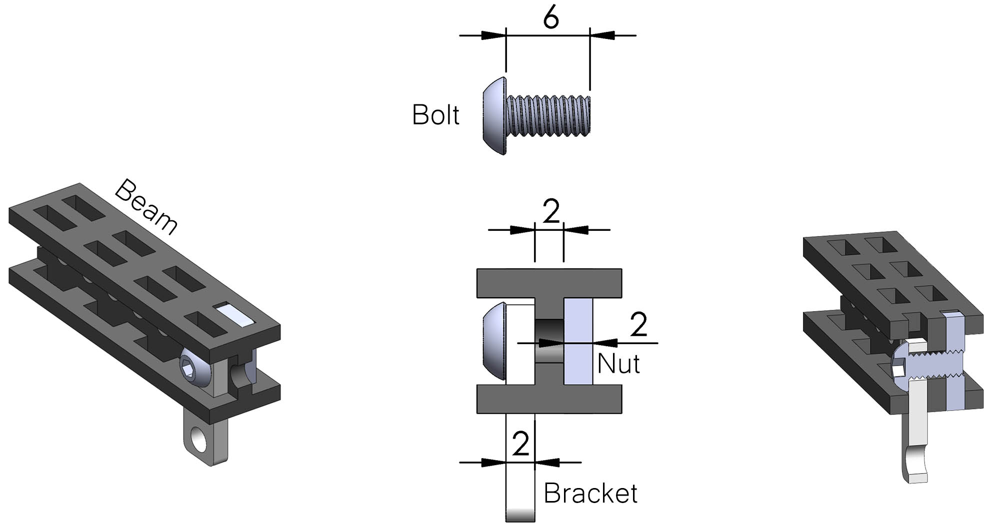
  <figcaption>Sandwich of fasteners</figcaption>
</figure>

## Beam

Our main structural part is Totem Beam. The Beam has a patented design which makes Totem building system unique.  
Rectangular holes are for nuts and brackets. All rectangular holes are the same size, so nuts and brackets can be mounted on any side.

<figure markdown="span">
  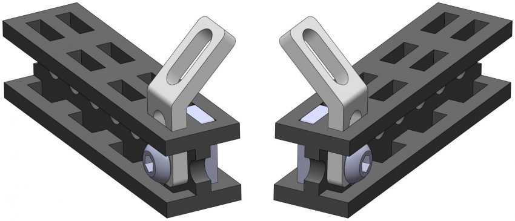{width="500px"}
  <figcaption>Mirrored bracket mounting</figcaption>
</figure>

Brackets (not all of them) can also be mounted on the side of the Beam (using the channel of the Beam, instead of rectangular holes). More about brackets is explained further down below.

<figure markdown="span">
  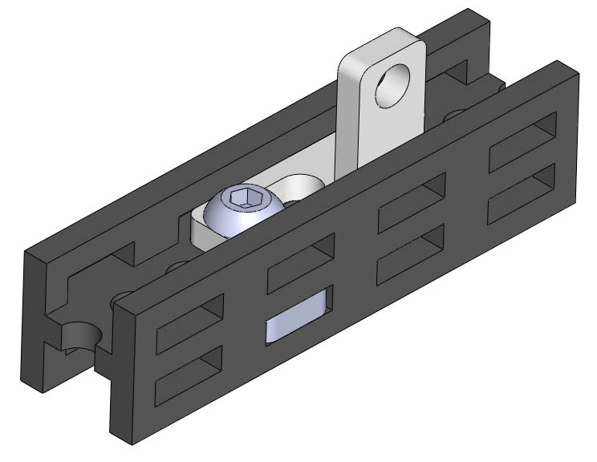{width="300px"}
  <figcaption>Bracket mounted in the channel of the Beam</figcaption>
</figure>

Sometimes brackets occupy both opposite holes. In that case, the nut goes horizontally, and 8mm bolt fastens them together. The step of rectangular holes is 10mm.

<figure markdown="span">
  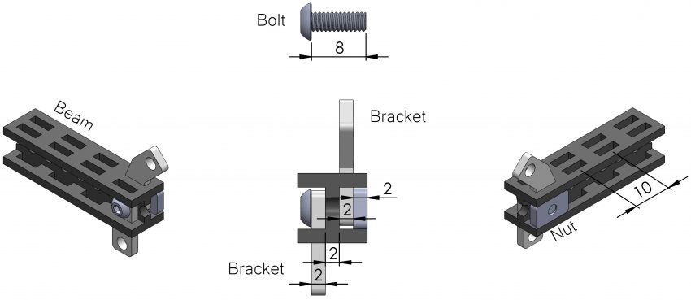
  <figcaption>Occupied rectangular holes</figcaption>
</figure>

Bolts always go through circular holes of the Beam. They are at every 5mm or "half step" of rectangular holes. If the circular hole is in line with the rectangular hole, the nut goes to rectangular slot. If the circular hole is in "half step", the nut goes horizontally, on the side of the beam.

<figure markdown="span">
  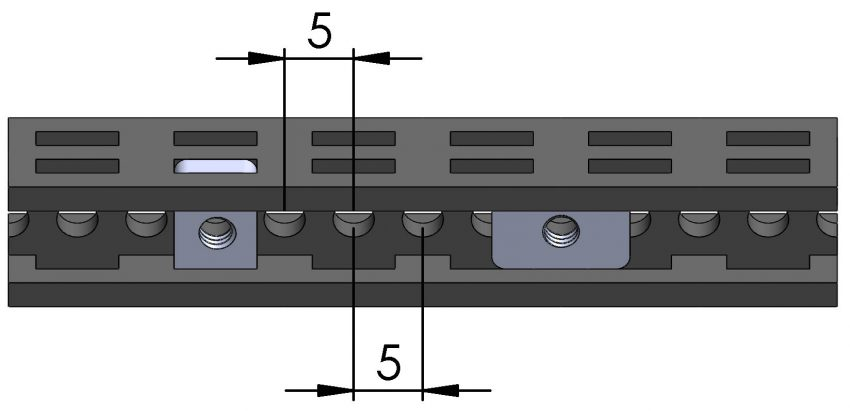
  <figcaption>Nut positioning</figcaption>
</figure>

## Board

Totem Boards are also structural parts. They have a grid of holes of 5mm. And it is 2mm thickness (same as Beam walls, Brackets and Nuts). Totem Boards can be cut using [Board Cutter](../board-cutters.md) at 90º or 45º degrees angle.

<figure markdown="span">
  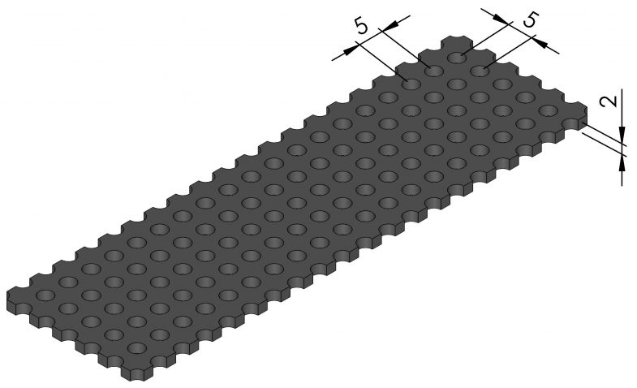
  <figcaption>Totem Board</figcaption>
</figure>

## Brackets

Totem Brackets connect Beams together. We wanted Totem to be versatile for many projects, that’s why we have so many different types of [Brackets](../brackets.md). Brackets can also hold PCB’s, motors, 3D printed parts, Boards, sensors etc. Brackets with circular holes keep Beams in 5mm or 10mm order. When the structure needs to go "off the Grid", use brackets with oblong holes. For example, when mounting third party components, like Arduino electronic boards. They may not have their mounting holes in 5mm or 10mm grid, so oblong holes let the structure adapt to the PCB.

<figure markdown="span">
  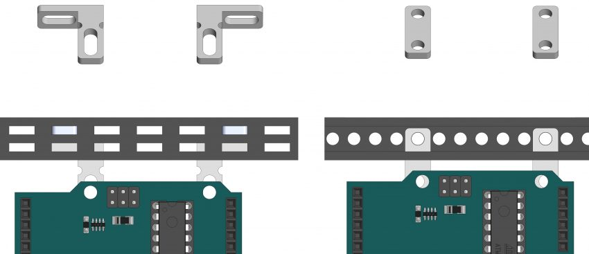
  <figcaption>Oblong holes vs circular</figcaption>
</figure>

## Screwdriver

This is not a "slightly" magnetic screwdriver (like many others). Totem [Magnetic screwdriver](../screwdrivers.md) is powered by neodymium 52 grade magnet.

<figure markdown="span">
  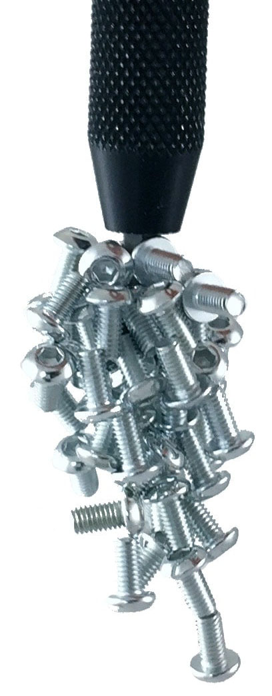{width="100px"}
  <figcaption>Totem Screwdriver magnet</figcaption>
</figure>

Not only the screwdriver is a tool for bolts, but for the nuts as well. Use your fingers to enter the first rectangular slot. Then push the nut in, using the back of the screwdriver. The nut almost always tilts, so use your finger to straighten it. Then push it all the way in.

<figure markdown="span">
  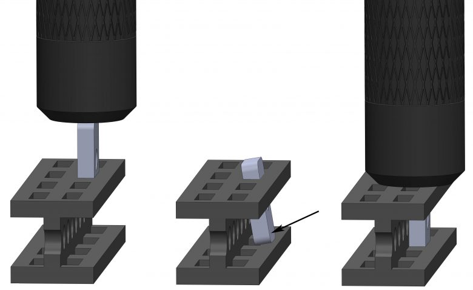
  <figcaption>How to push in the nuts</figcaption>
</figure>

When you get the hang of it, try pushing the nut holding the screwdriver in an angular position, like it is shown in the picture. That way you avoid tilting problem.

<figure markdown="span">
  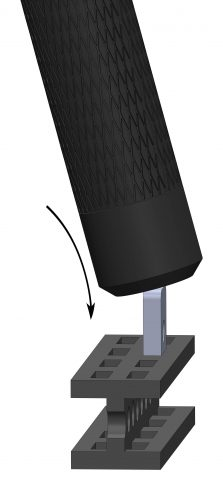
  <figcaption>Single push</figcaption>
</figure>

What about getting them out?
Use the tip (hex bit) of the screwdriver to push the nut out 2/3 of the slot. Then pull the nut by the thread.

<figure markdown="span">
  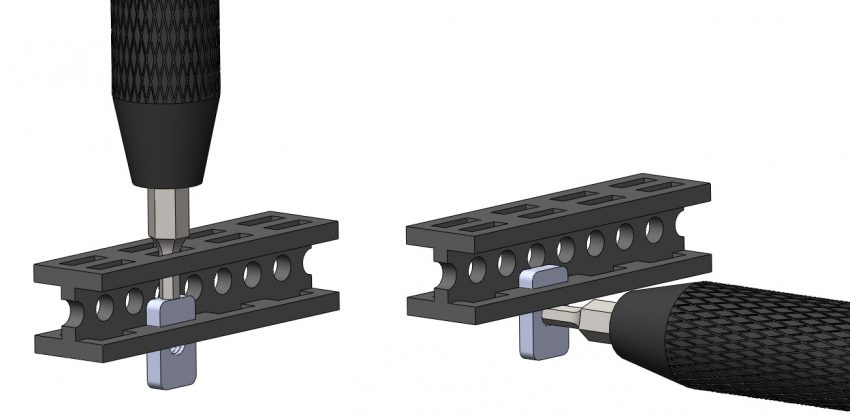
  <figcaption>How to push the nuts out</figcaption>
</figure>

## Straight structure

> "The structure I built is not straight"

There are a few causes for bent structures:

1) Ends of beams are not straight

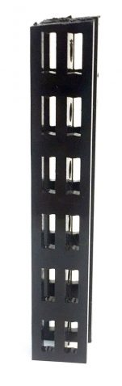

This is an obvious one, but it is worth mentioning. PLEASE DO NOT USE THIRD PARTY CUTTING TOOLS. Some of our customers tried using hacksaw for metal they had at home. It is not good for beam cutting. The blade is 0,55-0,8mm thickness and they usually do not have support both for the beam and the blade. We strongly recommend using Totem [cutting tools](../beam-cutters.md).

<figure markdown="span">
  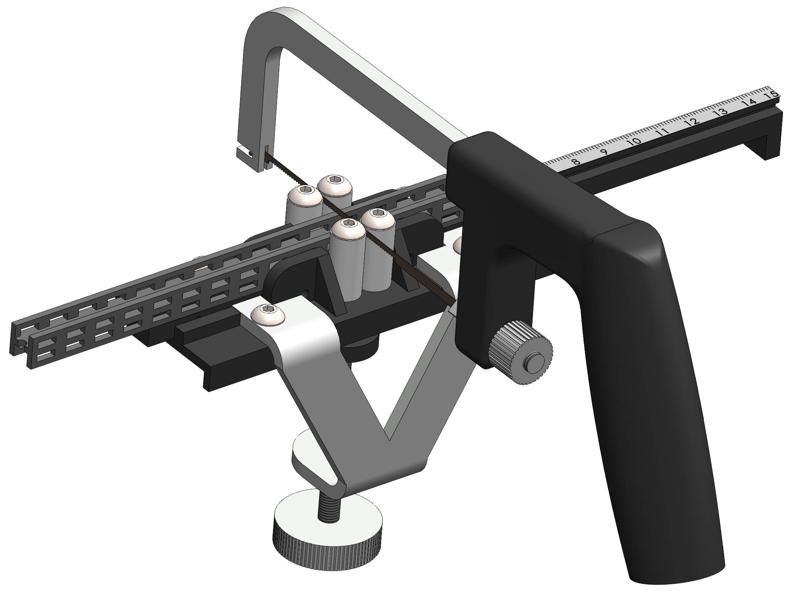{width=450px}
  <figcaption>Beam Cutter</figcaption>
</figure>

The blade is only 0,2mm thick, so it is three times more accurate. The Beam Cutter has a blade support and there is a Beam holder with pins, holding the Beam tight. However, the blade does wear out, and it needs to be replaced from time to time. The cut is always straighter with a sharp blade.

2) Fasteners are over-tightened

<figure markdown="span">
  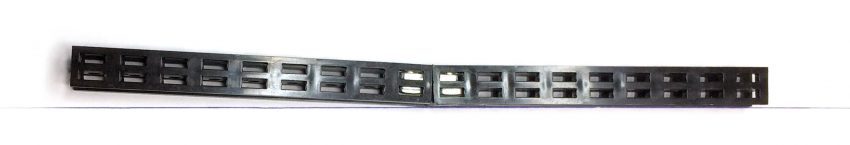
  <figcaption>Over-tightened structure</figcaption>
</figure>

Over-tightened fasteners deform plastic parts like Beam and Board. You also don’t want to have a flimsy structure, so how to know, how much torque is enough? The best way to find out is to perform an experiment. Tighten the bolt as much, as you can. It will  start to deform the bracket or the beam, or the head of the bolt. Now you know what is too much. Tighten the bolt at approximately 70 percent of full torque. It will be good for most of the times.

3) Closed geometry design
To ensure straightness of the structure, it is a good idea to make closed geometry design (when possible). As an example, our [Side Panel Stand](../../side-panels/index.md#stand-assembly) and [Mini Lab](../../mini-lab/index.md#assembly-guide).
There are no loose ends, and structures are made of either rectangles or triangles.

## Tailor to your project

We made Totem structural parts to be customized. The Beam is 40 cm length and the builder can cut to shorter parts at every 1 cm. Made a mistake? No worries, just cut another one! Totem Board is 10 cm x 10 cm and it can be cut at every 5 mm (even at 45 degrees). We designed specialized tools for beam and board cutting. Fast and easy cut!

Other cutting tools are handy as well. Drill a hole for larger diameter bolts, shaft or an axle. Use cutting pliers if there is a corner sticking out. Combine this with Totem adjustable brackets and you get lots of mounting options.

<figure markdown="span">
  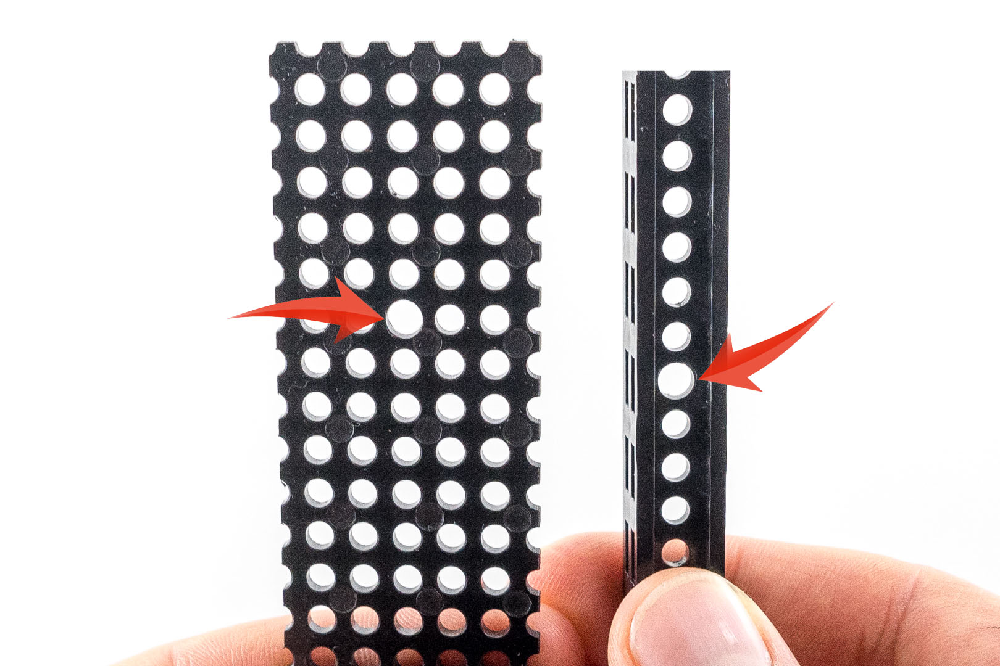
  <figcaption>Drilled 4mm holes</figcaption>
</figure>

## Press fit connections

Next big advantage of Totem plastic beam is the ability to have a press fit connection for nuts and brackets. When they enter the slots, beam walls hold inserted parts. Combine this feature with the Totem magnetic screwdriver and forget about the hassle of constant dropping parts on the floor.

<figure markdown="span">
  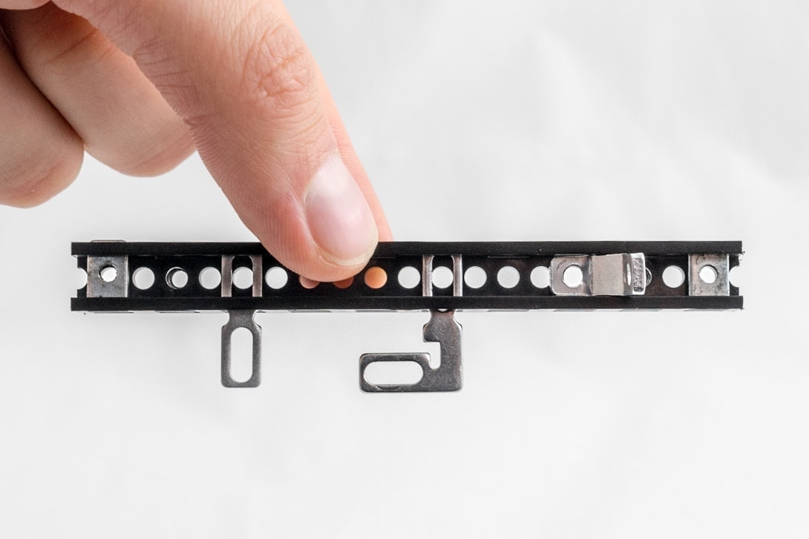
  <figcaption>Press fit Nuts and Brackets</figcaption>
</figure>

## More freedom to design

Most hobby construction systems have a grid. As long as one needs 90 degree connection, they all work. But what happens when the model needs 45 degrees angle or 60? It is very likely, parts will no longer match.

Totem beams and boards give the ability for mounting holes to be shifted. Most of the times, there is only 1-2 mm miss-match. That is a lot for metal, but plastic parts can be bent or twisted. Take a look at the picture below. The drawing shows assuming parts are totally straight. It is very clear, the bottom connection is off the grid. The picture on the right, shows real assembly of Totem parts. All connections look perfect. If parts could not be deformed, the design would be very limited due to grid restrictions.

<figure markdown="span">
  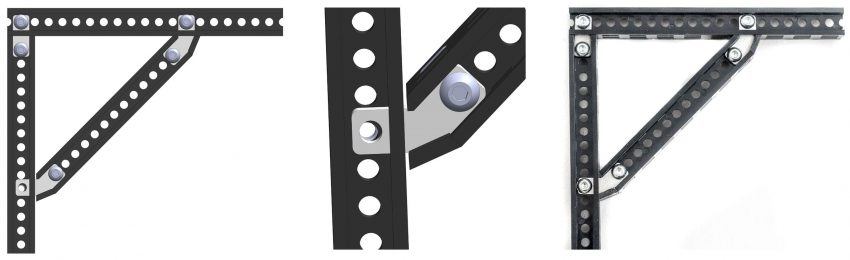
  <figcaption>Model vs. real assembly</figcaption>
</figure>

## Make stronger structures

**1st method** - using triangle support structures.  
One of the methods would be to use triangle support constructions. Triangles are the fundamental building blocks of many contemporary structures. Their strong, inflexible structure makes them perfect for contemporary designs. They are used in architecture and construction to create structures that will bear a certain amount of weight but still have material strength limits. Just by adding diagonal beam through the middle of a square you are effectively turning the structure into two triangles and eventually making it stronger.

<figure markdown="span">
  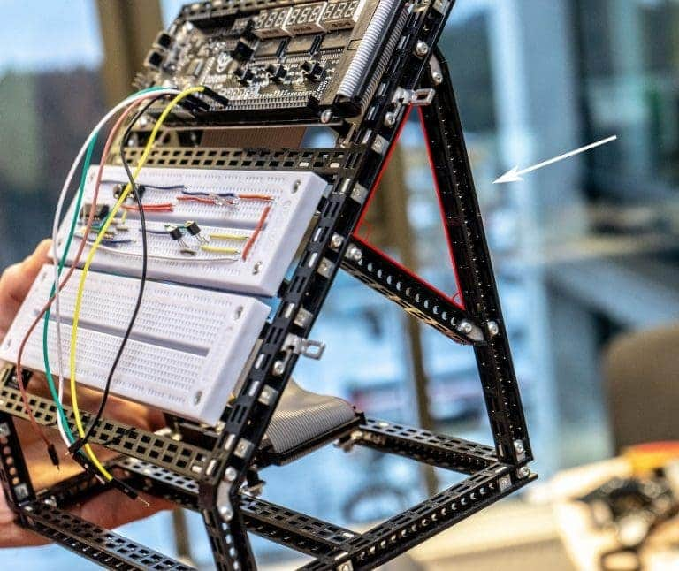
  <figcaption>Triangle structure in Totem Mini Lab rack</figcaption>
</figure>

**2nd method** - using strip brackets.  
Another method is to use aluminium [strip brackets](../brackets.md#strip-bracket) fixed inside of the [beams](../beams.md) or to the [board](../boards.md). Find a weak spot in your structure and depending on the situation use one-sided or double-sided mount (double-sided fixture compared to one-sided is stronger but heavier). To keep them in place you will need few bolts and nuts. Just keep in mind that this method will block beam’s slots, so use it wisely.

<figure markdown="span">
  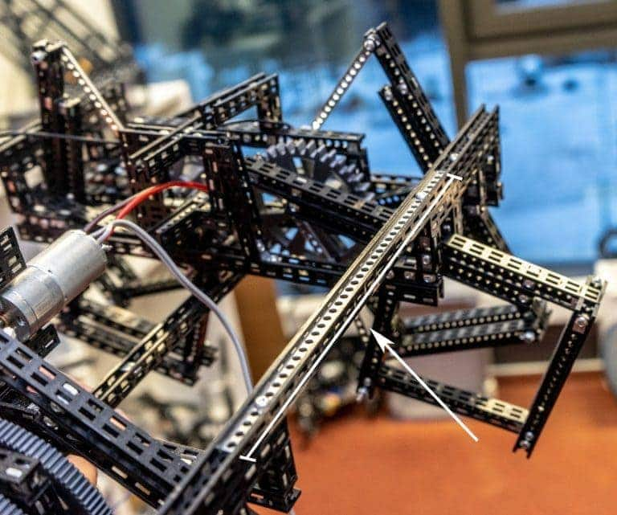
  <figcaption>Strip bracket added to totem beam</figcaption>
</figure>

**3rd method** - using 3D printed parts.  
To achieve even stronger structures you can consider using 3D printed parts. One of the options is the "Magic Cross" ([:material-printer-3d: STL file](https://github.com/totemmaker/TotemSTL/blob/master/Misc/Magic%20cross.stl){target=_blank}). It is meant to be used in between 4 beams with an easy fix of few bolts and nuts. The part will significantly reduce twisting and bending forces while still leaving possibilities to join parts in 5 different directions.

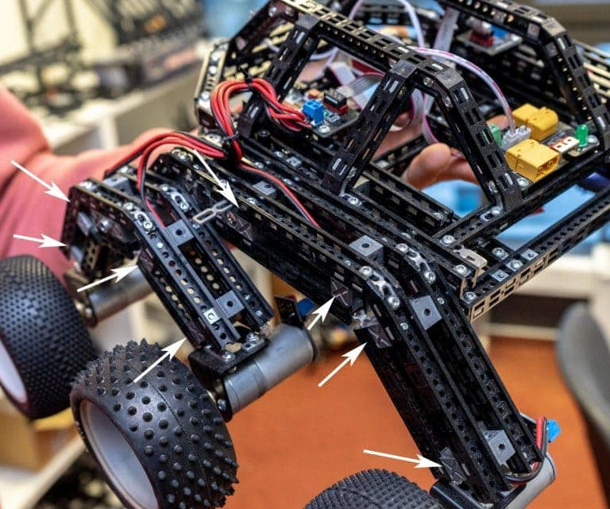

We set up a stress test to show how each method acts in the same conditions. Beams are fixed to the table with 20 cm shoulder hanging in the air. On the end we attached bag of [nuts](../fasteners.md#regular-nuts) that weights 0.5 kg (~630 pieces). For this test we used beam without any extra parts (1), beam with [strip brackets](../brackets.md#strip-bracket) fixed on one side (2), beam with strip brackets fixed on two sides (3) and assembly made with "Magic Cross" connections (4). You can see how each of the participants resists the bending force in the pictures below.

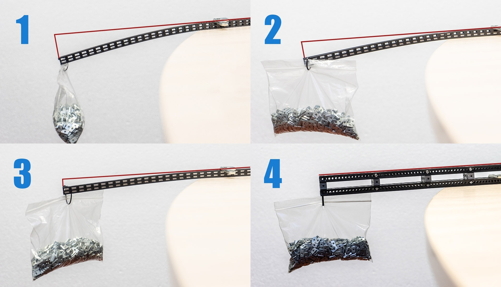

<iframe style="width: 100%;aspect-ratio: 16/9;" loading="lazy" src="https://www.youtube.com/embed/If_hbsaz-QY" title="" frameborder="0" allow="accelerometer; autoplay; clipboard-write; encrypted-media; gyroscope; picture-in-picture; web-share" referrerpolicy="strict-origin-when-cross-origin" allowfullscreen></iframe>

<iframe style="width: 100%;aspect-ratio: 16/9;" loading="lazy" src="https://www.youtube.com/embed/T9sEwb0pC_I" title="" frameborder="0" allow="accelerometer; autoplay; clipboard-write; encrypted-media; gyroscope; picture-in-picture; web-share" referrerpolicy="strict-origin-when-cross-origin" allowfullscreen></iframe>

<iframe style="width: 100%;aspect-ratio: 16/9;" loading="lazy" src="https://www.youtube.com/embed/PKuIlfa88R4" title="" frameborder="0" allow="accelerometer; autoplay; clipboard-write; encrypted-media; gyroscope; picture-in-picture; web-share" referrerpolicy="strict-origin-when-cross-origin" allowfullscreen></iframe>

<iframe style="width: 100%;aspect-ratio: 16/9;" loading="lazy" src="https://www.youtube.com/embed/cKkfLgfzaIc" title="" frameborder="0" allow="accelerometer; autoplay; clipboard-write; encrypted-media; gyroscope; picture-in-picture; web-share" referrerpolicy="strict-origin-when-cross-origin" allowfullscreen></iframe>

<iframe style="width: 100%;aspect-ratio: 16/9;" loading="lazy" src="https://www.youtube.com/embed/hTxfato-GGg" title="" frameborder="0" allow="accelerometer; autoplay; clipboard-write; encrypted-media; gyroscope; picture-in-picture; web-share" referrerpolicy="strict-origin-when-cross-origin" allowfullscreen></iframe>

## Mounting electronics

Totem mechanics is all about user-friendliness. Unique Beam design makes it easy to mount all brands of electronics  at any point of the project.
The provided example gives the clear understanding of how the Totem system works.
Arduino in this case is used, however it can be any other electronics brand, including Totem.

<iframe style="width: 100%;aspect-ratio: 16/9;" loading="lazy" src="https://www.youtube.com/embed/-ZO06ORfh44" title="" frameborder="0" allow="accelerometer; autoplay; clipboard-write; encrypted-media; gyroscope; picture-in-picture; web-share" referrerpolicy="strict-origin-when-cross-origin" allowfullscreen></iframe>

Parts needed:

- [Bolts M3x6](../fasteners.md#regular-bolts)
- [Nuts M3 6x10](../fasteners.md#regular-nuts)
- [Nuts M3 5.5x5.5](../fasteners.md#regular-nuts)
- [Nylon Standoffs](../fasteners.md#nylon-standoff)
- Adjustable Brackets (like [3-hole bracket](../brackets.md#3-hole-bracket), [L-bracket](../brackets.md#l-bracket))

**Note:** Totem fasteners are M3 standard. Raspberry Pi has ∅2.5mm holes so [M2.5x8 screw](../fasteners.md#screws) and [snap on bracket](../brackets.md#plastic-bracket) is required.

## Aesthetics

Some people may say, plastic parts look cheaper than aluminium. We think that is not necessarily true. We believe it is more important how they are made and what benefits do they give. Color anodized aluminium can be scratched, and pretty soon they look old and used. Totem plastic material isn’t painted, the color fills all of the plastic, and a scratch isn’t particularly visible.

<figure markdown="span">
  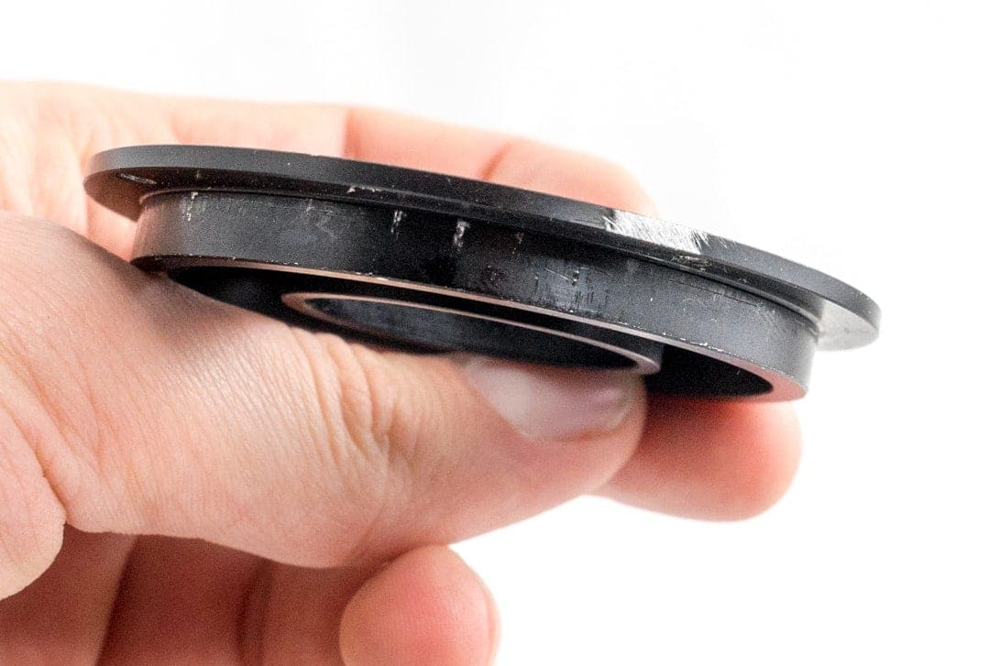
  <figcaption>Scratched anodized aluminium</figcaption>
</figure>
