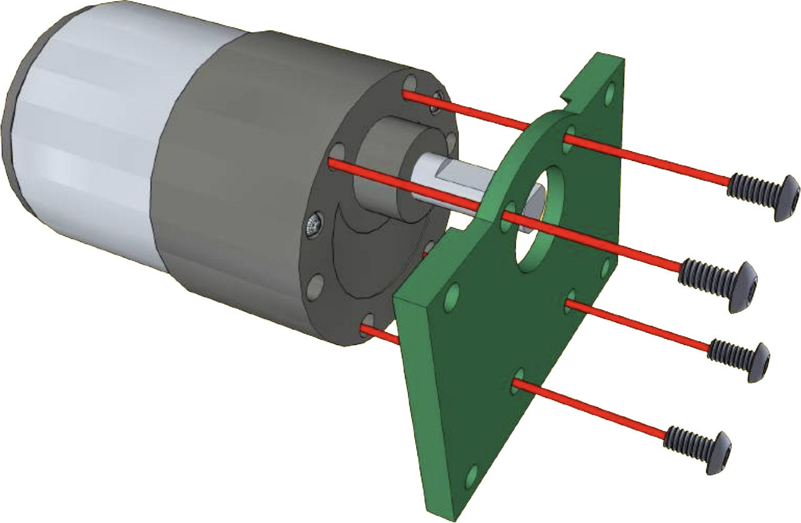
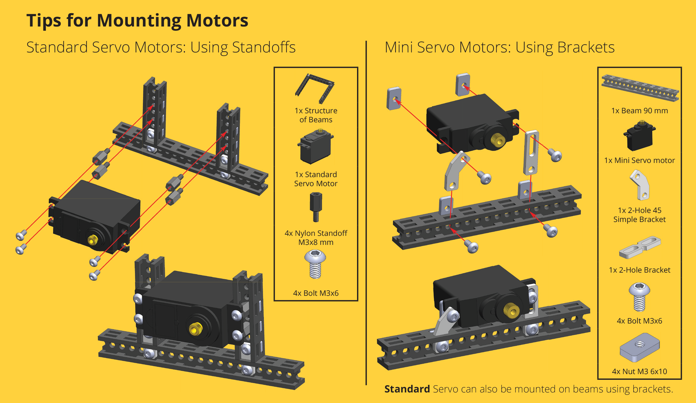

# Motors

There are different types of motors which do not fit Totem grid, so we offer [:material-printer-3d: STL](https://github.com/totemmaker/TotemSTL/tree/master/Misc){target=_blank} and [:material-cube-outline: STEP](https://github.com/totemmaker/TotemSTEP/tree/master/Totem%20Linear%20and%20axial%20action){target=_blank} files of parts for transition from standard motors mounting holes to Totem grid.

## DC motors

<iframe style="width: 100%;aspect-ratio: 16/9;" loading="lazy" src="https://www.youtube.com/embed/82Fm0LK_Xt8" title="" frameborder="0" allow="accelerometer; autoplay; clipboard-write; encrypted-media; gyroscope; picture-in-picture; web-share" referrerpolicy="strict-origin-when-cross-origin" allowfullscreen></iframe>

=== "DC 12V 400RPM"
    {width=300px loading=lazy}
    {width="300px" style="padding-bottom:60px" loading=lazy}  
    Motor: [:material-cart: _TM196_](https://totemmaker.net/product/25mm-dc-motor-400-rpm-12v/){target=_blank} | [:material-cube-outline: STEP file](https://github.com/totemmaker/TotemSTEP/blob/master/Totem%20Linear%20and%20axial%20action/25mm%20DC%20motor.STEP){target=_blank} | Robotic Kit: [RoboCar Chassis](robotics-kits.md#robocar-chassis)  

    **Power**: 12V, 1.5A (stall)  
    **Speed**: 400 RPM  
    **Shaft**: 4mm (diameter), 10mm (length), D-Shape  
    **Wire**: 150mm length, JST PH 2.0 Male connector  

    | Attachment | Description |
    | - | - |
    | {width="100px"} | **RoboCar mounting bracket**   [:material-printer-3d: STL file](https://github.com/totemmaker/TotemSTL/blob/master/RoboCar%20chassis/Black%20parts/TM416%2025%20mm%20DC%20motor%20bracket%20(3D).stl){target=_blank}   Motor mounting for RoboCar kit |
    | {width="100px"} | **Single beam mounting**   [:material-cart: _TM-3D1-1_](https://totemmaker.net/product/25mm-dc-motors-bracket/){target=_blank} &#124; [:material-printer-3d: STL file](https://github.com/totemmaker/TotemSTL/blob/master/Misc/TM145%2025mm%20DC%20motor%20bracket%20(3D).STL){target=_blank} &#124; [:material-cube-outline: STEP file](https://github.com/totemmaker/TotemSTEP/blob/master/Totem%20Other%20parts/25mm%20DC%20motor%20bracket.STEP){target=_blank} |
    | {width="100px"} | **Shaft coupler 4-3**   [:material-cart: _TM-RB-02-1_](https://totemmaker.net/product/motor-coupler-4-3-set/){target=_blank}   4mm - 3mm coupler to connect shafts |
    | {width="100px"} | **75mm wheel set**   [:material-cart: _TM-LWS_](https://totemmaker.net/product/lead-wheel-set/){target=_blank} &#124; [:material-cube-outline: STEP file (coupler)](https://github.com/totemmaker/TotemSTEP/blob/master/Totem%20Linear%20and%20axial%20action/12mm%20hex%20coupler.STEP){target=_blank}   4mm motor shaft wheel kit. |

    {width="300px"}
    {width="300px"}

    

=== "DC 12V 245RPM"
    {width=300px loading=lazy}  
    Motor: [:material-cart: _TM063_](https://totemmaker.net/product/dc-12-0v-245-rpm-motor-with-jst-ph-2-0-female-connector/){target=_blank} | Robotic Kit: [Black Spider](robotics-kits.md#black-spider)  

    **Power**: 12V, 1.5A (stall)  
    **Speed**: 245 RPM  
    **Shaft**: 6mm (diameter), 15mm (length), D-Shape  
    **Wire**: 150mm length, JST PH 2.0 Male connector  

    | Attachment | Description |
    | - | - |
    | {width="100px"} | **Mounting bracket**   [:material-printer-3d: STL file](https://github.com/totemmaker/TotemSTL/blob/master/Totem%20Spider/Gentlemens%20grey/TM249%2037%20mm%20DC%20Motor%20Plate%20(3D).stl){target=_blank}   For mounting motor to beams. |
    | {width="100px"} | **6mm shaft coupler**   [:material-cart: _TM046-K_](https://totemmaker.net/product/motor-shaft-coupler-6-mm-with-2-pcs-m3x6-bolts/){target=_blank}   Coupler to attach motor to gears. |

    

    

=== "DC 6V N20"
    {width=300px loading=lazy}
    {width="300px" style="padding-bottom:60px" loading=lazy}  
    [:material-cart: _TM207_](https://totemmaker.net/product/mini-dc-motor-751-ratio-6v/){target=_blank} | [:material-cube-outline: STEP file](https://github.com/totemmaker/TotemSTEP/blob/master/Totem%20Linear%20and%20axial%20action/N20%20motor%2015mm%20shaft.STEP){target=_blank} | Robotic Kits: [Mini Trooper](robotics-kits.md#mini-trooper), [Gripper Bot](robotics-kits.md#gripper-bot), ...

    **Power**: 6V, 1.6A (stall)  
    **Speed**: 400 RPM  
    **Gear**: ratio 75:1  
    **Shaft**: 3mm (diameter), 15mm (length), D-Shape  
    **Wire**: 150mm length, JST PH 2.0 Male connector  
    **Size**: 10H x 12W x 24L mm

    | Attachment | Description |
    | - | - |
    | {width="100px"} | **Bracket 2 V.3**   [:material-cart: _TM-3D3-1_](https://totemmaker.net/product/mini-dc-motor-bracket-2-v-3/){target=_blank} &#124; [:material-printer-3d: STL file](https://github.com/totemmaker/TotemSTL/blob/master/Misc/TM208%20N20%20Motor%20bracket%202%20v.3%20(3D).STL){target=_blank} &#124; [:material-cube-outline: STEP file](https://github.com/totemmaker/TotemSTEP/blob/master/Totem%20Other%20parts/N20%20motor%20bracket%202%20v.3%20(3D).STEP){target=_blank}   For mounting in front of the metal brackets with bolts sunken into surface. |
    | {width="100px"} | **Bracket 2 V.1**   [:material-cart: _TM-3D6-1_](https://totemmaker.net/product/mini-dc-motor-bracket-2/){target=_blank} &#124; [:material-printer-3d: STL file](https://github.com/totemmaker/TotemSTL/blob/master/Misc/TM147%20N20%20Motor%20bracket%202%20v.1%20(3D).STL){target=_blank} &#124; [:material-cube-outline: STEP file](https://github.com/totemmaker/TotemSTEP/blob/master/Totem%20Other%20parts/N20%20motor%20bracket%202%20v.1%20(3D).STEP){target=_blank}   For mounting behind the metal brackets. |
    | {width="100px"} | **Bracket 1**   [:material-cart: _TM-3D2-1_](https://totemmaker.net/product/mini-dc-motor-bracket-1/){target=_blank} &#124; [:material-printer-3d: STL file](https://github.com/totemmaker/TotemSTL/blob/master/Misc/TM332%20N20%20Motor%20Bracket%201%20(3D).STL){target=_blank} &#124; [:material-cube-outline: STEP file](https://github.com/totemmaker/TotemSTEP/blob/master/Totem%20Other%20parts/N20%20motor%20bracket%201%20(3D).STEP){target=_blank}   Mounting bracket that moves around depending on shaft position. |
    | {width="100px"} | **Shaft coupler 3-3**   [:material-cart: _TM-RB-01-1_](https://totemmaker.net/product/motor-coupler-3-3-set/){target=_blank}   3mm - 3mm coupler to connect shafts |
    | {width="100px"} | **Shaft coupler 4-3**   [:material-cart: _TM-RB-02-1_](https://totemmaker.net/product/motor-coupler-4-3-set/){target=_blank}   4mm - 3mm coupler to connect shafts |
    | {width="100px"} | **43mm wheel**   [:material-cart: _TM187_](https://totemmaker.net/product/43-mm-d-shaft-wheel/){target=_blank}  &#124; [:material-cube-outline: STEP file](https://github.com/totemmaker/TotemSTEP/blob/master/Totem%20Linear%20and%20axial%20action/43%20mm%20D-shaft%20wheel.STEP){target=_blank}   Rubber tread with plastic insert   Mounted directly on 3mm D-Shape motor shaft.   **Size**: 43 x 18 mm |

    [{loading=lazy}](../assets/images/products/motors/n20-motor-bracket-assembly.png)
    [{loading=lazy}](../assets/images/products/motors/n20-linear-actuator-1.png)
    [{loading=lazy}](../assets/images/products/motors/n20-linear-actuator-2.png)
    [{loading=lazy}](../assets/images/products/motors/n20-linear-actuator-3.png)

    {width="300px"}
    {width="300px"}
    [{width="300px" loading=lazy}](../assets/images/products/motors/n20-mounting.jpg)
    [{width="300px" loading=lazy}](../assets/images/products/motors/n20-motor-structure.jpg)

=== "DC 6V TT (Yellow)"
    {width=300px loading=lazy}

    [:material-cart: _TM067_](https://totemmaker.net/product/dc-motor-148-6v/){target=_blank} | [:material-cube-outline: STEP file](https://github.com/totemmaker/TotemSTEP/blob/master/Totem%20Linear%20and%20axial%20action/Yellow%20DC%20Motor.STEP){target=_blank} | Robotic Kit: [4WD car](robotics-kits.md#4wd-car), [Young engineering kits](robotics-kits.md#young-engineer-kits)  

    **Power**: 6V  
    **Gear**: ratio 1:48  
    **Shaft**: 5mm (diameter), 10mm (length), Dual-Shape  
    **Wire**: 150mm length, JST PH 2.0 Male connector  

    | Attachment | Description |
    | - | - |
    | {width="100px"} | **Mounting bracket**   [:material-cart: _TM238-K_](https://totemmaker.net/product/yellow-dc-motor-bracket-3d-with-2-pcs-m3x35-bolts-and-m3x6-nuts/){target=_blank} &#124; [:material-printer-3d: STL file](https://github.com/totemmaker/TotemSTL/blob/master/Misc/TM238%20Yellow%20DC%20motor%20bracket%203%20(3D).stl){target=_blank} &#124; [:material-cube-outline: STEP file](https://github.com/totemmaker/TotemSTEP/blob/master/Totem%20Other%20parts/Yellow%20DC%20motor%20bracket%203%20(3D).STEP){target=_blank}   For mounting motor perpendicular to beam. |
    | {width="100px"} | **67mm wheel**   [:material-cart: _TM186_](https://totemmaker.net/product/wheel-d-67mm/){target=_blank} &#124; [:material-cube-outline: STEP file](https://github.com/totemmaker/TotemSTEP/blob/master/Totem%20Linear%20and%20axial%20action/Wheel%20D65x25.STEP){target=_blank}   Rubber tread with plastic insert   Mounted directly on motor shaft. |
    | | **Other brackets** ([instruction](../assets/images/products/motors/mounting-yellow-dc-motor.png))   [:material-printer-3d: STL bracket 1](https://github.com/totemmaker/TotemSTL/blob/master/Misc/TM231%20Yellow%20DC%20motor%20bracket%201%20(3D).STL){target=_blank} &#124; [:material-cube-outline: STEP bracket 1](https://github.com/totemmaker/TotemSTEP/blob/master/Totem%20Other%20parts/Yellow%20DC%20motor%20bracket%201%20(3D).STEP){target=_blank}   [:material-printer-3d: STL bracket 2](https://github.com/totemmaker/TotemSTL/blob/master/Misc/TM228%20Yellow%20DC%20motor%20bracket%202%20(3D).STL){target=_blank} &#124; [:material-cube-outline: STEP bracket 2](https://github.com/totemmaker/TotemSTEP/blob/master/Totem%20Other%20parts/Yellow%20DC%20motor%20bracket%202%20(3D).STEP){target=_blank} |

    {width=400px}  
    [{loading=lazy}](../assets/images/products/motors/mounting-yellow-dc-motor.png)

## Servo motors

<iframe style="width: 100%;aspect-ratio: 16/9;" loading="lazy" src="https://www.youtube.com/embed/tl1BolbfXAY" title="" frameborder="0" allow="accelerometer; autoplay; clipboard-write; encrypted-media; gyroscope; picture-in-picture; web-share" referrerpolicy="strict-origin-when-cross-origin" allowfullscreen></iframe>

=== "Standard Servo"
    {width=300px loading=lazy}  
    [:material-cart: _TM066_](https://totemmaker.net/product/standard-servo-motor/){target=_blank} | [:material-cube-outline: STEP file](https://github.com/totemmaker/TotemSTEP/blob/master/Totem%20Linear%20and%20axial%20action/Standard%20Servo%20motor.STEP){target=_blank}  
    Arm: [:material-cube-outline: STEP single](https://github.com/totemmaker/TotemSTEP/blob/master/Totem%20Linear%20and%20axial%20action/Standard%20servo%20arm%20single.STEP){target=_blank} | [:material-cube-outline: STEP double](https://github.com/totemmaker/TotemSTEP/blob/master/Totem%20Linear%20and%20axial%20action/Standard%20servo%20arm%20double.STEP){target=_blank}

    **Model**: MG995, metal gear  
    **Voltage**: 4.8 ~ 6.6v  
    **Rotation angle**: 180°  
    **Torque**: 9.4kg/cm (4.8v); 11kg/cm (6v)  
    **Speed**: 0.20sec/60° (4.8v); 0.16sec/60° (6v)  
    **Size**: 39.5 x 20.5 x 40 mm, 55g (weight), 30cm (wire)  

=== "Mini Servo"
    {width=300px loading=lazy}  
    [:material-cart: _TM065_](https://totemmaker.net/product/mini-servo-motor/){target=_blank} | [:material-cube-outline: STEP file](https://github.com/totemmaker/TotemSTEP/blob/master/Totem%20Linear%20and%20axial%20action/Mini%20servo%20motor.STEP){target=_blank}  
    Arm: [:material-cube-outline: STEP file](https://github.com/totemmaker/TotemSTEP/blob/master/Totem%20Linear%20and%20axial%20action/Mini%20Servo%20motor%20arm.STEP){target=_blank}

    **Model**: Mini, metal gear  
    **Voltage**: 4.8 ~ 6.0v  
    **Rotation angle**: 180°  
    **Torque**: 3.0kg/cm (4.8v); 3.5kg/cm (6v)  
    **Speed**: 0.13sec/60° (4.8v); 0.11sec/60° (6v)  
    **Size**: 29.5 x 11.6 x 30.2 mm, 17.5g (weight), 18cm (wire)  

[{loading=lazy}](../assets/images/products/motors/tips-for-mounting-servo-motors.png)
[{loading=lazy}](../assets/images/products/motors/totem-robotics-solutions-custom-servo-arm.png)

## Stepper motors

<iframe style="width: 100%;aspect-ratio: 16/9;" loading="lazy" src="https://www.youtube.com/embed/pAQOjCGZLrY" title="" frameborder="0" allow="accelerometer; autoplay; clipboard-write; encrypted-media; gyroscope; picture-in-picture; web-share" referrerpolicy="strict-origin-when-cross-origin" allowfullscreen></iframe>

=== "NEMA 8 stepper bracket"
    {width=300px loading=lazy}
    {width="300px" loading=lazy}  
    [:material-cart: _TM-3D4-1_](https://totemmaker.net/product/nema-8-stepper-motor-bracket/){target=_blank} |
    [:material-printer-3d: STL file](https://github.com/totemmaker/TotemSTL/blob/master/Misc/TM148%20Nema%208%20Stepper%20Motor%20bracket%20(3D).STL){target=_blank} |
    [:material-cube-outline: STEP file](https://github.com/totemmaker/TotemSTEP/blob/master/Totem%20Other%20parts/Nema%208%20bracket.STEP){target=_blank}

    | Attachment | Description |
    | - | - |
    | {width="100px"} | **Shaft coupler 4-3**   [:material-cart: _TM-RB-02-1_](https://totemmaker.net/product/motor-coupler-4-3-set/){target=_blank}   4mm - 3mm coupler to connect shafts |
    | {width="100px"} | **75mm wheel set**   [:material-cart: _TM-LWS_](https://totemmaker.net/product/lead-wheel-set/){target=_blank} &#124; [:material-cube-outline: STEP file (coupler)](https://github.com/totemmaker/TotemSTEP/blob/master/Totem%20Linear%20and%20axial%20action/12mm%20hex%20coupler.STEP){target=_blank}   4mm motor shaft wheel kit. |

=== "NEMA 17 stepper bracket"
    {width=300px loading=lazy}
    {width="300px" loading=lazy}  
    [:material-cart: _TM-3D5-1_](https://totemmaker.net/product/nema-17-stepper-motor-bracket/){target=_blank} |
    [:material-printer-3d: STL file](https://github.com/totemmaker/TotemSTL/blob/master/Misc/TM149%20Nema%2017%20Stepper%20Motor%20bracket%20(3D).STL){target=_blank} |
    [:material-cube-outline: STEP file](https://github.com/totemmaker/TotemSTEP/blob/master/Totem%20Other%20parts/Nema%2017%20bracket.STEP){target=_blank}

[{loading=lazy}](../assets/images/products/motors/stepper-motor-linear-actuator-1.png)
[{loading=lazy}](../assets/images/
products/motors/stepper-motor-linear-actuator-2.png)
[{loading=lazy width="400px"}](../assets/images/products/motors/stepper-motor-structure.jpg)

## Shaft couplers

Attachments, adapters for motor shafts and metal rods.

=== "Motor coupler set 3-3"
    {width=300px loading=lazy}  
    [:material-cart: _TM-RB-01-1_](https://totemmaker.net/product/motor-coupler-3-3-set/){target=_blank}

    - Used to extend metal rods. Material: copper.
    - For connecting two 3 mm diameter shafts or axles.
    - Comes with Tapper set bolts (4pcs.) and Hex Key.

=== "Motor coupler set 4-3"
    {width=300px loading=lazy}  
    [:material-cart: _TM-RB-02-1_](https://totemmaker.net/product/motor-coupler-4-3-set/){target=_blank}

    - Used to extend metal rods. Material: copper.
    - For connecting 3 mm and 4 mm diameter shafts or axles.
    - Comes with Tapper set bolts (4pcs.) and Hex Key.

=== "Motor shaft coupler 6mm"
    {width=300px loading=lazy}  
    [:material-cart: _TM046-K_](https://totemmaker.net/product/motor-shaft-coupler-6-mm-with-2-pcs-m3x6-bolts/){target=_blank}

    - Used to connect 6mm motor shaft to plastic gears.
    - Comes with Tapper bolts M3X6 (2pcs.).

    

=== "E-Clip"
    {width=300px loading=lazy}  
    [:material-cart: _TM-RB-03-30_](https://totemmaker.net/product/e-clip-50-pack/){target=_blank} | [:material-cube-outline: STEP file](https://github.com/totemmaker/TotemSTEP/blob/master/Totem%20Fasteners/E-clip.STEP){target=_blank}

    - Groove diameter: 2.3 mm. Material: carbon steel.
    - Designed to fit onto shafts and do not require special pliers or tools to fit.
    - Used for locating or retaining components from sideways movement on the shaft.

    [{loading=lazy}](../assets/images/products/motors/totem-robotics-solutions-axles.png)

## Attachment kits

=== "Lead wheel set"
    {width=300px loading=lazy}  
    [:material-cart: _TM-LWS_](https://totemmaker.net/product/lead-wheel-set/){target=_blank}  
    12mm HEX coupler: [:material-cube-outline: STEP file](https://github.com/totemmaker/TotemSTEP/blob/master/Totem%20Linear%20and%20axial%20action/12mm%20hex%20coupler.STEP){target=_blank}

    Wheel kit for mounting straight to 4mm motor shaft by locking position with the tapper bolt. Includes all required parts and a hex key.  

    **Dimensions:** 75 mm (diameter), 30 mm (width).  
    Used in [RoboCar Chassis](robotics-kits.md#robocar-chassis) kit.  

    

=== "Idler wheel set"
    {width=300px loading=lazy}  
    [:material-cart: _TM-IWS_](https://totemmaker.net/product/idler-wheel-set/){target=_blank}

    Free spin wheel kit with bearing barrel construction.  
    **Note: The construction is different from the one used in the RoboCar Kit!**  

    **Dimensions:** 75 mm (diameter), 30 mm (width).  
    Includes required bearings, barrel and bolts.  

    [{loading=lazy width="300px"}](../assets/images/products/motors/idler-wheel-barrel-info-1.png)
    [{loading=lazy width="300px"}](../assets/images/products/motors/idler-wheel-barrel-info-2.png)

=== "Caster wheel kit"
    [{width=300px loading=lazy}](../assets/images/products/motors/caster-wheel-kit.jpg)  
    [:material-cart: _TM342_](https://totemmaker.net/product/caster-wheel/){target=_blank} |
    [:material-printer-3d: STL files](https://github.com/totemmaker/TotemSTL/tree/master/Caster%20wheel%20set){target=_blank} |
    [:material-cube-outline: STEP files](https://github.com/totemmaker/TotemSTEP/tree/master/Totem%20Other%20parts/Caster%20wheel){target=_blank}

    **Wheel**: 43 mm (diameter), 18 mm (width).  
    **Construction**: ~7.5 cm (height).  
    Mounts on Totem beam. Rotates around its axis. Used in [Lucas Robot](robotics-kits.md#lucas-robot) kit.  

    [{loading=lazy}](../assets/images/products/motors/caster-wheel-kit-assembly.png)

=== "Micro Gripper Kit"
    {width=300px loading=lazy}
    {style="height:300px" loading=lazy}  
    [:material-cart: _TM331_](https://totemmaker.net/product/micro-gripper/){target=_blank} | [:material-printer-3d: STL files](https://github.com/totemmaker/TotemSTL/tree/master/Gripper%20Bot){target=_blank} | [:material-cube-outline: STEP files](https://github.com/totemmaker/TotemSTEP/tree/master/Totem%20Other%20parts/Gripper%20Bot){target=_blank}  

    A simple solution for projects requiring small grippers (includes [Mini Servo motor](#mini-servo)).

    **Mounting:** directly on Totem beam. Material: plastic.  
    **Wire Length:** ~18.5 cm (including connector).  
    **Opening:** 180 degrees.  
    Used in [Gripper Bot](robotics-kits.md#gripper-bot) and [Lucas Robot](robotics-kits.md#lucas-robot) kits.

    [{loading=lazy}](../assets/images/products/motors/micro-gripper-kit-attaching.png)

## Wheels

=== "43mm O-Shaft wheel"
    {width=300px loading=lazy}  
    [:material-cart: _TM233_](https://totemmaker.net/product/43-mm-o-shaft-wheel/){target=_blank} | [:material-cube-outline: STEP file](https://github.com/totemmaker/TotemSTEP/blob/master/Totem%20Linear%20and%20axial%20action/43%20mm%20O-shaft%20wheel.STEP){target=_blank}

    - **Dimensions:** 43 mm (diameter), 18 mm (width).
    - Hole type: O-Shape (for free spin).
    - Rubber tire with plastic rim.

=== "43mm D-Shaft wheel"
    {width=300px loading=lazy}  
    [:material-cart: _TM187_](https://totemmaker.net/product/43-mm-d-shaft-wheel/){target=_blank} | [:material-cube-outline: STEP file](https://github.com/totemmaker/TotemSTEP/blob/master/Totem%20Linear%20and%20axial%20action/43%20mm%20D-shaft%20wheel.STEP){target=_blank}

    - **Dimensions:** 43 mm (diameter), 18 mm (width).
    - Hole type: D-Shape (mount on motor shaft).
    - Rubber tire with plastic rim.

=== "67mm yellow wheel"
    {width=300px loading=lazy}  
    [:material-cart: _TM186_](https://totemmaker.net/product/wheel-d-67mm/){target=_blank} | [:material-cube-outline: STEP file](https://github.com/totemmaker/TotemSTEP/blob/master/Totem%20Linear%20and%20axial%20action/Wheel%20D65x25.STEP){target=_blank}

    - **Dimensions:** 67 mm (diameter), 26.6 mm (width).
    - Mounts directly on [DC 6V TT (Yellow)](#dc-6v-tt-yellow).
    - Rubber tire with plastic rim.

=== "75mm wheel"
    {width=300px loading=lazy}  
    [:material-cart: _TM191_](https://totemmaker.net/product/wheel-75-mm/){target=_blank}  

    - **Dimensions:** 75 mm (diameter), 30 mm (width).
    - Mounting: 12mm HEX coupler: [:material-cube-outline: STEP file](https://github.com/totemmaker/TotemSTEP/blob/master/Totem%20Linear%20and%20axial%20action/12mm%20hex%20coupler.STEP){target=_blank}
    - Rubber tire with plastic rim.
    - [Lead](#lead-wheel-set) and [Idler](#idler-wheel-set) wheel sets available.
