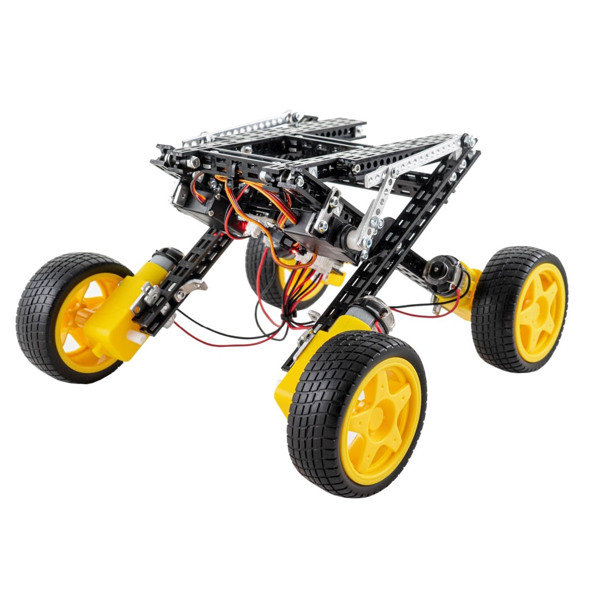

# Robotics Kits

Totem Robotics Kits contains all required parts to assemble model. Each one includes required tools, pre-cut parts and building instructions. Robots are based on programmable Totem [RoboBoard](../roboboard/index.md), enabling remote [:octicons-device-mobile-16: Smartphone control](../remote-control/app/index.md) and [:simple-arduino: Arduino programming](../setup/index.md).  

{target=_blank}
{target=_blank}

## RoboBoard X3

Models based on [RoboBoard X3](../roboboard-x3/index.md). Designed for light and compact robots.

### Mini Trooper

{width=300px loading=lazy}
[{style="width:300px;padding-bottom:54px" loading=lazy}](../assets/images/products/kits/mini-trooper-parts-list.png)

Battle bot robot with active flipper. Also able to self-right when tipped over.  
Available in [:material-cart: Pack of 2 kit](https://totemmaker.net/product/mini-trooper-2-pack/){target=_blank} to play together and try to challenge each other.

[:fontawesome-solid-file-pdf: Assembly instructions](https://totemmaker.net/wp-content/uploads/2019/08/mini-troopers-2.2-print.pdf){target=_blank}  
[:material-cart: _TRK-MT1Y_](https://totemmaker.net/product/mini-trooper/){target=_blank} |
[:material-printer-3d: STL files](https://github.com/totemmaker/TotemSTL/tree/master/Mini%20Trooper){target=_blank} |
[:material-cube-outline: STEP files](https://github.com/totemmaker/TotemSTEP/tree/master/Totem%20Other%20parts/Mini%20Trooper){target=_blank} |
[:simple-arduino: Arduino examples](https://github.com/totemmaker/arduino-examples/tree/master/kit_MiniTrooper){target=_blank}

### Mini Shooter

{width=300px loading=lazy}
[{style="width:300px;padding-bottom:54px" loading=lazy}](../assets/images/products/kits/mini-shooter-parts-list.png)

Rubber bands shooter with adjustable height. Ingenious mechanism allows to store up to 5 rubber bands and shoot on demand.

[:fontawesome-solid-file-pdf: Assembly instructions](https://totemmaker.net/wp-content/uploads/2021/11/mini-shooter-assembly-guide.pdf){target=_blank}  
[:material-cart: _TMK-MRSR_](https://totemmaker.net/product/mini-shooter/){target=_blank} |
[:material-printer-3d: STL files](https://github.com/totemmaker/TotemSTL/tree/master/Mini%20Shooter){target=_blank} |
[:material-cube-outline: STEP files](https://github.com/totemmaker/TotemSTEP/tree/master/Totem%20Other%20parts/Mini%20Shooter){target=_blank}

### Lady Bug

{width=300px loading=lazy}
[{style="width:300px;padding-bottom:54px" loading=lazy}](../assets/images/products/kits/ladybug-parts-list.png)

6-legged walking robot kit. Cute and playful looking.

[:fontawesome-solid-file-pdf: Assembly instructions](https://totemmaker.net/wp-content/uploads/2021/01/ladybug-instructions.pdf){target=_blank}  
[:material-cart: _TKR-LDB_](https://totemmaker.net/product/ladybug-smartphone-app-controlled-6-legged-robot-kit/){target=_blank} |
[:material-printer-3d: STL files](https://github.com/totemmaker/TotemSTL/tree/master/Ladybug){target=_blank} |
[:material-cube-outline: STEP files](https://github.com/totemmaker/TotemSTEP/tree/master/Totem%20Other%20parts/Ladybug){target=_blank}

## RoboBoard X4

Models based on [RoboBoard X4](../roboboard-x4/index.md). Designed for larger robots with more power.

### Black Spider

{width=300px loading=lazy}
[{style="width:300px;padding-bottom:38px" loading=lazy}](../assets/images/products/kits/black-spider-parts-list.png)

Walking robot based on principle invented by Joe Klann in 1994. Kit includes 1150+ parts and you will learn many cool mechanical principles that may be used in many other projects.

[:fontawesome-solid-file-pdf: Assembly instructions](https://totemmaker.net/wp-content/uploads/2021/01/black-spider-assembly-instructions-v.2-compressed.pdf){target=_blank}  
[:material-cart: _TKR-LSP_](https://totemmaker.net/product/black-spider-programmable-and-smartphone-controllable-robot/){target=_blank} |
[:material-printer-3d: STL files](https://github.com/totemmaker/TotemSTL/tree/master/Totem%20Spider){target=_blank}

### RoboCar Chassis

{width=300px loading=lazy}
[{style="width:300px;padding-bottom:29px" loading=lazy}](../assets/images/products/kits/robocar-chassis-parts-list.png)

Car platform with Ackermann steering for building your projects on top of it. Can be used with additional [Truck Top](#truck-top), [Retro Top](#retro-top) for improved looks and building experience.  
RoboCar wheel base length: 197 mm, wheel tracking length: 175 mm.

[:fontawesome-solid-file-pdf: Assembly instructions](https://totemmaker.net/wp-content/uploads/2021/12/totem-truck-4.1-instructions-v.1.4-v3.pdf){target=_blank}  
[:material-cart: _TMK-RCC_](https://totemmaker.net/product/robocar-chassis/){target=_blank} |
[:material-printer-3d: STL files](https://github.com/totemmaker/TotemSTL/tree/master/RoboCar%20chassis){target=_blank} |
[:simple-arduino: Arduino examples](https://github.com/totemmaker/arduino-examples/tree/master/kit_RoboCar){target=_blank}

#### Truck Top

{width=300px loading=lazy}
[{style="width:300px;padding-bottom:43px" loading=lazy}](../assets/images/products/kits/truck-top-parts-list.png)

Truck top complements the [RoboCar chassis](#robocar-chassis) and makes it a proper constructor as the top is made out of 36 different parts, in total of more than 450 parts. The top is designed to not only give a more playful look to the RoboCar platform, but it also gives option to attach the extra parts.

[:fontawesome-solid-file-pdf: Assembly instructions](https://totemmaker.net/wp-content/uploads/2021/12/totem-truck-4.0-pickup-top-instructions-part-1-10-v.2.5-web-version.pdf){target=_blank}  
[:material-cart: _TMK-RCTT_](https://totemmaker.net/product/truck-top-for-robocar/){target=_blank} |
[:material-printer-3d: STL files](https://github.com/totemmaker/TotemSTL/tree/master/Truck%20Top){target=_blank}

#### Retro Top

{width=300px loading=lazy}
[{style="width:300px;padding-bottom:29px" loading=lazy}](../assets/images/products/kits/retro-top-parts-list.png)

Retro top complements the [RoboCar chassis](#robocar-chassis) and gives an old-school, safari truck look. Inspired by the iconic Willys Jeep from the 1950's and contains 496 parts of assembly.

[:fontawesome-solid-file-pdf: Assembly instructions](https://totemmaker.net/wp-content/uploads/2023/03/totem-retro-top-for-robocar-instructions-v.1.5-compressed.pdf){target=_blank}  
[:material-cart: _TMK-RCWJ_](https://totemmaker.net/product/retro-top-for-robocar/){target=_blank}

## Robotics Kit

{width=300px loading=lazy}

Engineering robotics kit to build 7 different models. Contains 1000+ building pieces, including motors and electronics.
7 mini models of real life robotic machines. Built models can be controlled using [:octicons-device-mobile-16: Smartphone app](../remote-control/app/index.md) or programmed with [:simple-arduino: Arduino IDE](../setup/index.md).  
Based on [RoboBoard X3](../roboboard-x3/index.md).

[:material-cart: _TKR-RK1_](https://totemmaker.net/product/robotics-kit-7-real-life-engineering-examples/){target=_blank} | [:fontawesome-solid-file-pdf: Handbook](https://totemmaker.net/wp-content/uploads/2021/04/robotics-kit-booklet-final.pdf){target=_blank}  

### Gripper Bot

{width=300px loading=lazy}
[{style="width:300px;padding-bottom:52px" loading=lazy}](../assets/images/products/kits/gripper-bot-parts-list.png)

Car with a controllable gripper arm. Can pick up small object and drive them around.

[:fontawesome-solid-file-pdf: Assembly instructions](https://totemmaker.net/wp-content/uploads/2021/03/gripper-bot-instructions-print-1.pdf){target=_blank}  
[:material-cart: _TMK-DMNNG_](https://totemmaker.net/product/gripper-bot-smartphone-app-controlled-car/){target=_blank} |
[:material-printer-3d: STL files](https://github.com/totemmaker/TotemSTL/tree/master/Gripper%20Bot){target=_blank} |
[:material-cube-outline: STEP files](https://github.com/totemmaker/TotemSTEP/tree/master/Totem%20Other%20parts/Gripper%20Bot){target=_blank} |
[:simple-arduino: Arduino examples](https://github.com/totemmaker/arduino-examples/tree/master/kit_GripperBot){target=_blank}

### 4WD Car

{width=300px loading=lazy}
[{style="width:300px;padding-bottom:39px" loading=lazy}](../assets/images/products/kits/4wd-parts-list.png)

Car with 4 independent wheel motors. Basic platform, that can be used to build upon.

[:fontawesome-solid-file-pdf: Assembly instructions](https://totemmaker.net/wp-content/uploads/2019/08/4wd-v3.pdf){target=_blank}  
[:material-cart: _TMK-4WDU_](https://totemmaker.net/product/diy-smartphone-controlled-4wd-motor-wheel-kit/){target=_blank}

### Hockey Bot

{width=300px loading=lazy}
[{style="width:300px;padding-bottom:48px" loading=lazy}](../assets/images/products/kits/hockey-bot-parts-list.png)

Car with a retractable swinging arm that accumulates and later releases the energy by swinging the arm to kick the ball.

[:fontawesome-solid-file-pdf: Assembly instructions](https://totemmaker.net/wp-content/uploads/2021/03/totem-hockey-bot-instructions-v.1.5.pdf){target=_blank}  
[:material-cart: _TKR-RK1_](https://totemmaker.net/product/robotics-kit-7-real-life-engineering-examples/){target=_blank} (Robotics Kit)

### Lucas Robot

{width=300px loading=lazy}
[{style="width:300px;padding-bottom:56px" loading=lazy}](../assets/images/products/kits/lucas-robot-parts-list.png)

Caster Wheel based robot, inspired by sci-fi movies. A true little robot, turns 360, grips and lifts.

[:fontawesome-solid-file-pdf: Assembly instructions](https://totemmaker.net/wp-content/uploads/2021/03/lucas-the-robot-instructions-v.1.5.pdf){target=_blank}  
[:material-cart: _TKR-RK1_](https://totemmaker.net/product/robotics-kit-7-real-life-engineering-examples/){target=_blank} (Robotics Kit)

### Lift Mobile

{width=300px loading=lazy}
[{style="width:300px;padding-bottom:56px" loading=lazy}](../assets/images/products/kits/lift-mobile-parts-list.png)

Uses scissor mechanism in a robotic lifting platform. Has 4 independent motors to move around.

[:fontawesome-solid-file-pdf: Assembly instructions](https://totemmaker.net/wp-content/uploads/2021/03/lift-mobile-instructions-v.1.4.pdf){target=_blank}  
[:material-cart: _TKR-RK1_](https://totemmaker.net/product/robotics-kit-7-real-life-engineering-examples/){target=_blank} (Robotics Kit)

### Larva Mobile

{width=300px loading=lazy}
[{style="width:300px;padding-bottom:59px" loading=lazy}](../assets/images/products/kits/larva-mobile-parts-list.png)

Inspired by the nature, inch-worm. This robot uses scissors principle shape shifting for movement.

[:fontawesome-solid-file-pdf: Assembly instructions](https://totemmaker.net/wp-content/uploads/2021/03/larvamobile-instructions-v.1.6.pdf){target=_blank}  
[:material-cart: _TKR-RK1_](https://totemmaker.net/product/robotics-kit-7-real-life-engineering-examples/){target=_blank} (Robotics Kit)

### Mini Spider

{width=300px loading=lazy}
[{style="width:300px;padding-bottom:59px" loading=lazy}](../assets/images/products/kits/mini-spider-parts-list.png)

Small 6-legged walking robot. Can go forward, backwards and change directions.

[:fontawesome-solid-file-pdf: Assembly instructions](https://totemmaker.net/wp-content/uploads/2021/03/mini-spider-instructions.pdf){target=_blank}  
[:material-cart: _TKR-RK1_](https://totemmaker.net/product/robotics-kit-7-real-life-engineering-examples/){target=_blank} (Robotics Kit) | [:material-printer-3d: STL motor hub](https://github.com/totemmaker/TotemSTL/blob/master/Misc/TM201%20N20%20motor%20hub%20(Mini%20spider%2C%20Scorpion)%20(3D).STL){target=_blank}

## Young engineer kits

Walking robots based on single motor and battery.  
Entry level robotic kits (does not include RoboBoard!).

### T-Rex

{width=300px loading=lazy}
[{style="width:300px;padding-bottom:34px" loading=lazy}](../assets/images/products/kits/t-rex-parts-list.png)

Walking robot resembling a T-Rex dinosaur.

[:fontawesome-solid-file-pdf: Assembly instructions](https://totemmaker.net/wp-content/uploads/2019/09/t-rex-instructions-print.pdf){target=_blank}  
[:material-cart: _TKR-TRX_](https://totemmaker.net/product/young-engineer-kit-t-rex/){target=_blank} | [:material-printer-3d: STL motor hub](https://github.com/totemmaker/TotemSTL/blob/master/Misc/TM227%20Yellow%20DC%20motor%20hub%20(T-rex)%20(3D).STL){target=_blank}  
[:material-printer-3d: STL motor hub (T-Rex)](https://github.com/totemmaker/TotemSTL/blob/master/Misc/TM227%20Yellow%20DC%20motor%20hub%20(T-rex)%20(3D).STL){target=_blank}  
[:material-cube-outline: STEP motor hub (T-Rex)](https://github.com/totemmaker/TotemSTEP/blob/master/Totem%20Other%20parts/Yellow%20DC%20motor%20hub%20(T-Rex)%20(3D).STEP){target=_blank}  

### Giraffe

{width=300px loading=lazy}
[{style="width:300px;padding-bottom:9px" loading=lazy}](../assets/images/products/kits/giraffe-parts-list.png)

Walking robot resembling a giraffe.

[:fontawesome-solid-file-pdf: Assembly instructions](https://totemmaker.net/wp-content/uploads/2019/09/giraffe-instructions-print.pdf){target=_blank}  
[:material-cart: _TKR-GRF_](https://totemmaker.net/product/young-engineer-kit-giraffe/){target=_blank} | [:material-printer-3d: STL motor hub](https://github.com/totemmaker/TotemSTL/blob/master/Misc/TM230%20Yellow%20DC%20motor%20hub%20(Dog%2C%20giraffe)%20(3D).STL){target=_blank}  
[:material-printer-3d: STL motor hub (Dog, Girrafe)](https://github.com/totemmaker/TotemSTL/blob/master/Misc/TM230%20Yellow%20DC%20motor%20hub%20(Dog%2C%20giraffe)%20(3D).STL){target=_blank}  
[:material-cube-outline: STEP motor hub (Dog, Giraffe)](https://github.com/totemmaker/TotemSTEP/blob/master/Totem%20Other%20parts/Yellow%20DC%20motor%20hub%20(Dog%20and%20Giraffe)%20(3D).STEP){target=_blank}  

### Dog

{width=300px loading=lazy}
[{style="width:300px;padding-bottom:29px" loading=lazy}](../assets/images/products/kits/dog-parts-list.png)

Walking robot resembling a dog.

[:fontawesome-solid-file-pdf: Assembly instructions](https://totemmaker.net/wp-content/uploads/2019/09/dog-instructions-print.pdf){target=_blank}  
[:material-cart: _TKR-DG_](https://totemmaker.net/product/young-engineer-kit-dog/){target=_blank} | [:material-printer-3d: STL motor hub](https://github.com/totemmaker/TotemSTL/blob/master/Misc/TM230%20Yellow%20DC%20motor%20hub%20(Dog%2C%20giraffe)%20(3D).STL){target=_blank}  
[:material-printer-3d: STL motor hub (Dog, Girrafe)](https://github.com/totemmaker/TotemSTL/blob/master/Misc/TM230%20Yellow%20DC%20motor%20hub%20(Dog%2C%20giraffe)%20(3D).STL){target=_blank}  
[:material-cube-outline: STEP motor hub (Dog, Giraffe)](https://github.com/totemmaker/TotemSTEP/blob/master/Totem%20Other%20parts/Yellow%20DC%20motor%20hub%20(Dog%20and%20Giraffe)%20(3D).STEP){target=_blank}  
