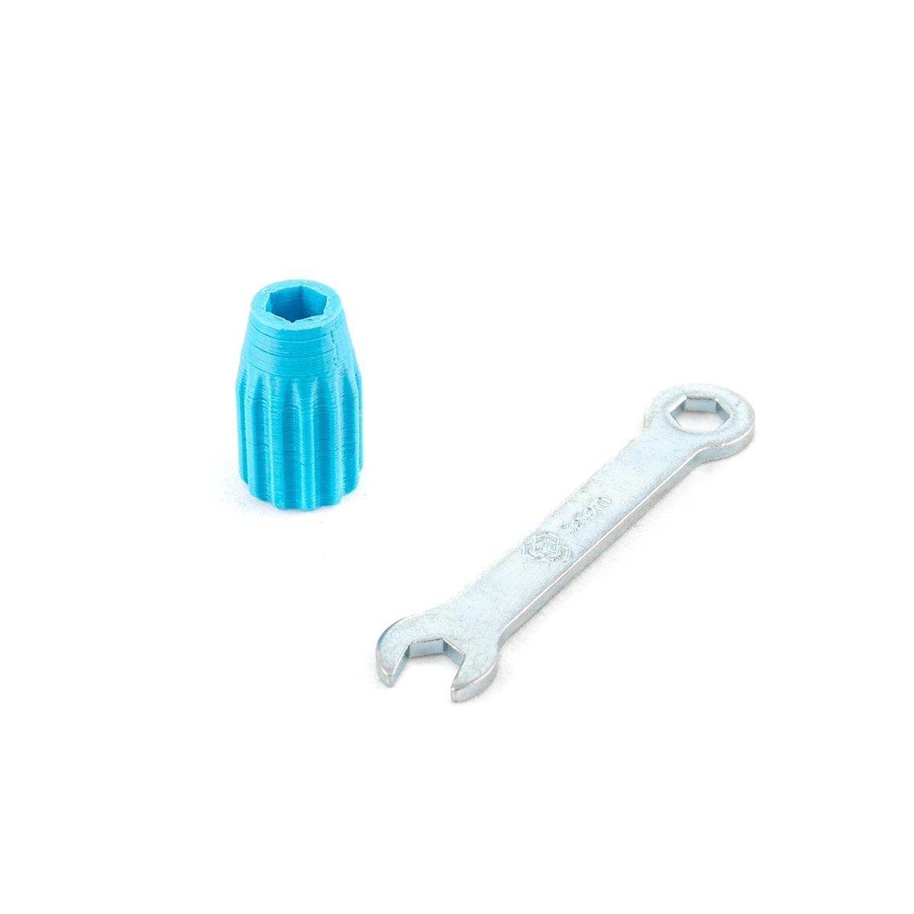
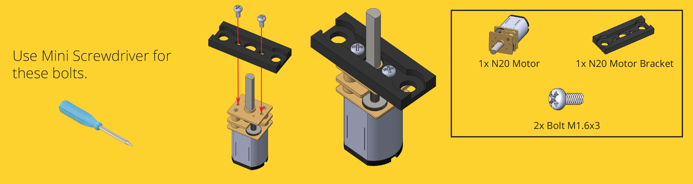
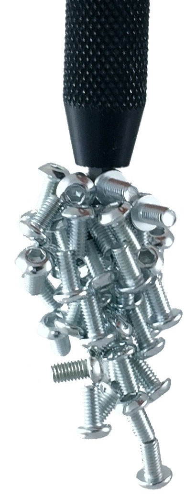
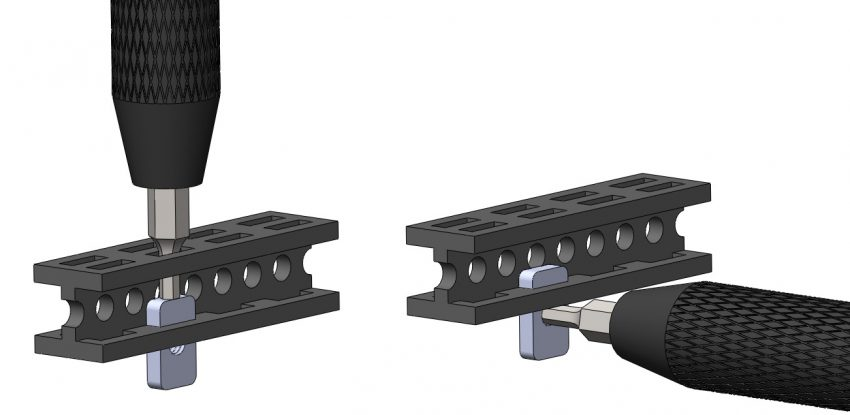

# Screwdrivers

<iframe style="width: 100%;aspect-ratio: 16/9;" loading="lazy" src="https://www.youtube.com/embed/af-9xxHuD6U" title="" frameborder="0" allow="accelerometer; autoplay; clipboard-write; encrypted-media; gyroscope; picture-in-picture; web-share" referrerpolicy="strict-origin-when-cross-origin" allowfullscreen></iframe>

-   **Magnetic** [:material-cart: _TM-TT-02_](https://totemmaker.net/product/magnetic-screwdriver-hex-key-2mm/){target=_blank style="float:right"}  
      
    Magnetic screwdriver for [Totem bolts](fasteners.md)

-   **Phillips 2mm** [:material-cart: _TM154_](https://totemmaker.net/product/philips-screwdriver/){target=_blank style="float:right"}  
      
    For screwing in [N20 motors](motors.md#dc-6v-n20) to bracket.

-   **Wrench** [:material-cart: _TM360_](https://totemmaker.net/product/socket-wrench-and-totem-wrench/){target=_blank style="float:right"}  
      
    For tightening [nuts and lock nuts](fasteners.md#regular-nuts).

## Totem Wrench

Small Totem Wrench for tightening [nuts](fasteners.md#regular-nuts) and [standoffs](fasteners.md#nylon-standoff) or holding them in place. Additional plastic Socket Wrench is handy in certain situations.

[{loading=lazy}](../assets/images/products/tools/totem-wrench-info.png)

## Phillips screwdriver

Use Phillips screwdriver for attaching [Bracket 2 V.3](motors.md#dc-6v-n20) to N20 motor.

[{loading=lazy}](../assets/images/products/motors/n20-motor-bracket-assembly.png)

## Totem Screwdriver

Totem designed hex screwdriver with **ergonomic design** and **strong magnetic grip**. Makes handling easy by **firmly holding bolt** in place.

<figure markdown="span">
  {width="100px" loading=lazy}
  <figcaption>Totem Screwdriver magnet</figcaption>
</figure>

**Push nuts into beam** with help of the screwdriver. Use your fingers to enter the first rectangular slot. Then push the nut in, using the back of the screwdriver. The nut almost always tilts, so use your finger to straighten it. Then push it all the way in.

<figure markdown="span">
  {loading=lazy}
  <figcaption>How to push in the nuts</figcaption>
</figure>

When you get the hang of it, try pushing the nut holding the screwdriver in an angular position, like it is shown in the picture. That way you avoid tilting problem.

<figure markdown="span">
  {loading=lazy}
  <figcaption>Single push</figcaption>
</figure>

What about getting them out?
Use the tip (hex bit) of the screwdriver to push the nut out 2/3 of the slot. Then pull the nut by the thread.

<figure markdown="span">
  {loading=lazy}
  <figcaption>How to push the nuts out</figcaption>
</figure>