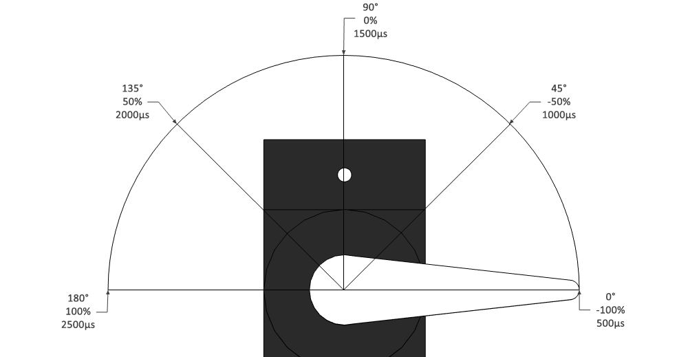

# Custom functions

!!! info
    At the moment available in Android only. For iOS use [Override commands](../../roboboard/api/totemapp.md#override-commands) as alternative.

Normally the buttons inside Totem app are mapped to motor outputs directly. If we press a button - motor starts to spin, and stops on release. This is quite limited functionality. RoboBoard allows to have custom actions programmed and we will make an example of waving a servo motor arm. For full feature list read [Totem App section](../../roboboard/api/totemapp.md).

## Adding control button

<video width="30%" controls autoplay loop>
  <source src="/assets/videos/totemfunctionbuttonapp.m4v" type="video/mp4">
Your browser does not support the video tag.
</video>

_Note: This is example from older app version and interface looks slightly different._  
For more about buttons editing read [Setting up Totem robot controls](https://totemmaker.net/blog/setting-up-totem-robot-controls/){target=_blank}.

1. Power on RoboBoard.
1. Connect with Totem App.
1. Create a new model.
1. Add button.
1. Go to button edit.
1. Select RoboBoard and add `functionA`.
1. Click ++"Next"++ → ++"Done"++ → ++"Save"++.
1. Select ++"Play"++ mode.

Now, when we click this button, a value `100` will be sent to command `functionA`. On release - `-100`. These values can be changed by adjusting the slider. RoboBoard can intercept this command and read its value. By doing so, we can program a certain tasks to execute. There are 4 auxiliary commands in total: `functionA`, `functionB`, `functionC`, `functionD` and each one can be used.

## Moving servo motor

We will write a code to wave servo arm. The motor itself is connected to servo channel A. Arm can move 180 degrees, and parameter values corresponds in range from `-100` to `100`. Look at the image below to see how it's related:



So, we will try to move arm in this sequence: -45°, 0°, 45°, 0°. The code required to do so:

```arduino linenums="1"
// Define a function, containing instructions to wave a servo arm
void moveServo() {
  Servo.A.spinPos(-50); // Set servo port A position to -50% (45° angle)
  delay(300);
  Servo.A.spinPos(0); // Set servo port A position to 0% (90° angle)
  delay(300);
  Servo.A.spinPos(50); // Set servo port A position to 50% (135° angle)
  delay(300);
  Servo.A.spinPos(0);
  delay(300); // Delay code execution for 300 milliseconds
}
// Arduino function first called on program start
void setup() {

}
// Arduino function repeating constantly
void loop() {
  moveServo(); // Execute servo instructions
  delay(2000); // Wait 2 seconds
}
```

Inside function `#!arduino loop()` we are calling `#!arduino moveServo()` to execute sequence and it is repeated every 2 seconds. The result should look like this:


## Detecting App button press

Now let's move this servo arm only when in-App button is pressed. As bonus, we will indicate button press with on-board LED. To detect command events we need to add a little bit more code:

```arduino linenums="1"
// Define a function, containing instructions to wave a servo arm
void moveServo() {
  Servo.A.spinPos(-50); // Set servo port A position to -50% (45° angle)
  delay(300);
  Servo.A.spinPos(0); // Set servo port A position to 0% (90° angle)
  delay(300);
  Servo.A.spinPos(50); // Set servo port A position to 50% (135° angle)
  delay(300);
  Servo.A.spinPos(0);
  delay(300); // Delay code execution for 300 milliseconds
}
// Create variable to hold the state of button press
bool appButtonPressed = false;
// Receive events sent from Totem App
void appEvent(int evt, int value) {
  // Check if received event is "functionA"
  if (evt == TotemApp.evtFunctionA) {
    // Check if sent value is "100" (button is pressed in)
    if (value == 100) {
      LED.on(); // Turn RoboBoard LED on
      appButtonPressed = true; // Set variable `appButtonPressed` state to `true`
    }
    // Value was not "100". Execute this block of code
    else {
      // Turn LED off and reset "appButtonPressed" variable
      LED.off();
      appButtonPressed = false;
    }
  }
}
// Arduino function first called on program start
void setup() {
  TotemApp.addEvent(appEvent); // Register TotemApp event function
}
// Arduino function repeating constantly
void loop() {
  // Wait till "appButtonPressed" is "true" and then execute "moveServo()"
  if (appButtonPressed) {
    moveServo();
  }
}
```

After uploading this code to RoboBoard - connect with Totem App and try pressing created button. Servo arm should move and LED light up.  
For more information about Totem App events read [`TotemApp`](../../roboboard/api/totemapp.md#receive-events) section.
