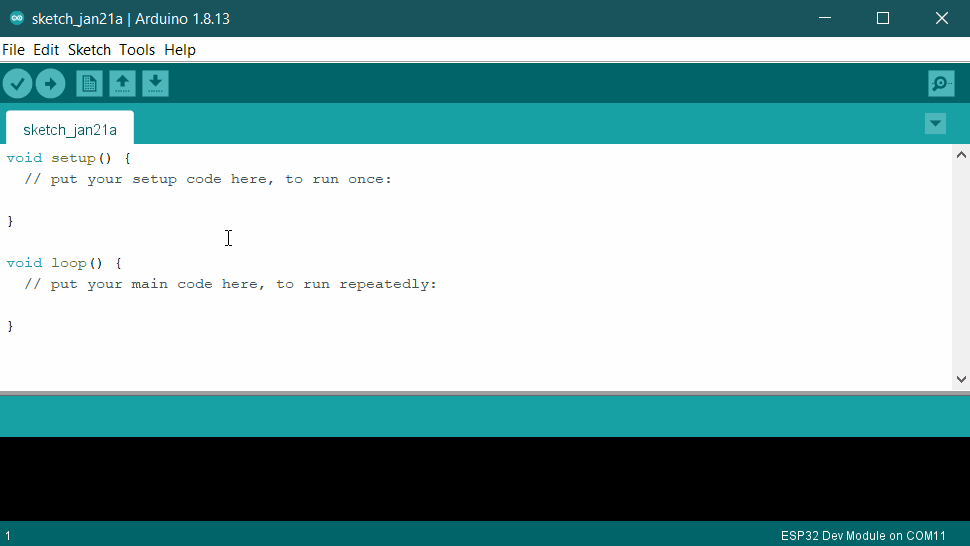

# Arduino remote interface

!!! info
    This tutorial is for wirelessly connecting to RoboBoard from external ESP32 board. Similar as Totem App does.  
    For RoboBoard programming with Arduino read [RoboBoard section](../../roboboard/index.md).

```arduino
void setup() {
  Totem.BLE.begin(); // Initialize Bluetooth Low Energy interface
}
```

Wireless interface to control X3 and X4 boards over BLE connection. It contains features like: finding Totem robots, connecting, sending and receiving commands. Totem boards are able to represent themselves as "robot", providing: name, color, model (type of robot). This information is available before BLE connection is established. Same information and functionality is available when using [Totem App](../app/index.md).  

## Install library

This functionality requires [Totem Arduino Library](https://github.com/totemmaker/TotemArduino). Install it before using in a project.  

1. Select `Sketch` → `Include Library` → `Manage libraries..`  
1. In search field type in `totem`.  
1. Click ++"Install"++ and wait for it to complete.  
1. Close Library Manager window.  


## Code examples

??? example "Connect and control motor (click to expand)"
    ```arduino
    // Include Totem Library
    #include <Totem.h>
    // Declare communication with any connected Totem module
    TotemModule module(0);
    // Arduino initialization function
    void setup() {
      Serial.begin(115200);
      Totem.BLE.begin(); // Start Bluetooth Low Energy interface
      Serial.println("Searching for Totem robot...");
      // Wait until connected to first found Totem robot
      TotemRobot robot = Totem.BLE.findRobot();
      // At this point further execution of setup() is blocked
      // until library connects to the robot
      Serial.print("Connected to: ");
      Serial.println(robot.getName());
      // Continue to loop()
    }
    // Arduino infinite loop function
    void loop() {
      // Control motor of connected robot
      module.write("motorA", 100); // Set motor A channel to 100% power
      delay(1000); // Wait 1 second
      module.write("motorA", 0); // Stop motor on A channel
      delay(1000); // Wait 1 second
    }
    ```

## Additional classes

- [ModuleData](ModuleData.md) - Object containing data received from module.  
- [MotorDriver](MotorDriver.md) - Object helping to control DC and Servo motors.  
- [TotemModule](TotemModule.md) - Instance of Totem module, allowing to send and receive commands.  
- [TotemRobot](TotemRobot.md) - Instance of connection to a wireless or remote access capable Totem module.  

## Functions

#### Totem.BLE.begin() { #begin data-toc-label='begin()' }

: Initialize Bluetooth Low Energy interface. Must be executed inside [setup()](https://www.arduino.cc/reference/en/language/structure/sketch/setup/){target=_blank} function before using library.  

```arduino
void setup() {
  Totem.BLE.begin(); // Initialize Bluetooth Low Energy interface
}
```

#### ([`TotemRobot`](TotemRobot.md)) Totem.BLE.findRobot() { #findRobot data-toc-label='findRobot()' }

#### ([`TotemRobot`](TotemRobot.md)) Totem.BLE.findRobot(`RobotReceiver`) { #findRobot-result data-toc-label='findRobot(result)' }

: Start searching for available Totem robots over Bluetooth Low Energy. This function will block until connection to any robot is established.  
On successful connection find process will be stopped. Additionally it can be stopped with call to [stopFind()](#stopFind).  
`RobotReceiver` is a user defined function to get all discovered robots.  
Format: `#!arduino void onFoundRobot(TotemRobot robot)`. Robot information can be accessed trough [`TotemRobot`](TotemRobot.md) parameter.
By calling `robot .`[`connect()`](TotemRobot.md#connect) user can decide which robot to select.  
_Parameter:_  
`()` - automatically connect to first discovered Totem robot.  
`RobotReceiver` - discovered robot connect function `onFoundRobot`.  
_Returns:_  [`TotemRobot`](TotemRobot.md).

```arduino
void onFoundRobot(TotemRobot robot) {
  // Totem robot discovered
  robot.connect();
}
void function() {
  Totem.BLE.findRobot(); // Automatically connect to first discovered Totem robot
  Totem.BLE.findRobot(onFoundRobot); // List result in onFoundRobot before connecting to Totem robot
}
```

#### Totem.BLE.findRobotNoBlock() { #findRobotNoBlock data-toc-label='findRobotNoBlock()' }

#### Totem.BLE.findRobotNoBlock(`RobotReceiver`)  { #findRobotNoBlock-result data-toc-label='findRobotNoBlock(result)' }

: Start searching for available Totem robots over Bluetooth Low Energy. This function does not block main program execution. All connection process will be done in background.  
After connection is established, this process will be stopped. Additionally it can be stopped with call to [stopFind()](#stopFind).  
`RobotReceiver` is a user defined function to get all discovered robots.  
Format: `#!arduino void onFoundRobot(TotemRobot robot)`. Robot information can be accessed trough [`TotemRobot`](TotemRobot.md) parameter.
By calling `robot .`[`connect()`](TotemRobot.md#connect) user can decide which robot to select.  
_Parameter:_  
`()` - automatically connect to first discovered Totem robot.  
`RobotReceiver` - discovered robot connect function `onFoundRobot`.  

```arduino
void onFoundRobot(TotemRobot robot) {
  // Totem robot discovered
  robot.connect();
}
void function() {
  Totem.BLE.findRobotNoBlock(); // Automatically connect to first discovered Totem robot
  Totem.BLE.findRobotNoBlock(onFoundRobot); // List result in onFoundRobot before connecting to Totem robot
}
```

#### (`bool`) Totem.BLE.isFinding() { #isFinding data-toc-label='isFinding()' }

: Check if [findRobot()](#findRobot) or [findRobotNoBlock()](#findRobotNoBlock) was called and process is active.  
_Returns:_ discovery process is active [`true`:`false`].

```arduino
void function() {
  if (Totem.BLE.isFinding())
    Serial.println("Robot find is active");
  else
    Serial.println("Robot find is inactive);
}
```

#### Totem.BLE.stopFind() { #stopFind data-toc-label='stopFind()' }

: Stop searching for robot and unblock [findRobot()](#findRobot). Only used when required to stop this process manually. After connection, the search process is stopped automatically and calling this function is not required.  

```arduino
void function() {
  Totem.BLE.stopFind(); // Stop searching for robot over Bluetooth Low Energy
}
```

#### Totem.BLE.attachOnConnect(`RobotReceiver`) { #attachOnConnect-result data-toc-label='attachOnConnect(result)' }

: Register function that will be called when [findRobot()](#findRobot) process connects to a robot. This is handy when using non-blocking find process and we don't know when connection is established.  
`RobotReceiver` is a user defined function to connected robot event.  
Format: `#!arduino void onConnectedRobot(TotemRobot robot)`. Robot information can be accessed trough [`TotemRobot`](TotemRobot.md) parameter.  
_Parameter:_
`RobotReceiver` - connected robot event function `onConnectedRobot`.  

```arduino
void onConnectedRobot(TotemRobot robot) {
  // findRobotNoBlock connected to robot in background and ended find procedure
  Serial.print("Connected robot: ");
  Serial.println(robot.getName());
}
void function() {
  Totem.BLE.findRobotNoBlock(); // Automatically connect to first discovered Totem robot
                                // Code execution continues with active find procedure
}
```

#### (`int`) Totem.BLE.getConnectedCount() { #getConnectedCount data-toc-label='getConnectedCount()' }

: Count of currently connected Totem robots.  
_Returns:_ connected robots count [`0`:`20`]

```arduino
void function() {
  Serial.print("Currently connected robots count: ");
  Serial.println(Totem.BLE.getConnectedCount());
}
```

#### ([`TotemRobot`](TotemRobot.md)) Totem.BLE.getConnectedLast() { #getConnectedLast data-toc-label='getConnectedLast()' }

: Get last connected robot.  
If no connection was made before, this function returns a dummy object that isn't connected.  
_Returns:_  [`TotemRobot`](TotemRobot.md).

```arduino
void function() {
  TotemRobot robot = Totem.BLE.getConnectedLast();
  Serial.print("Is last connected robot still connected: ");
  Serial.println(robot.isConnected() ? "Yes" : "No");
}
```

#### ([`TotemRobot[]`](TotemRobot.md)) Totem.BLE.getConnectedList() { #getConnectedList data-toc-label='getConnectedList()' }

: Get list of connected robots.  
_Returns:_ [`TotemRobot[]`](TotemRobot.md).

```arduino
void function() {
  for (auto robot : getConnectedList()) {
    Serial.print("Connected robot: ");
    Serial.println(robot.getName());
  }
}
```
