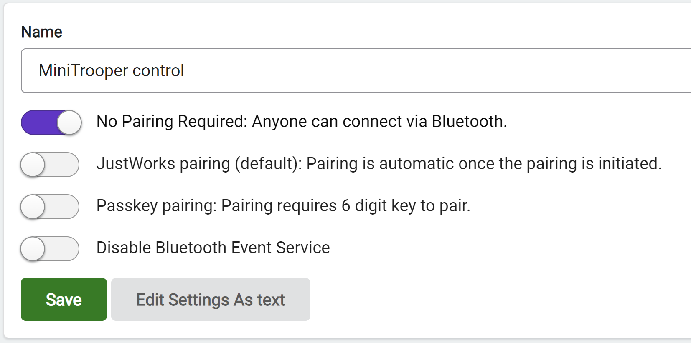

# BBC micro:bit


Guide for Totem RoboBoard remote control using BBC micro:bit and MakeCode.

**How it works?**

- micro:bit `bluetooth uart service` starts BLE server.
- RoboBoard connects `bluetooth uart service` (advertised by micro:bit).
- Block `bluetooth uart write number` is used to constantly send A and B button state.
- RoboBoard intercepts pressed buttons in `#!arduino void microbitOnWrite(String data)`.
- Function `#!arduino void microbitWriteString(String data)` can be used to send data back to micro:bit (intercepted by `bluetooth on data received` block).

## Setup micro:bit

Download provided MakeCode project to micro:bit.

<div style="position:relative;height:0;padding-bottom:70%;overflow:hidden;"><iframe style="position:absolute;top:0;left:0;width:100%;height:100%;" src="https://makecode.microbit.org/#pub:S15748-91078-35041-57649" frameborder="0" sandbox="allow-popups allow-forms allow-scripts allow-same-origin"></iframe></div>

**Note**: make sure "No Pairing Required" is selected inside :fontawesome-solid-gear: `Settings` -> :octicons-sliders-24: `Project Settings`.

{width=70%}

## Setup RoboBoard

Upload example code to RoboBoard: [Microbit_Controller.ino](https://github.com/totemmaker/arduino-examples/blob/master/kit_MiniTrooper/Microbit_Controller/Microbit_Controller.ino){target=_blank}  
**Note**: Example is made for [Totem MiniTrooper](../products/robotics-kits.md#mini-trooper) but can be adapted to other robots.

```arduino title="Functions"
// Should be called inside setup()
// Establishes connection to micro:bit
void microbitBegin();

// Send number or string to micro:bit
// Will be received inside [bluetooh on data received] block
void microbitWriteString(String data);

// Receive data sent from micro:bit [bluetooth uart write] block
// [number] [string] [line] blocks are available, but they all send
// string (text) of certain length.
void microbitOnWrite(String data) {
  int length = data.length(); // Get number of characters transmitted
  int number = data.toInt();  // Convert received message to number
  Serial.println(string);     // Print received message to Serial Monitor
}
```

Check Arduino [String reference](https://docs.arduino.cc/language-reference/en/variables/data-types/stringObject/){target=_blank} for more functionality.

## Connection

1. Power on BBC micro:bit
1. Power on RoboBoard (MiniTrooper)
1. Press A + B buttons to control robot.
1. Press RoboBoard X3 BOOT button to send it's state to micro:bit display.

**Note**: micro:bit tends to restart when plugged to PC. Power on MiniTrooper after micro:bit.
