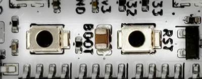
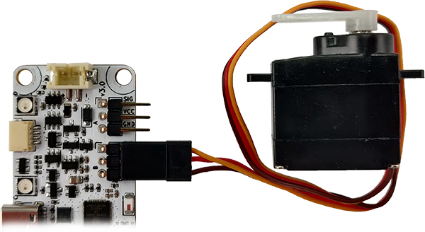
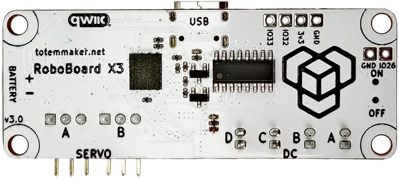

# RoboBoard X3

A programmable controller, designed for small to medium sized robots with strict space requirements or low power applications.  
This tiny package features components that are essential for robotic applications: battery input, charging, motor drivers, modules and sensors extensions, orientation sensor, powerful processor, wireless connectivity, software support and more.  
To start programming [install Arduino](../setup/index.md) and check [RoboBoard API](../roboboard/api/index.md) section.

## Feature list

<blockquote style="text-align:right;margin-top:-20px;margin-right:14px;border-left:0;line-height:0;font-size:9pt;">Click orange box to jump to explanation</blockquote>

{ align=right style="height:600px" usemap="#board_features" }

<map name="board_features">
  <area shape="rect" coords="82,0,169,58" title="Battery input" href="#battery-input">
  <area shape="rect" coords="162,68,276,143" title="Servo motor port A" href="#servo-motor-ports">
  <area shape="rect" coords="162,151,276,226" title="Servo motor port B" href="#servo-motor-ports">
  <area shape="rect" coords="139,249,203,313" title="ESP32" href="#esp32">
  <area shape="rect" coords="178,330,240,547" title="DC motor ports" href="#dc-motor-ports">
  <area shape="rect" coords="117,333,165,522" title="Motor drivers" href="#motor-drivers">
  <area shape="rect" coords="19,26,63,104" title="RGB LED D" href="#rgb-lights">
  <area shape="rect" coords="19,214,63,256" title="RGB LED C" href="#rgb-lights">
  <area shape="rect" coords="19,349,63,391" title="RGB LED B" href="#rgb-lights">
  <area shape="rect" coords="19,489,63,531" title="RGB LED A" href="#rgb-lights">
  <area shape="rect" coords="12,111,63,173" title="Qwiic port" href="#qwiic-port">
  <area shape="rect" coords="0,260,75,346" title="USB-C port" href="#usb-c-input">
  <area shape="rect" coords="24,395,72,480" title="GPIO pins" href="#gpio-pins">
  <area shape="rect" coords="61,536,95,582" title="GPIO pins" href="#gpio-pins">
  <area shape="rect" coords="74,391,107,442" title="Reset button" href="#buttons">
  <area shape="rect" coords="74,458,107,523" title="Boot button" href="#buttons">
  <area shape="rect" coords="99,537,173,599" title="On/Off switch" href="#onoff-switch">
</map>

**Processor:**  
• ESP32 chip (ESP32-D0WD)  
• Dual-core 240Mhz (Xtensa LX6)  
• 320KB SRAM , 8MB flash  
• Bluetooth (classic and BLE)  
• Wi-Fi  

**Board features:**  
• 2 Servo motor ports (3.7 Volt)  
• 4 DC motor ports (3.7 Volt)  
• 3 GPIO pins + (2 servo SIG)  
• 2 LDO regulators  
• 4 RGB lights  
• IMU sensor (accel and gyro)  
• Reset, Boot buttons  
• On/Off switch  
• Battery input, integrated charger  
• Qwiic (STEMMA QT compatible)  
• USB-C _(power, data, charging)_  

**Power:**  
• USB-C: 5V  
• Battery: LiPo, 3.7V, 250 mAh  

**Dimensions:**  
• [65 x 25 x 8 mm (L x W x H)](#schematics)  

## :fontawesome-solid-microchip: ESP32

RoboBoard is powered by ESP32 - a capable SoC with rich peripherals and wireless connectivity. This combinations makes it perfect for robotic applications where motor driving and wireless control is required.

For a past few years ESP32 is one of the most popular microcontroller among maker community. While its hardware capabilities are no doubt it also comes with vast software support, maintained officially by Espressif company and a help from community. This led to well established [Arduino support for ESP32](https://github.com/espressif/arduino-esp32){target="_blank"}, powering many projects all over the world. Our [Arduino support for RoboBoard](https://github.com/totemmaker/TotemArduinoBoards){target="_blank"} is based on official core for maintaining compatibility with libraries and examples with addition to well integrated RoboBoard features.

For more ESP32 specific details read [ESP32 section](../roboboard/api/esp32.md/).

## Board features

### :simple-sparkfun: Qwiic port


**Pinout:**  
• Black = **GND**  
• Red = <span style="color:red">3.3V</span>  
• Blue = <span style="color:blue">SDA</span>  
• Yellow = <span style="color:#FFC300">SCL</span>  

A connection system to attach third-party I2C modules. This allows to choose from many available sensors and other interface devices. Small and sturdy connector eliminates need for soldering and enables plug-and-play style modular systems. Each module comes with it's own Arduino library (supplied by manufacturer).

This port is compatible with SparkFun Qwiic and Adafruit STEMMA QT modules.  
For using Qwiic modules with RoboBoard read [GPIO / Qwiic section](../roboboard/api/gpio-qwiic.md#qwiic-port).  

_3.3V is provided by second LDO converter and can be switched on/off with [`Board.setEnable3V3()`](../roboboard/api/board.md#setEnable3V3). Read [Power circuit](#power-circuit) section for more details._  

### :material-rotate-orbit: IMU sensor


6DOF IMU sensor (3-axis accelerometer and 3-axis gyroscope) allows to detect board movement and orientation. Very useful in many robotic projects. Chip is connected to I2C line (same as Qwiic connector) and can be accessed trough API functions [`IMU`](../roboboard/api/imu.md).

```arduino
#include <Wire.h>
void setup() {
  Serial.begin(115200);
  Wire.begin();
}
void loop() {
  auto result = IMU.read(); // Read sensor measurements
  Serial.println(result.getX_G()); // Read unit from "result"
  delay(100); // Wait 100ms for next read
}
```

### :traffic_light: RGB lights


A light bar containing 4 RGB lights for using with multiple purposes.
_Note: some features must be enabled in [Board settings](../roboboard/api/board.md#setStatusRGB)._

**Connection indication** (Totem App):

- **Running animation** - no connection
- **Steady color** - connected to robot

**Appearance customization** (Totem App):

- **Change color** - click ++"Settings"++ (when connected) and drag slider to configure robot RGB and connection color.

**Battery State Of Charge:**

Upon power on - battery charge level will be displayed by playing "loading" animation with specific color:  

- :octicons-dot-fill-24:{ style="color: lawngreen" } - battery is full
- :octicons-dot-fill-24:{ style="color: gold" } - battery is medium
- :octicons-dot-fill-24:{ style="color: red" } - battery is low
- :material-white-balance-sunny:{ style="color: red" } - battery is discharged (blink 3 times)

In case battery is too low - board will power itself off, indicating by :material-white-balance-sunny:{ style="color: red" } LED.

**Programming:**

Use [`RGB`](../roboboard/api/rgb.md) API to change colors to your likeness or application.

```c++
RGB.color(Color::Green); // Color name
RGB.color(0, 0, 125); // Color RGB value
```

### :material-gesture-tap-button: Buttons



Contains two types of buttons:  

- `RST` - Performs hardware processor reset. Used to restart currently running program.  
- `BOOT` - Enter ESP32 serial bootloader (hold down and press `RESET`). Or user button.  
> This is performed automatically during code upload, so pressing button is not required.  
  Can be used as programmable user button with [`Button`](../roboboard/api/button.md) API. Wired to GPIO pin `0`.  
  By default this button is inactive and left for user implementation.  

```c++ title="Example: turn LED off on button press"
void setup() { }

void loop() {
  if (Button.wasPressed()) {
    RGB.off();
  }
  else if (Button.wasReleased()) {
    RGB.on();
  }
}
```

### :material-electric-switch: GPIO pins


Pins for external IO and communications (UART, I2C, SPI, ...):

- **IO26** - GPIO pin `26`
- **IO32** - GPIO pin `32`
- **IO33** - GPIO pin `33`
- **GND** - Ground pin
- **3V3** - 3.3 Volt output pin.
- **SIGA** - Servo pin can be used as GPIO pin `25`
- **SIGB** - Servo pin can be used as GPIO pin `14`

_**3V3** is powered by second LDO converter and can be switched on/off with [`Board.setEnable3V3()`](../roboboard/api/board.md#setEnable3V3). Read [Power circuit](#power-circuit) section for more details._  
_SIGA and SIGB pins contain 120 Ohm resistor._  

```arduino
void setup() {
  pinMode(IO32, OUTPUT); // Configure pin to output
  pinMode(IO33, INPUT); // Configure pin to input
  digitalWrite(IO32, HIGH); // Set pin state
  int state = digitalRead(IO33); // Read pin state
}
void loop() { }
```

For space constrains and low profile - pin headers are not soldered to pads. This makes a bit harder to connect various electronics to GPIO pins. Recommended ways to do so:

- Solder wires directly to pads
- Solder pin header and plug wires with jumper cables
- Pass wire trough hole and tighten it to the edge of the board

For more information read [GPIO / Qwiic section](../roboboard/api/gpio-qwiic.md).

**Arduino pin mapping table:**

Names and pin numbers that may be used in Arduino environment to program RoboBoard X3.  
_SPI can be mapped to any pin. Only default definitions are specified._

| Name | Number | [SPI](https://www.arduino.cc/reference/en/language/functions/communication/spi/){target="_blank"} | [Analog](https://docs.espressif.com/projects/arduino-esp32/en/latest/api/adc.html){target="_blank"} | [DAC](https://docs.espressif.com/projects/arduino-esp32/en/latest/api/dac.html){target="_blank"} | [Touch](https://docs.espressif.com/projects/arduino-esp32/en/latest/api/touch.html){target="_blank"} |
| - | - | - | - | - | - |
| **IO26** | 26 | MOSI | A0 | DAC2 | T0 |
| **IO32** | 32 | MISO | A1 | - | T1 |
| **IO33** | 33 | SCK | A2 | - | - |
| _SIGA_ | 25 | - | - | DAC1 | - |
| _SIGB_ | 14 | SS | - | - | T2 |

## Motor drivers

Integrated drivers allows to connect motors directly to the board, eliminating the need for an external modules. All control functions are built into RoboBoard API [`DC`](../roboboard/api/dc.md), [`Servo`](../roboboard/api/servo.md) and includes some more advanced features:

- `DC` - control % of power, electric braking, audible tone generation, acceleration and deceleration control, power limiter, decay mode, configurable frequency, spin direction invert.
- `Servo` - position, angle, pulse control, timed sequences, configurable pulse range, configurable period, trimming, spin direction invert.

### :material-format-rotate-90: Servo motor ports

{width="70%"}

**Servo wire colors:**   
• Orange = <span style="color:orange">Signal</span> (PWM)  
• Red = <span style="color:red">VCC</span>  
• Brown = <span style="color:brown">GND</span>  

Individual (SIG, VCC, GND pin) headers for connecting standard (3 wire) servo motors and other electronics. Ports are marked with letters A, B for controlling up to 2 motors.  
VCC pin is connected to the battery and voltage is dependent on State Of Charge (2.8-4.2V).

By default, API is configured for **180 degree** servo motors, with pulse duration between **500μs-2500μs** and **period of 20ms (50Hz)**. These parameters can be [customized](../roboboard/api/servo.md#configuration).

For more information read [`Servo`](../roboboard/api/servo.md) section.

### :material-engine-outline: DC motor ports


Individual JST-PH headers for connecting brushed DC motors. Ports are marked with letters A, B, C, D for controlling up to 4 motors.
Power comes straight from the battery (trough H-bridge motor driver) and peak voltage is dependent on State Of Charge (2.8-4.2V).  
Motor power is controller using 20kHz PWM signal. This parameter can be [customized](../roboboard/api/dc.md#configure).

For more information read [`DC`](../roboboard/api/dc.md) section.

_Note: motor wire colors (red, black) does not indicate polarity (+, -). Swapping wires only changes spin direction._

## Power circuit

Board contains built-in electronics for power distribution and control. It takes care of battery charging and provides power for all the components:

- `BATT` (2 Amps) - used by `DC motor ports`, `Servo motor VCC`. Vary between 2.8-5 V
- `3.3V main` (500 mAmps) - used by `ESP32`, `IMU`
- `3.3V periph` (500 mAmps) - used by `RGB lights`, `GPIO 3V3`, `Qwiic port`

Board contains separate 3.3V LDO voltage regulators for ESP32 and other peripherals. `3.3V periph` one can be turned on/off with function [`Board.setEnable3V3()`](../roboboard/api/board.md#setEnable3V3) for power saving applications, conveniently disabling all attached Qwiic modules.

### :material-power-plug: Charging

Battery charging circuit activates once USB-C cable is plugged in and continues until battery is full. It even works if [power switch](#onoff-switch) is set to OFF position. Any USB power source (computer, phone charger) can be used, providing 0.5A or more current.  

If charging mode [`Board.setChargingMode(true)`](../roboboard/api/board.md#setChargingMode) is enabled - processor enters shutdown mode once USB-C cable is plugged in. It also displays charging process by RGB indication:


1. Plug-in USB-C cable ①
1. :octicons-dot-fill-24:{ style="color: gold" } will blink while charging ②
1. :octicons-dot-fill-24:{ style="color: lawngreen" } will light up when finished ③

Charging process is stopped once battery is full and does not overcharge it.

### :material-power-plug: USB-C input

RoboBoard X3 USB-C 5V input is used for multiple purposes once it's plugged in:

- Board will power on, ignoring position of [power switch](#onoff-switch).
- Battery connected to [Battery input](#battery-input) will start charging (until it's full).
- PC discovers a serial port device, used for Serial Monitor and Arduino firmware upload.
- [`BATT` power rail](#power-circuit) overrides battery and becomes 5V (sourced from USB).  
  DC motor and Servo VCC pins will output 5V.

Keep in mind that PC USB port provides only 0.5 Amps and it's not enough for powering motors. For powering board from USB-C only (without a battery) - use devices that provides more than 0.5A current (e.g. power banks and phone chargers).

### :material-battery-high: Battery input

{width="70%"}

Battery input for 1S rechargeable Lithium battery to supply power to the board. When connected it powers [`BATT` rail](#power-circuit). Voltage may vary between 2.8-4.2 V, depending on battery State Of Charge.

Input: 2.8-4.2 V **rechargeable** Lithium battery, JST-PH connector.  
Higher capacity cells (like 18650) can be also used.  

:warning: Important notices:

- **Does not feature low voltage protection!**  
Battery must contain its own under voltage protection circuit.  
- **Does not feature reverse voltage protection!**  
Make sure polarity ( + - ) is correct before plugging battery in.  
- **Do not connect other power sources (or different battery types)!**  
May be damaged when USB-C cable is plugged in and charging starts.  

**Recommended to use only supplied battery:** [1S LiPo, 3.7V, 250mAh battery](https://totemmaker.net/product/3-7v-battery/){target="_blank"}  
*Or use USB-C port for power if battery is not required.*

### :material-power: On/Off switch


Used to turn X3 board power on/off without a need to disconnect the battery. Push switch ① up or down to toggle power.  
Upon power on - battery charge level ([if enabled](../roboboard/api/board.md#setStatusRGB)) will be displayed. "Loading" animation will be played with specific color ②:  

- :octicons-dot-fill-24:{ style="color: lawngreen" } - battery is full
- :octicons-dot-fill-24:{ style="color: gold" } - battery is medium
- :octicons-dot-fill-24:{ style="color: red" } - battery is low
- :material-white-balance-sunny:{ style="color: red" } - battery is discharged (blink 3 times)

Setting to OFF position shuts down all power rails (`BATT`, `3.3V main`, `3.3V periph`).  
This switch is overridden (always ON) if USB-C cable is plugged in. 

## Schematics

**Mechanical drawing (dimensions):**

[](../assets/images/RoboBoard_X3_v3.0-mechanical-drawing.png){target="_blank"}

**Schematic:**

[RoboBoard_X3_v3.0-schematic.pdf](../assets/images/RoboBoard_X3_v3.0-schematic.pdf){target="_blank"}

## Revision changelog

We are always looking to improve our products. Any physical change (components, layout) is indicated with board revision number (printed on top). Each revision may have different features or functionality.

### v3.0

{width="350px"}
{width="350px"}

Manufactured from 2023-Q2. Replaces discontinued [Mini Control Board](../mini-control-board/revisions.md).

- Renamed to "RoboBoard X3"
- Added Arduino programming
- Added IMU sensor
- Added Qwiic port
- Added Reset and Boot buttons
- Added GPIO pins
- Added battery current measurement
- Backwards compatible with Mini Control Board

For previous revisions check [Mini Control Board revisions](../mini-control-board/revisions.md).
