# RoboBoard X4

A more powerful programmable controller, designed for medium to larger sized robots with high voltage motors and additional expansion options.  
This compact package features components that are essential for robotic applications: battery input, charging, motor drivers, modules and sensors extensions, orientation sensor, powerful processor, wireless connectivity, software support and more.  
To start programming [install Arduino](../setup/index.md) and check [RoboBoard API](../roboboard/api/index.md) section.

Find at: [:shopping_cart: Totemmaker.net store → RoboBoard X4](https://totemmaker.net/product/roboboard-x4-power-adapter-battery/){target="_blank"}  

## Details

<blockquote style="text-align:right;margin-top:-20px;margin-right:14px;border-left:0;line-height:0;font-size:9pt;">Click orange box to jump to explanation</blockquote>

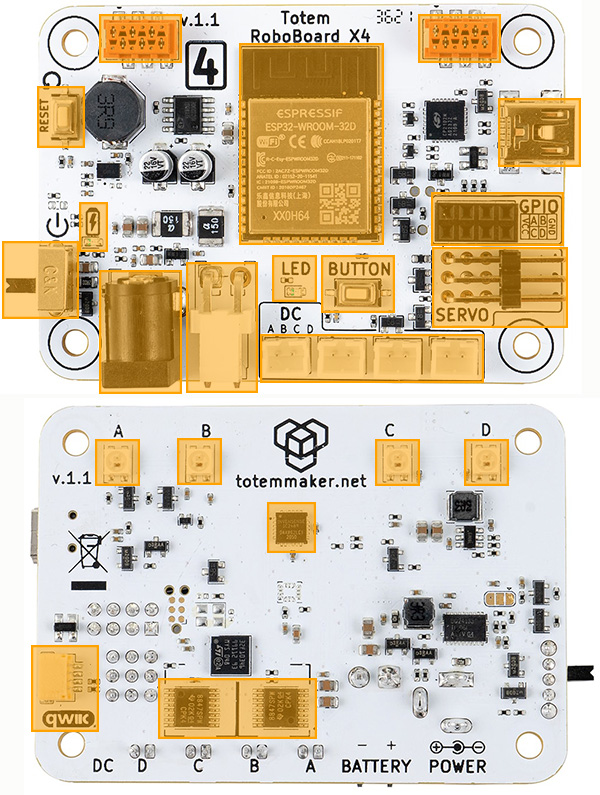{ align=right style="width:400px" usemap="#board_features" }

<map name="board_features">
  <area shape="rect" coords="67,10,121,40" title="TBUS connector (CAN)" href="#totembus">
  <area shape="rect" coords="278,10,333,40" title="TBUS connector (CAN)" href="#totembus">
  <area shape="rect" coords="25,57,56,97" title="Reset button" href="#buttons">
  <area shape="rect" coords="160,29,256,163" title="Processor" href="#esp32">
  <area shape="rect" coords="332,66,386,111" title="USB" href="#usb-port">
  <area shape="rect" coords="287,131,375,163" title="GPIO" href="#gpio-pins">
  <area shape="rect" coords="287,164,378,217" title="Servo motor" href="#servo-motor-ports">
  <area shape="rect" coords="173,223,322,255" title="DC motor" href="#dc-motor-ports">
  <area shape="rect" coords="182,170,211,200" title="Status LED" href="#status-led">
  <area shape="rect" coords="214,170,262,208" title="Programmable button" href="#buttons">
  <area shape="rect" coords="124,175,171,261" title="Battery input" href="#battery-input">
  <area shape="rect" coords="66,180,121,261" title="Power input" href="#power-input">
  <area shape="rect" coords="53,135,71,167" title="Charging LED" href="#charging">
  <area shape="rect" coords="0,160,51,211" title="On/Off switch" href="#onoff-switch">
  <area shape="rect" coords="63,292,147,322" title="RGB LED" href="#rgb-lights">
  <area shape="rect" coords="250,292,338,393" title="RGB LED" href="#rgb-lights">
  <area shape="rect" coords="176,333,213,373" title="IMU sensor" href="#imu-sensor">
  <area shape="rect" coords="21,430,65,488" title="Qwiic port" href="#qwiic-port">
  <area shape="rect" coords="106,452,211,492" title="DC motor drivers" href="#motor-drivers">
</map>

**Processor:**  
• ESP32 module (ESP32-D0WD)  
• Dual-core 240Mhz (Xtensa LX6)  
• 320KB SRAM, 8MB flash  
• Bluetooth (classic and BLE)  
• Wi-Fi  

**Board features:**  
• 3 Servo motor ports (5 Volt)  
• 4 DC motor ports (11.1 Volt)  
• 4 GPIO pins  
• 4 RGB lights  
• IMU sensor (accel and gyro)  
• Reset, User buttons  
• Status LED  
• On/Off switch  
• DC power input  
• Battery input, integrated charger  
• Qwiic port (STEMMA QT compatible)  
• TBUS (CAN bus)  
• USB _(data only, no power)_  

**Power:**  
• DC adapter: 30W, 15V, 2A  
• Battery: 3S Li-Ion 11.1V 2200mAh  

**Dimensions:**  
• [70 x 50 x 14 mm (L x W x H)](#schematics)  

## :fontawesome-solid-microchip: ESP32

RoboBoard is powered by ESP32 - a capable SoC with rich peripherals and wireless connectivity. This combinations makes it perfect for robotic applications where motor driving and wireless control is required.

For a past few years ESP32 is one of the most popular microcontroller among maker community. While its hardware capabilities are no doubt it also comes with vast software support, maintained officially by Espressif company and a help from community. This led to well established [Arduino support for ESP32](https://github.com/espressif/arduino-esp32){target="_blank"}, powering many projects all over the world. Our [Arduino support for RoboBoard](https://github.com/totemmaker/TotemArduinoBoards){target="_blank"} is based on official core for maintaining compatibility with libraries and examples with addition to well integrated RoboBoard features.

For more ESP32 specific details read [ESP32 section](../roboboard/api/esp32.md/).

## Board features

### :simple-sparkfun: Qwiic port

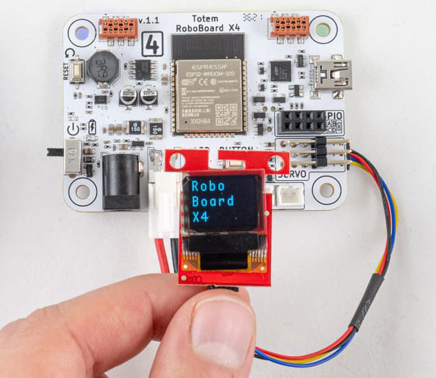{width=300px}

**Wires:**  
• Black = **GND**  
• Red = <span style="color:red">3.3V</span>  
• Blue = <span style="color:blue">SDA</span>  
• Yellow = <span style="color:#FFC300">SCL</span>  

**Cable:** standard "Qwiic cable". Can be found in local electronics store.  
**Connector:** SM04B-SRSS-TB 4-pin  

A connection system to attach third-party I2C modules. This allows to choose from many available sensors and other interface devices. Small and sturdy connector eliminates need for soldering and enables plug-and-play style modular systems. Each module comes with its own Arduino library (supplied by manufacturer).

This port is compatible with SparkFun Qwiic and Adafruit STEMMA QT modules.  
For using Qwiic modules with RoboBoard read [GPIO / Qwiic section](../roboboard/api/gpio-qwiic.md#qwiic-port).  

### :material-ev-plug-type2: TBUS (CAN bus) { #totembus }

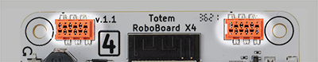{width=50%}

**Wires:** CAN-H, CAN-L, GND, [`5V`](#power-circuit) (out), [`BATT`](#power-circuit) (~12V), N.C. ([pinout](../roboboard/api/can.md))   
**Cable:** [:shopping_cart: Totemmaker.net store → TOTEMBUS CABLE](https://totemmaker.net/product/totembus-cable-connects-modules-to-totembus-network/){target=_blank}  
**Connector:** Micro-MaTch 6-pin  

TBUS (TotemBUS) connectors with dual purpose: Plug into CAN bus networks or attach [X4 extension modules](../modules/index.md). Both are interconnected and used for daisy-chaining.

For more information read [CAN](../roboboard/api/can.md) section.

```arduino
void setup() {
  // Start CAN peripheral at 500kbps
  CAN.begin(500);
}
void loop() {
  // Wait for CAN packet receive. 300ms timeout
  if (CAN.readPacketWait(300)) {
    // Get received packet
    auto packet = CAN.getPacket();
    // packet.id, packet.data, packet.len, packet.ext, packet.rtr
  }
  // Send CAN packets
  uint8_t data[8] = {1,2,3,4,5,6,7,8};
  CAN.writePacketExt(0x112233, data, 8); // Extended
  CAN.writePacketStd(0x1AB, data, 8);    // Standard
}

```

### :material-usb-port: USB port

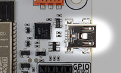

USB connector is present for Serial Monitor and Arduino firmware upload.  
Board <u>cannot</u> be powered from USB alone! It requires either [Power](#power-input) or [Battery](#battery-input) input.  

**Serial converter:** CP2102N  
**Connector:** miniUSB  

### :material-rotate-orbit: IMU sensor

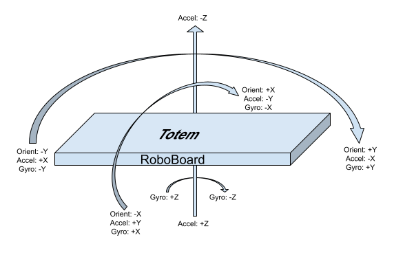

6DOF IMU sensor (3-axis accelerometer and 3-axis gyroscope) allows to detect board movement and orientation. Very useful in many robotic projects. Chip is connected to I2C line (same as Qwiic connector) and can be accessed trough API functions [`IMU`](../roboboard/api/imu.md).

```arduino
#include <Wire.h>
void setup() {
  Serial.begin(115200);
  Wire.begin();
}
void loop() {
  auto result = IMU.read(); // Read sensor measurements
  Serial.println(result.getX_G()); // Read unit from "result"
  delay(100); // Wait 100ms for next read
}
```

### :material-led-on: Status LED

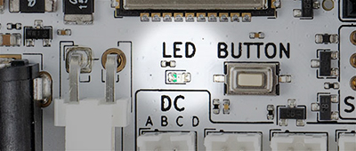{width=40%}

Red LED next to user button for indicating board state:  
:material-white-balance-sunny:{ style="color: red" } Short rapid blink - board started.  
:material-white-balance-sunny:{ style="color: red" } Blink 3 times - battery is depleted.  
:material-white-balance-sunny:{ style="color: red" } Blinking constantly - driver initialization error (consult [forum](https://forum.totemmaker.net/c/questions/10){target="_blank"}).  
:octicons-dot-fill-24:{ style="color: red" } On - running.  

This LED can be controlled from Arduino code:

```c++
LED.on(); // Turn LED On
LED.off(); // Turn LED Off
```
For more details read [`LED`](../roboboard/api/led.md) section.

### :traffic_light: RGB lights

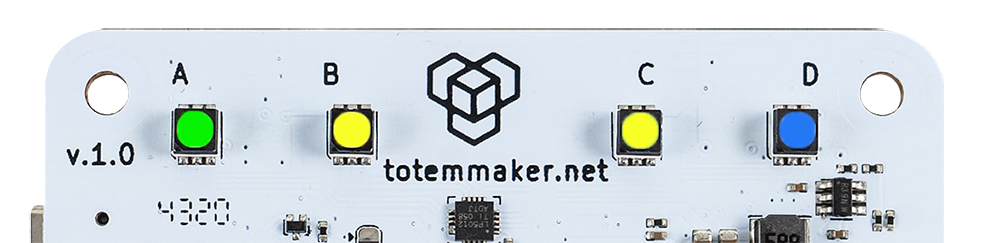{width=60%}

Back side of the board contains 4 RGB lights for using with multiple purposes.  
_Note: some features must be enabled in [Board settings](../roboboard/api/board.md#setStatusRGB)._

**Connection indication** (Totem App):

- **Running animation** - no connection
- **Steady color** - connected to robot

**Appearance customization** (Totem App):

- **Change color** - click ++"Settings"++ (when connected) and drag slider to configure robot RGB and connection color.

**Battery State Of Charge:**

Upon power on - battery charge level will be displayed by playing "loading" animation with specific color:  

- :octicons-dot-fill-24:{ style="color: lawngreen" } - battery is full
- :octicons-dot-fill-24:{ style="color: gold" } - battery is medium
- :octicons-dot-fill-24:{ style="color: red" } - battery is low
- :material-white-balance-sunny:{ style="color: red" } - battery is discharged (blink 3 times)

In case battery is too low - board will power itself off, indicating by :material-white-balance-sunny:{ style="color: red" } [Status LED](#status-led).

**Programming:**

Use [`RGB`](../roboboard/api/rgb.md) API to change colors to your likeness or application.

```c++
RGB.color(Color::Green); // Color name
RGB.color(0, 0, 125); // RGB value
```

### :material-gesture-tap-button: Buttons

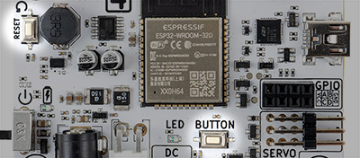{width=50%}

Contains two types of buttons:  

- `RESET` - Performs hardware processor reset. Used to restart currently running program.  
- `BUTTON` - Programmable user button. Can be used with [`Button`](../roboboard/api/button.md) API.  

By default `BUTTON` is inactive and left for user implementation.  

```c++ title="Example: Turn LED off on button press"
void setup() { }

void loop() {
  if (Button.wasPressed()) {
    LED.off();
  }
  else if (Button.wasReleased()) {
    LED.on();
  }
}
```

### :material-electric-switch: GPIO pins

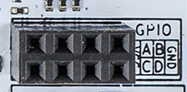

Pins for external IO and communications (UART, I2C, SPI, ...):

- **VCC** - 3.3 Volt output pin.
- **GPIOA** - GPIO pin `14`
- **GPIOB** - GPIO pin `23`
- **GPIOC** - GPIO pin `25`
- **GPIOD** - GPIO pin `26`
- **GND** - Ground pin

**Connector:** 0.1″ (2.54 mm) female pin header  

```arduino
void setup() {
  pinMode(GPIOA, OUTPUT); // Configure pin to output
  pinMode(GPIOB, INPUT); // Configure pin to input
  digitalWrite(GPIOA, HIGH); // Set pin state
  int state = digitalRead(GPIOB); // Read pin state
}
void loop() { }
```

For more information read [GPIO / Qwiic section](../roboboard/api/gpio-qwiic.md#arduino-pin-names).

## Motor drivers

Integrated drivers allows to connect motors directly to the board, eliminating the need for an external modules. All control functions are built into RoboBoard API [`DC`](../roboboard/api/dc.md), [`Servo`](../roboboard/api/servo.md) and includes some more advanced features:

- `DC` - control % of power, electric braking, audible tone generation, acceleration and deceleration control, power limiter, configurable frequency, spin direction invert.
- `Servo` - position, angle, pulse control, speed control, timed sequences, configurable pulse range, configurable period, trimming, spin direction invert.

### :material-format-rotate-90: Servo motor ports

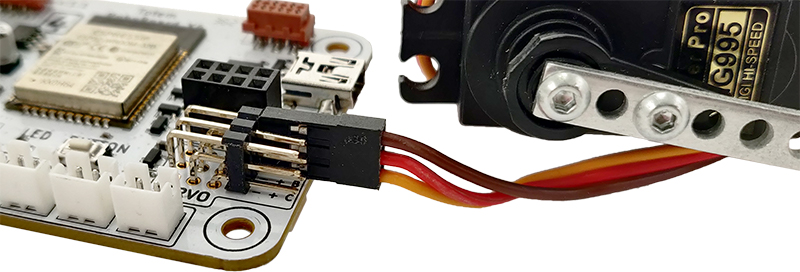{width=60%}

**Servo wire colors:**   
• (-) Brown = <span style="color:brown">GND</span>  
• (+) Red = <span style="color:red">VCC</span>  
• (S) Orange = <span style="color:orange">Signal</span> (PWM)  

**Connector:** 0.1″ (2.54 mm) male pin header  

Individual channels for connecting standard (3 wire) servo motors and other electronics. Pins are marked with letters A, B, C for controlling up to 3 motors with regulated 5 Volt output.

By default, API is configured for **180 degree** servo motors, with pulse duration between **500μs-2500μs** and **period of 20ms (50Hz)**. These parameters can be [customized](../roboboard/api/servo.md#configuration).

For more information read [`Servo`](../roboboard/api/servo.md) section.

### :material-engine-outline: DC motor ports

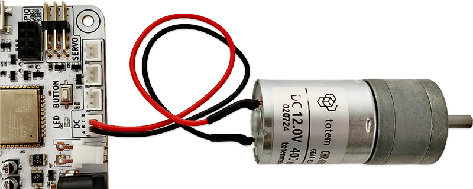{width=60%}

**Connector:** JST-PH 2-pin  

Connectors for 12V brushed DC motors. Ports are marked with letters A, B, C, D for controlling up to 4 motors.
Power comes straight from the battery (trough H-bridge motor driver) and peak voltage is dependent on State Of Charge (8.4-12.6V).  
Motor power is controller using 50Hz PWM signal. This parameter can be [customized](../roboboard/api/dc.md#configure).

Board contains dual DRV8847S driver chips for total control of 4 individual motor ports.  
Each driver is rated for 2 Amp peak and grouped into AB and CD ports. In case motor consumes too much current - a thermal protection will trigger when IC heats up over 150°C. After cool down - it turns back on. This may cause motor power off once a second.  

Motors shipped with Totem kits consumes 1.5A at stall and does not trigger thermal protection (only case if motor is stalled for a long time).  

For more information read [`DC`](../roboboard/api/dc.md) section.

_Note: motor wire colors (red, black) does not indicate polarity (+, -). Swapping wires only changes spin direction._

## Power circuit

Board contains built-in electronics for power distribution and control. It takes care of battery charging and provides power for all the components:

- `BATT` (6 Amps) - used by `DC motor ports`, `CAN bus BATT pin`. Vary between 8.4-15 V
- `5V` (6 Amps) - used by `Servo motor +`, `RGB lights`, `CAN bus 5V pin`
- `3.3V` (2 Amps) - used by `ESP32`, `co-processor`, `IMU`, `GPIO VCC`, `Qwiic port`

_USB port is for data only and does not power `5V` or `3.3V` rails. Either battery or DC adapter is required to program and power up the board._

### :material-power-plug-battery-outline: Charging

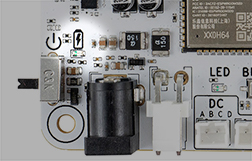

Battery charging circuit activates once both battery and DC adapter are plugged in and continues until battery is full. Charging process indicated by status LED :material-battery-charging: (near to DC jack):

:material-white-balance-sunny:{ style="color: red" } Blinking - battery not detected :material-battery-off-outline:.  
:octicons-dot-fill-24:{ style="color: red" } On - battery is charging :material-battery-charging-low:.  
:octicons-dot-24: Off - battery is charged :material-battery-high:.  
_Note: Sometimes LED can start blinking when battery is charged._  

### :material-power-plug-outline: Power input

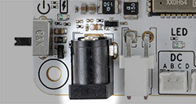

DC barrel-jack input to supply power for board and and battery charging. When connected it starts charging the battery (if not full) and powers `BATT` rail (overrides battery). In this case `BATT` will become 15V and DC motors will spin a little faster. If board starts to consume more than 2 Amps, missing energy will be topped off from the battery.

**Input voltage**: 15 Volts  
**Connector:** barrel jack 5.5/2.0mm center-positive  

**Recommended to use only supplied DC power adapter:** [30W, 15V, 2A power adapter](https://totemmaker.net/product/15v-2a-power-adapter/){target="_blank"}  

### :material-car-battery: Battery input

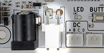

Battery input for board power and charging. When connected it powers [`BATT` rail](#power-circuit). Voltage may vary between 8.4-12.6 V, depending on battery State Of Charge.

**Input voltage**: 8.4-12.6 Volts  
**Battery type:** 3S 11.1V Lithium (**rechargeable**). Under-voltage protection required  
**Connector:** JST-VH 2-pin  

:warning: Important notices:

- **Does not feature low voltage protection!**  
Battery must contain its own under voltage protection circuit.  
- **Does not feature reverse voltage protection!**  
Make sure polarity ( + - ) is correct before plugging battery in.  
- **Do not connect other power sources (or different battery types)!**  
May be damaged when DC power jack is plugged in and charging starts.  

**Recommended to use only supplied battery:** [3S Li-Ion, 11.1V, 2200mAh battery](https://totemmaker.net/product/battery-for-roboboard-x4/){target="_blank"}  

### :material-power: On/Off switch

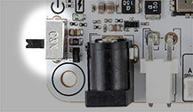

Used to turn X4 board power on/off without disconnecting DC jack or battery.  
Upon power on - battery charge level ([if enabled](../roboboard/api/board.md#setStatusRGB)) will be displayed. "Loading" animation will be played with specific color:  

- :octicons-dot-fill-24:{ style="color: lawngreen" } - battery is full
- :octicons-dot-fill-24:{ style="color: gold" } - battery is medium
- :octicons-dot-fill-24:{ style="color: red" } - battery is low
- :material-white-balance-sunny:{ style="color: red" } - battery is discharged (blink 3 times)

Setting to OFF position shuts down all power rails (`BATT`, `5V`, `3.3V`).  
Battery can still be charged while switch is set to OFF position.

## Driver update

RoboBoard contains additional processor for low-level control operations (motor, board, RGB). It works by communicating over UART and relieving some strain from ESP32. This processor is called "driver" and runs its own firmware.

**Checking installed version:**  
Run this Arduino code and view Serial Monitor. Latest version is mentioned in [Releases](https://github.com/totemmaker/TotemArduinoBoards/releases){target=_blank}.  
```arduino
void setup() {
    Serial.begin(115200); // Setting baud to 115200
}
void loop() {
  Serial.print("Driver: ");
  Serial.println(Board.getDriverVersionStr());
  delay(500);
}
```

**Update to latest firmware:**

1. Use [Arduino IDE](../setup/arduino-ide-2.md) and install latest [Totem Boards](../setup/arduino-ide-2.md#step-2-install-totem-boards). [
](https://github.com/totemmaker/TotemArduinoBoards/releases/latest){target=_blank}
1. Power on RoboBoard X4 and connect to PC.
1. Select `Tools` → `Board` → `Totem Boards` → `RoboBoard X4`.  
  Select `Tools` → `Port`.  
  Select `Tools` → `Programmer` → `Esptool`.  
1. Click `Tools` → `Burn bootloader`.
1. Update procedure will start. Wait for LED to light up and RGB lights go green.

**Troubleshooting:**

If LED starts blinking - there was update error. Try press RESET button and wait.  
If LED still blinks, follow these steps:

1. Open `Tools` → `Serial Monitor`.
1. Select `115200 baud`.
1. Wait for Serial output. Error will be displayed. Contact [support](../support.md) for further help.

## Schematics

**Mechanical drawing (dimensions):**

[](../assets/images/RoboBoard%20X4%20v1.1%20drawing.png){target="_blank"}

## Revision changelog

We are always looking to improve our products. Any physical change (components, layout) is indicated with board revision number (printed on top). Each revision may have different features or functionality.

### v1.1

<div style="content: '';clear: both;display: table;">


</div>

- Connected GPIO pins to ESP32
- Switched to addressable RGB lights
- Added Reset button
- Added Qwiic port
- Changed IMU to ICM-20689

### v1.0

<div style="content: '';clear: both;display: table;">


</div>

- Initial release
