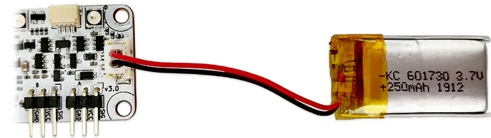

# Battery

{width="70%"}

RoboBoard can be powered from standalone battery to run whole circuit and motors. Also features charging and state monitoring.

- RoboBoard X3 - 3.7V 250mAh Li-Po (2 Amps peak)
- RoboBoard X4 - 11.1V 2200mAh Li-Ion (6 Amps peak)

## Code snippets

```arduino
// Initialize program
void setup() {
  Serial.begin(115200);
}
// Loop program
void loop() {
  // Print battery info
  Serial.printf("SOC: %d%%\n", Battery.getSOC());
  Serial.printf("Voltage: %.2fV\n", Battery.getVoltage());
  if (Board.getNumber() == 3) {
    Serial.printf("Current: %.2fA\n", Battery.getCurrent());
    Serial.printf("Charging: %s\n", Battery.isCharging() ? "Yes" : "No");
  }
  // Wait 1 second
  delay(1000);
}
```

***

## Functions

### :material-gauge: Status

Functions to read battery status.

<h4 class="apidec" id="getSOC">
<code>SOC</code> <span class="object">Battery</span>.<span class="function">getSOC</span>()
<a class="headerlink" href="#getSOC" title="Permanent link">¶</a></h4>
: Get battery State Of Charge (voltage based).  
**Returns:**  
`SOC` - battery charge level [`0`:`100`]%.  

<h4 class="apidec" id="getVoltage">
<code>voltage</code> <span class="object">Battery</span>.<span class="function">getVoltage</span>()
<a class="headerlink" href="#getVoltage" title="Permanent link">¶</a></h4>
: Get battery voltage.  
• X3: range [`2.6`:`4.2`]V. Shows ~`4.8` if USB connected.  
• X4: range [`8.40`:`12.60`]V  
**Returns:**  
`voltage` - battery voltage (_float_).  

<h4 class="apidec" id="getCurrent">
<code>amps</code> <span class="object">Battery</span>.<span class="function">getCurrent</span>() <code style="background:lightBlue">X3 v3.1 only</code>
<a class="headerlink" href="#getCurrent" title="Permanent link">¶</a></h4>
: Get battery current flow (Amps). `-`(discharging), `+`(charging).  
**Returns:**  
`amps` - battery current (_float_) [`-2.0`:`0.5`]A.  

<h4 class="apidec" id="isCharging">
<code>state</code> <span class="object">Battery</span>.<span class="function">isCharging</span>() <code style="background:lightBlue">X3 only</code>
<a class="headerlink" href="#isCharging" title="Permanent link">¶</a></h4>
: Check if battery is currently charging.  
**Returns:**  
`state` - is charging yes/no [`true`:`false`].  