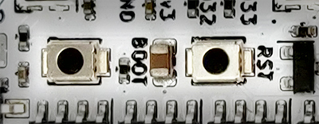

# Button

{align=left width="30%"}

_RTS (Reset) - physical processor restart. Button state can't be read._  
_BOOT - user button. Also may be used to manually enter ESP32 bootloader._  

<p style="clear: both;">Button control interface to read its state and events.<br>
Can be used with internal RoboBoard button or <a href="#external-gpio-button">external one connected to GPIO</a>.</p>

## Code snippets

```c++ title="State read"
// Is button currently pressed
bool isIn = Button.isPressed();
// Is button currently released
bool isOut = Button.isReleased();
// Is button pressed and holding for 1000 milliseconds
bool isInFor = Button.isPressedFor(1000);
// Is button released for 1000 milliseconds
bool isOutFor = Button.isReleasedFor(1000);
// Was button pressed before
bool wasIn = Button.wasPressed();
// Was button released before
bool wasOut = Button.wasReleased();
// Was button pressed and released
bool wasClick = Button.wasClick();
// Was button double clicked
bool wasDouble = Button.wasDoubleClick();
// Was button long pressed
bool wasLongPress = Button.wasLongPress();
```

```c++ title="Event usage"
// Function called on button event
void buttonEvent(int evt) {
  if (evt == Button.evtPress) {
    // Button was pressed
  }
  else if (evt == Button.evtRelease) {
    // Button was released
  }
  else if (evt == Button.evtLongPress) {
    // Button was long pressed
  }
  else if (evt == Button.evtDoubleClick) {
    // Button was double clicked
  }
}
void setup() {
  // Register button state change event 
  Button.addEvent(buttonEvent);
}
void loop() { }
```

??? example "Map button to processor restart (click to expand)"
    Example to make user button work same as physical reset (RST) button.
    ```arduino
    void setup() {
      // Map button as Reset
      Button.addEvent([]() { Board.restart(); });
    }
    void loop() {
    
    }
    ```

??? example "Delay code start until button press (click to expand)"
    Example to delay any code execution until button is pressed.
    ```arduino
    void setup() {
      // Run code and jump to loop()
      Serial.begin(115200);
      // Wait until button is pressed & print message
      while (!Button.waitClick(1000)) {
        Serial.println("Waiting for a button press...");
      }
    }
    void loop() {
      Serial.println("Code is running...");
      delay(500);
    }
    ```

***

## Functions

### :octicons-clock-16: Current state

Read current button states (at the moment).

<h4 class="apidec" id="isPressed">
<code>state</code> <span class="object">Button</span>.<span class="function">isPressed</span>()
<a class="headerlink" href="#isPressed" title="Permanent link">¶</a></h4>
: Check if button is pressed.  
**Returns:**  
`state` - yes / no [`true`:`false`]  

<h4 class="apidec" id="isReleased">
<code>state</code> <span class="object">Button</span>.<span class="function">isReleased</span>()
<a class="headerlink" href="#isReleased" title="Permanent link">¶</a></h4>
: Check if button is released.  
**Returns:**  
`state` - yes / no [`true`:`false`]  

<h4 class="apidec" id="isPressedFor">
<code>state</code> <span class="object">Button</span>.<span class="function">isPressedFor</span>(<code>time</code>)
<a class="headerlink" href="#isPressedFor" title="Permanent link">¶</a></h4>
: Check if button is pressed in for a certain amount of `time`.  
**Parameter:** `time` - amount of milliseconds button is pressed [`0`:`65535`]ms  
**Returns:** `status` - yes / no [`true`:`false`]  

<h4 class="apidec" id="isReleasedFor">
<code>state</code> <span class="object">Button</span>.<span class="function">isReleasedFor</span>(<code>time</code>)
<a class="headerlink" href="#isReleasedFor" title="Permanent link">¶</a></h4>
: Check if button is released in for a certain amount of `time`.  
**Parameter:** `time` - amount of milliseconds button is released [`0`:`65535`]ms  
**Returns:** `status` - yes / no [`true`:`false`]  

<h4 class="apidec" id="isLongPress">
<code>state</code> <span class="object">Button</span>.<span class="function">isLongPress</span>()
<a class="headerlink" href="#isLongPress" title="Permanent link">¶</a></h4>
: Check if button is pressed for 500ms.  
**Returns:**  
`state` - yes / no [`true`:`false`]  

<h4 class="apidec" id="getState">
<code>state</code> <span class="object">Button</span>.<span class="function">getState</span>()
<a class="headerlink" href="#getState" title="Permanent link">¶</a></h4>
: Get button state (pressed of not). Same as `isPressed()`.  
**Returns:**  
`state` - `true` is pressed, `false` not pressed.  

### :octicons-history-16: Previous state

Read past button states (current or already happened). Button actions are recorded and accessed with these functions (after event is already happened). Functions returns `true` only once. After that, recorded state is reset and waits for new event.

<h4 class="apidec" id="wasPressed">
<code>state</code> <span class="object">Button</span>.<span class="function">wasPressed</span>()
<a class="headerlink" href="#wasPressed" title="Permanent link">¶</a></h4>
: Check if button was pressed earlier.  
**Returns:**  
`state` - yes / no [`true`:`false`]  

<h4 class="apidec" id="wasReleased">
<code>state</code> <span class="object">Button</span>.<span class="function">wasReleased</span>()
<a class="headerlink" href="#wasReleased" title="Permanent link">¶</a></h4>
: Check if button was released earlier.  
**Returns:**  
`state` - yes / no [`true`:`false`]  

<h4 class="apidec" id="wasClick">
<code>state</code> <span class="object">Button</span>.<span class="function">wasClick</span>()
<a class="headerlink" href="#wasClick" title="Permanent link">¶</a></h4>
: Check if button is was clicked shortly.  
**Returns:**  
`state` - yes / no [`true`:`false`]  

<h4 class="apidec" id="wasLongPress">
<code>state</code> <span class="object">Button</span>.<span class="function">wasLongPress</span>()
<a class="headerlink" href="#wasLongPress" title="Permanent link">¶</a></h4>
: Check if button is was pressed for 500ms.  
**Returns:**  
`state` - yes / no [`true`:`false`]  

<h4 class="apidec" id="wasDoubleClick">
<code>state</code> <span class="object">Button</span>.<span class="function">wasDoubleClick</span>()
<a class="headerlink" href="#wasDoubleClick" title="Permanent link">¶</a></h4>
: Check if button was was double clicked.  
**Returns:**  
`state` - yes / no [`true`:`false`]  

<h4 class="apidec" id="getStateTime">
<code>time</code> <span class="object">Button</span>.<span class="function">getStateTime</span>()
<a class="headerlink" href="#getStateTime" title="Permanent link">¶</a></h4>
: Get amount of time button is in current state.  
**Returns:**  
`time` - state time (milliseconds).  

### :material-exclamation-thick: Events

Button events used to trigger some code execution when button is pressed. [`waitClick()`](#waitClick) is used to halt code execution until button is pressed. [`addEvent()`](#addEvent) is used to report button state change.

<h4 class="apidec" id="waitClick">
<code>state</code> <span class="object">Button</span>.<span class="function">waitClick</span>()
<a class="headerlink" href="#waitClick" title="Permanent link">¶</a></h4>
<h4 class="apidec" id="waitClick-time">
<code>state</code> <span class="object">Button</span>.<span class="function">waitClick</span>(<code>time</code>)
<a class="headerlink" href="#waitClick-time" title="Permanent link">¶</a></h4>
<h4 class="apidec" id="waitDobuleClick">
<code>state</code> <span class="object">Button</span>.<span class="function">waitDobuleClick</span>()
<a class="headerlink" href="#waitDobuleClick" title="Permanent link">¶</a></h4>
<h4 class="apidec" id="waitDobuleClick-time">
<code>state</code> <span class="object">Button</span>.<span class="function">waitDobuleClick</span>(<code>time</code>)
<a class="headerlink" href="#waitDobuleClick-time" title="Permanent link">¶</a></h4>
<h4 class="apidec" id="waitLongPress">
<code>state</code> <span class="object">Button</span>.<span class="function">waitLongPress</span>()
<a class="headerlink" href="#waitLongPress" title="Permanent link">¶</a></h4>
<h4 class="apidec" id="waitLongPress-time">
<code>state</code> <span class="object">Button</span>.<span class="function">waitLongPress</span>(<code>time</code>)
<a class="headerlink" href="#waitLongPress-time" title="Permanent link">¶</a></h4>
: Halts code execution until button event is detected.  
Contains timeout feature for maximum amount of `time` to wait.  
**Parameter:** `time` - maximum time to wait (ms). `0` - disabled.  
**Returns:** `state` - `true` if event detected, `false` if timeout.  

<h4 class="apidec" id="addEvent">
<span class="object">Button</span>.<span class="function">addEvent</span>(<code>function</code>)
<a class="headerlink" href="#addEvent" title="Permanent link">¶</a></h4>
: Register function, called on button event. Available event types:  
• `Button.evtRelease`  
• `Button.evtPress`  
• `Button.evtClick`  
• `Button.evtLongPress`  
• `Button.evtDoubleClick`  
**Parameter:** `function` - function name [`buttonEvent`].  
Accepts two types of functions - with `evt` parameter and without. Event parameter is a convenient way to get event type without checking inside `loop()`.  
`#!arduino void buttonEvent() { }` or  `#!arduino void buttonEvent(int evt) { }`.  
```arduino
void buttonEvent(int evt) {
  if (evt == Button.evtPress) Serial.println("Button: evtPress");
  if (evt == Button.evtRelease) Serial.println("Button: evtRelease");
}
void setup() {
  button.addEvent(buttonEvent);
}
void loop() { }
```

### Configuration

<h4 class="apidec" id="setDebounceTime">
<span class="object">Button</span>.<span class="function">setDebounceTime</span>(<code>time</code> )
<a class="headerlink" href="#setDebounceTime" title="Permanent link">¶</a></h4>
: Set debounce time to prevent false reading during button latching.  
**Parameters:**  
`time` - debounce time (ms). Default: 20ms.  

<h4 class="apidec" id="setLongPressTime">
<span class="object">Button</span>.<span class="function">setLongPressTime</span>(<code>time</code> )
<a class="headerlink" href="#setLongPressTime" title="Permanent link">¶</a></h4>
: Set custom long press time for [`isLongPress()`](#isLongPress) [`wasLongPress()`](#wasLongPress) functions.  
**Parameters:**  
`time` - press in time (ms). Default: 500ms.  

## External GPIO button

=== "RoboBoard X3"
    ```c++
    IOButton gpioButton(IO33); // Button connected to pin IO33
    gpioButton.isPressed(); // Read button state
    ```
=== "RoboBoard X4"
    ```c++
    IOButton gpioButton(GPIOA); // Button connected to pin GPIOA
    gpioButton.isPressed(); // Read button state
    ```

`IOButton` can be used to control external button connected to any GPIO pin. It requires pin number and pin state on button press (for algorithm to know correct button position). All same functions are available as for `Button` object.

Note: for "longPress" detection to work - only single button can be pressed at a time.

**Constructor:**

<h4 class="apidec" id="IOButton">
<span class="object">IOButton</span>(<code>pin</code>)
<a class="headerlink" href="#IOButton" title="Permanent link">¶</a></h4>
<h4 class="apidec" id="IOButton">
<span class="object">IOButton</span>(<code>pin</code>,<code>pressLevel</code>)
<a class="headerlink" href="#IOButton" title="Permanent link">¶</a></h4>
: Create button control object.  
**Parameter:**  
`pin` - GPIO pin number  
`pressLevel` - pin state when button is pressed [LOW:HIGH]. Default - LOW.  


```c++
IOButton button1(IO33); // Button on pin IO33. LOW when pressed
IOButton button2(IO33, LOW); // Button on pin IO33. LOW when pressed
IOButton button3(IO33, HIGH); // Button on pin IO33. HIGH when pressed
```