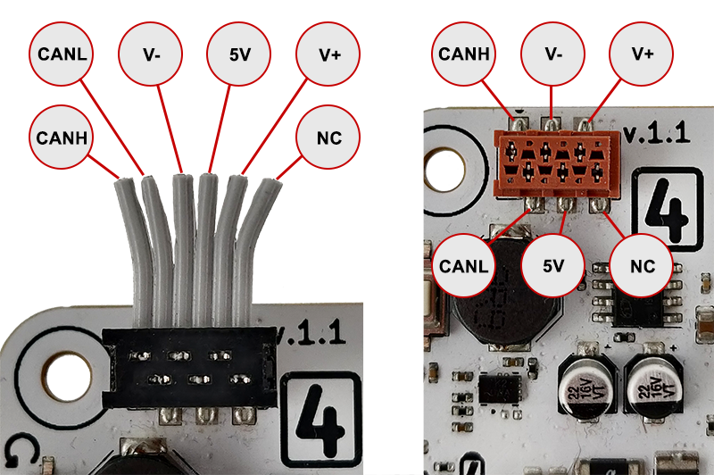

# CAN

{width=70%}

**CANH:** CAN-High, **CANL:** CAN-Low, **NC:** Not Connected  
**V-:** Ground, **5V:** 5V output, **V+:** [BATT](../../roboboard-x4/index.md#power-circuit) rail output (~12V)  

Ports are interconnected and used for daisy-chaining. Rated for 1Amp.  
Cable is available in our store: [:shopping_cart: Totemmaker.net store → TOTEMBUS CABLE](https://totemmaker.net/product/totembus-cable-connects-modules-to-totembus-network/){target=_blank}  

Interact with CAN bus network connected over TBUS (TotemBUS) connector. Has dual purpose: Plug into CAN bus networks or attach [X4 extension modules](../../modules/index.md).

```arduino
void setup() {
  // Start CAN peripheral at 500kbps
  CAN.begin(500);
}
void loop() {
  // Wait for CAN packet receive. 300ms timeout
  if (CAN.readPacketWait(300)) {
    // Get received packet
    auto packet = CAN.getPacket();
    // packet.id, packet.data, packet.len, packet.ext, packet.rtr
  }
  // Send CAN packets
  uint8_t data[8] = {1,2,3,4,5,6,7,8};
  CAN.writePacketExt(0x112233, data, 8); // Extended
  CAN.writePacketStd(0x1AB, data, 8);    // Standard
}
```

For more example code check: [Examples → RoboBoard → CAN](https://github.com/totemmaker/TotemArduinoBoards/tree/master/libraries/TotemRB/examples/CAN){target=_blank}

## GUI Monitor

{style="width: 100%; height: 159px; object-fit: cover; object-position: 100% 0;"}

RoboBoard X4 is compatible with open source [SavvyCAN](https://savvycan.com/){target=_blank} application to monitor CAN bus traffic. For setup instructions check :simple-github: [totemmaker/ESP32RET](https://github.com/totemmaker/ESP32RET?tab=readme-ov-file#esp32ret){target=_blank} repository.

## Operating modes

CAN peripheral operates in 3 modes:  

- **Normal** - Send and received messages on CAN bus.
- **Listen** - Receive messages without influencing the bus (monitoring).
- **Loopback** - Sent messages will be received right away. Used for demo and testing purposes.

Supported baud (kBits): 25, 50, 100, 125, 250, 500, 800, 1000

<h4 class="apidec" id="begin">
<span class="object">CAN</span>.<span class="function">begin</span>(<code>baud</code>)
<a class="headerlink" href="#begin" title="Permanent link">¶</a></h4>
: Start CAN bus peripheral in Normal mode.  
**Parameter:** `baud`: CAN bus baud rate (kBits).  

<h4 class="apidec" id="beginListen">
<span class="object">CAN</span>.<span class="function">beginListen</span>(<code>baud</code>)
<a class="headerlink" href="#beginListen" title="Permanent link">¶</a></h4>
: Start CAN bus peripheral in Listen mode.  
Note: There must be at least 2 devices on CAN bus for messaging to work, as RoboBoard won't send any packet acknowledgments. Can't use [`writePacket`](#writing) in this mode.  
**Parameter:** `baud`: CAN bus baud rate (kBits).  

<h4 class="apidec" id="beginLoopback">
<span class="object">CAN</span>.<span class="function">beginLoopback</span>(<code>baud</code>)
<a class="headerlink" href="#beginLoopback" title="Permanent link">¶</a></h4>
: Start CAN bus peripheral in Loopback mode.  
Works without attached to CAN bus network. Each sent packet will loop back to receiver.  
**Parameter:** `baud`: CAN bus baud rate (kBits).  

<h4 class="apidec" id="end">
<span class="object">CAN</span>.<span class="function">end</span>()
<a class="headerlink" href="#end" title="Permanent link">¶</a></h4>
: Stop CAN peripheral. Required to change working mode or hardware filter.  

<h4 class="apidec" id="isRunning">
<code>state</code> <span class="object">CAN</span>.<span class="function">isRunning</span>()
<a class="headerlink" href="#isRunning" title="Permanent link">¶</a></h4>
: Check if CAN peripheral state is "running".  
**Returns:** `true`: CAN is running. `false`: CAN is non-functional.  

<h4 class="apidec" id="setEnable">
<span class="object">CAN</span>.<span class="function">setEnable</span>(<code>state</code>)
<a class="headerlink" href="#setEnable" title="Permanent link">¶</a></h4>
: Switch CAN peripheral between "running" and "stopped" states.  
Can be used to temporary stop packet transmit and reception.  
**Parameter:**  
`state` - `true`: put CAN to "running" state. `false`: put CAN to "stopped" state.  

## Writing

<h4 class="apidec" id="writePacketStd">
<span class="object">CAN</span>.<span class="function">writePacketStd</span>(<code>id</code>,<code>data</code>,<code>len</code>)
<a class="headerlink" href="#writePacketStd" title="Permanent link">¶</a></h4>
<h4 class="apidec" id="writePacketExt">
<span class="object">CAN</span>.<span class="function">writePacketExt</span>(<code>id</code>,<code>data</code>,<code>len</code>)
<a class="headerlink" href="#writePacketExt" title="Permanent link">¶</a></h4>
: Send CAN data packet. "Std" and "Ext" differs in identifier size:  
• **Standard:** 11-bit identifier [`0`:`0x7FF`].  
• **Extended:** 29-bit identifier [`0`:`0x1FFFFFFF`].  
**Parameter:**  
`id` - identifier.  
`data` - pointer to 8-bit array (or NULL if len = 0).  
`len` - length of "data" array. [`0`:`8`].  

<h4 class="apidec" id="writePacketStdRtr">
<span class="object">CAN</span>.<span class="function">writePacketStdRtr</span>(<code>id</code>,<code>len</code>)
<a class="headerlink" href="#writePacketStdRtr" title="Permanent link">¶</a></h4>
<h4 class="apidec" id="writePacketExtRtr">
<span class="object">CAN</span>.<span class="function">writePacketExtRtr</span>(<code>id</code>,<code>len</code>)
<a class="headerlink" href="#writePacketExtRtr" title="Permanent link">¶</a></h4>
: Send Remote Transmission Request packet. "Std" and "Ext" differs in identifier size:  
• **Standard:** 11-bit identifier [`0`:`0x7FF`].  
• **Extended:** 29-bit identifier [`0`:`0x1FFFFFFF`].  
**Parameter:**  
`id` - identifier.  
`len` - data length field. [`0`:`8`].  

<h4 class="apidec" id="writePacket">
<span class="object">CAN</span>.<span class="function">writePacket</span>(<code>ext</code>,<code>id</code>,<code>data</code>,<code>len</code>,<code>rtr</code>)
<a class="headerlink" href="#writePacket" title="Permanent link">¶</a></h4>
: Send CAN packet. Allows to select packet configuration trough parameters.  
If `rtr` is set - parameter `data` is ignored.  
**Parameter:**  
`ext` - `true`: extended packet. `false`: standard packet.  
`id` - identifier extended:[`0`:`0x1FFFFFFF`], standard: [`0`:`0x7FF`].  
`data` - pointer to 8-bit array (or NULL if len = 0).  
`len` - length of "data" array. [`0`:`8`].  
`rtr` - `true`: send RTR packet. `false`: send data packet. Default: `false`.  

## Reading

Different message reception methods available. Only single one can be used at the time:  

- **Event mode** - messages will be received inside registered event handlers
    - Event is fired right after message is received
    - Multiple application modules can register event for CAN reception
    - Main loop is free to use for other application requirements
- **Polling mode** - messages will be acquired using [`readPacket`](#polling-mode) function inside a loop
    - Faster reception (bypassing event handling and context switching)
    - Better handles high amount of data

### Event mode

<h4 class="apidec" id="addEvent">
<span class="object">CAN</span>.<span class="function">addEvent</span>(<code>function</code>)
<a class="headerlink" href="#addEvent" title="Permanent link">¶</a></h4>
: Register CAN packet receive event. Can be read using [`getPacket()`](#getPacket).  
**Parameter:**  
`function` - function name.  

<h4 class="apidec" id="removeEvent">
<span class="object">CAN</span>.<span class="function">removeEvent</span>(<code>function</code>)
<a class="headerlink" href="#removeEvent" title="Permanent link">¶</a></h4>
: Unregister CAN packet receive event. Passed function won't be called anymore.  
**Parameter:**  
`function` - registered function name.  

```arduino
void eventCAN() {
  auto packet = CAN.getPacket();
  // packet.id, packet.data, packet.len, packet.ext, packet.rtr
}
void setup() {
  CAN.begin(500);
  CAN.addEvent(eventCAN);
}
void loop() {
  // Free to use
}
```

### Polling mode

<h4 class="apidec" id="readPacket">
<code>state</code> <span class="object">CAN</span>.<span class="function">readPacket</span>()
<a class="headerlink" href="#readPacket" title="Permanent link">¶</a></h4>
: Read received packet. Acquired packet is returned by function [`getPacket()`](#getPacket).  
Each call will pull new packet from internal receive queue.  
**Returns:** `true`: packet is received. `false`: no packets available.  

<h4 class="apidec" id="readPacketWait">
<code>state</code> <span class="object">CAN</span>.<span class="function">readPacketWait</span>()
<a class="headerlink" href="#readPacketWait" title="Permanent link">¶</a></h4>
<h4 class="apidec" id="readPacketWait-timeout">
<code>state</code> <span class="object">CAN</span>.<span class="function">readPacketWait</span>(<code>timeout</code>)
<a class="headerlink" href="#readPacketWait-timeout" title="Permanent link">¶</a></h4>
: Read received packet. Acquired packet is returned by function [`getPacket()`](#getPacket).  
Each call will pull new packet from internal receive queue.  
Function will halt code execution until new packet is received or timeout is passed.  
**Parameter:**  
`timeout` - (ms) time to wait for packet. Default: 0 - indefinitely.  
**Returns:** `true`: packet is received. `false`: no packets available, timeout.  

```arduino
void setup() {
  CAN.begin(500);
}
void loop() {
  if (CAN.readPacketWait(300)) {
    auto packet = CAN.getPacket();
    // packet.id, packet.data, packet.len, packet.ext, packet.rtr
  }
}
```

<h4 class="apidec" id="getPacket">
<code>CANPacket</code> <span class="object">CAN</span>.<span class="function">getPacket</span>()
<a class="headerlink" href="#getPacket" title="Permanent link">¶</a></h4>
: Return received CAN packet inside event function or after `readPacket()` returned `true`.  
**Returns:** `CANPacket` structure, containing packet information.  
```C
struct CANPacket {
    uint16_t ext : 1; // Is extended packet (or standard)
    uint16_t rtr : 1; // Is Remote Transmit Request
    int16_t filter; // Software filter that accepted packet (otherwise -1)
    uint32_t id; // Packet identifier
    uint8_t len; // Packet data length
    uint8_t data[8]; // Packet data array
};
```

## Filters

Filters will be applied to all received messages and intercepted only if `id` and `mask` parameters matches. Used to receive only specific packets, ignoring anything else.

### Software

Software filters are running inside application, but has a few more advantages:  
• Associate received packet with filter it matched [`packet.filter`](#getPacket).  
• Add and remove filters when CAN peripheral is running.  
• Add up to 16 filters.  

<h4 class="apidec" id="setFilterStd">
<span class="object">CAN</span>.<span class="function">setFilterStd</span>(<code>num</code>,<code>id</code>,<code>mask</code>)
<a class="headerlink" href="#setFilterStd" title="Permanent link">¶</a></h4>
: Set standard software filter.  
**Parameter:**  
`num` - filter slot number [`0`:`15`].  
`id` - identifier [`0`:`0x7FF`].  
`mask` - validated identifier bits [`0`:`0x7FF`].  

<h4 class="apidec" id="setFilterExt">
<span class="object">CAN</span>.<span class="function">setFilterExt</span>(<code>num</code>,<code>id</code>,<code>mask</code>)
<a class="headerlink" href="#setFilterExt" title="Permanent link">¶</a></h4>
: Set extended software filter.  
**Parameter:**  
`num` - filter slot number [`0`:`15`].  
`id` - identifier [`0`:`0x1FFFFFFF`].  
`mask` - validated identifier bits [`0`:`0x1FFFFFFF`].  

<h4 class="apidec" id="resetFilter">
<span class="object">CAN</span>.<span class="function">resetFilter</span>(<code>num</code>)
<a class="headerlink" href="#resetFilter" title="Permanent link">¶</a></h4>
: Disable filter on selected slot (num).  
**Parameter:**  
`num` - filter slot number [`0`:`15`]. `-1` - disable all filters.  

```arduino title="Software filter example"
void setup() {
    CAN.begin(500);
    // Allow to receive only standard packets:
    // 0x0A1 0x1A1 0x2A1 0x3A1 0x4A1 0x5A1 0x6A1 0x7A1
    // 0x0A2 0x1A2 0x2A2 0x3A2 0x4A2 0x5A2 0x6A2 0x7A2
    CAN.setFilterStd(0, 0xA1, 0xFF);
    CAN.setFilterStd(1, 0xA2, 0xFF);
}
```

### Hardware

Hardware filters are limited, but efficient with high amount of data.  
**Notice:**  
• Must be configured <u>before</u> calling `CAN.begin()`.  
• Only single one of "setHardware" function can be used.  

<h4 class="apidec" id="setHardwareFilterStd">
<span class="object">CAN</span>.<span class="function">setHardwareFilterStd</span>(<code>id</code>,<code>mask</code>)
<a class="headerlink" href="#setHardwareFilterStd" title="Permanent link">¶</a></h4>
: Set single standard hardware filter.  
**Parameter:**  
`id` - identifier [`0`:`0x7FF`].  
`mask` - validated identifier bits [`0`:`0x7FF`].  

<h4 class="apidec" id="setHardwareFilterExt">
<span class="object">CAN</span>.<span class="function">setHardwareFilterExt</span>(<code>id</code>,<code>mask</code>)
<a class="headerlink" href="#setHardwareFilterExt" title="Permanent link">¶</a></h4>
: Set single extended hardware filter.  
**Parameter:**  
`id` - identifier [`0`:`0x1FFFFFFF`].  
`mask` - validated identifier bits [`0`:`0x1FFFFFFF`].  

<h4 class="apidec" id="setHardwareFilterDual">
<span class="object">CAN</span>.<span class="function">setHardwareFilterDual</span>(<code>id1</code>,<code>mask1</code>,<code>id2</code>,<code>mask2</code>)
<a class="headerlink" href="#setHardwareFilterDual" title="Permanent link">¶</a></h4>
: Set dual hardware filter. Can filter out 2 different standard packets.  
**Parameter:**  
`id1`, `id2` - identifier [`0`:`0x7FF`].  
`mask1`, `mask2` - validated identifier bits [`0`:`0x7FF`].  

<h4 class="apidec" id="setHardwareFilter">
<span class="object">CAN</span>.<span class="function">setHardwareFilter</span>(<code>code</code>,<code>mask</code>,<code>single</code>)
<a class="headerlink" href="#setHardwareFilter" title="Permanent link">¶</a></h4>
: Set hardware filter manually. Allows for some additional configuration.  
For meaning of `code` and `mask` read: [ESP32 → TWAI → Acceptance Filter](https://docs.espressif.com/projects/esp-idf/en/latest/esp32/api-reference/peripherals/twai.html#acceptance-filter){target=_blank}.  
**Parameter:**  
`code` - 32-bit code.  
`mask` - 32-bit mask.  
`single` - `true`: single filter, `false`: dual filter.  

```arduino title="Hardware filter example"
void setup() {
    // Allow to receive only standard packets:
    // 0x0A1 0x1A1 0x2A1 0x3A1 0x4A1 0x5A1 0x6A1 0x7A1
    CAN.setHardwareFilterStd(0xA1, 0xFF);
    CAN.begin(500);
}
```

## Bus info

<h4 class="apidec" id="readAlerts">
<code>alerts</code> <span class="object">CAN</span>.<span class="function">readAlerts</span>()
<a class="headerlink" href="#readAlerts" title="Permanent link">¶</a></h4>
: Read CAN peripheral alerts (if any). Returned value is reset each function call.  
**Returns:**  
`alerts` - 32-bit value of active alerts. See [TWAI - Alerts](https://docs.espressif.com/projects/esp-idf/en/latest/esp32/api-reference/peripherals/twai.html#alerts){target=_blank} for description.  
Definitions are available in [`#include "driver/twai.h"`](https://github.com/totemmaker/TotemArduinoBoards/blob/master/tools/sdk/esp32/include/driver/include/driver/twai.h#L48-L67){target=_blank}  

<h4 class="apidec" id="readRxCount">
<code>count</code> <span class="object">CAN</span>.<span class="function">readRxCount</span>()
<a class="headerlink" href="#readRxCount" title="Permanent link">¶</a></h4>
: Read amount of queued RX messages.  
**Returns:**  
`count` - number of messages awaiting for read with [`readPacket`](#readPacket).
