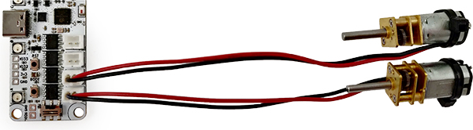

# DC



_Note: motor wire colors (red, black) does not indicate polarity (+, -). Swapping wires only changes spin direction._

Control interface for RoboBoard DC H-bridge motor drivers.  
May access specific port or all at once:  

- `DC.A`, `DC.B`, `DC.C`, `DC.D` - control single port  
- `DC[0]` - control port A [`1`-B, `2`-C, `3`-D] _(invalid indexes will be ignored)_  
- `DC` - control all ports _(some "get" functions are not available in this case)_  

***

## Code snippets

```c++ title="Function usage example"
// Control all DC ports
DC.spin(-50); // Spin backward at 50% power
DC.spin(0); // Stop spin
DC.brake(); // Brake motor
DC.coast(); // Free spin (no breaking and power)
// Play tone on all motors
DC.tone(5000); // Play 5kHz tone trough motor coils
// Change ports PWM frequency
DC.setFrequency(50); // Set PWM frequency to 50Hz
// Brake DC port B
DC[1].brake();
// Configure DC A port
DC.A.setRange(10, 90); // Set power range to [10% : 90%]
DC.A.setAccelerationTime(300); // Set acceleration to 300ms
DC.A.setDecelerationTime(150); // Set acceleration to 150ms
DC.A.setInvert(true); // Invert spin direction
```

***

Output ports are directly connected to battery trough motor driver and controlled using PWM modulation. Peak voltage is dependent on SOC of battery. This can vary between 8.4V - 12.6V (X4) and 2.8V - 4.2V (X3). The higher the voltage, the faster motor will spin.  

## Functions

DC motor can be in 1 of 3 different states:

- **Spin** - spinning forward / backward at 0-100% of power
- **Brake** - braking (stopping) at 0-100% of power
- **Tone** - vibrating coils to generate audible tone

### :joystick: Spin motors

<h4 class="apidec" id="spin">
<span class="object">DC</span>.<span class="group">A</span>.<span class="function">spin</span>(<code>power</code>)
<a class="headerlink" href="#spin" title="Permanent link">¶</a></h4>
: Spin motor at specified amount of power (%) and direction.  
`-`(backward),`+`(forward), `0`(no power).  
**Parameter:**  
`power` - output power [`-100`:`100`]%.

<h4 class="apidec" id="brake">
<span class="object">DC</span>.<span class="group">A</span>.<span class="function">brake</span>()
<a class="headerlink" href="#brake" title="Permanent link">¶</a></h4>
<h4 class="apidec" id="brake">
<span class="object">DC</span>.<span class="group">A</span>.<span class="function">brake</span>(<code>power</code>)
<a class="headerlink" href="#brake" title="Permanent link">¶</a></h4>
: Brake motor at specified amount of power (%).  
_Electric brake only. Does not hold wheel in place._  
**Parameter:**  
`power` - set brake power [`0`:`100`]%. Default: 100.

<h4 class="apidec" id="coast">
<span class="object">DC</span>.<span class="group">A</span>.<span class="function">coast</span>()
<a class="headerlink" href="#coast" title="Permanent link">¶</a></h4>
: Free spin motor (no power, no brake). Same as `brake(0)`.  

<h4 class="apidec" id="getSpin">
<code>power</code> <span class="object">DC</span>.<span class="group">A</span>.<span class="function">getSpin</span>()
<a class="headerlink" href="#getSpin" title="Permanent link">¶</a></h4>
: Get motor current spin power (%) and direction.  
`-`(backward),`+`(forward), `0`(no power).  
**Returns:**  
`power` - output power [`-100`:`100`]%.

<h4 class="apidec" id="getBrake">
<code>power</code> <span class="object">DC</span>.<span class="group">A</span>.<span class="function">getBrake</span>()
<a class="headerlink" href="#getBrake" title="Permanent link">¶</a></h4>
: Get motor current braking power (%).  
**Returns:**  
`power` - brake power [`0`:`100`]%.

### :material-music-note: Tone output

!!! danger
    Do not use tone function for a long period of time. This may overheat the motors.

Play tone (sound) by vibrating DC motor coil. Similar as Arduino [`tone()`](https://www.arduino.cc/reference/en/language/functions/advanced-io/tone/){target="_blank"} function, but with motors. Outputs audible range up to 20kHz. At low frequencies motor may shake a little.

<h4 class="apidec" id="tone">
<span class="object">DC</span>.<span class="function">tone</span>(<code>frequency</code>)
<a class="headerlink" href="#tone" title="Permanent link">¶</a></h4>
<h4 class="apidec" id="tone-duration">
<span class="object">DC</span>.<span class="function">tone</span>(<code>frequency</code>,<code>duration</code>)
<a class="headerlink" href="#tone-duration" title="Permanent link">¶</a></h4>
: Start vibrating all DC motors at specified frequency.  
**Parameter:**  
`frequency` - tone frequency [`0`:`20000`]Hz. `0` - stop.  
`duration` - output duration [`0`:`65535`]ms. `0` - indefinitely (default).  

<h4 class="apidec" id="getTone">
<code>number</code> <span class="object">DC</span>.<span class="function">getTone</span>()
<a class="headerlink" href="#getTone" title="Permanent link">¶</a></h4>
: Get currently applied tone.  
**Returns:**  
`frequency` - tone frequency [`0`:`20000`]Hz.  

### :material-car-speed-limiter: Acceleration

Configure motor acceleration and deceleration time. These gradual increase or decrease in speed is applied when changing motor output power with [`spin()`](#spin). Any difference between old value and target one will transit gradually. Typically used for tall robots to prevent tip over or gradually spin up some high mass object.  
Configuration takes parameter of maximum amount of time required to change speed between 0% and 100%.  
_Example: Setting [`#!c++ setAccelerationTime(1000)`](#setAccelerationTime), motor will require 1 second to reach maximum speed from stand still to 100%._

<h4 class="apidec" id="isAccelerating">
<code>state</code> <span class="object">DC</span>.<span class="group">A</span>.<span class="function">isAccelerating</span>()
<a class="headerlink" href="#isAccelerating" title="Permanent link">¶</a></h4>
: Check if motor is currently in acceleration or deceleration state.  
**Returns:**  
`state` - yes / no [`true`,`false`].  

<h4 class="apidec" id="wait">
<code>state</code> <span class="object">DC</span>.<span class="group">A</span>.<span class="function">wait</span>()
<a class="headerlink" href="#wait" title="Permanent link">¶</a></h4>
<h4 class="apidec" id="wait">
<code>state</code> <span class="object">DC</span>.<span class="group">A</span>.<span class="function">wait</span>(<code>time</code>)
<a class="headerlink" href="#wait" title="Permanent link">¶</a></h4>
: Wait until motor finishes accelerating or decelerating (block code until).  
**Parameter:** `time` - maximum time to wait (ms) for motor to finish. `0` - disabled.  
**Returns:** `state` - `true` if motor finished, `false` if timeout.  

<h4 class="apidec" id="setAccelerationTime">
<span class="object">DC</span>.<span class="group">A</span>.<span class="function">setAccelerationTime</span>(<code>time</code>)
<a class="headerlink" href="#setAccelerationTime" title="Permanent link">¶</a></h4>
: Configure amount of time required to accelerate motor from 0% to 100%.  
**Parameter:**  
`time` - acceleration time in milliseconds. `0` - disabled.  

<h4 class="apidec" id="setDecelerationTime">
<span class="object">DC</span>.<span class="group">A</span>.<span class="function">setDecelerationTime</span>(<code>time</code>)
<a class="headerlink" href="#setDecelerationTime" title="Permanent link">¶</a></h4>
: Configure amount of time required to decelerate motor from 100% to 0%.  
If disabled - motor will stop by free spinning (from inertia) or braking (if autobrake enabled).  
**Parameter:**  
`time` - deceleration time in milliseconds. `0` - disabled.  

<h4 class="apidec" id="getAccelerationTime">
<code>number</code> <span class="object">DC</span>.<span class="group">A</span>.<span class="function">getAccelerationTime</span>()
<a class="headerlink" href="#getAccelerationTime" title="Permanent link">¶</a></h4>
: Get configured amount of time for motor acceleration from 0% to 100%.  
**Returns:**  
`number` - acceleration time in milliseconds. `0` - disabled.  

<h4 class="apidec" id="getDecelerationTime">
<code>number</code> <span class="object">DC</span>.<span class="group">A</span>.<span class="function">getDecelerationTime</span>()
<a class="headerlink" href="#getDecelerationTime" title="Permanent link">¶</a></h4>
: Get configured amount of time for motor deceleration from 100% to 0%.  
**Returns:**  
`number` - deceleration time in milliseconds. `0` - disabled.  

### :material-wrench-cog: Configure

<h4 class="apidec" id="setEnable">
<span class="object">DC</span>.<span class="group">A</span>.<span class="function">setEnable</span>(<code>state</code>)
<a class="headerlink" href="#setEnable" title="Permanent link">¶</a></h4>
: Turn motor port on / off to disable any output.  

<h4 class="apidec" id="setInvert">
<span class="object">DC</span>.<span class="group">A</span>.<span class="function">setInvert</span>(<code>state</code>)
<a class="headerlink" href="#setInvert" title="Permanent link">¶</a></h4>
: Invert DC motor spin direction (swaps polarity + -).  
**Parameter:**  
`state` - is inverted spin direction [`true`:`false`]  

<h4 class="apidec" id="setAutobrake">
<span class="object">DC</span>.<span class="group">A</span>.<span class="function">setAutobrake</span>(<code>power</code>)
<a class="headerlink" href="#setAutobrake" title="Permanent link">¶</a></h4>
: Set automatic brake. Will apply brake when [`spin()`](#spin) is set to `0`.  
Used to prevent motor from free spinning.  
**Parameter:**  
`power` - automatic brake power [`0`:`100`]% or [`false`:`true`].

<h4 class="apidec" id="setRange">
<span class="object">DC</span>.<span class="group">A</span>.<span class="function">setRange</span>(<code>min</code>,<code>max</code>)
<a class="headerlink" href="#setRange" title="Permanent link">¶</a></h4>
: Set motor power range limits. Doing so - motor will start spin at `min` power and does not overstep `max`. Used to boost motor at low speed and limit max voltage.  
Applied spin power 0-100% [`spin()`](#spin) will be mapped to configured range.  
_RoboBoard X4 default: [`10`:`100`]._  
**Parameter:**  
`min` - minimum percentage required to start spinning a motor. Default: `0`  
`max` - maximum allowed percentage of power for the motor. Default: `100`  

<h4 class="apidec" id="setFastDecay">
<span class="object">DC</span>.<span class="group">A</span>.<span class="function">setFastDecay</span>()
<a class="headerlink" href="#setFastDecay" title="Permanent link">¶</a></h4>
<h4 class="apidec" id="setSlowDecay">
<span class="object">DC</span>.<span class="group">A</span>.<span class="function">setSlowDecay</span>()
<a class="headerlink" href="#setSlowDecay" title="Permanent link">¶</a></h4>
: Set coil current dissipation speed (fast or slow). Changes motor behavior.  
**Fast decay mode:** Motor free spins during speed change.  
**Slow decay mode:** More linear speed control. Better torque at low speed.  
_Note: RoboBoard X4 requires [driver version](../../roboboard-x4/index.md#driver-update) `1.60` or later._  

**Get settings:**

<h4 class="apidec" id="getEnable">
<code>state</code> <span class="object">DC</span>.<span class="group">A</span>.<span class="function">getEnable</span>()
<a class="headerlink" href="#getEnable" title="Permanent link">¶</a></h4>
: Check if motor port is enabled.  
**Returns:**  
`state` - enabled / disabled [`true`:`false`].  

<h4 class="apidec" id="getInvert">
<code>state</code> <span class="object">DC</span>.<span class="group">A</span>.<span class="function">getInvert</span>()
<a class="headerlink" href="#getInvert" title="Permanent link">¶</a></h4>
: Check if motor spin direction is inverted.  
**Returns:**  
`state` - yes / no [`true`:`false`].  

<h4 class="apidec" id="getAutobrake">
<code>state</code> <span class="object">DC</span>.<span class="group">A</span>.<span class="function">getAutobrake</span>()
<a class="headerlink" href="#getAutobrake" title="Permanent link">¶</a></h4>
: Get configured automatic brake power (if enabled).  
**Returns:**  
`state` - braking power [`0`:`100`]%.  

<h4 class="apidec" id="getRange">
<code>Range</code> <span class="object">DC</span>.<span class="group">A</span>.<span class="function">getRange</span>()
<a class="headerlink" href="#getRange" title="Permanent link">¶</a></h4>
: Get configured motor port power range.  
**Returns:**  
`Range` - Range structure.  
```c++
void setup() {
    auto range = DC.A.getRange();
    range.min;
    range.max;
    // Alternative use
    DC.A.getRange().min;
    DC.A.getRange().max;
}
```

<h4 class="apidec" id="getFastDecay">
<code>state</code> <span class="object">DC</span>.<span class="group">A</span>.<span class="function">getFastDecay</span>()
<a class="headerlink" href="#getFastDecay" title="Permanent link">¶</a></h4>
<h4 class="apidec" id="getSlowDecay">
<code>state</code> <span class="object">DC</span>.<span class="group">A</span>.<span class="function">getSlowDecay</span>()
<a class="headerlink" href="#getSlowDecay" title="Permanent link">¶</a></h4>
: Get selected decay mode (fast or slow).  
**Returns:**  
`state` - `true` if mode is selected.  

**Configure PWM frequency:**

<h4 class="apidec" id="setFrequency">
<span class="object">DC</span>.<span class="function">setFrequency</span>(<code>frequency</code>)
<a class="headerlink" href="#setFrequency" title="Permanent link">¶</a></h4>
: Set DC ports PWM frequency. Default: 20kHz.  
Can be changed if certain application or motor requires so.  
**Parameter:**  
`frequency` - PWM frequency [`1`:`65535`]Hz.  

<h4 class="apidec" id="getFrequency">
<code>number</code> <span class="object">DC</span>.<span class="function">getFrequency</span>()
<a class="headerlink" href="#getFrequency" title="Permanent link">¶</a></h4>
: Get configured DC ports PWM frequency.  
**Returns:**  
`number` - PWM frequency [`1`:`65535`]Hz.  