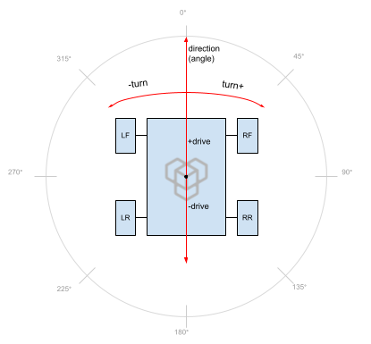
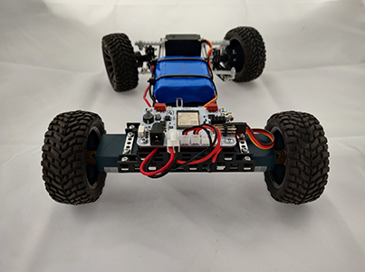
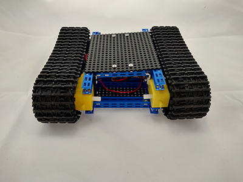
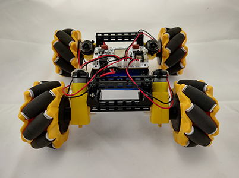

# Drivetrain

{style="height:300px;margin-top:-30px" align=right}

Most common robot configuration is direct motor driven wheels strapped to its chassis. Even it looks simple enough, there are different configurations and algorithms for improved agility and control response.  
`Drivetrain.` object allows to define robot wheel base and control its movement with a few simple lines of code. This includes drive forward / backward, turn left / right and drive to side (mecanum).

## Drivetrain types

| Steer drive | Tank drive | Mecanum drive |
| --- | --- | --- |
|  |  |  |
| Standard car wheel base with Ackermann steering. | Vehicle with track drive (or simple wheels). Steers by changing speed of left and right side.<br>Also called Arcade drive. | Drivetrain with 4 Mecanum wheels (with 45° rollers). Allows omnidirectional movement. |
| **Move directions:**<br>• Drive forward / backward<br>• Steer left / right | **Move directions:**<br>• Drive forward / backward<br>• Turn left / right<br>• Spin (in place) left / right | **Move directions:**<br>• Drive forward / backward<br>• Turn left / right<br>• Spin (in place) left / right<br>• Drive to side left / right |

***

## Code snippets

=== "Steer drive"
    ```c++
    void setup() {
      // Setup Steer drive
      Drivetrain.setWheelLeft(DC.A); // Left wheel
      Drivetrain.setWheelRight(DC.B); // Right wheel
      Drivetrain.setDriveSteer(); // Select "Steer" drivetrain
      // Steering wheels connected to Servo port A
      Servo.A.setInvert(true); // Invert servo spin direction
      Servo.A.setTrim(-38, -7, 18); // Trim servo to correct steer angles
    }
    void loop() {
      // Drive forward at 50% power and turn left 40%
      Drivetrain.driveTurn(50, -40);
      // Drivetrain.brake(); // Brake wheels
    }
    ```
=== "Tank drive"
    ```c++
    void setup() {
      // Setup Tank drive
      Drivetrain.setWheelLeft(DC.A); // Left wheel
      Drivetrain.setWheelRight(DC.B); // Right wheel
      Drivetrain.setDriveTank(); // Select "Tank" drivetrain
    }
    void loop() {
      // Drive backward at 40% power with 30% turn right
      Drivetrain.driveTurn(-40);
      // Drivetrain.brake(); // Brake wheels
    }
    ```
=== "Mecanum drive"
    ```c++
    void setup() {
      // Setup Mecanum drive
      Drivetrain.setWheelLeftFront(DC.A); // Left front wheel
      Drivetrain.setWheelRightFront(DC.B); // Right front wheel
      Drivetrain.setWheelLeftRear(DC.C); // Left rear wheel
      Drivetrain.setWheelRightRear(DC.D); // Right rear wheel
      Drivetrain.setDriveMecanum(); // Select "Mecanum" drivetrain
      DC.setAutobrake(true); // Brake all motors if power set to 0
    }
    void loop() {
      // Move diagonally to 45 degrees with 80% power and 30% turning left
      Drivetrain.driveTurnDirection(80, -30, 45);
    }
    ```


## Initial setup

Drivetrain algorithm requires knowledge of robot chassis configuration. This is depended on where motors are placed, which port is connected and spin direction when power is applied.  
Recommended to use [`Initial_setup.ino`](https://github.com/totemmaker/TotemArduinoBoards/blob/master/libraries/TotemRB/examples/Drivetrain/Initial_setup/Initial_setup.ino){target=_blank} example to correctly assign each wheel.

```c++
//      ___
// A |-|   |-| B
//     |   |
// C |-|___|-| D
//
void setup() {
  // Set left front wheel to port DC A
  Drivetrain.setWheelLeftFront(DC.A);
  // Set right front wheel to port DC B
  // Also invert motor spin direction
  Drivetrain.setWheelRightFront(DC.B, true);
  // Set rear wheels
  Drivetrain.setWheelLeftRear(DC.C); // Left rear wheel
  Drivetrain.setWheelRightRear(DC.D); // Right rear wheel
  // Select algorithm logic to drive configured wheels
  Drivetrain.setDriveTank();
}
void loop() {
  // Spin motors using selected drive algorithm
  Drivetrain.drive(100);
}
```

## Additional features

Drivetrain module only implements wheel configuration and movement algorithms. For an additional control features check [`DC`](dc.md) and [`Servo`](servo.md) sections.

- [`DC.setAccelerationTime(time)`](dc.md#setAccelerationTime) - control robot acceleration speed.  
- [`DC.setDecelerationTime(time)`](dc.md#setDecelerationTime) - control robot deceleration speed.  
- [`DC.setAutobrake(true)`](dc.md#setAutobrake) - brake motors to prevent wheel free spin.  
- [`DC.setRange(min, max)`](dc.md#setRange) - limit motor power.  
- [`Servo.setTrim(min, min, max)`](servo.md#setTrim) - set servo motor motion limits.  
- [`Servo.setSpeedRPM(rpm)`](servo.md#setSpeedRPM) - set servo motor motion limits.  
- [`Servo.run(sequence)`](servo.md#run) - move servo in predefined pattern.  

***

## Functions

### Configure wheels

Each _"setWheel"_ function contains additional `invert` parameter to flip motor spin direction.  
Example: `#!c++ Drivetrain.setWheelLeftFront(DC.A, true)`.  
_(a shortcut for using `#!c++ motor.setInvert(true)`)_.

<h4 class="apidec" id="setWheelLeft">
<span class="object">Drivetrain</span>.<span class="function">setWheelLeft</span>(<code>motor</code>)
<a class="headerlink" href="#setWheelLeft" title="Permanent link">¶</a></h4>
<h4 class="apidec" id="setWheelLeftFront">
<span class="object">Drivetrain</span>.<span class="function">setWheelLeftFront</span>(<code>motor</code>)
<a class="headerlink" href="#setWheelLeftFront" title="Permanent link">¶</a></h4>
<h4 class="apidec" id="setWheelLeftRear">
<span class="object">Drivetrain</span>.<span class="function">setWheelLeftRear</span>(<code>motor</code>)
<a class="headerlink" href="#setWheelLeftRear" title="Permanent link">¶</a></h4>
: Select robot left side wheel. Available configurations:  
1. Single wheel on left side `setWheelLeft()`.  
2. Front and Rear wheels on left side `setWheelLeftFront()`, `setWheelLeftRear()`.  
**Parameter:**  
`motor` - RoboBoard port [`DC.A`,`DC.B`,`DC.C`,`DC.D`].  
`invert` - (optional) flip motor spin direction yes / no [`true`:`false`].  

<h4 class="apidec" id="setWheelRight">
<span class="object">Drivetrain</span>.<span class="function">setWheelRight</span>(<code>motor</code>)
<a class="headerlink" href="#setWheelRight" title="Permanent link">¶</a></h4>
<h4 class="apidec" id="setWheelRightFront">
<span class="object">Drivetrain</span>.<span class="function">setWheelRightFront</span>(<code>motor</code>)
<a class="headerlink" href="#setWheelRightFront" title="Permanent link">¶</a></h4>
<h4 class="apidec" id="setWheelRightRear">
<span class="object">Drivetrain</span>.<span class="function">setWheelRightRear</span>(<code>motor</code>)
<a class="headerlink" href="#setWheelRightRear" title="Permanent link">¶</a></h4>
: Select robot right side wheel. Available configurations:  
1. Single wheel on right side `setWheelRight()`.  
2. Front and Rear wheels on right side `setWheelRightFront()`, `setWheelRightRear()`.  
**Parameter:**  
`motor` - RoboBoard port [`DC.A`,`DC.B`,`DC.C`,`DC.D`].  
`invert` - (optional) flip motor spin direction yes / no [`true`:`false`].  

<h4 class="apidec" id="getWheelLeftFront">
<code>motor</code> <span class="object">Drivetrain</span>.<span class="function">getWheelLeftFront</span>()
<a class="headerlink" href="#getWheelLeftFront" title="Permanent link">¶</a></h4>
<h4 class="apidec" id="getWheelLeftRear">
<code>motor</code> <span class="object">Drivetrain</span>.<span class="function">getWheelLeftRear</span>()
<a class="headerlink" href="#getWheelLeftRear" title="Permanent link">¶</a></h4>
<h4 class="apidec" id="getWheelRightFront">
<code>motor</code> <span class="object">Drivetrain</span>.<span class="function">getWheelRightFront</span>()
<a class="headerlink" href="#getWheelRightFront" title="Permanent link">¶</a></h4>
<h4 class="apidec" id="getWheelRightRear">
<code>motor</code> <span class="object">Drivetrain</span>.<span class="function">getWheelRightRear</span>()
<a class="headerlink" href="#getWheelRightRear" title="Permanent link">¶</a></h4>
: Get motor interface of configured wheel.  
_If not configured - returns dummy object (doing nothing)._  
**Returns:**  
`motor` - `MotorInterface` object.  

### Configure drivetrain

Select drive algorithm. Specifies how robot wheels should behave.  

<h4 class="apidec" id="setDriveTank">
<span class="object">Drivetrain</span>.<span class="function">setDriveTank</span>()
<a class="headerlink" href="#setDriveTank" title="Permanent link">¶</a></h4>
<h4 class="apidec" id="setDriveMecanum">
<span class="object">Drivetrain</span>.<span class="function">setDriveMecanum</span>()
<a class="headerlink" href="#setDriveMecanum" title="Permanent link">¶</a></h4>
<h4 class="apidec" id="setDriveSteer">
<span class="object">Drivetrain</span>.<span class="function">setDriveSteer</span>(<code>servo</code>)
<a class="headerlink" href="#setDriveSteer" title="Permanent link">¶</a></h4>
: Select drive algorithm.  
**Parameter:**  
`servo` - (optional) [`Servo`](servo.md) object. By default `Servo.A` is used.

<h4 class="apidec" id="setMaxSpeed">
<span class="object">Drivetrain</span>.<span class="function">setMaxSpeed</span>(<code>power</code>)
<a class="headerlink" href="#setMaxSpeed" title="Permanent link">¶</a></h4>
: Set limit for maximum robot speed. Will divide value passed to [`drive()`](#drive) function.  
**Parameter:**  
`power` - max percentage of speed [`0`:`100`]%. Default: 100  

<h4 class="apidec" id="getMaxSpeed">
<code>number</code> <span class="object">Drivetrain</span>.<span class="function">getMaxSpeed</span>()
<a class="headerlink" href="#getMaxSpeed" title="Permanent link">¶</a></h4>
: Get configured limit for maximum robot speed.  
**Parameter:**  
`number` - max percentage of speed [`0`:`100`]%.  

### Move robot

{align=right}

Instruct robot to move in specified direction. It calculates trajectory depending on selected drivetrain algorithm and parameter percentage. Available parameters:

- "drive" - drive forward or backward
- "turn" - turn robot to left or right
- "direction" - drive to angle in 360 degrees (mecanum drive only)
- "brake" - stop with braking
- "handbrake" - slow down robot. Same effect as pressing gas and brake pedals at the same time

<h4 class="apidec" id="brake">
<span class="object">Drivetrain</span>.<span class="function">brake</span>()
<a class="headerlink" href="#brake" title="Permanent link">¶</a></h4>
<h4 class="apidec" id="brake">
<span class="object">Drivetrain</span>.<span class="function">brake</span>(<code>power</code>)
<a class="headerlink" href="#brake" title="Permanent link">¶</a></h4>
: Stop driving with wheel braking.  
_Electric brake only. Does not hold wheel in place._  
**Parameter:**  
`power` - amount of brake power [`0`:`100`]%.  

<h4 class="apidec" id="handbrake">
<span class="object">Drivetrain</span>.<span class="function">handbrake</span>()
<a class="headerlink" href="#handbrake" title="Permanent link">¶</a></h4>
<h4 class="apidec" id="handbrake">
<span class="object">Drivetrain</span>.<span class="function">handbrake</span>(<code>power</code>)
<a class="headerlink" href="#handbrake" title="Permanent link">¶</a></h4>
: Reduce driving speed by adding resistance. If brake power is greater than speed - electric brake is engaged. Need to call `handbrake(0)` to release the brake.  
_Electric brake only. Does not hold wheel in place._  
**Parameter:**  
`power` - amount of brake power [`0`:`100`]%.  

<h4 class="apidec" id="coast">
<span class="object">Drivetrain</span>.<span class="function">coast</span>()
<a class="headerlink" href="#coast" title="Permanent link">¶</a></h4>
: Stop driving with free wheel spin (no power, no brake).  

<h4 class="apidec" id="drive">
<span class="object">Drivetrain</span>.<span class="function">drive</span>(<code>driveSpeed</code>)
<a class="headerlink" href="#drive" title="Permanent link">¶</a></h4>
: Start driving forward or backward at percentage of speed.  
**Parameter:**  
`driveSpeed` - [`-100`:`100`]%. `-`(backward), `+`(forward)  

<h4 class="apidec" id="turn">
<span class="object">Drivetrain</span>.<span class="function">turn</span>(<code>turnSpeed</code>)
<a class="headerlink" href="#turn" title="Permanent link">¶</a></h4>
: Start turning left or right at percentage of speed.  
In Steer drive this will turn servo motor A and controls rear wheels differential speed.  
**Parameter:**  
`turnSpeed` - [`-100`:`100`]%. `-`(left), `+`(right).  

<h4 class="apidec" id="driveTurn">
<span class="object">Drivetrain</span>.<span class="function">driveTurn</span>(<code>driveSpeed</code>, <code>turnSpeed</code>)
<a class="headerlink" href="#driveTurn" title="Permanent link">¶</a></h4>
: Start driving forward or backward with turning left or right at the same time. Move trajectory is combined by drive and turn speeds.  
**Parameter:**  
`driveSpeed` - [`-100`:`100`]%. `-`(backward), `+`(forward)  
`turnSpeed` - [`-100`:`100`]%. `-`(left), `+`(right)  

<h4 class="apidec" id="driveDirection">
<span class="object">Drivetrain</span>.<span class="function">driveDirection</span>(<code>driveSpeed</code>, <code>driveAngle</code>)
<a class="headerlink" href="#driveDirection" title="Permanent link">¶</a></h4>
: Start driving to specified degree of angle with percentage of speed.  
_May be used with combination of joystick magnitude and angle._  
_Mecanum drivetrain only._  
**Parameter:**  
`driveSpeed` - [`-100`:`100`]%. `-`(backward), `+`(forward)  
`driveAngle` - [`0`:`359`]°. `0`(forward), `90`(right), `180`(backward), `270`(left)  

<h4 class="apidec" id="driveTurnDirection">
<span class="object">Drivetrain</span>.<span class="function">driveTurnDirection</span>(<code>driveSpeed</code>, <code>turnSpeed</code>, <code>driveAngle</code>)
<a class="headerlink" href="#driveTurnDirection" title="Permanent link">¶</a></h4>
: Start driving to specified degree of angle with percentage of speed and turning.  
_Mecanum drivetrain only._  
**Parameter:**  
`driveSpeed` - [`-100`:`100`]%. `-`(backward), `+`(forward)  
`turnSpeed` - [`-100`:`100`]%. `-`(left), `+`(right)  
`driveAngle` - [`0`:`359`]°. `0`(forward), `90`(right), `180`(backward), `270`(left)  

<h4 class="apidec" id="spinLeftRight">
<span class="object">Drivetrain</span>.<span class="function">spinLeftRight</span>(<code>left</code>, <code>right</code>)
<a class="headerlink" href="#spinLeftRight" title="Permanent link">¶</a></h4>
: Start spinning left and right wheels at different speed and directions.  
_Mainly used with Tank drivetrain for individual track control._  
**Parameter:**  
`left` - left wheels speed [`-100`:`100`]%. `-`(backward), `+`(forward)  
`right` - right wheels speed [`-100`:`100`]%. `-`(backward), `+`(forward)  

<h4 class="apidec" id="spinWheels">
<span class="object">Drivetrain</span>.<span class="function">spinWheels</span>(<code>LF</code>, <code>RF</code>, <code>LR</code>, <code>RR</code>)
<a class="headerlink" href="#spinWheels" title="Permanent link">¶</a></h4>
: Start spinning each configured wheel individually.  
**Parameter:**  
`LF` `RF` `LR` `RR` - wheel speed [`-100`:`100`]%. `-`(backward), `+`(forward)  

<h4 class="apidec" id="getBrake">
<code>power</code> <span class="object">Drivetrain</span>.<span class="function">getBrake</span>()
<a class="headerlink" href="#getBrake" title="Permanent link">¶</a></h4>
: **Returns:** `power` - amount of brake applied [`0`:`100`]%.  

<h4 class="apidec" id="getDrive">
<code>speed</code> <span class="object">Drivetrain</span>.<span class="function">getDrive</span>()
<a class="headerlink" href="#getDrive" title="Permanent link">¶</a></h4>
: **Returns:** `speed` - drive speed [`-100`:`100`]%. `-`(backward), `+`(forward)  

<h4 class="apidec" id="getTurn">
<code>speed</code> <span class="object">Drivetrain</span>.<span class="function">getTurn</span>()
<a class="headerlink" href="#getTurn" title="Permanent link">¶</a></h4>
: **Returns:** `speed` - turn speed [`-100`:`100`]%. `-`(left), `+`(right)  

<h4 class="apidec" id="getDirection">
<code>angle</code> <span class="object">Drivetrain</span>.<span class="function">getDirection</span>()
<a class="headerlink" href="#getDirection" title="Permanent link">¶</a></h4>
: _Mecanum drivetrain only._  
**Returns:** `angle` - drive direction [`0`:`359`]°. `0`(forward), `90`(right), `180`(backward), `270`(left) 

<h4 class="apidec" id="isMoving">
<code>state</code> <span class="object">Drivetrain</span>.<span class="function">isMoving</span>()
<a class="headerlink" href="#isMoving" title="Permanent link">¶</a></h4>
: Check if robot is currently moving (power is applied).  
**Returns:**  
`state` - `true` if robot is moving. `false` not moving.  

## Joystick input

Helper functions to convert joystick / gamepad input to values suitable for motor control. Takes care of value range and smooth control input.

```c++
int button = Joystick::getTrigger(gamepad.button.r1);
int turn = Joystick::getAxis(3, gamepad.stick.rx);
int angle = Joystick::getAngle(gamepad.stick.lx, gamepad.stick.ly);
int magnitude = Joystick::getMagnitude(gamepad.stick.lx, gamepad.stick.ly);

Drivetrain.driveTurnDirection(magnitude, turn, angle);
```

<h4 class="apidec" id="getTrigger">
<code>power</code> <span class="object">Joystick</span>::<span class="function">getTrigger</span>(<code>input</code>)
<a class="headerlink" href="#getTrigger" title="Permanent link">¶</a></h4>
<h4 class="apidec" id="getTrigger">
<code>power</code> <span class="object">Joystick</span>::<span class="function">getTrigger</span>(<code>exp</code>, <code>input</code>)
<a class="headerlink" href="#getTrigger" title="Permanent link">¶</a></h4>
: Get amount of trigger button is pressed.  
**Parameter:**  
`input` - raw joystick button input [`0`:`255`].  
`exp` - exponent value to increase precision at low speed [`1`:`4`]. Default: 2.  
**Returns:**  
`power` - amount of button pressed [`0`:`100`]%.  

<h4 class="apidec" id="getAxis">
<code>position</code> <span class="object">Joystick</span>::<span class="function">getAxis</span>(<code>input</code>)
<a class="headerlink" href="#getAxis" title="Permanent link">¶</a></h4>
<h4 class="apidec" id="getAxis">
<code>position</code> <span class="object">Joystick</span>::<span class="function">getAxis</span>(<code>exp</code>, <code>input</code>)
<a class="headerlink" href="#getAxis" title="Permanent link">¶</a></h4>
: Get joystick axis position.  
**Parameter:**  
`input` - raw joystick axis input [`-127`:`128`].  
`exp` - exponent value to increase precision at low speed [`1`:`4`]. Default: 2.  
**Returns:**  
`position` - axis position [`-100`:`100`]%. 0 - center.  

<h4 class="apidec" id="getAngle">
<code>angle</code> <span class="object">Joystick</span>::<span class="function">getAngle</span>(<code>x</code>, <code>y</code>)
<a class="headerlink" href="#getAngle" title="Permanent link">¶</a></h4>
<h4 class="apidec" id="getAngle">
<code>angle</code> <span class="object">Joystick</span>::<span class="function">getAngle</span>(<code>exp</code>, <code>x</code>, <code>y</code>)
<a class="headerlink" href="#getAngle" title="Permanent link">¶</a></h4>
: Get joystick angle (degree) from center.  
**Parameter:**  
`x` - raw joystick X axis input [`-127`:`128`].  
`y` - raw joystick Y axis input [`-127`:`128`].  
`exp` - exponent value to increase precision at low speed [`1`:`4`]. Default: 2.  
**Returns:**  
`angle` - joystick lean angle [`0`:`359`]°. `0` - pointing up.  

<h4 class="apidec" id="getMagnitude">
<code>power</code> <span class="object">Joystick</span>::<span class="function">getMagnitude</span>(<code>x</code>, <code>y</code>)
<a class="headerlink" href="#getMagnitude" title="Permanent link">¶</a></h4>
<h4 class="apidec" id="getMagnitude">
<code>power</code> <span class="object">Joystick</span>::<span class="function">getMagnitude</span>(<code>exp</code>, <code>x</code>, <code>y</code>)
<a class="headerlink" href="#getMagnitude" title="Permanent link">¶</a></h4>
: Get joystick amount pushed from center to side.  
**Parameter:**  
`x` - raw joystick X axis input [`-127`:`128`].  
`y` - raw joystick Y axis input [`-127`:`128`].  
`exp` - exponent value to increase precision at low speed [`1`:`4`]. Default: 2.  
**Returns:**  
`power` - joystick lean amount [`0`:`100`]%.  

**Default configuration values**

<h4 class="apidec" id="joystick_range">
<span class="object">Joystick</span>::<span class="function">range</span>
<a class="headerlink" href="#joystick_range" title="Permanent link">¶</a></h4>
: Raw joystick input range. Default: `127`.  
<h4 class="apidec" id="joystick_exponent">
<span class="object">Joystick</span>::<span class="function">exponent</span>
<a class="headerlink" href="#joystick_exponent" title="Permanent link">¶</a></h4>
: Standard input exponent value [`1`:`4`]. Default: `2`. _input_^exponent^  
<h4 class="apidec" id="joystick_deadzone">
<span class="object">Joystick</span>::<span class="function">deadzone</span>
<a class="headerlink" href="#joystick_deadzone" title="Permanent link">¶</a></h4>
: Joystick deadzone [`0`:`100`]%. Default: `0`.  
_Note: disabled by default as `exponent` feature discards small values when stick is stationary._
