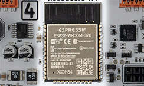

# ESP32

ESP32 processor comes with large set of features already integrated in Arduino framework. Many useful things like wireless connectivity, advanced GPIO control and file systems can be used right away without additional libraries. All of it can be found in official ESP32 Arduino documentation and examples.

- [Arduino ESP32 documentation](https://docs.espressif.com/projects/arduino-esp32/en/latest/libraries.html#apis){target="_blank"}
- [Arduino ESP32 examples](https://github.com/totemmaker/TotemArduinoBoards/tree/master/libraries){target="_blank"}
- [ESP32 datasheet](https://www.espressif.com/sites/default/files/documentation/esp32_datasheet_en.pdf){target="_blank"}

## Software

RoboBoard Arduino software is based on official ESP32 support to maintain compatibility with third-party libraries and tutorials. All standard functionality is available in addition with Totem RoboBoard functions. For more details read [API section](index.md).

### FreeRTOS

ESP32 software is integrated with FreeRTOS (Real-time operating system for microcontrollers) allowing to utilize both cores and use multithreading features. Processes can be split into asynchronous tasks and controlled with mutex, timers, queues and other operating system utilities.  
Default task allocation:  
• **Core 0** - WiFi, Bluetooth, TotemApp, motor driving, other background tasks.  
• **Core 1** - Arduino sketch (`setup()`, `loop()`), events.  

ESP32 FreeRTOS [documentation](https://docs.espressif.com/projects/esp-idf/en/latest/esp32/api-reference/system/freertos_idf.html){target="_blank"} | [examples](https://github.com/totemmaker/TotemArduinoBoards/tree/master/libraries/ESP32/examples/FreeRTOS){target="_blank"}

### Storage

ESP32 contains a total of 8MB flash memory. It is split into separate partitions for whole system to function. Exact partition table can be found in file [default_8MB.csv](https://github.com/totemmaker/TotemArduinoBoards/blob/master/tools/partitions/default_8MB.csv){target="_blank"}.

- `nvs` (20KB) - storage for [`Board.settingsSave()`](board.md#settingsSave) and [Preferences](#preferences) library.
- `otadata` (8KB) - holds current state of `app` partitions.
- `app0` - (3.3MB) - holds Arduino sketch code.
- `app1` - (3.3MB) - second Arduino sketch bank. Loaded during OTA update.
- `spiffs` - (1.5MB) - file system (storage) for holding large data and files.  
Files can be created and handled using [`FS.h`](https://github.com/totemmaker/TotemArduinoBoards/blob/master/libraries/FS/src/FS.h){target="_blank"} and [`SPIFFS.h`](https://github.com/totemmaker/TotemArduinoBoards/blob/master/libraries/SPIFFS/src/SPIFFS.h){target="_blank"}.
- `coredump` - (65KB) - stores core dumps during system crash.

_Note: while total amount of flash is 8MB - only 3.3MB can be used for single Arduino sketch. To overcome this limit - different partition table should be selected._

Examples:

- [SPIFFS file system](https://github.com/totemmaker/TotemArduinoBoards/tree/master/libraries/SPIFFS/examples){target="_blank"} - handle files inside `spiffs` partition.
- [Wi-Fi File Browser](https://github.com/totemmaker/TotemArduinoBoards/tree/master/libraries/WebServer/examples/FSBrowser){target="_blank"} - website to view files in `spiffs` partition.

### Preferences

Library used for storing user settings in flash memory. Will be preserved during power off.

Preferences [documentation](https://docs.espressif.com/projects/arduino-esp32/en/latest/api/preferences.html){target="_blank"} | [examples](https://github.com/totemmaker/TotemArduinoBoards/tree/master/libraries/Preferences/examples){target="_blank"}

## Radio

### Wi-Fi

ESP32 has integrated Wi-Fi capability. May be used to connect home network and access the Internet. From there possibilities are endless.  

Wi-Fi [documentation](https://docs.espressif.com/projects/arduino-esp32/en/latest/api/wifi.html){target="_blank"} | examples:  

- [Wi-Fi](https://github.com/totemmaker/TotemArduinoBoards/tree/master/libraries/WiFi/examples){target="_blank"} - connect to Wi-Fi networks.
- [Web Server](https://github.com/totemmaker/TotemArduinoBoards/tree/master/libraries/WebServer/examples){target="_blank"} - host website on ESP32 itself.
- [mDNS](https://github.com/totemmaker/TotemArduinoBoards/tree/master/libraries/ESPmDNS/examples){target="_blank"} - host local website with address `http://esp32.local`.
- [Network time](https://github.com/totemmaker/TotemArduinoBoards/blob/master/libraries/ESP32/examples/Time/SimpleTime/SimpleTime.ino){target="_blank"} - get correct time and date from the Internet.
- [Captive Portal](https://github.com/totemmaker/TotemArduinoBoards/blob/master/libraries/DNSServer/examples/CaptivePortal/CaptivePortal.ino){target="_blank"} - display website when connected to ESP32.
- [NetBIOS](https://github.com/totemmaker/TotemArduinoBoards/blob/master/libraries/NetBIOS/examples/ESP_NBNST/ESP_NBNST.ino){target="_blank"} - allow to find ESP32 on local network.
- [AsyncUDP](https://github.com/totemmaker/TotemArduinoBoards/tree/master/libraries/AsyncUDP/examples){target="_blank"} - broadcast using UDP protocol.
- [HTTP Client](https://github.com/totemmaker/TotemArduinoBoards/tree/master/libraries/HTTPClient/examples){target="_blank"} - access other websites (web browser).
- [Arduino OTA](https://github.com/totemmaker/TotemArduinoBoards/tree/master/libraries/ArduinoOTA/examples){target="_blank"} - upload ESP32 firmware binary over Wi-Fi.
- [Web Firmware update](https://github.com/totemmaker/TotemArduinoBoards/tree/master/libraries/HTTPUpdateServer/examples/WebUpdater){target="_blank"} - ESP32 firmware update web server.
- [HTTP Firmware update](https://github.com/totemmaker/TotemArduinoBoards/tree/master/libraries/HTTPUpdate/examples){target="_blank"} - update ESP32 firmware from URL.

### ESP-NOW

A communication protocol developed by Espressif. Alternative to Wi-Fi and Bluetooth solutions. Based on 2.4 Ghz frequency, allows for long distance communication and compatible with legacy ESP8266 chips.

ESP-NOW [documentation](https://docs.espressif.com/projects/arduino-esp32/en/latest/api/espnow.html){target="_blank"} | [examples](https://github.com/totemmaker/TotemArduinoBoards/tree/master/libraries/ESP32/examples/ESPNow/){target="_blank"}

### Bluetooth (classic)

Older Bluetooth (classic) standard used for multiple purposes like audio headset (A2DP), Serial Port Profile (SPP) and other.  
In Arduino environment mostly used with [`BluetoothSerial.h`](https://github.com/totemmaker/TotemArduinoBoards/blob/master/libraries/BluetoothSerial/src/BluetoothSerial.h){target="_blank"} functionality to connect with PC over Bluetooth virtual serial port. Allows printing to Serial Monitor without USB connected.

BluetoothSerial [documentation](https://docs.espressif.com/projects/arduino-esp32/en/latest/api/bluetooth.html){target="_blank"} | [examples](https://github.com/totemmaker/TotemArduinoBoards/tree/master/libraries/BluetoothSerial/examples){target="_blank"}

### Bluetooth Low Energy

Bluetooth standard introduced in Bluetooth 4.0 specification. Consumes less power, but works differently compared to old standard. Mainly used to connect with smartphones ([Totem App](../../remote-control/app/index.md).

Custom Bluetooth services and implementations can be also created. See information below.

BLE [documentation](https://docs.espressif.com/projects/arduino-esp32/en/latest/api/ble.html){target="_blank"} | [examples](https://github.com/totemmaker/TotemArduinoBoards/tree/master/libraries/BLE/examples){target="_blank"} | 
[Simple BLE library](https://github.com/totemmaker/TotemArduinoBoards/blob/master/libraries/SimpleBLE/examples/SimpleBleDevice/SimpleBleDevice.ino){target="_blank"}

## Hardware

### Reset Reason

Read processor restart reason upon power on. There are multiple situation how this could happen. Mainly used for detecting unexpected faults.

Reset Reason [documentation](https://docs.espressif.com/projects/arduino-esp32/en/latest/api/reset_reason.html){target="_blank"} | [example](https://github.com/totemmaker/TotemArduinoBoards/blob/master/libraries/ESP32/examples/ResetReason/ResetReason.ino){target="_blank"}

### Deep Sleep

Put processor into deep sleep state to turn it off and use only a fraction of power. It will boot up (wake) after specified `time` (other conditions are also possible). Mainly used with power saving applications.  

<h4 class="apidec" id="deepSleep">
ESP.deepSleep(<code>time</code>)
<a class="headerlink" href="#deepSleep" title="Permanent link">¶</a></h4>
: **Parameter:**  
`time` - wake up time in microseconds (μs).  

Deep Sleep [documentation](https://docs.espressif.com/projects/arduino-esp32/en/latest/api/deepsleep.html){target="_blank"} | [examples](https://github.com/totemmaker/TotemArduinoBoards/tree/master/libraries/ESP32/examples/DeepSleep){target="_blank"}

### Timer

ESP32 contains 4, 64-bit hardware timers to perform precise timing operations.  
Used as configurable counter or alarm interrupts at specified time.  

Timer [documentation](https://docs.espressif.com/projects/arduino-esp32/en/latest/api/timer.html){target="_blank"} | [examples](https://github.com/totemmaker/TotemArduinoBoards/tree/master/libraries/ESP32/examples/Timer){target="_blank"} | [Ticker library](https://github.com/totemmaker/TotemArduinoBoards/tree/master/libraries/Ticker/examples){target="_blank"}
