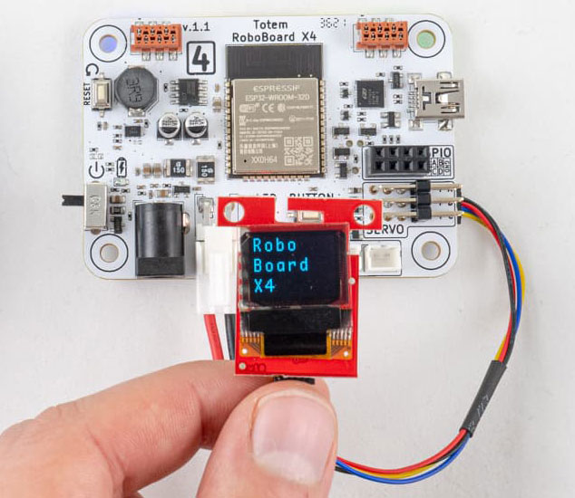

# GPIO / Qwiic

[{width="500"}](../../assets/images/roboboard/roboboard-x4-gpio.png)

RoboBoard contains GPIO pins for hooking up external electronics. Can be used for simple input, output operations or with communication protocols (UART, I2C, SPI, ...).  
Works same as any other Arduino development board (like [TotemDuino](../../totemduino/index.md)).  
Additional [Qwiic port](#qwiic-port) is available to connect external I2C modules.  

- [General Input/Output documentation](https://docs.espressif.com/projects/arduino-esp32/en/latest/api/gpio.html){target="_blank"}
- [ADC (analog) API documentation](https://docs.espressif.com/projects/arduino-esp32/en/latest/api/adc.html){target="_blank"}
- [Arduino API reference](https://www.arduino.cc/reference/){target="_blank"}

```arduino title="Picture above example code"
void setup() {
  Serial.begin(115200); // Start serial at 115200 baud rate
  pinMode(GPIOC, OUTPUT); // Set GPIOC to OUTPUT (HIGH or LOW)
  pinMode(GPIOD, INPUT_PULLUP); // Set GPIOD to INPUT (pull HIGH)
}
void loop() {
  // If RoboBoard button is pressed - pulsate LED on GPIOC pin 
  if (Button.isPressed()) {
    for(int i=0; i<255; i+=15) { analogWrite(GPIOC, i); delay(10); }
    for(int i=255; i>0; i-=15) { analogWrite(GPIOC, i); delay(10); }
    return;
  }
  // Check if button is pressed (connects to GND)
  if (digitalRead(GPIOD) == LOW) Serial.print("Button press, ");
  // Read potentiometer position 0-4095
  Serial.println(analogRead(GPIOA)); // Read pin GPIOA analog
  delay(100); // Wait 100ms
  digitalWrite(GPIOC, LOW); // Turn LED on
  delay(100); // Wait 100ms
  digitalWrite(GPIOC, HIGH); // Turn LED off
}
```

{style="height:130px"}
{style="height:130px"}

_RoboBoard X3 pins are named **IO26**, **IO32**, **IO33**, SIGA, SIGB.  
RoboBoard X4 pins are named **GPIOA**, **GPIOB**, **GPIOC**, **GPIOD**.  
Additional GND (Ground) and VCC (3.3V) pins available.  
Instructions are the same for both boards._

***

## Using I2C

[{width="500"}](../../assets/images/roboboard/roboboard-x4-i2c.png)

I^2^C (Inter-Integrated Circuit) / TWI (Two-wire Interface) communication protocol used for controlling many different devices and modules. Main communication protocol of [Qwiic port](#qwiic-port).  
In Arduino environment it is called "Wire".

General I2C [documentation](https://docs.espressif.com/projects/arduino-esp32/en/latest/api/i2c.html){target="_blank"} | [examples](https://github.com/totemmaker/TotemArduinoBoards/tree/master/libraries/Wire/examples){target="_blank"}

`Wire` object is mapped to pins of [Qwiic port](#qwiic-port) and [IMU sensor](imu.md).  
To start I2C - include `Wire.h` file and call `#!arduino Wire.begin()` inside `setup()` function to run with default parameters. A few more options available:

- `#!arduino Wire.begin()` - set default pins and frequency (speed) to 100kHz.
- `#!arduino Wire.begin(SDA, SCL, 400000)` - set default pins with 400kHz speed.
- `#!arduino Wire.begin(GPIOA, GPIOB, 400000)` - set to GPIOA, GPIOB pins with 400kHz speed.
- `#!arduino Wire.begin(GPIOA, GPIOB)` - set to GPIOA, GPIOB pins with 100kHz speed.
- `#!arduino Wire.setPins(GPIOA, GPIOB)` - set to GPIOA, GPIOB pins before calling `#!arduino Wire.begin()`. Used to change SDA, SCL pins for libraries that calls `#!arduino Wire.begin()` internally.

```{.arduino .yaml .annotate .title="Control SSD1306 display with RoboBoard X4"}
#include <Wire.h>
#include <Adafruit_GFX.h> // (1) Adafruit-GFX library
#include <Adafruit_SSD1306.h> // (2) Adafruit_SSD1306 library

Adafruit_SSD1306 display(128, 64);

void setup() {
  delay(500); // Wait for display to turn on
  // Set I2C SDA pin to GPIOA
  // Set I2C SCL pin to GPIOB
  // (other pins can be used also)
  Wire.setPins(GPIOA, GPIOB);
  // Initialize display (Wire.begin() is called inside library)
  if(!display.begin(SSD1306_SWITCHCAPVCC, 0x3C)) {
    for(;;); // Don't proceed, loop forever
  }
  // Print text
  display.clearDisplay(); // Clear the buffer
  display.setTextSize(2); // Change text size
  display.setTextColor(SSD1306_WHITE); // Set color
  display.setCursor(10, 25); // Center
  display.println("RoboBoard"); // Set text
  display.display(); // Write to display
}

void loop() {
  
}
```

1. [https://github.com/adafruit/Adafruit-GFX-Library](https://github.com/adafruit/Adafruit-GFX-Library){target="_blank"}
2. [https://github.com/adafruit/Adafruit_SSD1306](https://github.com/adafruit/Adafruit_SSD1306){target="_blank"}

***

ESP32 has two I2C channels: `Wire` (mapped to [Qwiic port](#qwiic-port)) and `Wire1` (free to use).  
It's recommended to use `Wire1` with GPIO pins, as it allows simultaneous use of Qwiic port and GPIO pins. Most Arduino libraries expects to communicate over `Wire`.

??? abstract "Example using Wire1 with GPIO"
    ```{.arduino .yaml .annotate}
    #include <Wire.h>
    #include <Adafruit_GFX.h> // (1) Adafruit-GFX library
    #include <Adafruit_SSD1306.h> // (2) Adafruit_SSD1306 library
    // Change to second "Wire1" I2C peripheral
    Adafruit_SSD1306 display(128, 64, &Wire1);

    void setup() {
      delay(500); // Wait for display to turn on
      // Set Wire1 I2C SDA pin to GPIOA
      // Set Wire1 I2C SCL pin to GPIOB
      // (other pins can be used also)
      Wire1.setPins(GPIOA, GPIOB);
      // Initialize display (Wire1.begin() is called inside library)
      if(!display.begin(SSD1306_SWITCHCAPVCC, 0x3C)) {
        for(;;); // Don't proceed, loop forever
      }
      // Print text
      display.clearDisplay(); // Clear the buffer
      display.setTextSize(2); // Change text size
      display.setTextColor(SSD1306_WHITE); // Set color
      display.setCursor(10, 25); // Center
      display.println("RoboBoard"); // Set text
      display.display(); // Write to display
    }

    void loop() {
      
    }
    ```

    1. [https://github.com/adafruit/Adafruit-GFX-Library](https://github.com/adafruit/Adafruit-GFX-Library){target="_blank"}
    2. [https://github.com/adafruit/Adafruit_SSD1306](https://github.com/adafruit/Adafruit_SSD1306){target="_blank"}

## Using UART (Serial)

[{width="550"}](../../assets/images/roboboard/roboboard-x4-uart.png)

UART (Universal Asynchronous Receiver / Transmitter) protocol is a base of most Serial communications. Can be used to communicate with external devices or printing debug messages inside Serial Monitor. Uses two wires **TX**, **RX** for transmit and receive. Both devices (on both ends) has to use same **baud rate** (communication speed).  
In Arduino environment it is called "Serial".

Serial API [documentation](https://www.arduino.cc/reference/en/language/functions/communication/serial/){target="_blank"} | [examples](https://github.com/totemmaker/TotemArduinoBoards/tree/master/libraries/ESP32/examples/Serial){target="_blank"}

ESP32 has three separate UART channels:

- `Serial` - standard one, mapped to USB (for printing to Serial Monitor).
- `Serial1` - free to use. Recommended with GPIO pins.
- ~~`Serial2`~~ - not available on X4, _but may be used with X3_.

_`Serial` object can be also mapped to GPIO pins if required._

```arduino title="Example using Serial1 with GPIO pins"
void setup() {
  // Map GPIOC to TX <-> FTDI RX
  // Map GPIOD to RX <-> FTDI TX
  // (other pins can be used also)
  // Begin UART over GPIO pins (config: 8bit data, 1 stop bit, no parity)
  Serial1.begin(115200, SERIAL_8N1, GPIOD, GPIOC); // baud, config, rx, tx
}
int counter;
void loop() {
  // Use "Serial1" to print over GPIO pins
  Serial1.print("Test ");
  Serial1.println(counter++);
  delay(100);
}
```

## Using SPI

[{width="550"}](../../assets/images/roboboard/roboboard-x4-spi.png)

Serial Peripheral Interface is commonly used for fast communication speed (up to 40 MHz). Uses 4 wires (CS, SCK, MISO, MOSI).  
In Arduino environment it is called "SPI".

SPI [documentation](https://docs.arduino.cc/learn/communication/spi){target="_blank"}

```arduino
#include <SPI.h>

// Set GPIOD pin as "CS"
const static int CS = GPIOD;

void setup() {
  // Set CS pin as output
  pinMode(CS, OUTPUT);
  // Set SPI pins SCK, MISO, MOSI
  // (other pins can be used also)
  SPI.begin(GPIOC, GPIOB, GPIOA);
  // Write byte 0x55 over SPI
  SPI.beginTransaction(SPISettings()); // Transaction settings can be added
  digitalWrite(CS, LOW); // Pull CS pin LOW to initiate transfer
  SPI.transfer(0x55); // Transfer byte 0x55
  digitalWrite(CS, HIGH); // Pull CS pin HIGH to end transfer
  SPI.endTransaction(); // End transaction
}

void loop() {
  
}
```

## Using other peripherals

GPIO pins can be used with multiple peripherals. Each one has its own advantages and use cases. View full list:

- **ADC** - read pin analog value (voltage).  
[documentation](https://docs.espressif.com/projects/arduino-esp32/en/latest/api/adc.html){target="_blank"} | [example](https://github.com/totemmaker/TotemArduinoBoards/blob/master/libraries/ESP32/examples/AnalogRead/AnalogRead.ino){target="_blank"}
- **DAC** - output pin analog value (voltage).  
[documentation](https://docs.espressif.com/projects/arduino-esp32/en/latest/api/dac.html){target="_blank"}
- **Digital IO** - output pin digital value (GND or VCC).  
[documentation](https://docs.espressif.com/projects/arduino-esp32/en/latest/api/gpio.html){target="_blank"}
- **I2C** - two wire, master-slave protocol.  
[documentation](https://docs.espressif.com/projects/arduino-esp32/en/latest/api/i2c.html){target="_blank"} | [examples](https://github.com/totemmaker/TotemArduinoBoards/tree/master/libraries/Wire/examples){target="_blank"}
- **I2S** - serial bus for digital audio (mic and speakers).  
[documentation](https://docs.espressif.com/projects/arduino-esp32/en/latest/api/i2s.html){target="_blank"} | [examples](https://github.com/totemmaker/TotemArduinoBoards/tree/master/libraries/I2S/examples){target="_blank"}
- **LEDC** - LED Control peripheral, PWM generator.  
[documentation](https://docs.espressif.com/projects/arduino-esp32/en/latest/api/ledc.html) | [examples](https://github.com/totemmaker/TotemArduinoBoards/tree/master/libraries/ESP32/examples/AnalogOut)
- **RMT** - send infrared or neopixel messages.  
[documentation](https://docs.espressif.com/projects/arduino-esp32/en/latest/api/rmt.html){target="_blank"} | [examples](https://github.com/totemmaker/TotemArduinoBoards/tree/master/libraries/ESP32/examples/RMT){target="_blank"}
- **SigmaDelta** - sigma delta modulation generator.  
[documentation](https://docs.espressif.com/projects/arduino-esp32/en/latest/api/sigmadelta.html){target="_blank"} | [example](https://github.com/totemmaker/TotemArduinoBoards/blob/master/libraries/ESP32/examples/AnalogOut/SigmaDelta/SigmaDelta.ino){target="_blank"}
- **SPI** - Serial Peripheral Interface. Fast master-slave communication.  
[documentation](https://docs.espressif.com/projects/arduino-esp32/en/latest/api/spi.html){target="_blank"} | [examples](https://github.com/totemmaker/TotemArduinoBoards/tree/master/libraries/SPI/examples){target="_blank"}
- **Touch** - pin touch sensor (capacitive).  
[documentation](https://docs.espressif.com/projects/arduino-esp32/en/latest/api/touch.html){target="_blank"} | [examples](https://github.com/totemmaker/TotemArduinoBoards/tree/master/libraries/ESP32/examples/Touch){target="_blank"}
- **TWAI (CANbus)** - Two-Wire Automotive Interface (CAN bus).  
_Used internally for TotemBUS._  
[examples](https://github.com/totemmaker/TotemArduinoBoards/tree/master/libraries/ESP32/examples/TWAI){target="_blank"}

## Arduino pin names

These definitions (A0, DAC2, ...) can be used in Arduino code instead of pin name or number.  
Empty field (-) means pin does not have that functionality.  
SPI can be mapped to any pin. Only default definitions are specified.

=== "RoboBoard X3"
    Pin definitions of RoboBoard X3 (v3.0) board.

    | Name | Number | [SPI](https://www.arduino.cc/reference/en/language/functions/communication/spi/){target="_blank"} | [Analog](https://docs.espressif.com/projects/arduino-esp32/en/latest/api/adc.html){target="_blank"} | [DAC](https://docs.espressif.com/projects/arduino-esp32/en/latest/api/dac.html){target="_blank"} | [Touch](https://docs.espressif.com/projects/arduino-esp32/en/latest/api/touch.html){target="_blank"} |
    | - | - | - | - | - | - |
    | **IO26** | 26 | MOSI | A0 | DAC2 | T0 |
    | **IO32** | 32 | MISO | A1 | - | T1 |
    | **IO33** | 33 | SCK | A2 | - | - |
    | _SIGA_ | 25 | - | - | DAC1 | - |
    | _SIGB_ | 14 | SS | - | - | T2 |

    _Note: SIG pins are only available if motor is not connected._

=== "RoboBoard X4"
    Pin definitions of RoboBoard X4 (v1.1) board.

    | Name | Number | [SPI](https://www.arduino.cc/reference/en/language/functions/communication/spi/){target="_blank"} | [Analog](https://docs.espressif.com/projects/arduino-esp32/en/latest/api/adc.html){target="_blank"} | [DAC](https://docs.espressif.com/projects/arduino-esp32/en/latest/api/dac.html){target="_blank"} | [Touch](https://docs.espressif.com/projects/arduino-esp32/en/latest/api/touch.html){target="_blank"} |
    | - | - | - | - | - | - |
    | **GPIOA** | 14 | MOSI | A0 | - | T0 |
    | **GPIOB** | 23 | MISO | - | - | - |
    | **GPIOC** | 25 | SCK | A2 | DAC1 | - |
    | **GPIOD** | 26 | SS | A3 | DAC2 | - |

## Qwiic port


A connection system to attach third-party I2C modules. This allows to choose from many available sensors and other interface devices. Small and sturdy connector eliminates need for soldering and enables plug-and-play style modular systems. Each module comes with its own Arduino library (supplied by manufacturer).

This port is compatible with SparkFun Qwiic and Adafruit STEMMA QT modules.  

### Connector

It uses 4-pin SM04B-SRSS-TB connector with I2C communication and 3.3V power line. Modules usually contain 2 connectors for joining multiple of them (daisy-chaining).  
Single RoboBoard Qwiic port can host multiple modules.

{style="width: 350px; height: 80px; object-fit: cover; object-position: 0% 68%;"}

**Wire color pinout:**  
• Black = **GND**  
• Red = <span style="color:red">3.3V</span>  
• Blue = <span style="color:blue">SDA</span>  
• Yellow = <span style="color:#FFC300">SCL</span>  

### Installing modules

When module is connected to the RoboBoard - it will simply power on but won't do anything. To make any use of it - you need to install Arduino library, specific to connected module. It should be provided by manufacturer. Libraries also contain example code, explaining how to use it.

### Usage example

{width=500px}

Code example to display text as in picture:  

```{.arduino .yaml .annotate}
#include <Wire.h>
#include <SFE_MicroOLED.h> // (1) SparkFun Micro OLED Breakout library

#define PIN_RESET GPIOA    // Not used
MicroOLED oled(PIN_RESET); // I2C declaration

void setup() {
  Wire.begin(); // Initialize I2C
  
  oled.begin(0x3D, Wire); // Initialize OLED
  
  oled.clear(ALL); // Clear display internal memory
  oled.clear(PAGE); // Clear buffer

  oled.setFontType(1); // Change font for bigger letters
    
  oled.setCursor(0, 0); // Set cursor to top-left
  
  oled.println("Robo"); // Print text
  oled.println("Board");
  oled.println("X4");
  
  oled.display();  // Display what's in the buffer
}

void loop() {
  
}
```

1. [https://github.com/sparkfun/SparkFun_Micro_OLED_Arduino_Library](https://github.com/sparkfun/SparkFun_Micro_OLED_Arduino_Library){target="_blank"}

### Qwiic vs STEMMA QT

A different brand names describing same connector and pin order. One is introduced by SparkFun, another by - Adafruit.

- **STEMMA QT** modules - works with 3.3V and 5V microcontrollers (like Arduino UNO).
- **Qwiic** modules - **works with 3.3V microcontrollers only!** (can't use with Arduino UNO).

Totem RoboBoard is 3.3V so both brand modules can be used.

## Internal pin mapping

A list of ESP32 pins that are assigned to specific functions inside RoboBoard. Only for reference and shouldn't be accessed directly. Used internally by [RoboBoard API](index.md).

=== "RoboBoard X3"
    | Number | Name | Description |
    | - | - | - |
    | 1 | Serial TX | UART communication over USB |
    | 3 | Serial RX | UART communication over USB |
    | 15 | SDA | I2C bus pin routed to IMU and Qwiic port. Has external 2k2 Ohm pull-up |
    | 5 | SCL | I2C bus pin routed to IMU and Qwiic port. Has external 2k2 Ohm pull-up |
    | 26 | IO26 | GPIO pin |
    | 32 | IO32 | GPIO pin |
    | 33 | IO33 | GPIO pin |
    | 22 | MOTORA_INA | DC motor port A pin 0 |
    | 12 | MOTORA_INB | DC motor port A pin 1 |
    | 23 | MOTORB_INA | DC motor port B pin 0 |
    | 19 | MOTORB_INB | DC motor port B pin 1 |
    | 18 | MOTORC_INA | DC motor port C pin 0 |
    | 21 | MOTORC_INB | DC motor port C pin 1 |
    | 4 | MOTORD_INA | DC motor port D pin 0 |
    | 2 | MOTORD_INB | DC motor port D pin 1 |
    | 25 | SERVOA_IN | Servo motor port A (SIG) |
    | 14 | SERVOB_IN | Servo motor port B (SIG) |
    | 0 | BUTTON | BOOT button |
    | 13 | RGB | RGB light strip data pin |
    | 27 | 3V3_EN | Peripheral 3.3V LDO enable pin |
    | 34 | BATTERY_FULL | State of battery charging (if full) |
    | 35 | BATTERY_CHARGE | State of battery charging (if charging) |
    | 36 | BATTERY_CURRENT | Battery current measurement |
    | 37 | BATTERY_VOLTAGE | Battery voltage measurement |
    | 38 | USB_DETECT | State of USB port (is plugged in) |
    | 39 | IMU_INT | IMU chip interrupt pin |
=== "RoboBoard X4"
    | Number | Name | Description |
    | - | - | - |
    | 1 | Serial TX | UART communication over USB |
    | 3 | Serial RX | UART communication over USB |
    | 21 | SDA | I2C bus pin routed to IMU and Qwiic port. Has external 2k2 Ohm pull-up |
    | 22 | SCL | I2C bus pin routed to IMU and Qwiic port. Has external 2k2 Ohm pull-up |
    | 14 | GPIOA | GPIO pin |
    | 23 | GPIOB | GPIO pin |
    | 25 | GPIOC | GPIO pin |
    | 26 | GPIOD | GPIO pin |
    | 17 | CAN_TX | CAN bus transmit pin routed to TotemBUS |
    | 34 | CAN_RX | CAN bus receive pin routed to TotemBUS |
    | 5 | CAN_EN | CAN bus transceiver enable (active LOW) |
    | 4 | DRIVER_DFU | Device Firmware Update pin of STM32 co-processor |
    | 15 | DRIVER_RESET | Reset pin of STM32 co-processor |
    | 16 | DRIVER_RX | UART RX pin of STM32 co-processor |
    | 27 | DRIVER_TX | UART TX pin of STM32 co-processor |
    | 13 | LED | Status LED bellow ESP32 |
    | 18 | BUTTON | User button below ESP32 |
    | 39 | USB_DETECT | State of USB port (is plugged in) |
    | 36 | BATTERY_VOLTAGE | Battery voltage measurement |
    | 35 | IMU_INT | IMU chip interrupt pin (v1.1 only) |
    | 14 | IMU_INT | IMU chip interrupt pin (v1.0 only) |

## RoboBoard X4 v1.0 GPIO

First revision of RoboBoard X4 had GPIO pins connected to co-processor instead of ESP32. For this reason Arduino API can't be used and special commands are required to interact. This also limits to digital read / write and analog read / write only.

??? abstract "GPIO control functions (click to expand)"

    **X410_digitalWrite(`pin`, `state`)**  
    : Set GPIO pin state. Works similar like Arduino function `digitalWrite()`.  
    Calling this function will reconfigure pin to output.  
    **Parameter:**  
    `pin` - pin number [`0`:`3`]  
    `state` - GND (0V) or VCC (3.3V) [`LOW`:`HIGH`]  

    (`state`) **X410_digitalRead(`pin`)**  
    : Read GPIO pin state. Works similar like Arduino function `digitalRead()`.  
    Calling this function will reconfigure pin to input.  
    **Returns:**  
    `pin` - pin number [`0`:`3`]  
    `state` - GND (0V) or VCC (3.3V) [`LOW`:`HIGH`]  

    **X410_analogWrite(`pin`, `value`)**  
    : Set GPIO pin analog value. Works similar like Arduino function `analogWrite()`.
    Calling this function will reconfigure pin to output.  
    **Parameter:**  
    `pin` - pin number [`0`:`3`]  
    `value` - analog value [`0`:`20`]. (0, 10, 20) = (0V, 1.65V, 3.3V).
    
    (`value`) **X410_analogRead(`pin`)**  
    : Read GPIO pin analog value. Works similar like Arduino function `analogRead()`.
    Calling this function will reconfigure pin to output.  
    **Returns:**  
    `pin` - pin number [`0`:`3`]  
    `value` - analog value [`0`:`1023`]. (0, 512, 1023) = (0V, 1.65V, 3.3V).

    **X410_pinMode(`pin`, `mode`)**  
    : Turn on GPIO pin pulldown or pullup resistor. Works similar like Arduino function `pinMode(pin, INPUT_PULLUP)`.  
    **Parameter:**  
    `pin` - pin number [`0`:`3`]  
    `mode` - turn on pulldown or pullup [`LOW`:`HIGH`]. (LOW, HIGH) = (GND (0V), VCC (3.3V)).  

    **Example:**  
    ```arduino
    void loop() {
      // Toggle GPIOA pin
      X410_digitalWrite(GPIOA, HIGH);
      delay(1000);
      X410_digitalWrite(GPIOA, LOW);
      delay(1000);
    }
    ```
