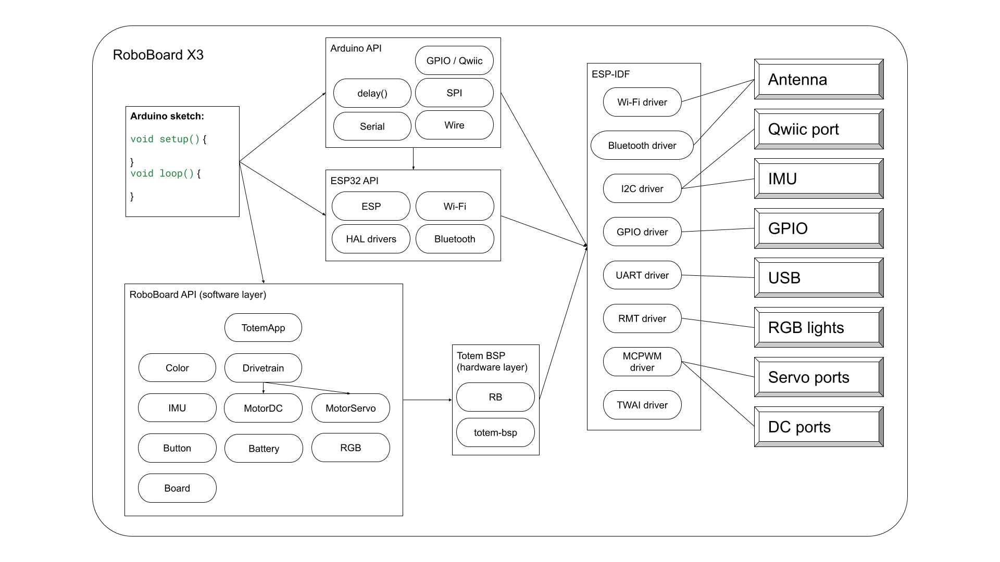
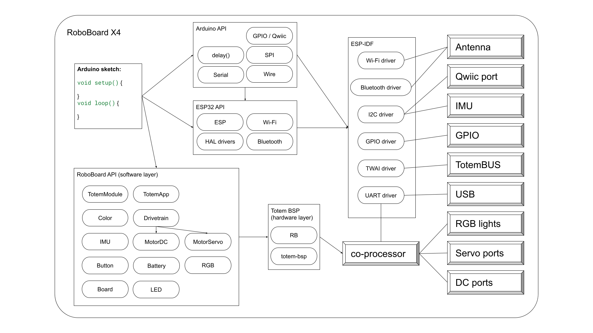

# API Reference

Application Programming Interface. A set of functions to control various board features.  
It consists of standard ESP32 Arduino implementation with addition of Totem software for RoboBoard. This whole package allows to use it as standard Arduino development board with additional capabilities.

_Note: Some features may be available with specific RoboBoard only. Such differences are marked with `X3 only`{style="background:lightBlue"}, `X4 only`{style="background:lightBlue"} tags._

## Software structure 

=== "RoboBoard X3"
    [](../../assets/images/roboboard/roboboard-x3-structure.png)
=== "RoboBoard X4"
    [](../../assets/images/roboboard/roboboard-x4-structure.png)

Software package is divided into parts:  

- **Arduino API** - official Arduino programming functions [Arduino Reference](https://www.arduino.cc/reference/){target="_blank"}.  
Universal across all Arduino boards. Used by third-party Arduino libraries.  
- **ESP32 API** - processor specific functions and additional [esp32-hal drivers](#hal-drivers).  
Ties ESP32 with Arduino framework and provides extended peripheral functionality.  
- **ESP-IDF** - official [Espressif development framework](https://github.com/espressif/esp-idf){target="_blank"} contains all [ESP32 drivers](https://github.com/espressif/esp-idf/tree/master/components){target="_blank"}.  
Layer between hardware and software. Provides all required tools and drivers for ESP32.  
- **RoboBoard API** - additional RoboBoard functionality provided by Totemmaker.  
Includes board control functions [totem-bsp](https://github.com/totemmaker/totem-bsp){target=_blank} and other services.

All software parts can be accessed from Arduino sketch, but mainly **Arduino API** and **RoboBoard API** is used.

## Compile definitions

Most of the code works the same on RoboBoard X3 and RoboBoard X4. In case it's required to run different code per each board - use definitions to detect board type at compile time:

```c++
#if ROBOBOARD_X3 // Compiles only on RoboBoard X3
  pinMode(IO32, OUTPUT); // Initialize IO32 pin as output
#endif
#if ROBOBOARD_X4 // Compiles only on RoboBoard X4
  pinMode(GPIOA, OUTPUT); // Initialize GPIOA pin as output
#endif
```

_Note: correct board must be selected in Arduino IDE Board menu._

## Totem Prefix

If there is a conflict between Totem API function names and some library, this option requires to use prefix (C++ namespace) with every totem function:

- PlatformIO: In platformio.ini add: `build_flags = -DREQUIRE_TOTEM_PREFIX`
- Arduino IDE: Select `Tools` → `Totem Prefix` → `totem::Board`

```arduino
void setup() {
    totem::Board.getRevision();
    totem::Battery.getVoltage();
    totem::RGB.color(totem::Color::Red);
}
```

## Multithreading

RoboBoard Arduino implementation has function `addLoop()` to create additional parallel `loop()` tasks. An easy way to control separate actions with `delay()` function.  
All tasks runs on the same **Core 1**, as main `loop()` and only single one is executed at the time.  
_Note: this is not a standard Arduino function and will not compile with other boards!_

<h4 class="apidec" id="addLoop">
<span class="function">addLoop</span>(<code>function</code>)
<a class="headerlink" href="#addLoop" title="Permanent link">¶</a></h4>
: Register new parallel `loop()` function.  
**Parameter:**  
`function` - parallel function name (`loop2()`)  

```c++
int counter0 = 0;
int counter1 = 0;
int counter2 = 0;
int counter3 = 0;

void loop1() {
    if (counter1 <= 3) printf("loop1(): %d\n", counter1++);
}
void loop2() {
    if (counter2 <= 3) printf("loop2(): %d\n", counter2++);
}
void loop3() {
    if (counter3 <= 3) printf("loop3(): %d\n", counter3++);
    
}
void setup() {
    printf("setup()\n");
    addLoop(loop1);
    addLoop(loop2);
    addLoop(loop3);
}

void loop() {
    if (counter0 <= 3) printf("loop0(): %d\n", counter0++);
    // delay(0); // <- switch to other loop earlier
}
```

Loop functions will switch between by reaching end of function or call to `delay()`. Note that `loop()` has priority over added ones, so call to `delay(0)` is required to execute all loops equally. See print output bellow to view the difference:

!!! abstract "Print output"
    === "Without delay(0)"
        ```
        setup()
        loop0(): 0
        loop0(): 1
        loop0(): 2
        loop0(): 3
        loop1(): 0
        loop2(): 0
        loop3(): 0
        loop1(): 1
        loop2(): 1
        loop3(): 1
        loop1(): 2
        loop2(): 2
        loop3(): 2
        loop1(): 3
        loop2(): 3
        loop3(): 3
        ```
    === "With delay(0)"
        ```
        setup()
        loop0(): 0
        loop1(): 0
        loop2(): 0
        loop3(): 0
        loop0(): 1
        loop1(): 1
        loop2(): 1
        loop3(): 1
        loop0(): 2
        loop1(): 2
        loop0(): 3
        loop2(): 2
        loop3(): 2
        loop1(): 3
        loop2(): 3
        loop3(): 3
        ```

## Totem API list

Full list of functionalities and libraries available in Arduino environment for RoboBoard.

- [TotemApp](totemapp.md) - Totem Android/iOS application for RoboBoard control
- [Drivetrain](drivetrain.md) - robot wheel control logic
- [Joystick](drivetrain.md#joystick-input) - raw joystick input converter
- [Battery](battery.md) - acquire battery status
- [Board](board.md) - acquire RoboBoard information and change settings
- [IMU](imu.md) - accelerometer & gyroscope readings
- [RGB](rgb.md) - RGB light controller
- [LED](led.md) - status LED controller
- [Color](rgb.md#color-formats) - list of color names
- [Button](button.md) - physical button input controller
- [IOLED](led.md#external-gpio-led) - external LED controller connected to IO pin
- [IOButton](button.md#external-gpio-button) - external button controller connected to IO pin
- [Servo](servo.md) - servo motor controller interface
- [DC](dc.md) - DC motor controller interface
- [TotemModule11](../../modules/11.md) - TotemBUS Distance module `X4 only`{style="background:lightBlue"}
- [TotemModule14](../../modules/14.md) - TotemBUS Line Follower module `X4 only`{style="background:lightBlue"}
- [TotemModule15](../../modules/15.md) - TotemBUS Potentiometer module `X4 only`{style="background:lightBlue"}
- [TotemModule22](../../modules/22.md) - TotemBUS Environment sensor module `X4 only`{style="background:lightBlue"}


- [`addLoop(func)`](#addLoop) - function to create parallel `loop()` handler
- `initRoboBoard()` - RoboBoard system pre-initialization handler
- `TOTEMMAKER_PLATFORM` - Totem Arduino core for RoboBoard
- `ROBOBOARD_X3` - board RoboBoard X3 is selected during compilation
- `ROBOBOARD_X4` - board RoboBOard X4 is selected during compilation

### Libraries

- [`#include <Totem.h>`](https://github.com/totemmaker/TotemArduino){target=_blank} - remote RoboBoard control. Labboard control

## Espressif API list

- [ESP](https://github.com/totemmaker/TotemArduinoBoards/blob/master/cores/esp32/Esp.h){target="_blank"}
- [Arduino API reference](https://www.arduino.cc/reference/en/){target=_blank}
- [APIs documentation](https://docs.espressif.com/projects/arduino-esp32/en/latest/libraries.html#apis){target=_blank}
- [FreeRTOS API Reference](https://www.freertos.org/a00106.html){target=_blank}

### HAL drivers

Additional ESP32 drivers, providing extended functionality compared to standard Arduino API.

- [esp32-hal-adc.h](https://github.com/totemmaker/TotemArduinoBoards/blob/master/cores/esp32/esp32-hal-adc.h){target="_blank"}
- [esp32-hal-cpu.h](https://github.com/totemmaker/TotemArduinoBoards/blob/master/cores/esp32/esp32-hal-cpu.h){target="_blank"}
- [esp32-hal-dac.h](https://github.com/totemmaker/TotemArduinoBoards/blob/master/cores/esp32/esp32-hal-dac.h){target="_blank"}
- [esp32-hal-i2c-slave.h](https://github.com/totemmaker/TotemArduinoBoards/blob/master/cores/esp32/esp32-hal-i2c-slave.h){target="_blank"}
- [esp32-hal-i2c.h](https://github.com/totemmaker/TotemArduinoBoards/blob/master/cores/esp32/esp32-hal-i2c.h){target="_blank"}
- [esp32-hal-ledc.h](https://github.com/totemmaker/TotemArduinoBoards/blob/master/cores/esp32/esp32-hal-ledc.h){target="_blank"}
- [esp32-hal-log.h](https://github.com/totemmaker/TotemArduinoBoards/blob/master/cores/esp32/esp32-hal-log.h){target="_blank"}
- [esp32-hal-rgb-led.h](https://github.com/totemmaker/TotemArduinoBoards/blob/master/cores/esp32/esp32-hal-rgb-led.h){target="_blank"}
- [esp32-hal-rmt.h](https://github.com/totemmaker/TotemArduinoBoards/blob/master/cores/esp32/esp32-hal-rmt.h){target="_blank"}
- [esp32-hal-sigmadelta.h](https://github.com/totemmaker/TotemArduinoBoards/blob/master/cores/esp32/esp32-hal-sigmadelta.h){target="_blank"}
- [esp32-hal-spi.h](https://github.com/totemmaker/TotemArduinoBoards/blob/master/cores/esp32/esp32-hal-spi.h){target="_blank"}
- [esp32-hal-timer.h](https://github.com/totemmaker/TotemArduinoBoards/blob/master/cores/esp32/esp32-hal-timer.h){target="_blank"}
- [esp32-hal-touch.h](https://github.com/totemmaker/TotemArduinoBoards/blob/master/cores/esp32/esp32-hal-touch.h){target="_blank"}
- [esp32-hal-uart.h](https://github.com/totemmaker/TotemArduinoBoards/blob/master/cores/esp32/esp32-hal-uart.h){target="_blank"}
- [Low level drivers (esp-idf)](https://github.com/totemmaker/TotemArduinoBoards/tree/master/tools/sdk/esp32/include/driver/include/driver){target=_blank}
- [All components (esp-idf)](https://github.com/totemmaker/TotemArduinoBoards/tree/master/tools/sdk/esp32/include){target=_blank}

### Encoding / encryption

- `base64` (#include <base64.h>)
- `MD5Builder` (#include <MD5Builder.h>)

For AES, RSA, SHA and others check: [esp-idf](https://github.com/totemmaker/TotemArduinoBoards/tree/master/tools/sdk/esp32/include/mbedtls/port/include){target=_blank}

### Libraries

- ArduinoOTA - upload ESP32 firmware binary over Wi-Fi  
- BluetoothSerial - Bluetooth Classic Serial communication  
- DNSServer - (CaptivePortal) display website when connected to ESP32  
- EEPROM - legacy user data storage to flash  
- ESP Insights - Espressif diagnostic cloud service  
- ESP RainMaker - Espressif IOT cloud service  
- ESP32 Async UDP - broadcast using UDP protocol  
- ESP32 BLE Arduino - Bluetooth Low Energy communication  
- ESPmDNS - host local website with address `http://esp32.local`  
- FFat - FAT file system  
- HTTPClient - access other websites (web browser)  
- HTTPUpdate - firmware update from HTTP server  
- HTTPUpdateServer - host local website to update firmware  
- I2S - I2C peripheral control library  
- LittleFS - LittleFS file system  
- NetBIOS - make ESP32 discoverable on local network  
- Preferences - library for long term user data storage  
- SD - SD card control library  
- SD_MMC - SD MMC card control library  
- SimpleBLE - advertise basic BLE server  
- SPI - SPI peripheral control library  
- SPIFFS - SPIFFS file system  
- Ticker - function call at specific rate  
- Update - ESP32 firmware update library  
- WebServer - host local website  
- WiFi - WiFi control library  
- WiFiClientSecure - connect to web server using TLS  
- WiFiProv - WiFi provision over BLE or SOFTAP  
- Wire - I2C peripheral control library  
