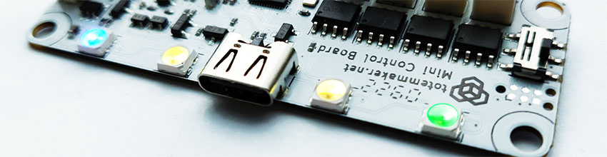

# RGB



Control 4 individual RGB lights (A, B, C, D) located at the edge of RoboBoard. By default it shines "Totem" colors. Can be controlled from smartphone app to customize robot appearance or using API for different colors or animations.

Ways to access specific LED:

- `RGB.A` - control LED A
- `RGB.B` - control LED B
- `RGB.C` - control LED C
- `RGB.D` - control LED D
- `RGB[0]` - control LED A [`1`-B, `2`-C, `3`-D] _(invalid indexes will be ignored)_  
- `RGB` - control all LEDs  

## Code snippets

```c++
// Set all LED
RGB.colorTotem();           // Set all LED to Totem colors
RGB.color(Color::Violet);   // Set all LED to violet color
RGB.color(0xFFFF00);        // Set all LED to yellow color
RGB.color(0, 255, 0);       // Set all LED to green color
RGB.color(Color::random()); // Set all LED to random generated color
// Set single LED
RGB.A.color(Color::White);  // Set RGB A to white color
RGB.B.color(Color::Red);    // Set RGB B to red color
RGB.C.color(0x00FFFF);      // Set RGB C to cyan color
RGB[3].color(0, 0, 255);    // Set RGB D to blue color
// Control functions
RGB.on();             // Turn LED on
RGB.off();            // Turn LED off
RGB.toggle();         // Toggle on/off
// Individual random color
for (int i=0; i<4; i++) {
  RGB[i].color(Color::random());
}
```

***

## Functions

### :traffic_light: Control

Read [Color formats](#color-formats) for more details how color is represented with numbers.

<form>
  <label for="color_picker">Click to pick RGB color:</label>
  <input type="color" id="color_picker" name="color_picker" value="#ff0000">
</form>

<h4 class="apidec" id="colorTotem">
<span class="object">RGB</span>.<span class="function">colorTotem</span>()
<a class="headerlink" href="#colorTotem" title="Permanent link">¶</a></h4>
: Lit up all LED with "Totem" colors (:green_circle: :yellow_circle: :yellow_circle: :blue_circle:).  

<h4 class="apidec" id="color-rgb">
<span class="object">RGB</span>.<span class="function">color</span>(<code>red</code>, <code>green</code>, <code>blue</code>)
<a class="headerlink" href="#color-rgb" title="Permanent link">¶</a></h4>
<h4 class="apidec" id="color-hex">
<span class="object">RGB</span>.<span class="function">color</span>(<code>hex</code>)
<a class="headerlink" href="#color-hex" title="Permanent link">¶</a></h4>
: Set LED color with RGB or HEX format.  
**Parameter:**  
:red_circle: `red` - amount of red color [`0`:`255`]  
:green_circle: `green` - amount of green color [`0`:`255`]  
:blue_circle: `blue` - amount of blue color [`0`:`255`]  
:fontawesome-solid-hashtag: `hex` - hexadecimal color code [`0x000000`:`0xFFFFFF`]  

<h4 class="apidec" id="on">
<span class="object">RGB</span>.<span class="function">on</span>()
<a class="headerlink" href="#on" title="Permanent link">¶</a></h4>
: Turn LED on to last used color.  

<h4 class="apidec" id="off">
<span class="object">RGB</span>.<span class="function">off</span>()
<a class="headerlink" href="#off" title="Permanent link">¶</a></h4>
: Turn LED off.  

<h4 class="apidec" id="toggle">
<span class="object">RGB</span>.<span class="function">toggle</span>()
<a class="headerlink" href="#toggle" title="Permanent link">¶</a></h4>
: Toggle LED between on / off states.  

<h4 class="apidec" id="isOn">
<code>state</code> <span class="object">RGB</span>.<span class="function">isOn</span>()
<a class="headerlink" href="#isOn" title="Permanent link">¶</a></h4>
: Check if LED is currently lit on.  
**Returns:**  
`state` - `true` if lit on. `false` otherwise (off).

<h4 class="apidec" id="getColor">
<code>hex</code> <span class="object">RGB</span>.<span class="function">getColor</span>()
<a class="headerlink" href="#getColor" title="Permanent link">¶</a></h4>
: Get current LED color.  
**Returns:**  
:fontawesome-solid-hashtag: `hex` - hexadecimal color code [`0x000000`:`0xFFFFFF`]  

<h4 class="apidec" id="setState">
<span class="object">RGB</span>.<span class="function">setState</span>(<code>state</code>)
<a class="headerlink" href="#setState" title="Permanent link">¶</a></h4>
: Set LED to specific state (on / off).  
**Parameter:**  
`state` - state on / off [`HIGH`:`LOW`] or [`true`:`false`]  

<h4 class="apidec" id="getState">
<code>state</code> <span class="object">RGB</span>.<span class="function">getState</span>()
<a class="headerlink" href="#getState" title="Permanent link">¶</a></h4>
: Same as `isOn()`.  
**Returns:**  
`state` - `true` if lit on. `false` otherwise (off).

### :material-wrench-cog: Configure

<h4 class="apidec" id="setDim">
<span class="object">RGB</span>.<span class="function">setDim</span>(<code>dimming</code>)
<a class="headerlink" href="#setDim" title="Permanent link">¶</a></h4>
: Limit maximum LED brightness. Default values: X3 - `128`. X4 - `255`.  
**Parameter:**  
`dimming` - [`0`:`255`] maximum brightness.

<h4 class="apidec" id="getDim">
<code>dimming</code> <span class="object">RGB</span>.<span class="function">getDim</span>()
<a class="headerlink" href="#getDim" title="Permanent link">¶</a></h4>
: Get configured LED brightness.  
**Returns:**  
`dimming` - [`0`:`255`] maximum brightness.

<h4 class="apidec" id="setEnable">
<span class="object">RGB</span>.<span class="function">setEnable</span>(<code>state</code>)
<a class="headerlink" href="#setEnable" title="Permanent link">¶</a></h4>
: Enable / disable RGB light. Disabled LED will not lit up.  
**Parameter:**  
`state` - LED is enabled / disabled [`true`:`false`].

<h4 class="apidec" id="getEnable">
<code>state</code> <span class="object">RGB</span>.<span class="function">getEnable</span>()
<a class="headerlink" href="#getEnable" title="Permanent link">¶</a></h4>
: Check if RGB light is enabled.  
**Returns:**  
`state` - LED is enabled / disabled [`true`:`false`].

## Color names

```c++ title="totem-color.h"
namespace Color {
enum {
    IndianRed = 0xFFCD5C5C,
    LightCoral = 0xFFF08080,
    Salmon = 0xFFFA8072,
    Crimson = 0xFFDC143C,
    Red = 0xFFFF0000,
    FireBrick = 0xFFB22222,
    DarkRed = 0xFF8B0000,
    ...
```

Object `Color` contains a list of names with predefined HEX codes. A more convenient way to control LED color, compared to specifying exact RGB values. Full list can be found in [totem-color.h](https://github.com/totemmaker/TotemArduinoBoards/blob/master/tools/totem/include/private/totem-color.h){target="_blank"} file.

### Color formats

<form>
  <label for="color_picker">Click to pick RGB color:</label>
  <input type="color" id="color_picker" name="color_picker" value="#ff0000">
</form>

**Available color formats:**

- :fontawesome-solid-t: _NAME_: `Color::Red`{style="color:red"}, `Color::Violet`{style="color:violet"}, ...  
- :rainbow: _RGB_ value: 8-bit amount [`0`:`255`] of <span style="color:red">Red</span>, <span style="color:green">Green</span>, <span style="color:blue">Blue</span> colors mix.  
- :fontawesome-solid-hashtag: _HEX_ code: hexadecimal color code `0xFFFFFF` (similar to HTML code `#FFFFFF`).  

**HEX format encoding:**

Conversion between HEX and RGB formats.

24-bit: `0xAABBCC` → `0xAA` (170 <span style="color:red">red</span>), `0xBB` (187 <span style="color:green">green</span>), `0xCC` (204 <span style="color:blue">blue</span>).  

**Use with RoboBoard color functions:**

- `#!c++ RGB.color(Color::Violet)` - set color name
- `#!c++ RGB.color(100, 150, 200)` - set color mix of <span style="color:red">Red</span>, <span style="color:green">Green</span>, <span style="color:blue">Blue</span> [`0`:`255`] values
- `#!c++ RGB.color(0xFFAABB)` - set color HEX code [`0x000000`:`0xFFFFFF`]

### Color mix functions

Functions for mixing color from <span style="color:red">R</span><span style="color:green">G</span><span style="color:blue">B</span> values and returning single HEX code. Useful if color has to be stored to `int` variable for later use with `color()` function.

<h4 class="apidec" id="rgb">
<code>hex</code> <span class="object">Color</span>::<span class="function">rgb</span>(<code>red</code>,<code>green</code>,<code>blue</code>)
<a class="headerlink" href="#rgb" title="Permanent link">¶</a></h4>
: Mix color by provided parameters.  
**Returns:** 24-bit color code.  
**Parameter:**  
:red_circle: `red` - amount of red color [`0`:`255`]  
:green_circle: `green` - amount of green color [`0`:`255`]  
:blue_circle: `blue` - amount of blue color [`0`:`255`]  
:fontawesome-solid-hashtag: `hex` - hexadecimal color code [`0x000000`:`0xFFFFFF`]  

<h4 class="apidec" id="random">
<code>hex</code> <span class="object">Color</span>::<span class="function">random</span>()
<a class="headerlink" href="#random" title="Permanent link">¶</a></h4>
: Generate random color.  
**Returns:** 24-bit color code.  
