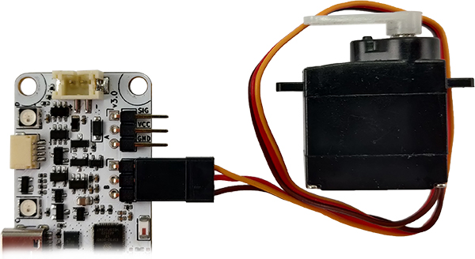
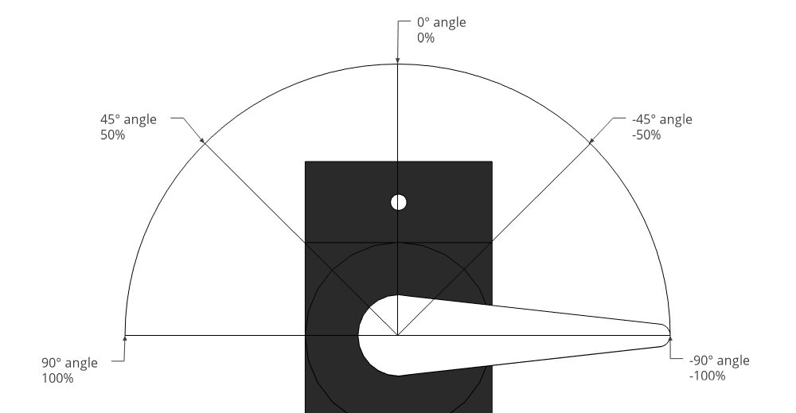
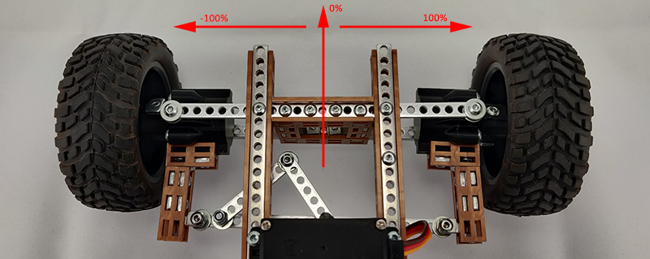

# Servo

{align=left width="50%"}

**Servo wire colors:**   
• Orange = <span style="color:orange">Signal</span> (PWM)  
• Red = <span style="color:red">VCC</span>  
• Brown = <span style="color:brown">GND</span>  

<p style="clear: both;">Motor control interface for RoboBoard 3-pin SERVO ports.<br>Can be accessed for each port individually:</p>

- `Servo.A` - control port A
- `Servo.B` - control port B
- `Servo.C` - control port C <code style="background:lightBlue">X4 only</code>
- `Servo[0]` - control port A [`1`-B, `2`-C] _(invalid indexes will be ignored)_  
- `Servo` - control all ports _("get" functions are not available in this case)_  

Configured for standard **180 degree** servo motors, with pulse duration between **500μs-2500μs** and **period of 20ms (50Hz)**. These parameters can be [customized](#configuration).  

***

!!! info
    Speed control (duration, RPM) is not yet implemented in RoboBoard X3

## Code snippets

```c++ title="Function usage example"
// Control all servo ports
Servo.spinPos(0); // Move to center
Servo.spinPos(60); // Move 60% right
Servo.spinPosDuration(0, 1500); // Move to center in 1.5s
Servo.spinPosRPM(60, 30); // Move 60% right at 30RPM speed
Servo.spinAngle(0); // Move left
Servo.spinAngle(90); // Move to 90° (center)
Servo.spinPulse(1500); // Move to 1500µs (center)
Servo.coast(); // Motor free spin (no hold)
// Stop servo port B
Servo[1].stop();
// Configure servo A port
Servo.A.setInvert(true); // Invert spin direction
Servo.A.setSpeedRPM(30); // Set arm speed to 30RPM
Servo.A.setSpeedS60(0.17); // Set arm speed to 0.17s/60°
Servo.A.setPeriod(20000); // Set period to 20000µs (50Hz)
Servo.A.setTrim(-38, -7, 18); // Map pos to L: -38, C: -7, R: 18
Servo.A.setRange(500, 2500); // Set pulse (µs) limits
```

***



Most servos can turn its arm 180 degrees. This is controlled by applying range of 500-2500 μs (microseconds) pulse to signal wire. This corresponds to servo arm position. For convenience - there are 3 different control units:

- [`spinPos()`](#spinPos) - set position in percentage of range [`-100`:`100`]%. `0` - center.
- [`spinAngle()`](#spinAngle) - set position in angle degrees [`0`:`180`]°. `90` - center.
- [`spinPulse()`](#spinPulse) - set actual microseconds pulse [`500`:`2500`]μs. `1500` - center.

In case [`#!c++ setInvert(true)`](#setInvert) is enabled - servo arm will move to different direction, thus "pos" and "angle" values are inverted. "pulse" stays the same.

## Calibration / trimming

`Servo` contains trimming feature to limit motor position to configured range. Mainly used for car steering with calibrated center position and maximum travel to left and right.



When configured, function [`spinPos()`](#spinPos) [`-100`:`100`] can be used to steer robot wheels.

**Select motor parameters**

Most servos operate in 500 to 2500μsec range and can turn its arm either 180° or 270°.  
Set correct parameters if you are using different type of motor:

- `#!c++ setMotor(180, 500, 2500)` - 180°, 500-2500 μs (**default**)
- `#!c++ setMotor(180, 1000, 2000)` - 180°, 1000-2000 μs
- `#!c++ setMotor(270, 500, 2500)` - 270°, 500-2500 μs
- `#!c++ setMotor(270, 1000, 2000)` - 270°, 1000-2000 μs

These values may be adjusted to match correct (calibrated) motor angle and pulses.  
Function [`spinPulseRaw()`](#spinPulseRaw) can be used to find actual limits.  
Can use [`SerialServoControl.ino`](https://github.com/totemmaker/TotemArduinoBoards/blob/master/libraries/TotemRB/examples/Servo/SerialServoControl/SerialServoControl.ino) example.  

**Change spin direction**

Using function [`spinPos()`](#spinPos) with negative / positive value [`-100`:`100`] will move motor between configured [`500`:`2500`] pulse range. If direction should be reversed - use function: [`#!c++ setInvert(true)`](#setInvert).

**Trim motor position**

Typically, function [`spinPos()`](#spinPos) [`-100`:`100`] will turn servo motor in its full range. When placed in a robot - most of the times there are mechanical limits that should be accounted for and center position is shifted. Trimming allows to offset center position and specify how far motor should spin to either side.  

1. Use function [`spinPos()`](#spinPos) to find center position and maximum turn to left and right
2. Enter discovered values to function `#!c++ setTrim(-38, -7, 18)`

Now function [`spinPos()`](#spinPos) [`-100`:`100`] will operate inside configured limits.

```c++
// Calibrate
Servo.A.setMotor(180, 500, 2500); // angle, usMin, usMax
Servo.A.setInvert(true); // invert
Servo.A.setTrim(-38, -7, 18); // position limits left, center, right
// Move (spin to position)
Servo.A.spinPos(0); // [-100:100] (spins to -7)
```

## Functions

### :joystick: Position control

<h4 class="apidec" id="spinPos">
<span class="object">Servo</span>.<span class="group">A</span>.<span class="function">spinPos</span>(<code>position</code>)
<a class="headerlink" href="#spinPos" title="Permanent link">¶</a></h4>
<h4 class="apidec" id="spinPosDuration">
<span class="object">Servo</span>.<span class="group">A</span>.<span class="function">spinPosDuration</span>(<code>position</code>,<code>duration</code>) <code style="background:lightBlue">X4 only</code>
<a class="headerlink" href="#spinPosDuration" title="Permanent link">¶</a></h4>
<h4 class="apidec" id="spinPosRPM">
<span class="object">Servo</span>.<span class="group">A</span>.<span class="function">spinPosRPM</span>(<code>position</code>,<code>speed</code>) <code style="background:lightBlue">X4 only</code>
<a class="headerlink" href="#spinPosRPM" title="Permanent link">¶</a></h4>
: Move servo to position (%).  
**Parameter:**  
`position` - servo position [`-100`:`100`]%  
`duration` - time duration for position to change time in ms <code style="background:lightBlue">X4 only</code>  
`speed` - (float) motor speed in rounds per minute (RPM) units. <code style="background:lightBlue">X4 only</code>  

<h4 class="apidec" id="spinAngle">
<span class="object">Servo</span>.<span class="group">A</span>.<span class="function">spinAngle</span>(<code>angle</code>)
<a class="headerlink" href="#spinAngle" title="Permanent link">¶</a></h4>
<h4 class="apidec" id="spinAngleDuration">
<span class="object">Servo</span>.<span class="group">A</span>.<span class="function">spinAngleDuration</span>(<code>angle</code>,<code>duration</code>) <code style="background:lightBlue">X4 only</code>
<a class="headerlink" href="#spinAngleDuration" title="Permanent link">¶</a></h4>
<h4 class="apidec" id="spinAngleRPM">
<span class="object">Servo</span>.<span class="group">A</span>.<span class="function">spinAngleRPM</span>(<code>angle</code>,<code>speed</code>) <code style="background:lightBlue">X4 only</code>
<a class="headerlink" href="#spinAngleRPM" title="Permanent link">¶</a></h4>
: Move servo to angle (°).  
Note: maximum angle depends on [`setMotor()`](#setMotor) configuration.  
**Parameter:**  
`angle` - servo angle [`0`:`180`]°  
`duration` - time duration for position to change time in ms <code style="background:lightBlue">X4 only</code>  
`speed` - (float) motor speed in rounds per minute (RPM) units. <code style="background:lightBlue">X4 only</code>  

<h4 class="apidec" id="spinPulse">
<span class="object">Servo</span>.<span class="group">A</span>.<span class="function">spinPulse</span>(<code>pulse</code>)
<a class="headerlink" href="#spinPulse" title="Permanent link">¶</a></h4>
<h4 class="apidec" id="spinPulseDuration">
<span class="object">Servo</span>.<span class="group">A</span>.<span class="function">spinPulseDuration</span>(<code>pulse</code>,<code>duration</code>) <code style="background:lightBlue">X4 only</code>
<a class="headerlink" href="#spinPulseDuration" title="Permanent link">¶</a></h4>
<h4 class="apidec" id="spinPulseRPM">
<span class="object">Servo</span>.<span class="group">A</span>.<span class="function">spinPulseRPM</span>(<code>pulse</code>,<code>speed</code>) <code style="background:lightBlue">X4 only</code>
<a class="headerlink" href="#spinPulseRPM" title="Permanent link">¶</a></h4>
: Move servo to exact pulse (µs).  
**Parameter:**  
`pulse` - time [`500`:`2500`]µs (microseconds)  
`duration` - time duration for position to change time in ms <code style="background:lightBlue">X4 only</code>  
`speed` - (float) motor speed in rounds per minute (RPM) units. <code style="background:lightBlue">X4 only</code>  

<h4 class="apidec" id="spinPulseRaw">
<span class="object">Servo</span>.<span class="group">A</span>.<span class="function">spinPulseRaw</span>(<code>pulse</code>)
<a class="headerlink" href="#spinPulseRaw" title="Permanent link">¶</a></h4>
: Write pulse directly, without any value filter and conversion. Also ignores [`setInvert()`](#setInvert).  
**Parameter:**  
`pulse` - time [`0`:period]µs (microseconds)  

<h4 class="apidec" id="coast">
<span class="object">Servo</span>.<span class="group">A</span>.<span class="function">coast</span>()
<a class="headerlink" href="#coast" title="Permanent link">¶</a></h4>
: Set motor to free spin (can be moved by hand). Stops PWM signal output.  
_Note: Some motors may not support this feature (holds position even without PWM signal)._

<h4 class="apidec" id="getPos">
<code>position</code> <span class="object">Servo</span>.<span class="group">A</span>.<span class="function">getPos</span>()
<a class="headerlink" href="#getPos" title="Permanent link">¶</a></h4>
: Get current servo position (%).  
**Returns:**  
`position` - servo position [`-100`:`100`]%  

<h4 class="apidec" id="getAngle">
<code>angle</code> <span class="object">Servo</span>.<span class="group">A</span>.<span class="function">getAngle</span>()
<a class="headerlink" href="#getAngle" title="Permanent link">¶</a></h4>
: Get current servo angle (°).  
**Returns:**  
`angle` - servo angle [`0`:`180`]°  

<h4 class="apidec" id="getPulse">
<code>pulse</code> <span class="object">Servo</span>.<span class="group">A</span>.<span class="function">getPulse</span>()
<a class="headerlink" href="#getPulse" title="Permanent link">¶</a></h4>
: Get current servo pulse (µs).  
**Returns:**  
`pulse` - pulse time [`500`:`2500`]µs (microseconds)  

### Limit trimming

<h4 class="apidec" id="setTrim">
<span class="object">Servo</span>.<span class="group">A</span>.<span class="function">setTrim</span>(<code>left</code>,<code>right</code>)
<a class="headerlink" href="#setTrim" title="Permanent link">¶</a></h4>
<h4 class="apidec" id="setTrim-center">
<span class="object">Servo</span>.<span class="group">A</span>.<span class="function">setTrim</span>(<code>left</code>,<code>center</code>,<code>right</code>)
<a class="headerlink" href="#setTrim-center" title="Permanent link">¶</a></h4>
: Set motor rotation limits for [`spinPos()`](#spinPos) function. Uses position percentage parameters.  
• _Parameter values must come in order! left < center < right._  
• _[`setInvert()`](#setInvert) must be set correctly before calling this function. Position values internally are converted to pulses._  
• _If `center` parameter is not provided - it is set to middle value between `left` and `right`._  
**Parameter:**  
`left` - steer to left limit [`-100`:`100`]%  
`center` - center position [`-100`:`100`]%  
`right` - steer to right limit [`-100`:`100`]%  

<h4 class="apidec" id="setTrimPulse">
<span class="object">Servo</span>.<span class="group">A</span>.<span class="function">setTrimPulse</span>(<code>min</code>,<code>max</code>)
<a class="headerlink" href="#setTrimPulse" title="Permanent link">¶</a></h4>
<h4 class="apidec" id="setTrimPulse-center">
<span class="object">Servo</span>.<span class="group">A</span>.<span class="function">setTrimPulse</span>(<code>min</code>,<code>center</code>,<code>max</code>)
<a class="headerlink" href="#setTrimPulse-center" title="Permanent link">¶</a></h4>
: Set motor rotation limits for [`spinPos()`](#spinPos) function. Uses exact pulse (µs) parameters.  
Function [`spinPulseRaw()`](#spinPulseRaw) can be used to discover required values.  
• _Parameter values must come in order! min < center < max._  
• _[`usMin`:`usMax`] range depends on [`setMotor()`](#setMotor) configuration. Typically [`500`:`2500`]._  
• _If `center` parameter is not provided - it is set to middle value between `min` and `max`._  
**Parameter:**  
`min` - minimum pulse limit [`usMin`:`usMax`]µs (microseconds)  
`center` - center pulse position [`usMin`:`usMax`]µs (microseconds)  
`max` - maximum pulse limit [`usMin`:`usMax`]µs (microseconds)  

### :material-car-cruise-control: Spin speed

<h4 class="apidec" id="setSpeedRPM">
<span class="object">Servo</span>.<span class="group">A</span>.<span class="function">setSpeedRPM</span>(<code>speed</code>) <code style="background:lightBlue">X4 only</code>
<a class="headerlink" href="#setSpeedRPM" title="Permanent link">¶</a></h4>
<h4 class="apidec" id="setSpeedS60">
<span class="object">Servo</span>.<span class="group">A</span>.<span class="function">setSpeedS60</span>(<code>seconds</code>) <code style="background:lightBlue">X4 only</code>
<a class="headerlink" href="#setSpeedS60" title="Permanent link">¶</a></h4>
: Set constant servo speed (to slow it down).  
Servo motors are capable ~60 RPM at top. Setting value `0` will use maximum motor speed.  
**Parameter:**  
`speed` - (float) motor speed in rounds per minute (RPM) units.  
`seconds` - (float) motor speed in seconds / 60 degree units (e.g. `0.16` = 62.5RPM).  
_It is commonly found in servo motors description._  

<h4 class="apidec" id="getSpeedRPM">
<code>speed</code> <span class="object">Servo</span>.<span class="group">A</span>.<span class="function">getSpeedRPM</span>() <code style="background:lightBlue">X4 only</code>
<a class="headerlink" href="#getSpeedRPM" title="Permanent link">¶</a></h4>
<h4 class="apidec" id="getSpeedS60">
<code>seconds</code> <span class="object">Servo</span>.<span class="group">A</span>.<span class="function">getSpeedS60</span>() <code style="background:lightBlue">X4 only</code>
<a class="headerlink" href="#getSpeedS60" title="Permanent link">¶</a></h4>
: Get configured servo speed.  
**Returns:**  
`speed` - (float) motor speed in rounds per minute (RPM) units.  
`seconds` - (float) motor speed in seconds / 60 degree units (e.g. `0.16` = 62.5RPM).  
_It is commonly found in servo motors description._  

### :material-animation-play: Move sequences

Run list of predefined servo movements with position and delay. Convenient to use when some repetitive action has to be performed in background.  

```c++
void setup() {
  // Run list of inline servo movements
  Servo.A.run({
    {500, 0},    // delay:500, position:0
    {500, -50},  // delay:500, position:-50
    {1000, 0},   // delay:1s, position:0
    {500, 50},   // delay:500, position:-50
  });
  Servo.A.wait(); // Wait for started sequence to end
  // Define sequence list
  ServoSequence list[] = {
    {500, 40},     // delay:500, position:40
    {500, 0},      // delay:500, position:0
    {500, -40},    // delay:500, position:-40
    {500, 0},      // delay:500, position:0
  };
  // Run specified list 3 times and stop
  Servo.A.run(list, 3);
}
void loop() { }
```

**Maximum of 6 moves in sequence available.**

<h4 class="apidec" id="run">
<span class="object">Servo</span>.<span class="group">A</span>.<span class="function">run</span>(<code>sequence[]</code>)
<a class="headerlink" href="#run" title="Permanent link">¶</a></h4>
<h4 class="apidec" id="run-times">
<span class="object">Servo</span>.<span class="group">A</span>.<span class="function">run</span>(<code>sequence[]</code>, <code>times</code>)
<a class="headerlink" href="#run-times" title="Permanent link">¶</a></h4>
: Run provided list of movements in order. Executed in background and does not block code.  
Additionally, `times` parameter can be provided to repeat this list number of times.  
**Parameter:**  
`sequence[]` - array of `ServoSequence`.  
`times` - number of times to repeat sequence. `0` - repeat. Default: `1`.  

<h4 class="apidec" id="isMoving">
<code>state</code> <span class="object">Servo</span>.<span class="group">A</span>.<span class="function">isMoving</span>()
<a class="headerlink" href="#isMoving" title="Permanent link">¶</a></h4>
: Check if servo motor is currently moving. Works in a few cases:  
1. Motor is executing servo sequence [`run()`](#run).  
2. Motor is moving with custom speed [`setSpeedRPM()`](#setSpeedRPM).  
3. Motor is moving with duration/RPM [`spinPosDuration()`](#spinPosDuration).  
_Other cases it will return `false`!_  
**Returns:**
`state` - `true` if motor is moving, `false` if stationary.  

<h4 class="apidec" id="wait">
<code>state</code> <span class="object">Servo</span>.<span class="group">A</span>.<span class="function">wait</span>()
<a class="headerlink" href="#wait" title="Permanent link">¶</a></h4>
<h4 class="apidec" id="wait-time">
<code>state</code> <span class="object">Servo</span>.<span class="group">A</span>.<span class="function">wait</span>(<code>time</code>)
<a class="headerlink" href="#wait-time" title="Permanent link">¶</a></h4>
: Wait for motor to stop moving (block code until). Works in a few cases:  
1. Motor is executing servo sequence [`run()`](#run).  
2. Motor is moving with custom speed [`setSpeedRPM()`](#setSpeedRPM).  
3. Motor is moving with duration/RPM [`spinPosDuration()`](#spinPosDuration).  
_Other cases it will return `true` right away without blocking!_  
**Parameter:** `time` - maximum time to wait (ms) for motor move end. `0` - disabled.  
**Returns:** `state` - `true` motor finish moving, `false` timeout.  

<h4 class="apidec" id="stop">
<span class="object">Servo</span>.<span class="group">A</span>.<span class="function">stop</span>()
<a class="headerlink" href="#stop" title="Permanent link">¶</a></h4>
: Stop currently moving servo motor:  
1. Running servo sequence (started with [`run()`](#run)).  
2. Moving with configured duration/RPM.  

### :material-wrench-cog: Configuration

<h4 class="apidec" id="setEnable">
<span class="object">Servo</span>.<span class="group">A</span>.<span class="function">setEnable</span>(<code>state</code>)
<a class="headerlink" href="#setEnable" title="Permanent link">¶</a></h4>
: Enable / disable servo output. Will stop signal generation if disabled.  
**Parameter:**  
`state` - turn motor port on / off [`true`:`false`].  

<h4 class="apidec" id="setInvert">
<span class="object">Servo</span>.<span class="group">A</span>.<span class="function">setInvert</span>(<code>state</code>)
<a class="headerlink" href="#setInvert" title="Permanent link">¶</a></h4>
: Invert servo spin direction.  
**Parameter:**  
`state` - invert spin direction [`true`:`false`]  

<h4 class="apidec" id="setPeriod">
<span class="object">Servo</span>.<span class="group">A</span>.<span class="function">setPeriod</span>(<code>period</code>)
<a class="headerlink" href="#setPeriod" title="Permanent link">¶</a></h4>
: Set custom servo signal period (default 20000µs (20ms))  
**Parameter:**  
`period` - signal window time [`0`:`65535`]µs (microseconds)  

<h4 class="apidec" id="setMotor">
<span class="object">Servo</span>.<span class="group">A</span>.<span class="function">setMotor</span>(<code>angle</code>,<code>usMin</code>,<code>usMax</code>)
<a class="headerlink" href="#setMotor" title="Permanent link">¶</a></h4>
: Set Servo motor configuration. Default: 180deg, 500us, 2500us  
**Parameter:**  
`angle` - maximum motor spin angle (180deg or 270deg)  
`usMin` - min position pulse [`0`:period]µs (microseconds)  
`usMax` - max position pulse [`0`:period]µs (microseconds)  

<h4 class="apidec" id="getEnable">
<code>state</code> <span class="object">Servo</span>.<span class="group">A</span>.<span class="function">getEnable</span>()
<a class="headerlink" href="#getEnable" title="Permanent link">¶</a></h4>
: Check if servo output is enabled (yes / no).  
**Returns:**  
`state` - enabled / disabled [`true`:`false`].  

<h4 class="apidec" id="getInvert">
<code>state</code> <span class="object">Servo</span>.<span class="group">A</span>.<span class="function">getInvert</span>()
<a class="headerlink" href="#getInvert" title="Permanent link">¶</a></h4>
: Check if motor spin direction is inverted (yes / no).  
**Returns:**  
`state` - yes / no [`true`:`false`].  

<h4 class="apidec" id="getPeriod">
<code>number</code> <span class="object">Servo</span>.<span class="group">A</span>.<span class="function">getPeriod</span>()
<a class="headerlink" href="#getPeriod" title="Permanent link">¶</a></h4>
: Get configured servo signal period (default 20000µs (20ms)).  
**Returns:**  
`number` - signal window time [`0`:`65535`]µs (microseconds)  

<h4 class="apidec" id="getMotor">
<code>Params</code> <span class="object">Servo</span>.<span class="group">A</span>.<span class="function">getMotor</span>()
<a class="headerlink" href="#getMotor" title="Permanent link">¶</a></h4>
: Get servo motor configuration of [`setMotor()`](#setMotor). Default (`180`,`500`,`2500`) µs.  
**Returns:**  
`Params` - MotorType structure.  
```c++
void setup() {
    auto range = Servo.A.getMotor();
    range.angle; // Max angle
    range.usMin; // Min microseconds limit
    range.usMax; // Max microseconds limit
    // Alternative use
    Servo.A.getMotor().angle;
    Servo.A.getMotor().usMin;
    Servo.A.getMotor().usMax;
}
```

<h4 class="apidec" id="getTrim">
<code>Range</code> <span class="object">Servo</span>.<span class="group">A</span>.<span class="function">getTrim</span>()
<a class="headerlink" href="#getTrim" title="Permanent link">¶</a></h4>
<h4 class="apidec" id="getTrimPulse">
<code>Range</code> <span class="object">Servo</span>.<span class="group">A</span>.<span class="function">getTrimPulse</span>()
<a class="headerlink" href="#getTrimPulse" title="Permanent link">¶</a></h4>
: Get configured position range of [`setTrim()`](#setTrim). Default: [`-100`:`0`:`100`].  
**Returns:**  
`Range` - Range structure.  
```c++
void setup() {
    auto range = Servo.A.getTrim();
    range.min;
    range.mid;
    range.max;
    // Alternative use
    Servo.A.getTrim().min;
    Servo.A.getTrim().mid;
    Servo.A.getTrim().max;
}
```
