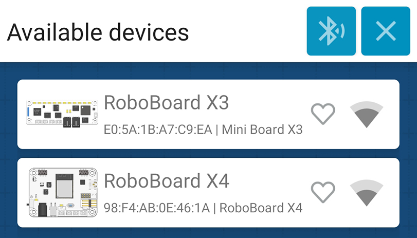

# TotemApp

{width=300px}

`TotemApp.` object allows to interact with [Totem App](../../remote-control/app/index.md) and get connection events or value changes when button is pressed. Combination of app button editor and RoboBoard programming creates ability to make custom remote controls for particular robot or embedded application.  
Available for Android and iOS.

See guide [Custom functions](../../remote-control/app/custom-function.md) for more detail instructions on executing custom actions on app button press.

Related configuration functions: [`Board.setStatusRGB()`](board.md#setStatusRGB) and [`Board.setStatusSound()`](board.md#setStatusSound).

Enabled automatically if `TotemApp` is used inside the code.  
_Enabling this feature increases compiled binary size by 800KB._

***

## Code snippets

```arduino
// Got Totem App specific event
void appEvent(int evt, int value) {
  if (evt == TotemApp.evtFunctionA) {
    Serial.print("Got '/0/functionA': "); Serial.println(value);
  }
  if (evt == TotemApp.evtConnect) {
    Serial.println("Totem App connected");
  }
  if (evt == TotemApp.evtDisconnect) {
    Serial.println("Totem App disconnected");
  }
}
// Override function called on app button click
// Allows to modify value before RoboBoard processes it
bool appOverride(int cmd, int value) {
  if (cmd == TotemApp.cmdPosA) { // Invert "/0/serv/posA" direction
    Servo.A.spinPos(-value); // Set servo position
    return false; // Block app command (override)
  }
  if (cmd == TotemApp.cmdPowerA) { // Limit "/0/dc/powerA" to [-50:50]
    if (value >= -50 && value <= 50) return true; // Allow app command
    // value is above limit. Constrain it
    DC.A.spin(constrain(value, -50, 50)); // Write motor power
    return false; // Block app command (override)
  }
  // Allow other app commands to be processed by RoboBoard
  return true;
}
void setup() {
  Serial.begin(115200);
  // Register TotemApp event function
  TotemApp.addEvent(appEvent);
  // Register Totem App override function
  TotemApp.addOverride(appOverride);
}
// Loop program
void loop() {
  // Empty
}
```

## :material-list-status: Runtime control

<h4 class="apidec" id="begin">
<span class="object">TotemApp</span>.<span class="function">begin</span>()
<a class="headerlink" href="#begin" title="Permanent link">¶</a></h4>
<h4 class="apidec" id="begin-name">
<span class="object">TotemApp</span>.<span class="function">begin</span>(<code>name</code>)
<a class="headerlink" href="#begin-name" title="Permanent link">¶</a></h4>
: Start Totem App service. Board will be discoverable in connect menu.  
_Note: call to any other `TotemApp` function will enable this service internally, so `TotemApp.begin()` is not mandatory._  
**Parameter:** `name` - (optional) change board name displayed in Totem App.  

<h4 class="apidec" id="disconnect">
<span class="object">TotemApp</span>.<span class="function">disconnect</span>()
<a class="headerlink" href="#disconnect" title="Permanent link">¶</a></h4>
: Force to disconnect Totem App.  

<h4 class="apidec" id="wait">
<code>state</code> <span class="object">TotemApp</span>.<span class="function">wait</span>()
<a class="headerlink" href="#wait" title="Permanent link">¶</a></h4>
<h4 class="apidec" id="wait-time">
<code>state</code> <span class="object">TotemApp</span>.<span class="function">wait</span>(<code>time</code>)
<a class="headerlink" href="#wait-time" title="Permanent link">¶</a></h4>
: Wait for Totem App to connect (block code until).  
**Parameter:** `time` - maximum time to wait (ms) for app connection. `0` - disabled.  
**Returns:** `state` - `true` if connected, `false` if timeout.  

## :fontawesome-solid-mobile-screen-button: Receive events

!!! warning
    At the moment `evtFunction` is only available with Android version of [Totem App](https://play.google.com/store/apps/details?id=lt.aldrea.karolis.totemandroid){target="_blank"}.  
    Use [Override commands](#override-commands) as an alternative for iOS.

<h4 class="apidec" id="addEvent">
<span class="object">TotemApp</span>.<span class="function">addEvent</span>(<code>function</code>)
<a class="headerlink" href="#addEvent" title="Permanent link">¶</a></h4>
: Register function to receive data sent from Totem App. Available event types:  
• `evtFunctionA` - topic `/0/functionA` data received.  
• `evtFunctionB` - topic `/0/functionB` data received.  
• `evtFunctionC` - topic `/0/functionC` data received.  
• `evtFunctionD` - topic `/0/functionD` data received.  
• `evtConnect` - Totem App connected.  
• `evtDisconnect` - Totem App disconnected.  
**Parameter:**  
`function` - function name [`appEvent`].  
```arduino
void appEvent(int evt, int value) {
  if (evt == TotemApp.evtFunctionA) {
    Serial.print("Function A: "); Serial.println(value);
  }
  if (evt == TotemApp.evtFunctionB) {
    Serial.print("Function B: "); Serial.println(value);
  }
  if (evt == TotemApp.evtFunctionC) {
    Serial.print("Function C: "); Serial.println(value);
  }
  if (evt == TotemApp.evtFunctionD) {
    Serial.print("Function D: "); Serial.println(value);
  }
  if (evt == TotemApp.evtConnect) {
    Serial.println("Totem App connected");
  }
  if (evt == TotemApp.evtDisconnect) {
    Serial.println("Totem App disconnected");
  }
}
void setup() {
  Serial.begin(115200);
  TotemApp.addEvent(appEvent); // Register TotemApp event function
}
void loop() {

}
```

## :material-playlist-edit: Override commands

Functionality allowing to intercept commands sent by Totem App. Typically button press will apply motor power directly (e.g. `/0/dc/powerA` → `DC.A.spin()`). Any action will be presented in `bool appOverride(int cmd, int value)` function, providing `value` and ability to choose either block or allow RoboBoard to process this command.

Can be used to intercept standard "Model" controls and make your own drive logic or actions.

List of app commands:

• `TotemApp.cmdPosA` - topic `/0/serv/posA`.  
• `TotemApp.cmdPosB` - topic `/0/serv/posB`.  
• `TotemApp.cmdPosC` - topic `/0/serv/posC`.  
• `TotemApp.cmdPowerA` - topic `/0/dc/powerA`.  
• `TotemApp.cmdPowerB` - topic `/0/dc/powerB`.  
• `TotemApp.cmdPowerC` - topic `/0/dc/powerC`.  
• `TotemApp.cmdPowerD` - topic `/0/dc/powerD`.  
• `TotemApp.cmdFunctionA` - topic `/0/functionA`.  
• `TotemApp.cmdFunctionB` - topic `/0/functionB`.  
• `TotemApp.cmdFunctionC` - topic `/0/functionC`.  
• `TotemApp.cmdFunctionD` - topic `/0/functionD`.  

!!! warning "Known behavior"
    Totem App always sends `cmdPowerA`, `cmdPowerB`, `cmdPowerC`, `cmdPowerD` as a single message. Even if `/0/dc/powerA` is the only one set - others will trigger event with value `0`.

<h4 class="apidec" id="addOverride">
<span class="object">TotemApp</span>.<span class="function">addOverride</span>(<code>function</code>)
<a class="headerlink" href="#addOverride" title="Permanent link">¶</a></h4>
: Register function to override commands sent from Totem App.  
Function declaration: `bool appOverride(int cmd, int value)`  
`cmd` - command identifier. `value` - integer sent from app.  
Use `return false` to block command and `return true` to allow it.  
**Parameter:**  
`function` - function name [`appOverride`].  
_Note: this function is called from Bluetooth environment, running on Core 0. It is not recommended to use heavy operations (like print or delay) inside function body._
```arduino
// Override function called on app button click
bool appOverride(int cmd, int value) {
  if (cmd == TotemApp.cmdPosA) {
    Serial.print("/0/serv/posA -> "); Serial.println(value);
  }
  if (cmd == TotemApp.cmdPosB) {
    Serial.print("/0/serv/posB -> "); Serial.println(value);
  }
  if (cmd == TotemApp.cmdPosC) {
    Serial.print("/0/serv/posC -> "); Serial.println(value);
  }
  if (cmd == TotemApp.cmdPowerA) {
    Serial.print("/0/dc/powerA -> "); Serial.println(value);
  }
  if (cmd == TotemApp.cmdPowerB) {
    Serial.print("/0/dc/powerB -> "); Serial.println(value);
  }
  if (cmd == TotemApp.cmdPowerC) {
    Serial.print("/0/dc/powerC -> "); Serial.println(value);
  }
  if (cmd == TotemApp.cmdPowerD) {
    Serial.print("/0/dc/powerD -> "); Serial.println(value);
  }
  // This function requires return!
  // `true` - pass received command back to RoboBoard
  // `false` - RoboBoard won't get this command (override)
  return false;
}
// Initialize program
void setup() {
  Serial.begin(115200);
  // Register Totem App override function
  TotemApp.addOverride(appOverride);
}
// Loop program
void loop() {
  // Empty
}
```
